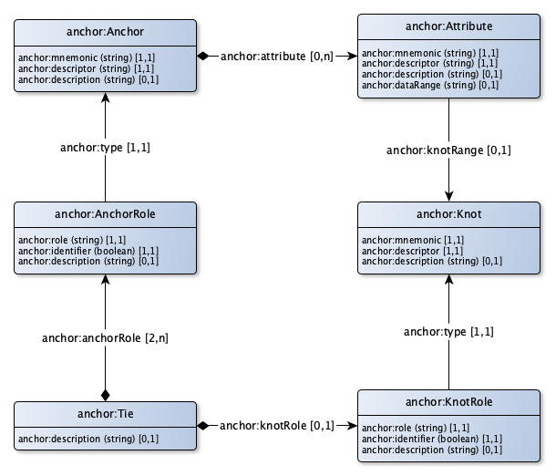

# Anchor modeling and linked data

Anchor is an agile database modeling technique suited for information that changes over time both in structure and content. It provides a graphical notation used for conceptual modeling similar to that of entity-relationship modeling, with extensions for working with temporal data. The modeling technique involves four modeling constructs: the anchor, attribute, tie and knot, each capturing different aspects of the domain being modeled.[1] The resulting models can be translated to physical database designs using formalized rules. When such a translation is done the tables in the relational database will mostly be in the sixth normal form. (Source: [wikipedia](https://en.wikipedia.org/wiki/Anchor_modeling)).

Anchor modeling is a conceptual modeling style and doesn't directly relate to a storage model. Currently, however, the usual implementation of an anchor model is a relational database.

This means that the highly flexable nature of an anchor modeling is usually transformed to the fixed schema of a relation database. Although clever transformation rules are used to minimize the risked of losing the advantages of the anchor modeling, the original anchor model graph structure is lost in the fixed table-oriented relation database.

A more natural approach might be to transform the anchor model to a RDF model. Both models are graph models and have the same characteristics regarding flexibility and expressibility.

This page describes the transformation rules that can be used to transform an anchor model to a RDF model. It also defines a RDF vocabulary to be used for anchor modeling. An example (from [anchormodeling.com](http://www.anchormodeling.com)) is used for the transformation itself. An [XSL stylesheet](anchor2rdf.xsl) is included to transform the XML serialization of an anchor model (as generated by the [online tool](http://www.anchormodeling.com/modeler/latest/)) to the corresponding RDF model.

## Elements of an anchor model

|Term|Deschrijving|
|----|------------|
|Anchor|Resource
|Attribute|Datatype properties of a resource|
|Tie|Object properties of a resource|
|Knot|Shared datatype properties between resources, such as state|

The [metadata model](anchor-vocabulary.ttl) for an anchor model is depicted in the figure below.



Some observations can be made regarding this model:

- The `anchor:type` property is modelled as a link between an anchor role and an anchor and a knot role and a knot. The XML implementation model uses the mnemonics as links between anchor role / anchor and knot role / knot. This is an implementation detail that we don't want to see in the RDF model.
- The `identity` attribute that is available in the XML implementation model is not modelled in the RDF model. In RDF, all identities are URI's, so this attribute is not necessary.
- The `anchor:dataRange` property is modelled as a string: anything is possible. It would seem more logical to restrict this range to a datatype class. This is however not how the current XML anchor model is implemented.

## Transforming an anchor model to a RDF model

The RDF model is largely similar to an anchor model. The transformation is pretty easy, as depicted in the table below:

|Anchor class|RDF class|
|------------|---------|
| `anchor:Anchor` | `owl:Class` |
| `anchor:Attribute` | subclass of `rdf:Statement` |
| `anchor:Tie` | `owl:Class` with object properties |
| `anchor:Knot` | `owl:Class` |

### Anchor transformation
An anchor is transformed to a corresponding `owl:Class` and a `sh:NodeShape` to be able to add extra constraints.

- The `descriptor` is used to formulate the name of the class.
- the `description` is added as an `rdfs:comment` statement about the class.
- the `mnemonic` is ommitted (no need for in a RDF model).
- a `rdfs:seeAlso` statement is added to link the class to the original anchor model.

For example, let's look at the following [Restaurant anchor model](tutorial/1_B_restaurant-anchor.ttl), translated from the [tutorial model](tutorial/1_A_restaurant-anchor.xml):

```
anchor:RE a am:Anchor;
  am:descriptor "Restaurant"^^xsd:string;
  am:mnemonic "RE"^^xsd:string
.
```

This model is translated to the following [RDF model](tutorial/1_C_restaurant-anchor-owl.ttl):

```
exdef:Restaurant a owl:Class, sh:NodeShape;
  rdfs:label "Restaurant"^^xsd:string;
  rdfs:seeAlso anchor:RE
.
```

Let's populate this model with an example, [Mario's pizzaria](tutorial/1_D_restaurant-anchor-rdf.ttl):

```
example:PizzariaRistoranteMario a exdef:Restaurant.
```

As all RDF resources are identified by a URI, there is no need to explicitly define a primary key, including its type.

### Attribute transformation
An attribute is transformed to a corresponding subclass of a `rdf:Statement`. At first hand, it would seem more logical to transform an attribute to a corresponding `owl:datatypeProperty`. However, the whole idea of anchor modeling is to obtain a stable data model, so direct reification to a statement is more durable. Also, an anchor model doesn't actually support the idea of attributes as first-class citizens in the model (attributes are always part of exactly one anchor).

To enable the semantic richness of a RDF model, the attribute name is also used to create a `owl:datatypeProperty`. This property could be inferred from the rdf:Statement.

To formulate the constraints to which anchor the attribute belongs, and the datatype of the attribute, a `sh:NodeShape` is used.

For example, let's look at the following part of the [Restaurant anchor model](tutorial/2_B_restaurant-name.ttl), translated from the [tutorial model](tutorial/2_A_restaurant-name.xml):

```
attribute:RE_NAM a am:Attribute;
  am:descriptor "Name"^^xsd:string;
  am:mnemonic "NAM"^^xsd:string;
  am:dataRange "xsd:string"^^xsd:string;
.
```

(From this point in the documentation, only parts of the models are depicted to save space. It makes it absolutely clear that every addition to the anchor model is also an addition to the RDF model, without the need to change anything. The complete models are available via the hyperlinks to the correspoding model files).

This part of the model is translated to the following [RDF model](tutorial/2_C_restaurant-name-owl.ttl) part:

```
exdef:name a owl:DatatypeProperty;
  rdfs:label "name"^^xsd:string;
.
exdef:Restaurant_Name a owl:Class, sh:NodeShape;
  rdfs:subClassOf rdf:Statement;
  rdfs:label "Name"^^xsd:string;
  rdfs:seeAlso attribute:RE_NAM;
  sh:property [
    sh:path rdf:subject;
    sh:node exdef:Restaurant;
    sh:minCount 1;
    sh:maxCount 1;
  ];
  sh:property [
    sh:path rdf:subject;
    sh:datatype xsd:string;
    sh:minCount 1;
    sh:maxCount 1;
  ];
  sh:property [
    sh:path rdf:predicate;
    sh:hasValue exdef:name;
    sh:minCount 1;
    sh:maxCount 1;
  ];
.
```

Let's populate this part of the model with an example, [Mario's pizzaria](tutorial/2_D_restaurant-name-rdf.ttl):

```
<urn:uuid:8607519e-59ae-4917-b606-7311679a1684> a exdef:Restaurant_Name;
  rdf:subject example:PizzariaRistoranteMario;
  rdf:object "Pizzaria Ristorante Mario"^^xsd:string;
  rdf:predicate exdef:name;
.
```

The URI for the statement is a dynamically generated UUID. From this statement, the following statement can be inferred:

```
example:PizzariaRistoranteMario exdef:name "Pizzaria Ristorante Mario"^^xsd:string.
```

This final statement is more readable for the end user, but can become problematic when the attribute is historized, so it is only used as an inferred statement, not the actually stored statement.

### Tie transformation
A tie is transformed to a `owl:Class`, including a `sh:NodeShape` to constraint which anchors are tied by the tie. More than two anchors could be tied. In the case of a binary tie, the anchor roles themselves can be used to infer extra statements that make it more easier to read the corresponding model.

For example, let's look at the following part of the [Restaurant anchor model](tutorial/3_B_restaurant-dish.ttl), translated from the [tutorial model](tutorial/3_A_restaurant-dish.xml):

```
tie:RE_at_DI_isServed a am:Tie;
  am:anchorRole [
    rdf:type am:AnchorRole;
    am:identifier "true"^^xsd:string;
    am:role "at"^^xsd:string;
    am:type anchor:RE
  ];
  am:anchorRole [
    rdf:type am:AnchorRole;
    am:identifier "true"^^xsd:string;
    am:role "isServed"^^xsd:string;
    am:type anchor:DI
  ]
.
```

This part of the model is translated to the following [RDF model](tutorial/3_C_restaurant-dish-owl.ttl) part:

```
exdef:at a owl:ObjectProperty;
  rdfs:label "at"^^xsd:string;
.
exdef:isServed a owl:ObjectProperty;
  rdfs:label "isServed"^^xsd:string;
.
exdef:RestaurantAtDishIsServed a owl:Class, sh:NodeShape;
  rdfs:label "Restaurant at Dish isServed";
  rdfs:seeAlso tie:RE_at_DI_isServed;
  sh:property [
    sh:path exdef:at;
    sh:class exdef:Restaurant;
  ];
  sh:property [
    sh:path exdef:isServed;
    sh:class exdef:Dish;
  ];
.
```

Let's populate this part of the model with an example, [Mario's pizzaria](tutorial/3_D_restaurant-dish-rdf.ttl):

```
<urn:uuid:26613064-7c8b-4bca-89cb-13185e35bb6a> a exdef:Restaurant_at_Dish_isServed;
  role:at example:PizzariaRistoranteMario;
  role:isServed example:PizzaMargherita;
.
```

The URI for the tie is a dynamically generated UUID. From this statement, the following statement can be inferred:

```
example:PizzariaRistoranteMario exdef:isServed example:PizzaMargherita.
example:PizzaMargherita exdef:at example:PizzariaRistoranteMario.
```

(Mario's pizzaria serves a pizza margherita, and a pizza margherita is served at Mario's pizzaria).

### Knot transformation
A knot is transformed to a corresponding `owl:Class` and a `sh:NodeShape` to be able to add extra constraints.

In this case, we knot an attribute, so the attribute itself is also transformed a bit different: instead of a datatype, the attribute is constrained to a knot link.

For example, let's look at the following part of the [Restaurant anchor model](tutorial/4_B_restaurant-knot.ttl), translated from the [tutorial model](tutorial/4_A_restaurant-knot.xml):

```
attribute:RE_CUI a am:Attribute;
  am:descriptor "Cuisine"^^xsd:string;
  am:mnemonic "CUI"^^xsd:string;
  am:knotRange knot:CUI;
.

knot:CUI a am:Knot;
  am:descriptor "Cuisine"^^xsd:string;
  am:mnemonic "CUI"^^xsd:string;
.
```

This part of the model is translated to the following [RDF model](tutorial/4_C_restaurant-knot-owl.ttl) part:

```
exdef:Restaurant_Cuisine a owl:Class, sh:NodeShape;
  rdfs:subClassOf rdf:Statement;
  rdfs:label "Restaurant Cuisine";
  rdfs:seeAlso attribute:RE_CUI;
  sh:property [
    sh:path rdf:subject;
    sh:node exdef:Restaurant;
    sh:minCount 1;
    sh:maxCount 1;
  ];
  sh:property [
    sh:path rdf:subject;
    sh:node exdef:Cuisine;
    sh:minCount 1;
    sh:maxCount 1;
  ];
  sh:property [
    sh:path rdf:predicate;
    sh:hasValue exdef:cuisine;
    sh:minCount 1;
    sh:maxCount 1;
  ];
.

exdef:Cuisine a owl:Class, sh:NodeShape;
  rdfs:label "Cuisine";
  rdfs:seeAlso knot:CUI
.
```

The `exdef:Restaurant_Cuisine` defines the knotted attribute: the subject isn't a datatype as in the case of `exdef:Restaurant_Name` above, but a link to the `exdef:Cuisine` knot. The `exdef:Cuisine` defines the knot itself.

Let's populate this part of the model with an example, [Mario's pizzaria](tutorial/4_D_restaurant-knot-rdf.ttl):

```
<urn:uuid:79d7c07c-633e-49a2-bf24-fac930ddae5f> a exdef:Restaurant_Cuisine;
  rdf:subject example:PizzariaRistoranteMario;
  rdf:object example:ItalianCuisine;
  rdf:predicate exdef:cuisine;
.

example:ItalianCuisine a knot:CUI;
  value:Cuisine "Italian Cuisine";
.
```

As always, the URI for the statement is a dynamically generated UUID. From the statement, the following statement can be inferred:

```
example:PizzariaRistoranteMario exdef:cuisine example:ItalianCuisine.
```

(Mario's pizzaria cuisine is the Italian Cuisine).

### History transformation
Whenever a attribute (or a tie for that matter) is historized, a history attribute is simply added, without changing anything of the RDF model. For the history attribute, we use the common prov ontology statement: `prov:generatedAt`.

For example, let's look at the price attribute from following part of the [Restaurant anchor model](tutorial/5_B_restaurant-history.ttl), translated from the [tutorial model](tutorial/5_A_restaurant-history.xml):

```
attribute:DI_PRI a am:Attribute;
  am:descriptor "Price"^^xsd:string;
  am:mnemonic "PRI"^^xsd:string;
  am:dataRange "xsd:decimal"^^xsd:string;
  am:timeRange "xsd:date"^^xsd:string
.
```

As exampled above, without history, this would be transformed to the following model:

```
exdef:Dish_Price a owl:Class, sh:NodeShape;
  rdfs:subClassOf rdf:Statement;
  rdfs:label "Dish Price";
  rdfs:seeAlso attribute:DI_PRI;
  sh:property [
    sh:path rdf:subject;
    sh:node exdef:Dish;
    sh:minCount 1;
    sh:maxCount 1;
  ];
  sh:property [
    sh:path rdf:subject;
    sh:datatype xsd:decimal;
    sh:minCount 1;
    sh:maxCount 1;
  ];
  sh:property [
    sh:path rdf:predicate;
    sh:hasValue exdef:price;
    sh:minCount 1;
    sh:maxCount 1;
  ];
.
```

When we include history (as stated by the `am:timeRange` property), we simply add a `prov:generatedAt` property, so we get the following [RDF model](tutorial/5_C_restaurant-history-owl.ttl) part:

```
exdef:Dish_Price a owl:Class, sh:NodeShape;
  rdfs:subClassOf rdf:Statement;
  rdfs:label "Dish Price";
  rdfs:seeAlso attribute:DI_PRI;
  sh:property [
    sh:path rdf:subject;
    sh:node exdef:Dish;
    sh:minCount 1;
    sh:maxCount 1;
  ];
  sh:property [
    sh:path rdf:subject;
    sh:datatype xsd:decimal;
    sh:minCount 1;
    sh:maxCount 1;
  ];
  sh:property [
    sh:path rdf:predicate;
    sh:hasValue exdef:price;
    sh:minCount 1;
    sh:maxCount 1;
  ];
  sh:property [
    sh:path prov:generatedAt;
    sh:datatype xsd:date;
    sh:minCount 1;
    sh:maxCount 1;
  ]
.
```

Only the last `sh:property` is added, the rest remains the same. Let's populate this part of the model with an example, [Mario's pizzaria](tutorial/5_D_restaurant-history-rdf.ttl). In this example, we state that a pizzaria Margherita at two different points in time, had two different prices:

```
<urn:uuid:fcd5d83c-318b-4b92-b486-f88336086c54> a exdef:Dish_Price;
  rdf:subject example:PizzaMargherita;
  rdf:object "10.15"^^xsd:decimal;
  rdf:predicate exdef:price;
  prov:generatedAt "2019-01-01"^^xsd:date;
.
<urn:uuid:75cbd44b-f24e-4cde-9707-4c11bd478e7c> a exdef:Dish_Price;
  rdf:subject example:PizzaMargherita;
  rdf:object "12.95"^^xsd:decimal;
  rdf:predicate exdef:price;
  prov:generatedAt "2019-08-01"^^xsd:date;
.
```

From this, we could infer two prices. But which price should we take? We need to take time into account when inferring the actual value for the price of the dish. Most common is to use the most recent price:

```
example:PizzaMargherita exdef:price "12.95"^^xsd:decimal.
```

(The current price of a pizza Margherita is 12.95).
