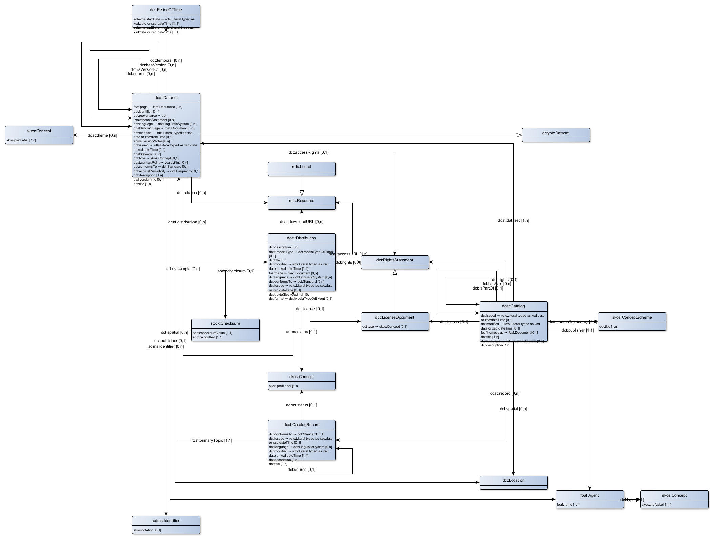

# DCAT AP EU v1.1
This document described the DCAT Application Profile for data portals in Europe as specified by the EU JoinUp initiative. This document is generated from Linked Data sources (mainly SHACL and the original DCAT ontology) to facilitate automatic translation and comparision between DCAT profiles.

The original source document can be found at: [https://joinup.ec.europa.eu/release/dcat-ap-v11](https://joinup.ec.europa.eu/release/dcat-ap-v11)

The following vocabularies are used:

|prefix|uri|website
|---|---|---
|adms|http://www.w3.org/ns/adms#|[http://www.w3.org/TR/vocab-adms/](http://www.w3.org/TR/vocab-adms/)
|dcat|http://www.w3.org/ns/dcat#|[http://www.w3.org/TR/vocab-dcat/](http://www.w3.org/TR/vocab-dcat/)
|dct|http://dublincore.org/documents/dcmi-terms/|[http://www.dublincore.org/documents/dcmi-terms/](http://www.dublincore.org/documents/dcmi-terms/)
|foaf|http://xmlns.com/foaf/0.1/|[http://xmlns.com/foaf/spec/](http://xmlns.com/foaf/spec/)
|rdfs|http://www.w3.org/2000/01/rdf-schema#|[http://www.w3.org/TR/rdf-schema/](http://www.w3.org/TR/rdf-schema/)
|skos|http://www.w3.org/2004/02/skos/core#|[http://www.w3.org/TR/skos-reference/](http://www.w3.org/TR/skos-reference/)

## Class description

|Req|Class name|Usage note for the Application Profile|uri
|---|---|---|---
|[Man](http://www.w3.org/ns/shacl#Violation)|[Agent](http://xmlns.com/foaf/0.1/Agent)|An entity that is associated with Catalogues and/or Datasets. If the Agent is an organisation, the use of the Organization Ontology is recommended. See section 7 for a discussion on Agent roles.|foaf:Agent
|[Man](http://www.w3.org/ns/shacl#Violation)|[Catalogue](http://www.w3.org/ns/dcat#Catalog)|A catalogue or repository that hosts the Datasets being described.|dcat:Catalog
|[Man](http://www.w3.org/ns/shacl#Violation)|[Dataset](http://www.w3.org/ns/dcat#Dataset)|A conceptual entity that represents the information published.|dcat:Dataset
|[Man](http://www.w3.org/ns/shacl#Violation)|[Literal](http://www.w3.org/2000/01/rdf-schema#Literal)|A literal value such as a string or integer; Literals may be typed, e.g. as a date according to xsd:date. Literals that contain human-readable text have an optional language tag as defined by BCP 47|rdfs:Literal
|[Man](http://www.w3.org/ns/shacl#Violation)|[Resource](http://www.w3.org/2000/01/rdf-schema#Resource)|Anything described by RDF.|rdfs:Resource
|[Rec](http://www.w3.org/ns/shacl#Warning)|[Category](http://www.w3.org/2004/02/skos/core#Concept)|A subject of a Dataset.|skos:Concept
|[Rec](http://www.w3.org/ns/shacl#Warning)|[Category scheme](http://www.w3.org/2004/02/skos/core#ConceptScheme)|A concept collection (e.g. controlled vocabulary) in which the Category is defined.|skos:ConceptScheme
|[Rec](http://www.w3.org/ns/shacl#Warning)|[Distribution](http://www.w3.org/ns/dcat#Distribution)|A physical embodiment of the Dataset in a particular format.|dcat:Distribution
|[Rec](http://www.w3.org/ns/shacl#Warning)|[Licence document](http://purl.org/dc/terms/LicenseDocument)|A legal document giving official permission to do something with a resource.|dct:LicenseDocument
|[Opt](http://www.w3.org/ns/shacl#Info)|[Catalogue record](http://www.w3.org/ns/dcat#CatalogRecord)|A description of a Dataset’s entry in the Catalogue.|dcat:CatalogRecord
|[Opt](http://www.w3.org/ns/shacl#Info)|[Checksum](http://spdx.org/rdf/terms#Checksum)|A value that allows the contents of a file to be authenticated. This class allows the results of a variety of checksum and cryptographic message digest algorithms to be represented.|spdx:Checksum
|[Opt](http://www.w3.org/ns/shacl#Info)|[Document](http://xmlns.com/foaf/0.1/Document)|A textual resource intended for human consumption that contains information, e.g. a web page about a Dataset.|foaf:Document
|[Opt](http://www.w3.org/ns/shacl#Info)|[Frequency](http://purl.org/dc/terms/Frequency)|A rate at which something recurs, e.g. the publication of a Dataset.|dct:Frequency
|[Opt](http://www.w3.org/ns/shacl#Info)|[Identifier](http://www.w3.org/ns/adms#Identifier)|An identifier in a particular context, consisting of the string that is the identifier; an optional identifier for the identifier scheme; an optional identifier for the version of the identifier scheme; an optional identifier for the agency that manages the identifier scheme|adms:Identifier
|[Opt](http://www.w3.org/ns/shacl#Info)|[Kind](http://www.w3.org/2006/vcard/ns#Kind)|A description following the vCard specification, e.g. to provide telephone number and e-mail address for a contact point. Note that the class Kind is the parent class for the four explicit types of vCards (Individual, Organization, Location, Group).|vcard:Kind
|[Opt](http://www.w3.org/ns/shacl#Info)|[Linguistic system](http://purl.org/dc/terms/LinguisticSystem)|A system of signs, symbols, sounds, gestures, or rules used in communication, e.g. a language|dct:LinguisticSystem
|[Opt](http://www.w3.org/ns/shacl#Info)|[Location](http://purl.org/dc/terms/Location)|A spatial region or named place. It can be represented using a controlled vocabulary or with geographic coordinates. In the latter case, the use of the Core Location Vocabulary is recommended, following the approach described in the GeoDCAT-AP specification.|dct:Location
|[Opt](http://www.w3.org/ns/shacl#Info)|[Media type or extent](http://purl.org/dc/terms/MediaTypeOrExtent)|A media type or extent, e.g. the format of a computer file|dct:MediaTypeOrExtent
|[Opt](http://www.w3.org/ns/shacl#Info)|[Period of time](http://purl.org/dc/terms/PeriodOfTime)|An interval of time that is named or defined by its start and end dates.|dct:PeriodOfTime
|[Opt](http://www.w3.org/ns/shacl#Info)|[Provenance statement](http://purl.org/dc/terms/ProvenanceStatement)|A statement of any changes in ownership and custody of a resource since its creation that are significant for its authenticity, integrity, and interpretation|dct:ProvenanceStatement
|[Opt](http://www.w3.org/ns/shacl#Info)|[Publisher type](http://www.w3.org/2004/02/skos/core#Concept)|A type of organisation that acts as a publisher|skos:Concept
|[Opt](http://www.w3.org/ns/shacl#Info)|[Rights statement](http://purl.org/dc/terms/RightsStatement)|A statement about the intellectual property rights (IPR) held in or over a resource, a legal document giving official permission to do something with a resource, or a statement about access rights.|dct:RightsStatement
|[Opt](http://www.w3.org/ns/shacl#Info)|[Standard](http://purl.org/dc/terms/Standard)|A standard or other specification to which a Dataset or Distribution conforms|dct:Standard
|[Opt](http://www.w3.org/ns/shacl#Info)|[Status](http://www.w3.org/2004/02/skos/core#Concept)|An indication of the maturity of a Distribution or the type of change of a Catalogue Record.|skos:Concept

## Property description

|Class|Req|Property|URI|Range|Usage note|Card
|---|---|---|---|---|---|---
|[adms:Identifier](http://www.w3.org/ns/adms#Identifier)|[Man](http://www.w3.org/ns/shacl#Violation)|notation|[skos:notation](http://www.w3.org/2004/02/skos/core#notation)|[rdfs:Literal](http://www.w3.org/2000/01/rdf-schema#Literal)|This property contains a string that is an identifier in the context of the identifier scheme referenced by its datatype.|0..1
|[dcat:Catalog](http://www.w3.org/ns/dcat#Catalog)|[Man](http://www.w3.org/ns/shacl#Violation)|dataset|[dcat:dataset](http://www.w3.org/ns/dcat#dataset)|[dcat:Dataset](http://www.w3.org/ns/dcat#Dataset)|This property links the Catalogue with a Dataset that is part of the Catalogue.|1..n
|[dcat:Catalog](http://www.w3.org/ns/dcat#Catalog)|[Man](http://www.w3.org/ns/shacl#Violation)|description|[dct:description](http://purl.org/dc/terms/description)|[rdfs:Literal](http://www.w3.org/2000/01/rdf-schema#Literal)|This property contains a free-text account of the Catalogue. This property can be repeated for parallel language versions of the description. For further information on multilingual issues, please refer to section 8.|1..n
|[dcat:Catalog](http://www.w3.org/ns/dcat#Catalog)|[Man](http://www.w3.org/ns/shacl#Violation)|publisher|[dct:publisher](http://purl.org/dc/terms/publisher)|[foaf:Agent](http://xmlns.com/foaf/0.1/Agent)|This property refers to an entity (organisation) responsible for making the Catalogue available.|1..1
|[dcat:Catalog](http://www.w3.org/ns/dcat#Catalog)|[Man](http://www.w3.org/ns/shacl#Violation)|title|[dct:title](http://purl.org/dc/terms/title)|[rdfs:Literal](http://www.w3.org/2000/01/rdf-schema#Literal)|This property contains a name given to the Catalogue. This property can be repeated for parallel language versions of the name.|1..n
|[dcat:Catalog](http://www.w3.org/ns/dcat#Catalog)|[Rec](http://www.w3.org/ns/shacl#Warning)|homepage|[foaf:homepage](http://xmlns.com/foaf/0.1/homepage)|[foaf:Document](http://xmlns.com/foaf/0.1/Document)|This property refers to a web page that acts as the main page for the Catalogue.|0..1
|[dcat:Catalog](http://www.w3.org/ns/dcat#Catalog)|[Rec](http://www.w3.org/ns/shacl#Warning)|language|[dct:language](http://purl.org/dc/terms/language)|[dct:LinguisticSystem](http://purl.org/dc/terms/LinguisticSystem)|This property refers to a language used in the textual metadata describing titles, descriptions, etc. of the Datasets in the Catalogue. This property can be repeated if the metadata is provided in multiple languages.|0..n
|[dcat:Catalog](http://www.w3.org/ns/dcat#Catalog)|[Rec](http://www.w3.org/ns/shacl#Warning)|license|[dct:license](http://purl.org/dc/terms/license)|[dct:LicenseDocument](http://purl.org/dc/terms/LicenseDocument)|This property refers to the licence under which the Catalogue can be used or reused.|0..1
|[dcat:Catalog](http://www.w3.org/ns/dcat#Catalog)|[Rec](http://www.w3.org/ns/shacl#Warning)|release date|[dct:issued](http://purl.org/dc/terms/issued)|[rdfs:Literal typed as xsd:date or xsd:dateTime](http://bp4mc2.org/def/dcat-ap-eu/DateOrDateTimeDataType)|This property contains the date of formal issuance (e.g., publication) of the Catalogue.|0..1
|[dcat:Catalog](http://www.w3.org/ns/dcat#Catalog)|[Rec](http://www.w3.org/ns/shacl#Warning)|themes|[dcat:themeTaxonomy](http://www.w3.org/ns/dcat#themeTaxonomy)|[skos:ConceptScheme](http://www.w3.org/2004/02/skos/core#ConceptScheme)|This property refers to a knowledge organization system used to classify the Catalogue's Datasets.|0..n
|[dcat:Catalog](http://www.w3.org/ns/dcat#Catalog)|[Rec](http://www.w3.org/ns/shacl#Warning)|update/modification date|[dct:modified](http://purl.org/dc/terms/modified)|[rdfs:Literal typed as xsd:date or xsd:dateTime](http://bp4mc2.org/def/dcat-ap-eu/DateOrDateTimeDataType)|This property contains the most recent date on which the Catalogue was modified.|0..1
|[dcat:Catalog](http://www.w3.org/ns/dcat#Catalog)|[Opt](http://www.w3.org/ns/shacl#Info)|has part|[dct:hasPart](http://purl.org/dc/terms/hasPart)|[dcat:Catalog](http://www.w3.org/ns/dcat#Catalog)|This property refers to a related Catalogue that is part of the described Catalogue|0..n
|[dcat:Catalog](http://www.w3.org/ns/dcat#Catalog)|[Opt](http://www.w3.org/ns/shacl#Info)|is part of|[dct:isPartOf](http://purl.org/dc/terms/isPartOf)|[dcat:Catalog](http://www.w3.org/ns/dcat#Catalog)|This property refers to a related Catalogue in which the described Catalogue is physically or logically included.|0..1
|[dcat:Catalog](http://www.w3.org/ns/dcat#Catalog)|[Opt](http://www.w3.org/ns/shacl#Info)|record|[dcat:record](http://www.w3.org/ns/dcat#record)|[dcat:CatalogRecord](http://www.w3.org/ns/dcat#CatalogRecord)|This property refers to a Catalogue Record that is part of the Catalogue|0..n
|[dcat:Catalog](http://www.w3.org/ns/dcat#Catalog)|[Opt](http://www.w3.org/ns/shacl#Info)|rights|[dct:rights](http://purl.org/dc/terms/rights)|[dct:RightsStatement](http://purl.org/dc/terms/RightsStatement)|This property refers to a statement that specifies rights associated with the Catalogue.|0..1
|[dcat:Catalog](http://www.w3.org/ns/dcat#Catalog)|[Opt](http://www.w3.org/ns/shacl#Info)|spatial / geographic|[dct:spatial](http://purl.org/dc/terms/spatial)|[dct:Location](http://purl.org/dc/terms/Location)|This property refers to a geographical area covered by the Catalogue.|0..n
|[dcat:CatalogRecord](http://www.w3.org/ns/dcat#CatalogRecord)|[Man](http://www.w3.org/ns/shacl#Violation)|primary topic|[foaf:primaryTopic](http://xmlns.com/foaf/0.1/primaryTopic)|[dcat:Dataset](http://www.w3.org/ns/dcat#Dataset)|This property links the Catalogue Record to the Dataset described in the record.|1..1
|[dcat:CatalogRecord](http://www.w3.org/ns/dcat#CatalogRecord)|[Man](http://www.w3.org/ns/shacl#Violation)|update/ modification date|[dct:modified](http://purl.org/dc/terms/modified)|[rdfs:Literal typed as xsd:date or xsd:dateTime](http://bp4mc2.org/def/dcat-ap-eu/DateOrDateTimeDataType)|This property links the Catalogue Record to the Dataset described in the record.|1..1
|[dcat:CatalogRecord](http://www.w3.org/ns/dcat#CatalogRecord)|[Rec](http://www.w3.org/ns/shacl#Warning)|application profile|[dct:conformsTo](http://purl.org/dc/terms/conformsTo)|[dct:Standard](http://purl.org/dc/terms/Standard)|This property refers to an Application Profile that the Dataset’s metadata conforms to|0..1
|[dcat:CatalogRecord](http://www.w3.org/ns/dcat#CatalogRecord)|[Rec](http://www.w3.org/ns/shacl#Warning)|change type|[adms:status](http://www.w3.org/ns/adms#status)|[skos:Concept](http://bp4mc2.org/def/dcat-ap-eu/Status)|This property refers to the type of the latest revision of a Dataset's entry in the Catalogue. It MUST take one of the values :created, :updated or :deleted depending on whether this latest revision is a result of a creation, update or deletion.|0..1
|[dcat:CatalogRecord](http://www.w3.org/ns/dcat#CatalogRecord)|[Rec](http://www.w3.org/ns/shacl#Warning)|listing date|[dct:issued](http://purl.org/dc/terms/issued)|[rdfs:Literal typed as xsd:date or xsd:dateTime](http://bp4mc2.org/def/dcat-ap-eu/DateOrDateTimeDataType)|This property contains the date on which the description of the Dataset was included in the Catalogue.|0..1
|[dcat:CatalogRecord](http://www.w3.org/ns/dcat#CatalogRecord)|[Opt](http://www.w3.org/ns/shacl#Info)|description|[dct:description](http://purl.org/dc/terms/description)|[rdfs:Literal](http://www.w3.org/2000/01/rdf-schema#Literal)|This property contains a free-text account of the record. This property can be repeated for parallel language versions of the description.|0..n
|[dcat:CatalogRecord](http://www.w3.org/ns/dcat#CatalogRecord)|[Opt](http://www.w3.org/ns/shacl#Info)|language|[dct:language](http://purl.org/dc/terms/language)|[dct:LinguisticSystem](http://purl.org/dc/terms/LinguisticSystem)|This property refers to a language used in the textual metadata describing titles, descriptions, etc. of the Dataset. This property can be repeated if the metadata is provided in multiple languages.|0..n
|[dcat:CatalogRecord](http://www.w3.org/ns/dcat#CatalogRecord)|[Opt](http://www.w3.org/ns/shacl#Info)|source metadata|[dct:source](http://purl.org/dc/terms/source)|[dcat:CatalogRecord](http://www.w3.org/ns/dcat#CatalogRecord)|This property refers to the original metadata that was used in creating metadata for the Dataset|0..1
|[dcat:CatalogRecord](http://www.w3.org/ns/dcat#CatalogRecord)|[Opt](http://www.w3.org/ns/shacl#Info)|title|[dct:title](http://purl.org/dc/terms/title)|[rdfs:Literal](http://www.w3.org/2000/01/rdf-schema#Literal)|This property contains a name given to the Catalogue Record. This property can be repeated for parallel language versions of the name.|0..n
|[dcat:Dataset](http://www.w3.org/ns/dcat#Dataset)|[Man](http://www.w3.org/ns/shacl#Violation)|description|[dct:description](http://purl.org/dc/terms/description)|[rdfs:Literal](http://www.w3.org/2000/01/rdf-schema#Literal)|This property contains a free-text account of the Dataset. This property can be repeated for parallel language versions of the description.|1..n
|[dcat:Dataset](http://www.w3.org/ns/dcat#Dataset)|[Man](http://www.w3.org/ns/shacl#Violation)|title|[dct:title](http://purl.org/dc/terms/title)|[rdfs:Literal](http://www.w3.org/2000/01/rdf-schema#Literal)|This property contains a name given to the Dataset. This property can be repeated for parallel language versions of the name.|1..n
|[dcat:Dataset](http://www.w3.org/ns/dcat#Dataset)|[Rec](http://www.w3.org/ns/shacl#Warning)|contact point|[dcat:contactPoint](http://www.w3.org/ns/dcat#contactPoint)|[vcard:Kind](http://www.w3.org/2006/vcard/ns#Kind)|This property contains contact information that can be used for sending comments about the Dataset.|0..n
|[dcat:Dataset](http://www.w3.org/ns/dcat#Dataset)|[Rec](http://www.w3.org/ns/shacl#Warning)|dataset distribution|[dcat:distribution](http://www.w3.org/ns/dcat#distribution)|[dcat:Distribution](http://www.w3.org/ns/dcat#Distribution)|This property links the Dataset to an available Distribution.|0..n
|[dcat:Dataset](http://www.w3.org/ns/dcat#Dataset)|[Rec](http://www.w3.org/ns/shacl#Warning)|keyword/ tag|[dcat:keyword](http://www.w3.org/ns/dcat#keyword)|[rdfs:Literal](http://www.w3.org/2000/01/rdf-schema#Literal)|This property contains a keyword or tag describing the Dataset.|0..n
|[dcat:Dataset](http://www.w3.org/ns/dcat#Dataset)|[Rec](http://www.w3.org/ns/shacl#Warning)|publisher|[dct:publisher](http://purl.org/dc/terms/publisher)|[foaf:Agent](http://xmlns.com/foaf/0.1/Agent)|This property refers to an entity (organisation) responsible for making the Dataset available.|0..1
|[dcat:Dataset](http://www.w3.org/ns/dcat#Dataset)|[Rec](http://www.w3.org/ns/shacl#Warning)|theme/ category|[dcat:theme](http://www.w3.org/ns/dcat#theme)|[skos:Concept](http://bp4mc2.org/def/dcat-ap-eu/Category)|This property refers to a category of the Dataset. A Dataset may be associated with multiple themes.|0..n
|[dcat:Dataset](http://www.w3.org/ns/dcat#Dataset)|[Opt](http://www.w3.org/ns/shacl#Info)|access rights|[dct:accessRights](http://purl.org/dc/terms/accessRights)|[dct:RightsStatement](http://purl.org/dc/terms/RightsStatement)|This property refers to information that indicates whether the Dataset is open data, has access restrictions or is not public. A controlled vocabulary with three members (:public, :restricted, :non-public) will be created and maintained by the Publications Office of the EU.|0..1
|[dcat:Dataset](http://www.w3.org/ns/dcat#Dataset)|[Opt](http://www.w3.org/ns/shacl#Info)|conforms to|[dct:conformsTo](http://purl.org/dc/terms/conformsTo)|[dct:Standard](http://purl.org/dc/terms/Standard)|This property refers to an implementing rule or other specification.|0..n
|[dcat:Dataset](http://www.w3.org/ns/dcat#Dataset)|[Opt](http://www.w3.org/ns/shacl#Info)|documentation|[foaf:page](http://xmlns.com/foaf/0.1/page)|[foaf:Document](http://xmlns.com/foaf/0.1/Document)|This property refers to a page or document about this Dataset.|0..n
|[dcat:Dataset](http://www.w3.org/ns/dcat#Dataset)|[Opt](http://www.w3.org/ns/shacl#Info)|frequency|[dct:accrualPeriodicity](http://purl.org/dc/terms/accrualPeriodicity)|[dct:Frequency](http://purl.org/dc/terms/Frequency)|This property refers to the frequency at which the Dataset is updated.|0..1
|[dcat:Dataset](http://www.w3.org/ns/dcat#Dataset)|[Opt](http://www.w3.org/ns/shacl#Info)|has version|[dct:hasVersion](http://purl.org/dc/terms/hasVersion)|[dcat:Dataset](http://www.w3.org/ns/dcat#Dataset)|This property refers to a related Dataset that is a version, edition, or adaptation of the described Dataset.|0..n
|[dcat:Dataset](http://www.w3.org/ns/dcat#Dataset)|[Opt](http://www.w3.org/ns/shacl#Info)|identifier|[dct:identifier](http://purl.org/dc/terms/identifier)|[rdfs:Literal](http://www.w3.org/2000/01/rdf-schema#Literal)|This property contains the main identifier for the Dataset, e.g. the URI or other unique identifier in the context of the Catalogue.|0..n
|[dcat:Dataset](http://www.w3.org/ns/dcat#Dataset)|[Opt](http://www.w3.org/ns/shacl#Info)|is version of|[dct:isVersionOf](http://purl.org/dc/terms/isVersionOf)|[dcat:Dataset](http://www.w3.org/ns/dcat#Dataset)|This property refers to a related Dataset of which the described Dataset is a version, edition, or adaptation.|0..n
|[dcat:Dataset](http://www.w3.org/ns/dcat#Dataset)|[Opt](http://www.w3.org/ns/shacl#Info)|landing page|[dcat:landingPage](http://www.w3.org/ns/dcat#landingPage)|[foaf:Document](http://xmlns.com/foaf/0.1/Document)|This property refers to a web page that provides access to the Dataset, its Distributions and/or additional information. It is intended to point to a landing page at the original data provider, not to a page on a site of a third party, such as an aggregator.|0..n
|[dcat:Dataset](http://www.w3.org/ns/dcat#Dataset)|[Opt](http://www.w3.org/ns/shacl#Info)|language|[dct:language](http://purl.org/dc/terms/language)|[dct:LinguisticSystem](http://purl.org/dc/terms/LinguisticSystem)|This property refers to a language of the Dataset. This property can be repeated if there are multiple languages in the Dataset.|0..n
|[dcat:Dataset](http://www.w3.org/ns/dcat#Dataset)|[Opt](http://www.w3.org/ns/shacl#Info)|other identifier|[adms:identifier](http://www.w3.org/ns/adms#identifier)|[adms:Identifier](http://www.w3.org/ns/adms#Identifier)|This property refers to a secondary identifier of the Dataset, such as MAST/ADS, DataCite, DOI, EZID or W3ID.|0..n
|[dcat:Dataset](http://www.w3.org/ns/dcat#Dataset)|[Opt](http://www.w3.org/ns/shacl#Info)|provenance|[dct:provenance](http://purl.org/dc/terms/provenance)|[dct:ProvenanceStatement](http://purl.org/dc/terms/ProvenanceStatement)|This property contains a statement about the lineage of a Dataset.|0..n
|[dcat:Dataset](http://www.w3.org/ns/dcat#Dataset)|[Opt](http://www.w3.org/ns/shacl#Info)|related resource|[dct:relation](http://purl.org/dc/terms/relation)|[rdfs:Resource](http://www.w3.org/2000/01/rdf-schema#Resource)|This property refers to a related resource.|0..n
|[dcat:Dataset](http://www.w3.org/ns/dcat#Dataset)|[Opt](http://www.w3.org/ns/shacl#Info)|release date|[dct:issued](http://purl.org/dc/terms/issued)|[rdfs:Literal typed as xsd:date or xsd:dateTime](http://bp4mc2.org/def/dcat-ap-eu/DateOrDateTimeDataType)|This property contains the date of formal issuance (e.g., publication) of the Dataset.|0..1
|[dcat:Dataset](http://www.w3.org/ns/dcat#Dataset)|[Opt](http://www.w3.org/ns/shacl#Info)|sample|[adms:sample](http://www.w3.org/ns/adms#sample)|[dcat:Distribution](http://www.w3.org/ns/dcat#Distribution)|This property refers to a sample distribution of the dataset|0..n
|[dcat:Dataset](http://www.w3.org/ns/dcat#Dataset)|[Opt](http://www.w3.org/ns/shacl#Info)|source|[dct:source](http://purl.org/dc/terms/source)|[dcat:Dataset](http://www.w3.org/ns/dcat#Dataset)|This property refers to a related Dataset from which the described Dataset is derived.|0..n
|[dcat:Dataset](http://www.w3.org/ns/dcat#Dataset)|[Opt](http://www.w3.org/ns/shacl#Info)|spatial/ geographical coverage|[dct:spatial](http://purl.org/dc/terms/spatial)|[dct:Location](http://purl.org/dc/terms/Location)|This property refers to a geographic region that is covered by the Dataset.|0..n
|[dcat:Dataset](http://www.w3.org/ns/dcat#Dataset)|[Opt](http://www.w3.org/ns/shacl#Info)|temporal coverage|[dct:temporal](http://purl.org/dc/terms/temporal)|[dct:PeriodOfTime](http://purl.org/dc/terms/PeriodOfTime)|This property refers to a temporal period that the Dataset covers.|0..n
|[dcat:Dataset](http://www.w3.org/ns/dcat#Dataset)|[Opt](http://www.w3.org/ns/shacl#Info)|type|[dct:type](http://purl.org/dc/terms/type)|[skos:Concept](http://bp4mc2.org/def/dcat-ap-eu/DatasetType)|This property refers to the type of the Dataset. A controlled vocabulary for the values has not been established.|0..1
|[dcat:Dataset](http://www.w3.org/ns/dcat#Dataset)|[Opt](http://www.w3.org/ns/shacl#Info)|update/ modification date|[dct:modified](http://purl.org/dc/terms/modified)|[rdfs:Literal typed as xsd:date or xsd:dateTime](http://bp4mc2.org/def/dcat-ap-eu/DateOrDateTimeDataType)|This property contains the most recent date on which the Dataset was changed or modified.|0..1
|[dcat:Dataset](http://www.w3.org/ns/dcat#Dataset)|[Opt](http://www.w3.org/ns/shacl#Info)|version|[owl:versionInfo](http://www.w3.org/2002/07/owl#versionInfo)|[rdfs:Literal](http://www.w3.org/2000/01/rdf-schema#Literal)|This property contains a version number or other version designation of the Dataset.|0..1
|[dcat:Dataset](http://www.w3.org/ns/dcat#Dataset)|[Opt](http://www.w3.org/ns/shacl#Info)|version notes|[adms:versionNotes](http://www.w3.org/ns/adms#versionNotes)|[rdfs:Literal](http://www.w3.org/2000/01/rdf-schema#Literal)|This property contains a description of the differences between this version and a previous version of the Dataset. This property can be repeated for parallel language versions of the version notes.|0..n
|[dcat:Distribution](http://www.w3.org/ns/dcat#Distribution)|[Man](http://www.w3.org/ns/shacl#Violation)|access URL|[dcat:accessURL](http://www.w3.org/ns/dcat#accessURL)|[rdfs:Resource](http://www.w3.org/2000/01/rdf-schema#Resource)|This property contains a URL that gives access to a Distribution of the Dataset. The resource at the access URL may contain information about how to get the Dataset.|1..n
|[dcat:Distribution](http://www.w3.org/ns/dcat#Distribution)|[Rec](http://www.w3.org/ns/shacl#Warning)|description|[dct:description](http://purl.org/dc/terms/description)|[rdfs:Literal](http://www.w3.org/2000/01/rdf-schema#Literal)|This property contains a free-text account of the Distribution. This property can be repeated for parallel language versions of the description.|0..n
|[dcat:Distribution](http://www.w3.org/ns/dcat#Distribution)|[Rec](http://www.w3.org/ns/shacl#Warning)|format|[dct:format](http://purl.org/dc/terms/format)|[dct:MediaTypeOrExtent](http://purl.org/dc/terms/MediaTypeOrExtent)|This property refers to the file format of the Distribution.|0..1
|[dcat:Distribution](http://www.w3.org/ns/dcat#Distribution)|[Rec](http://www.w3.org/ns/shacl#Warning)|license|[dct:license](http://purl.org/dc/terms/license)|[dct:LicenseDocument](http://purl.org/dc/terms/LicenseDocument)|This property refers to the licence under which the Distribution is made available.|0..1
|[dcat:Distribution](http://www.w3.org/ns/dcat#Distribution)|[Opt](http://www.w3.org/ns/shacl#Info)|byte size|[dcat:byteSize](http://www.w3.org/ns/dcat#byteSize)|[xsd:decimal](http://www.w3.org/2001/XMLSchema#decimal)|This property contains the size of a Distribution in bytes.|0..1
|[dcat:Distribution](http://www.w3.org/ns/dcat#Distribution)|[Opt](http://www.w3.org/ns/shacl#Info)|checksum|[spdx:checksum](http://spdx.org/rdf/terms#checksum)|[spdx:Checksum](http://spdx.org/rdf/terms#Checksum)|This property provides a mechanism that can be used to verify that the contents of a distribution have not changed|0..1
|[dcat:Distribution](http://www.w3.org/ns/dcat#Distribution)|[Opt](http://www.w3.org/ns/shacl#Info)|documentation|[foaf:page](http://xmlns.com/foaf/0.1/page)|[foaf:Document](http://xmlns.com/foaf/0.1/Document)|This property refers to a page or document about this Distribution.|0..n
|[dcat:Distribution](http://www.w3.org/ns/dcat#Distribution)|[Opt](http://www.w3.org/ns/shacl#Info)|download URL|[dcat:downloadURL](http://www.w3.org/ns/dcat#downloadURL)|[rdfs:Resource](http://www.w3.org/2000/01/rdf-schema#Resource)|This property contains a URL that is a direct link to a downloadable file in a given format.|0..n
|[dcat:Distribution](http://www.w3.org/ns/dcat#Distribution)|[Opt](http://www.w3.org/ns/shacl#Info)|language|[dct:language](http://purl.org/dc/terms/language)|[dct:LinguisticSystem](http://purl.org/dc/terms/LinguisticSystem)|This property refers to a language used in the Distribution. This property can be repeated if the metadata is provided in multiple languages.|0..n
|[dcat:Distribution](http://www.w3.org/ns/dcat#Distribution)|[Opt](http://www.w3.org/ns/shacl#Info)|linked schemas|[dct:conformsTo](http://purl.org/dc/terms/conformsTo)|[dct:Standard](http://purl.org/dc/terms/Standard)|This property refers to an established schema to which the described Distribution conforms.|0..n
|[dcat:Distribution](http://www.w3.org/ns/dcat#Distribution)|[Opt](http://www.w3.org/ns/shacl#Info)|media type|[dcat:mediaType](http://www.w3.org/ns/dcat#mediaType)|[dct:MediaTypeOrExtent](http://purl.org/dc/terms/MediaTypeOrExtent)|This property refers to the media type of the Distribution as defined in the official register of media types managed by IANA.|0..1
|[dcat:Distribution](http://www.w3.org/ns/dcat#Distribution)|[Opt](http://www.w3.org/ns/shacl#Info)|release date|[dct:issued](http://purl.org/dc/terms/issued)|[rdfs:Literal typed as xsd:date or xsd:dateTime](http://bp4mc2.org/def/dcat-ap-eu/DateOrDateTimeDataType)|This property contains the date of formal issuance (e.g., publication) of the Distribution.|0..1
|[dcat:Distribution](http://www.w3.org/ns/dcat#Distribution)|[Opt](http://www.w3.org/ns/shacl#Info)|rights|[dct:rights](http://purl.org/dc/terms/rights)|[dct:RightsStatement](http://purl.org/dc/terms/RightsStatement)|This property refers to a statement that specifies rights associated with the Distribution.|0..1
|[dcat:Distribution](http://www.w3.org/ns/dcat#Distribution)|[Opt](http://www.w3.org/ns/shacl#Info)|status|[adms:status](http://www.w3.org/ns/adms#status)|[skos:Concept](http://bp4mc2.org/def/dcat-ap-eu/Status)|This property refers to the maturity of the Distribution|0..1
|[dcat:Distribution](http://www.w3.org/ns/dcat#Distribution)|[Opt](http://www.w3.org/ns/shacl#Info)|title|[dct:title](http://purl.org/dc/terms/title)|[rdfs:Literal](http://www.w3.org/2000/01/rdf-schema#Literal)|This property contains a name given to the Distribution. This property can be repeated for parallel language versions of the description.|0..n
|[dcat:Distribution](http://www.w3.org/ns/dcat#Distribution)|[Opt](http://www.w3.org/ns/shacl#Info)|update/ modification date|[dct:modified](http://purl.org/dc/terms/modified)|[rdfs:Literal typed as xsd:date or xsd:dateTime](http://bp4mc2.org/def/dcat-ap-eu/DateOrDateTimeDataType)|This property contains the most recent date on which the Distribution was changed or modified.|0..1
|[dct:LicenseDocument](http://purl.org/dc/terms/LicenseDocument)|[Man](http://www.w3.org/ns/shacl#Violation)|License type|[dct:type](http://purl.org/dc/terms/type)|[skos:Concept](http://bp4mc2.org/def/dcat-ap-eu/LicenseType)|This property refers to a type of licence, e.g. indicating 'public domain' or 'royalties required'.|0..1
|[dct:PeriodOfTime](http://purl.org/dc/terms/PeriodOfTime)|[Opt](http://www.w3.org/ns/shacl#Info)|end date/time|[schema:endDate](http://schema.org/endDate)|[rdfs:Literal typed as xsd:date or xsd:dateTime](http://bp4mc2.org/def/dcat-ap-eu/DateOrDateTimeDataType)|This property contains the end of the period|0..1
|[dct:PeriodOfTime](http://purl.org/dc/terms/PeriodOfTime)|[Opt](http://www.w3.org/ns/shacl#Info)|start date/time|[schema:startDate](http://schema.org/startDate)|[rdfs:Literal typed as xsd:date or xsd:dateTime](http://bp4mc2.org/def/dcat-ap-eu/DateOrDateTimeDataType)|This property contains the start of the period|1..1
|[foaf:Agent](http://xmlns.com/foaf/0.1/Agent)|[Man](http://www.w3.org/ns/shacl#Violation)|name|[foaf:name](http://xmlns.com/foaf/0.1/name)|[rdfs:Literal](http://www.w3.org/2000/01/rdf-schema#Literal)|This property contains a name of the agent. This property can be repeated for different versions of the name (e.g. the name in different languages)|1..n
|[foaf:Agent](http://xmlns.com/foaf/0.1/Agent)|[Rec](http://www.w3.org/ns/shacl#Warning)|type|[dct:type](http://purl.org/dc/terms/type)|[skos:Concept](http://bp4mc2.org/def/dcat-ap-eu/PublisherType)|This property refers to a type of the agent that makes the Catalogue or Dataset available|0..1
|[skos:Concept](http://www.w3.org/2004/02/skos/core#Concept)|[Man](http://www.w3.org/ns/shacl#Violation)|preferred label|[skos:prefLabel](http://www.w3.org/2004/02/skos/core#prefLabel)|[rdfs:Literal](http://www.w3.org/2000/01/rdf-schema#Literal)|This property contains a preferred label of the category. This property can be repeated for parallel language versions of the label.|1..n
|[skos:ConceptScheme](http://www.w3.org/2004/02/skos/core#ConceptScheme)|[Man](http://www.w3.org/ns/shacl#Violation)|title|[dct:title](http://purl.org/dc/terms/title)|[rdfs:Literal](http://www.w3.org/2000/01/rdf-schema#Literal)|This property contains a name of the category scheme. May be repeated for different versions of the name|1..n
|[spdx:Checksum](http://spdx.org/rdf/terms#Checksum)|[Man](http://www.w3.org/ns/shacl#Violation)|algorithm|[spdx:algorithm](http://spdx.org/rdf/terms#algorithm)||This property identifies the algorithm used to produce the subject Checksum. Currently, SHA-1 is the only supported algorithm. It is anticipated that other algorithms will be supported at a later time.|1..1
|[spdx:Checksum](http://spdx.org/rdf/terms#Checksum)|[Man](http://www.w3.org/ns/shacl#Violation)|checksum value|[spdx:checksumValue](http://spdx.org/rdf/terms#checksumValue)|[rdfs:Literal](http://www.w3.org/2000/01/rdf-schema#Literal)|This property provides a lower case hexadecimal encoded digest value produced using a specific algorithm.|1..1

