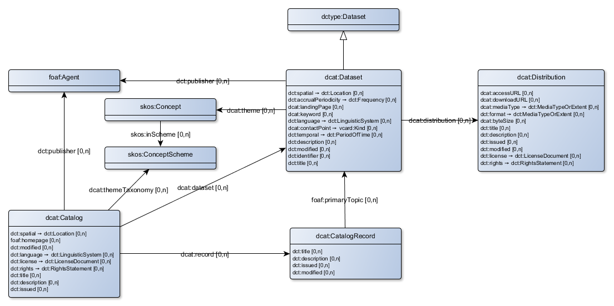

# DCAT W3c basis
This document described the Data Catalog Vocabulary (DCAT) as described by The W3c. This document is generated from Linked Data sources (mainly SHACL and the original DCAT ontology) to facilitate automatic translation and comparision between DCAT profiles.

The original source document can be found at: [http://www.w3.org/TR/vocab-dcat](http://www.w3.org/TR/vocab-dcat)

The following vocabularies are used:

|prefix|uri|website
|---|---|---
|dcat|http://www.w3.org/ns/dcat#|[http://www.w3.org/TR/vocab-dcat/](http://www.w3.org/TR/vocab-dcat/)
|dct|http://dublincore.org/documents/dcmi-terms/|[http://www.dublincore.org/documents/dcmi-terms/](http://www.dublincore.org/documents/dcmi-terms/)
|foaf|http://xmlns.com/foaf/0.1/|[http://xmlns.com/foaf/spec/](http://xmlns.com/foaf/spec/)
|rdfs|http://www.w3.org/2000/01/rdf-schema#|[http://www.w3.org/TR/rdf-schema/](http://www.w3.org/TR/rdf-schema/)
|skos|http://www.w3.org/2004/02/skos/core#|[http://www.w3.org/TR/skos-reference/](http://www.w3.org/TR/skos-reference/)

## Class: Catalog

|name|vocabulair|definition
|---|---|---
|Catalog|dcat:Catalog|A curated collection of metadata about datasets
|Description|dct:description|An account of the resource.
|Issued|dct:issued|Date of formal issuance (e.g., publication) of the resource.
|Modified|dct:modified|Date on which the resource was changed.
|Title|dct:title|A name given to the resource.
|Dataset|dcat:dataset|Links a catalog to a dataset that is part of the catalog.
|Homepage|foaf:homepage|
|Language|dct:language|A language of the resource.
|License|dct:license|A legal document giving official permission to do something with the resource.
|Publisher|dct:publisher|An entity responsible for making the resource available.
|Record|dcat:record|Links a catalog to its records.
|Rights|dct:rights|Information about rights held in and over the resource.
|Spatial|dct:spatial|Spatial characteristics of the resource.
|Theme taxonomy|dcat:themeTaxonomy|The knowledge organization system (KOS) used to classify catalog's datasets.

## Class: Catalog record

|name|vocabulair|definition
|---|---|---
|Catalog record|dcat:CatalogRecord|A record in a data catalog, describing a single dataset.
|Description|dct:description|An account of the resource.
|Issued|dct:issued|Date of formal issuance (e.g., publication) of the resource.
|Modified|dct:modified|Date on which the resource was changed.
|Title|dct:title|A name given to the resource.
|Primary topic|foaf:primaryTopic|

## Class: Dataset

|name|vocabulair|definition
|---|---|---
|Dataset|dcat:Dataset|A collection of data, published or curated by a single source, and available for access or download in one or more formats
|Description|dct:description|An account of the resource.
|Identifier|dct:identifier|An unambiguous reference to the resource within a given context.
|Keyword|dcat:keyword|A keyword or tag describing the dataset.
|Landing page|dcat:landingPage|A Web page that can be navigated to in a Web browser to gain access to the dataset, its distributions and/or additional information.
|Modified|dct:modified|Date on which the resource was changed.
|Title|dct:title|A name given to the resource.
|Contact point|dcat:contactPoint|Links a dataset to relevant contact information which is provided using VCard.
|Distribution|dcat:distribution|Connects a dataset to one of its available distributions.
|Language|dct:language|A language of the resource.
|Publisher|dct:publisher|An entity responsible for making the resource available.
|Spatial|dct:spatial|Spatial characteristics of the resource.
|Temporal|dct:temporal|Temporal characteristics of the resource.
|Theme|dcat:theme|The main category of the dataset. A dataset can have multiple themes.
|accrualPeriodicity|dct:accrualPeriodicity|The frequency with which items are added to a collection.

## Class: Distribution

|name|vocabulair|definition
|---|---|---
|Distribution|dcat:Distribution|Represents a specific available form of a dataset. Each dataset might be available in 
          different forms, these forms might represent different formats of the dataset or different 
          endpoints. Examples of distributions include a downloadable CSV file, an API or an RSS feed
|Access URL|dcat:accessURL|Could be any kind of URL that gives access to a distribution of the dataset. E.g. landing page, 
          download, feed URL, SPARQL endpoint. Use when your catalog does not have information on which it 
          is or when it is definitely not a download.
|Byte size|dcat:byteSize|The size of a distribution in bytes.
|Description|dct:description|An account of the resource.
|Download URL|dcat:downloadURL|This is a direct link to a downloadable file in a given format. E.g. CSV file or RDF file. The 
          format is described by the distribution's dc:format and/or dcat:mediaType
|Issued|dct:issued|Date of formal issuance (e.g., publication) of the resource.
|Modified|dct:modified|Date on which the resource was changed.
|Title|dct:title|A name given to the resource.
|Format|dct:format|The file format, physical medium, or dimensions of the resource.
|License|dct:license|A legal document giving official permission to do something with the resource.
|Media type|dcat:mediaType|This property SHOULD be used when the media type of the distribution is defined 
          in IANA, otherwise dct:format MAY be used with different values.
|Rights|dct:rights|Information about rights held in and over the resource.

