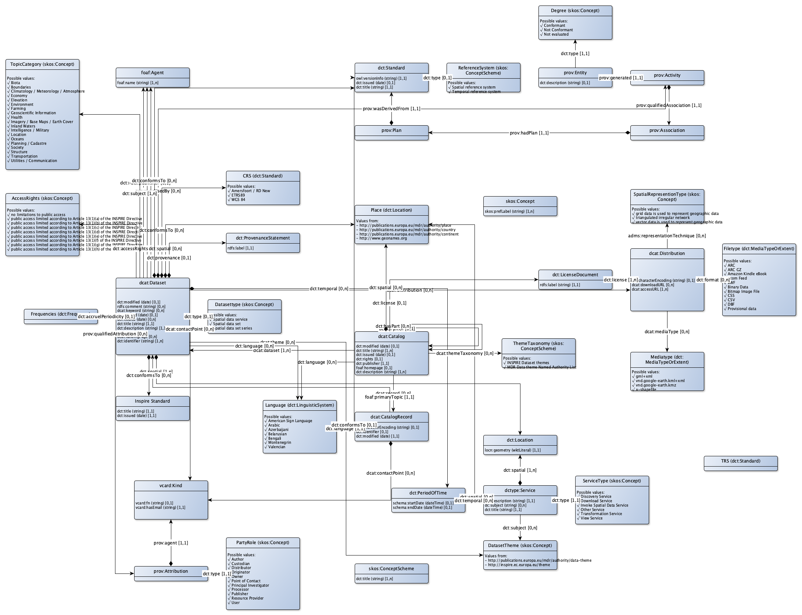

# Profile documentation

This page described the GeoDCAT Application profile version 1.0.1 as specified in: [https://joinup.ec.europa.eu/release/geodcat-ap/v101](https://joinup.ec.europa.eu/release/geodcat-ap/v101).

## Vocabularies and namespaces

The following vocabularies are used:

|prefix|namespace|documentation
|---|---|---
|adms|http://www.w3.org/ns/adms#|
|cnt|http://www.w3.org/2011/content#|
|dc|http://purl.org/dc/elements/1.1/|[http://www.dublincore.org/documents/dcmi-terms](http://www.dublincore.org/documents/dcmi-terms)
|dcat|http://www.w3.org/ns/dcat#|
|dct|http://purl.org/dc/terms/|[http://www.dublincore.org/documents/dcmi-terms](http://www.dublincore.org/documents/dcmi-terms)
|dctype|http://purl.org/dc/dcmitype/|[http://www.dublincore.org/documents/dcmi-terms](http://www.dublincore.org/documents/dcmi-terms)
|foaf|http://xmlns.com/foaf/0.1/|
|owl|http://www.w3.org/2002/07/owl#|
|prov|http://www.w3.org/ns/prov#|[http://www.w3.org/TR/prov-o](http://www.w3.org/TR/prov-o)
|rdfs|http://www.w3.org/2000/01/rdf-schema#|
|schema|http://schema.org/|[http://schema.org](http://schema.org)
|skos|http://www.w3.org/2004/02/skos/core#|
|spdx|http://spdx.org/rdf/terms#|
|vcard|http://www.w3.org/2006/vcard/ns#|

## Application profile classes

### Mandatory classes

|class name|URI|definition
|---|---|---
|Agent|[foaf:Agent](http://xmlns.com/foaf/0.1/Agent)|
|Boundingbox|[dct:Location](http://purl.org/dc/terms/Location)|
|Catalogue|[dcat:Catalog](http://www.w3.org/ns/dcat#Catalog)|
|Dataset|[dcat:Dataset](http://www.w3.org/ns/dcat#Dataset)|
|Service|[dctype:Service](http://purl.org/dc/dcmitype/Service)|

### Recommended classes

|class name|URI|definition
|---|---|---
|Category|[skos:Concept](http://www.w3.org/2004/02/skos/core#Concept)|
|Category Scheme|[skos:ConceptScheme](http://www.w3.org/2004/02/skos/core#ConceptScheme)|
|Distribution|[dcat:Distribution](http://www.w3.org/ns/dcat#Distribution)|
|Licence Document|[dct:LicenseDocument](http://purl.org/dc/terms/LicenseDocument)|

### Optional classes

|class name|URI|definition
|---|---|---
|Catalogue Record|[dcat:CatalogRecord](http://www.w3.org/ns/dcat#CatalogRecord)|
|ConformityDegree|[prov:Entity](http://www.w3.org/ns/prov#Entity)|
|ConformityPlan|[prov:Plan](http://www.w3.org/ns/prov#Plan)|
|ConformityRole|[prov:Association](http://www.w3.org/ns/prov#Association)|
|ConformityTest|[prov:Activity](http://www.w3.org/ns/prov#Activity)|
|Kind|[vcard:Kind](http://www.w3.org/2006/vcard/ns#Kind)|
|Period Of Time|[dct:PeriodOfTime](http://purl.org/dc/terms/PeriodOfTime)|
|Provenance Statement|[dct:ProvenanceStatement](http://purl.org/dc/terms/ProvenanceStatement)|
|ResponsibleOrganization|[prov:Attribution](http://www.w3.org/ns/prov#Attribution)|
|Standard|[dct:Standard](http://purl.org/dc/terms/Standard)|

## DCAT application profile properties per class

### Catalogue

|man|property|uri|range|definition|card
|---|---|---|---|---|---
|M|dataset|[dcat:dataset](http://www.w3.org/ns/dcat#dataset)|[dcat:Dataset](http://www.w3.org/ns/dcat#Dataset)||1..n
|M|description|[dct:description](http://purl.org/dc/terms/description)|||1..n
|M|publisher|[dct:publisher](http://purl.org/dc/terms/publisher)|[foaf:Agent](http://xmlns.com/foaf/0.1/Agent)||1..1
|M|title|[dct:title](http://purl.org/dc/terms/title)|||1..n
|R|homepage|[foaf:homepage](http://xmlns.com/foaf/0.1/homepage)|||0..1
|R|language|[dct:language](http://purl.org/dc/terms/language)|||0..n
|R|licence|[dct:license](http://purl.org/dc/terms/license)|[dct:LicenseDocument](http://purl.org/dc/terms/LicenseDocument)||0..1
|R|release date|[dct:issued](http://purl.org/dc/terms/issued)|||0..1
|R|themes|[dcat:themeTaxonomy](http://www.w3.org/ns/dcat#themeTaxonomy)|[skos:ConceptScheme](http://www.w3.org/2004/02/skos/core#ConceptScheme)||0..n
|R|update modification date|[dct:modified](http://purl.org/dc/terms/modified)|||0..1
|O|has part|[dct:hasPart](http://purl.org/dc/terms/hasPart)|[dcat:Catalog](http://www.w3.org/ns/dcat#Catalog)||0..n
|O|is part of|[dct:isPartOf](http://purl.org/dc/terms/isPartOf)|[dcat:Catalog](http://www.w3.org/ns/dcat#Catalog)||0..1
|O|record|[dcat:record](http://www.w3.org/ns/dcat#record)|[dcat:CatalogRecord](http://www.w3.org/ns/dcat#CatalogRecord)||0..n
|O|rights|[dct:rights](http://purl.org/dc/terms/rights)|||0..1
|O|spatial geographic|[dct:spatial](http://purl.org/dc/terms/spatial)|[dct:Location](http://purl.org/dc/terms/Location)||0..n

### Catalogue Record

|man|property|uri|range|definition|card
|---|---|---|---|---|---
|M|contact point|[dcat:contactPoint](http://www.w3.org/ns/dcat#contactPoint)|[vcard:Kind](http://www.w3.org/2006/vcard/ns#Kind)||0..n
|M|language|[dct:language](http://purl.org/dc/terms/language)|||1..1
|M|primary topic|[foaf:primaryTopic](http://xmlns.com/foaf/0.1/primaryTopic)|[dcat:Dataset](http://www.w3.org/ns/dcat#Dataset)||1..1
|M|update modification date|[dct:modified](http://purl.org/dc/terms/modified)|||1..1
|O|application profile|[dct:conformsTo](http://purl.org/dc/terms/conformsTo)|[dct:Standard](http://purl.org/dc/terms/Standard)||0..1
|O|character set|[cnt:characterEncoding](http://www.w3.org/2011/content#characterEncoding)|||0..1
|O|identifier|[dct:identifier](http://purl.org/dc/terms/identifier)|||0..1

### Dataset

|man|property|uri|range|definition|card
|---|---|---|---|---|---
|M|description|[dct:description](http://purl.org/dc/terms/description)|||1..1
|M|identifier|[dct:identifier](http://purl.org/dc/terms/identifier)|||1..n
|M|title|[dct:title](http://purl.org/dc/terms/title)|||1..1
|M|topic category|[dct:subject](http://purl.org/dc/terms/subject)|[skos:Concept](http://www.w3.org/2004/02/skos/core#Concept)||1..n
|R|author|[dct:creator](http://purl.org/dc/terms/creator)|[foaf:Agent](http://xmlns.com/foaf/0.1/Agent)||0..1
|R|contact point|[dcat:contactPoint](http://www.w3.org/ns/dcat#contactPoint)|[vcard:Kind](http://www.w3.org/2006/vcard/ns#Kind)||0..n
|R|creation date|[dct:created](http://purl.org/dc/terms/created)|||0..1
|R|dataset distribution|[dcat:distribution](http://www.w3.org/ns/dcat#distribution)|[dcat:Distribution](http://www.w3.org/ns/dcat#Distribution)||0..n
|R|documentation|[foaf:page](http://xmlns.com/foaf/0.1/page)|||0..n
|R|frequency|[dct:accruelPeriodicity](http://purl.org/dc/terms/accruelPeriodicity)|||0..1
|R|geographic bounding box|[dct:spatial](http://purl.org/dc/terms/spatial)|[dct:Location](http://purl.org/dc/terms/Location)||1..n
|R|keyword tag|[dcat:keyword](http://www.w3.org/ns/dcat#keyword)|||0..n
|R|landing page|[dcat:landingPage](http://www.w3.org/ns/dcat#landingPage)|||0..n
|R|language|[dct:language](http://purl.org/dc/terms/language)|||0..n
|R|owner|[dct:rightsHolder](http://purl.org/dc/terms/rightsHolder)|[foaf:Agent](http://xmlns.com/foaf/0.1/Agent)||0..1
|R|publisher|[dct:publisher](http://purl.org/dc/terms/publisher)|[foaf:Agent](http://xmlns.com/foaf/0.1/Agent)||0..1
|R|release date|[dct:issued](http://purl.org/dc/terms/issued)|||0..n
|R|reponsible organization|[prov:qualifiedAttribution](http://www.w3.org/ns/prov#qualifiedAttribution)|[prov:Attribution](http://www.w3.org/ns/prov#Attribution)||0..n
|R|spatial resolution|comment|||0..n
|R|temporal coverage|[dct:temporal](http://purl.org/dc/terms/temporal)|[dct:PeriodOfTime](http://purl.org/dc/terms/PeriodOfTime)||0..n
|R|theme category|[dcat:theme](http://www.w3.org/ns/dcat#theme)|[skos:Concept](http://www.w3.org/2004/02/skos/core#Concept)||0..n
|R|type|[dct:type](http://purl.org/dc/terms/type)|[skos:Concept](http://www.w3.org/2004/02/skos/core#Concept)||0..1
|R|update modification date|[dct:modified](http://purl.org/dc/terms/modified)|||0..1
|O|access rights|[dct:accessRights](http://purl.org/dc/terms/accessRights)|||1..n
|O|conformity specification|[prov:wasUsedBy](http://www.w3.org/ns/prov#wasUsedBy)|[prov:Activity](http://www.w3.org/ns/prov#Activity)||0..n
|O|conforms to|[dct:conformsTo](http://purl.org/dc/terms/conformsTo)|[dct:Standard](http://purl.org/dc/terms/Standard)||0..n
|O|coordinate reference system|[dct:conformsTo](http://purl.org/dc/terms/conformsTo)|[dct:Standard](http://purl.org/dc/terms/Standard)||0..n
|O|provenance|[dct:provenance](http://purl.org/dc/terms/provenance)|[dct:ProvenanceStatement](http://purl.org/dc/terms/ProvenanceStatement)||0..1
|O|spatial geographical coverage|[dct:spatial](http://purl.org/dc/terms/spatial)|[dct:Location](http://purl.org/dc/terms/Location)||0..n
|O|temporal reference system|[dct:conformsTo](http://purl.org/dc/terms/conformsTo)|[dct:Standard](http://purl.org/dc/terms/Standard)||0..n

### Distribution

|man|property|uri|range|definition|card
|---|---|---|---|---|---
|R|access URL|[dcat:accessURL](http://www.w3.org/ns/dcat#accessURL)|||1..n
|R|download URL|[dcat:downloadURL](http://www.w3.org/ns/dcat#downloadURL)|||0..n
|R|licence|[dct:license](http://purl.org/dc/terms/license)|[dct:LicenseDocument](http://purl.org/dc/terms/LicenseDocument)||1..n
|O|character encoding|[cnt:characterEncoding](http://www.w3.org/2011/content#characterEncoding)|||0..1
|O|format|[dct:format](http://purl.org/dc/terms/format)|||0..n
|O|media type|[dcat:mediaType](http://www.w3.org/ns/dcat#mediaType)|||0..n
|O|spatial representation type|[adms:representationTechnique](http://www.w3.org/ns/adms#representationTechnique)|[skos:Concept](http://www.w3.org/2004/02/skos/core#Concept)||0..n

### Agent

|man|property|uri|range|definition|card
|---|---|---|---|---|---
|M|name|[foaf:name](http://xmlns.com/foaf/0.1/name)|||1..n

### Category scheme

|man|property|uri|range|definition|card
|---|---|---|---|---|---
|M|title|[dct:title](http://purl.org/dc/terms/title)|||1..n

### Category

|man|property|uri|range|definition|card
|---|---|---|---|---|---
|M|preferred label|[skos:prefLabel](http://www.w3.org/2004/02/skos/core#prefLabel)|||1..n

### Checksum

### Identifier

### Licence document

|man|property|uri|range|definition|card
|---|---|---|---|---|---
|M|label|label|||1..1

### Periode of time

|man|property|uri|range|definition|card
|---|---|---|---|---|---
|O|end date time|[schema:endDate](http://schema.org/endDate)|||0..1
|O|start date time|[schema:startDate](http://schema.org/startDate)|||0..1

## Controlled vocabularies

|Domain|Property URI|Used for class|Vocabulary name|Vocabulary URI
|---|---|---|---|---
|[AccessRights](http://linkeddata.ordina.nl/profiel#AccessRights)|[dct:accessRights](http://purl.org/dc/terms/accessRights)|[dcat:Dataset](http://www.w3.org/ns/dcat#Dataset)|INSPIRE limitations on public access|[http://inspire.ec.europa.eu/metadata-codelist/LimitationsOnPublicAccess](http://inspire.ec.europa.eu/metadata-codelist/LimitationsOnPublicAccess)
|[CRS](http://linkeddata.ordina.nl/profiel#CRS)|[dct:conformsTo](http://purl.org/dc/terms/conformsTo)|[dcat:Dataset](http://www.w3.org/ns/dcat#Dataset)|Coordinate Reference System|[http://inspire.ec.europa.eu/glossary/SpatialReferenceSystem](http://inspire.ec.europa.eu/glossary/SpatialReferenceSystem)
|[DatasetTheme](http://linkeddata.ordina.nl/profiel#DatasetTheme)|[dcat:theme](http://www.w3.org/ns/dcat#theme), [dct:subject](http://purl.org/dc/terms/subject)|[dcat:Dataset](http://www.w3.org/ns/dcat#Dataset), [dctype:Service](http://purl.org/dc/dcmitype/Service)|INSPIRE theme register, MDR Dataset Theme Vocabulary|
|[Datasettype](http://linkeddata.ordina.nl/profiel#Datasettype)|[dct:type](http://purl.org/dc/terms/type)|[dcat:Dataset](http://www.w3.org/ns/dcat#Dataset)|INSPIRE resource type|[http://inspire.ec.europa.eu/metadata-codelist/ResourceType](http://inspire.ec.europa.eu/metadata-codelist/ResourceType)
|[Degree](http://linkeddata.ordina.nl/profiel#Degree)|[dct:type](http://purl.org/dc/terms/type)|[prov:Entity](http://www.w3.org/ns/prov#Entity)|INSPIRE Degrees of conformity|[http://inspire.ec.europa.eu/metadata-codelist/DegreeOfConformity](http://inspire.ec.europa.eu/metadata-codelist/DegreeOfConformity)
|[Filetype](http://linkeddata.ordina.nl/profiel#Filetype)|[dct:format](http://purl.org/dc/terms/format)|[dcat:Distribution](http://www.w3.org/ns/dcat#Distribution)|MDR File Type Named Authority List|[http://publications.europa.eu/mdr/authority/filetype](http://publications.europa.eu/mdr/authority/filetype)
|[Frequencies](http://linkeddata.ordina.nl/profiel#Frequencies)|[dct:accruelPeriodicity](http://purl.org/dc/terms/accruelPeriodicity)|[dcat:Dataset](http://www.w3.org/ns/dcat#Dataset)|MDR Frequency Named Authority List|[http://publications.europa.eu/mdr/authority/frequency](http://publications.europa.eu/mdr/authority/frequency)
|[InspireStandard](http://linkeddata.ordina.nl/profiel#InspireStandard)|[dct:conformsTo](http://purl.org/dc/terms/conformsTo)|[dcat:Dataset](http://www.w3.org/ns/dcat#Dataset)|Inspire Standaard, Inspire Standard|
|[Language](http://linkeddata.ordina.nl/profiel#Language)|[dct:language](http://purl.org/dc/terms/language)|[dcat:Catalog](http://www.w3.org/ns/dcat#Catalog), [dcat:Dataset](http://www.w3.org/ns/dcat#Dataset), [dcat:CatalogRecord](http://www.w3.org/ns/dcat#CatalogRecord)|MDR Languages Named Authority List|[http://publications.europa.eu/mdr/authority/language](http://publications.europa.eu/mdr/authority/language)
|[Mediatype](http://linkeddata.ordina.nl/profiel#Mediatype)|[dcat:mediaType](http://www.w3.org/ns/dcat#mediaType)|[dcat:Distribution](http://www.w3.org/ns/dcat#Distribution)|INSPIRE application mediatypes|[http://inspire.ec.europa.eu/media-types/application](http://inspire.ec.europa.eu/media-types/application)
|[PartyRole](http://linkeddata.ordina.nl/profiel#PartyRole)|[dct:type](http://purl.org/dc/terms/type)|[prov:Attribution](http://www.w3.org/ns/prov#Attribution)|INSPIRE party roles|[http://inspire.ec.europa.eu/metadata-codelist/ResponsiblePartyRole](http://inspire.ec.europa.eu/metadata-codelist/ResponsiblePartyRole)
|[Place](http://linkeddata.ordina.nl/profiel#Place)|[dct:spatial](http://purl.org/dc/terms/spatial)|[dcat:Catalog](http://www.w3.org/ns/dcat#Catalog), [dcat:Dataset](http://www.w3.org/ns/dcat#Dataset), [dctype:Service](http://purl.org/dc/dcmitype/Service)|Geonames, MDR Continents Named Authority List, MDR Countries Named Authority List, MDR Places Named Authority List|
|[ReferenceSystem](http://linkeddata.ordina.nl/profiel#ReferenceSystem)|[dct:type](http://purl.org/dc/terms/type)|[dct:Standard](http://purl.org/dc/terms/Standard)|Reference system|[http://bp4mc2.org/dcat/reference-system](http://bp4mc2.org/dcat/reference-system)
|[ServiceType](http://linkeddata.ordina.nl/profiel#ServiceType)|[dct:type](http://purl.org/dc/terms/type)|[dctype:Service](http://purl.org/dc/dcmitype/Service)|INSPIRE spatial data service type|[http://inspire.ec.europa.eu/metadata-codelist/SpatialDataServiceType](http://inspire.ec.europa.eu/metadata-codelist/SpatialDataServiceType)
|[SpatialRepresentionType](http://linkeddata.ordina.nl/profiel#SpatialRepresentionType)|[adms:representationTechnique](http://www.w3.org/ns/adms#representationTechnique)|[dcat:Distribution](http://www.w3.org/ns/dcat#Distribution)|INSPIRE Spatial representation type|[http://inspire.ec.europa.eu/metadata-codelist/SpatialRepresentationTypeCode](http://inspire.ec.europa.eu/metadata-codelist/SpatialRepresentationTypeCode)
|[ThemeTaxonomy](http://linkeddata.ordina.nl/profiel#ThemeTaxonomy)|[dcat:themeTaxonomy](http://www.w3.org/ns/dcat#themeTaxonomy)|[dcat:Catalog](http://www.w3.org/ns/dcat#Catalog)|Allowed Theme taxonomies (Inspire and MDR)|[http://bp4mc2.org/dcat/theme-taxonomy](http://bp4mc2.org/dcat/theme-taxonomy)
|[TopicCategory](http://linkeddata.ordina.nl/profiel#TopicCategory)|[dct:subject](http://purl.org/dc/terms/subject)|[dcat:Dataset](http://www.w3.org/ns/dcat#Dataset)|Topic categories in accordance with ISO 19115|[http://inspire.ec.europa.eu/metadata-codelist/TopicCategory](http://inspire.ec.europa.eu/metadata-codelist/TopicCategory)
