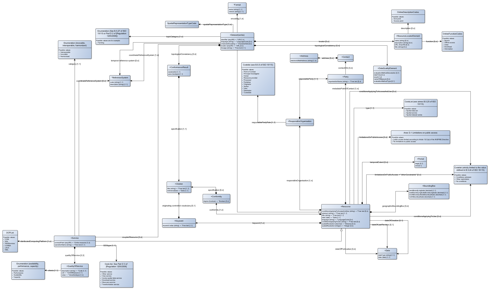

# Inspire metadataprofiel
This document described the INSPIRE Profile

For the dutch original source document can be found at: [https://geonovum.github.io/Metadata-ISO19115/](https://geonovum.github.io/Metadata-ISO19115/)

This profile is described as SHACL shape graph, but does **not** use any vocabularies. A [seperate mapping]() to GEO-DCAT-AP is provided.

## Metadata elements as described in the regulation

|item|source|definition|scope
|---|---|---|---
|[http://bp4mc2.org/inspire/id/concept/](http://bp4mc2.org/inspire/id/concept/)|||
|[Invocation metadata](http://bp4mc2.org/inspire/id/concept/InvocationMetadata)|[Annex VII Part B.3 (annex of Article 14b)](http://bp4mc2.org/inspire/id/regelgeving/AnnexVIIPartB3)|The invocation metadata element documents the interfaces of the harmonised spatial data service and lists the end points to enable machine-to machine communication.|
|[Coordinate Reference System Identifier](http://bp4mc2.org/inspire/id/concept/CoordinateReferenceSystemIdentifier)|[Annex VI Part B.3 (annex of Article 14b)](http://bp4mc2.org/inspire/id/regelgeving/AnnexVIPartB3)|Where appropriate, this is the list of coordinate reference systems supported by the spatial data service.|Each supported coordinate reference system shall be expressed using an identifier.
|[Quality of Service](http://bp4mc2.org/inspire/id/concept/QualityOfService)|[Annex VI Part B.4 (annex of Article 14b)](http://bp4mc2.org/inspire/id/regelgeving/AnnexVIPartB4)|This is the minimum quality of service estimated by the spatial data service responsible party and expected to be valid over a period of time.|
|[Quality of Service Criteria](http://bp4mc2.org/inspire/id/concept/QualityOfServiceCriteria)|[Annex VI Part B.4.1 (annex of Article 14b)](http://bp4mc2.org/inspire/id/regelgeving/AnnexVIPartB4-1)|These are the criteria to which the measurements refer.|The value domain of this metadata element is as follows: [availability, performance, capacity]
|[Quality of Service Measurement Description](http://bp4mc2.org/inspire/id/concept/QualityOfServiceMeasurementDescription)|[Annex VI Part B.4.2.1 (annex of Article 14b)](http://bp4mc2.org/inspire/id/regelgeving/AnnexVIPartB4-2-1)|It describes the measurement for each criterion.|The value domain of this metadata element is free text.
|[Quality of Service Measurement Value](http://bp4mc2.org/inspire/id/concept/QualityOfServiceMeasurementValue)|[Annex VI Part B.4.2.2 (annex of Article 14b)](http://bp4mc2.org/inspire/id/regelgeving/AnnexVIPartB4-2-2)|It describes the value of the measurement for each criterion.|The value domain of this metadata element is free text.
|[Quality of Service Measurement Unit](http://bp4mc2.org/inspire/id/concept/QualityOfServiceMeasurementUnit)|[Annex VI Part B.4.2.3 (annex of Article 14b)](http://bp4mc2.org/inspire/id/regelgeving/AnnexVIPartB4-2-3)|It describes the Unit of the measurement for each criterion.|The value domain of this metadata element is free text.
|[Spatial data services category](http://bp4mc2.org/inspire/id/concept/SpatialDataServicesCategory)|[Annex V Part B.1 (annex of Article 14a)](http://bp4mc2.org/inspire/id/regelgeving/AnnexVPartB1)|This is a citation of the status of the spatial data service versus invocability.|The value domain of this metadata element is as follows: (a) invocabule; (b) interoperable; (c) harmonised
|[Code list](http://bp4mc2.org/inspire/id/concept/CodeList)|[Article 2 clause 5](http://bp4mc2.org/inspire/id/regelgeving/Article02-05)||
|[Enumeration](http://bp4mc2.org/inspire/id/concept/Enumeration)|[Article 2 clause 7](http://bp4mc2.org/inspire/id/regelgeving/Article02-07)||
|[Spatial data set Coordinate Reference System](http://bp4mc2.org/inspire/id/concept/SpatialDatasetCoordinateReferenceSystem)|[Article 13 clause 1](http://bp4mc2.org/inspire/id/regelgeving/Article13-1)|Description of the coordinate reference system(s) used in the data set.|
|[Spatial data set Temporal Reference System](http://bp4mc2.org/inspire/id/concept/SpatialDatasetTemporalReferenceSystem)|[Article 13 clause 2](http://bp4mc2.org/inspire/id/regelgeving/Article13-2)|Description of the temporal reference system(s) used in the data set.|This element is mandatory only if the spatial data set contains temporal information that does not refer to the default temporal reference system.
|[Spatial data set encoding](http://bp4mc2.org/inspire/id/concept/SpatialDatasetEncoding)|[Article 13 clause 3](http://bp4mc2.org/inspire/id/regelgeving/Article13-3)|Description of the computer language construct(s) specifying the representation of data objects in a record, file, message, storage device or transmission channel.|
|[Spatial data set topological consistency](http://bp4mc2.org/inspire/id/concept/SpatialDatasetTopologicalConsistency)|[Article 13 clause 4](http://bp4mc2.org/inspire/id/regelgeving/Article13-4)|Correctness of the explicitly encoded topological characteristics of the data set as described by the scope.|This element is mandatory only if the data set includes types from the Generic Network Model and does not assure centreline topology (connectivity of centrelines) for the network.
|[Spatial data set character encoding](http://bp4mc2.org/inspire/id/concept/SpatialDatasetCharacterEncoding)|[Article 13 clause 5](http://bp4mc2.org/inspire/id/regelgeving/Article13-5)|The character encoding used in the data set.|This element is mandatory only if an encoding is used that is not based on UTF-8.
|[Spatial data set representation type](http://bp4mc2.org/inspire/id/concept/SpatialDatasetSpatialRepresentationType)|[Article 13 clause 6](http://bp4mc2.org/inspire/id/regelgeving/Article13-6)|The method used to spatially represent geographic information.|
|[Resource](http://bp4mc2.org/inspire/id/concept/Resource)|[Part A 1](http://bp4mc2.org/inspire/id/regelgeving/PartA1)|An information resource that has a direct or indirect reference to a specific location or geographic area.|
|[Resource title](http://bp4mc2.org/inspire/id/concept/ResourceTitle)|[Part B 1.1](http://bp4mc2.org/inspire/id/regelgeving/PartB01-1)|This a characteristic, and often unique, name by which the resource is known.|The value domain of this metadata element is free text., Het waardedomein van dit metagegevenselement is vrije tekst.
|[Resource abstract](http://bp4mc2.org/inspire/id/concept/ResourceAbstract)|[Part B 1.2](http://bp4mc2.org/inspire/id/regelgeving/PartB01-2)|This is a brief narrative summary of the content of the resource.|The value domain of this metadata element is free text.
|[Resource type](http://bp4mc2.org/inspire/id/concept/ResourceType)|[Part B 1.3](http://bp4mc2.org/inspire/id/regelgeving/PartB01-3)|This is the type of resource being described by the metadata.|The value domain of this metadata element is defined in Part D.1.
|[Resource locator](http://bp4mc2.org/inspire/id/concept/ResourceLocator)|[Part B 1.4](http://bp4mc2.org/inspire/id/regelgeving/PartB01-4)|The resource locator defines the link(s) to the resource and/or the link to additional information about the resource.|The value domain of this metadata element is a character string, commonly expressed as uniform resource locator (URL).
|[Unique resource identifier](http://bp4mc2.org/inspire/id/concept/UniqueResourceIdentifier)|[Part B 1.5](http://bp4mc2.org/inspire/id/regelgeving/PartB01-5)|A value uniquely identifying the resource.|The value domain of this metadata element is a mandatory character string code, generally assigned by the data owner, and a character string namespace uniquely identifying the context of the identifier code (for example, the data owner).
|[Coupled resource](http://bp4mc2.org/inspire/id/concept/CoupledResource)|[Part B 1.6](http://bp4mc2.org/inspire/id/regelgeving/PartB01-6)|If the resource is a spatial data service, this metadata element identifies, where relevant, the target spatial data set(s) of the service through their unique resource identifiers (URI).|The value domain of this metadata element is a mandatory character string code, generally assigned by the data owner, and a character string namespace uniquely identifying the context of the identifier code (for example, the data owner).
|[Resource language](http://bp4mc2.org/inspire/id/concept/ResourceLanguage)|[Part B 1.7](http://bp4mc2.org/inspire/id/regelgeving/PartB01-7)|The language(s) used within the resource.|The value domain of this metadata element is limited to the languages defined in ISO 639-2.
|[Topic category](http://bp4mc2.org/inspire/id/concept/TopicCategory)|[Part B 2.1](http://bp4mc2.org/inspire/id/regelgeving/PartB02-1)|The topic category is a high-level classification scheme to assist in the grouping and topic-based search of available spatial data resources.|The value domain of this metadata element is defined in Part D.2.
|[Spatial data service type](http://bp4mc2.org/inspire/id/concept/SpatialDataServiceType)|[Part B 2.2](http://bp4mc2.org/inspire/id/regelgeving/PartB02-2)|This is a classification to assist in the search of available spatial data services. A specific service shall be categorised in only one category.|The value domain of this metadata element is defined in Part D.3.
|[Keyword](http://bp4mc2.org/inspire/id/concept/Keyword)|[Part B 3](http://bp4mc2.org/inspire/id/regelgeving/PartB03)|For each keyword, the following metadata elements shall be provided: [section 3.1 and 3.2]|If the resource is a spatial data service, at least one keyword from Part D.4 shall be provided., If a resource is a spatial data set or spatial data set series, at least one keyword shall be provided from the general environmental multilingual thesaurus (GEMET) describing the relevant spatial data theme as defined in Annex I, II or III to Directive 2007/2/EC.
|[Keyword value](http://bp4mc2.org/inspire/id/concept/KeywordValue)|[Part B 3.1](http://bp4mc2.org/inspire/id/regelgeving/PartB03-1)|The keyword value is a commonly used word, formalised word or phrase used to describe the subject. While the topic category is too coarse for detailed queries, keywords help narrowing a full text search and they allow for structured keyword search.|The value domain of this metadata element is free text.
|[Keyword originating controlled vocabulary](http://bp4mc2.org/inspire/id/concept/KeywordOriginatingControlledVocabulary)|[Part B 3.2](http://bp4mc2.org/inspire/id/regelgeving/PartB03-2)|If the keyword value originates from a controlled vocabulary (thesaurus, ontology), for example GEMET, the citation of the originating controlled vocabulary shall be provided.|This citation shall include at least the title and a reference date (date of publication, date of last revision or of creation) of the originating controlled vocabulary.
|[Geographic bounding box](http://bp4mc2.org/inspire/id/concept/GeographicBoundingBox)|[Part B 4.1](http://bp4mc2.org/inspire/id/regelgeving/PartB04-1)|This is the extent of the resource in the geographic space, given as a bounding box.|The bounding box shall be expressed with westbound and eastbound longitudes, and southbound and northbound latitudes in decimal degrees, with a precision of at least two decimals.
|[Temporal reference](http://bp4mc2.org/inspire/id/concept/TemporalReference)|[Part B 5](http://bp4mc2.org/inspire/id/regelgeving/PartB05)|This metadata element addresses the requirement to have information on the temporal dimension of the data as referred to in Article 8(2)(d) of Directive 2007/2/EC. At least one of the metadata elements referred to in points 5.1 to 5.4 shall be provided.|The value domain of the metadata elements referred to in points 5.1 to 5.4 is a set of dates. Each date shall refer to a temporal reference system and shall be expressed in a form compatible with that system. The default reference system shall be the Gregorian calendar, with dates expressed in accordance with ISO 8601.
|[Temporal extent](http://bp4mc2.org/inspire/id/concept/TemporalExtent)|[Part B 5.1](http://bp4mc2.org/inspire/id/regelgeving/PartB05-1)|The temporal extent defines the time period covered by the content of the resource.|This time period may be expressed as any of the following: (a) an individual date, (b) an interval of dates expressed through the starting date and end date of the interval, (c) a mix of individual dates and intervals of dates.
|[Date of publication](http://bp4mc2.org/inspire/id/concept/DateOfPublication)|[Part B 5.2](http://bp4mc2.org/inspire/id/regelgeving/PartB05-2)|This is the date of publication of the resource when available, or the date of entry into force. There may be more than one date of publication.|
|[Date of last revision](http://bp4mc2.org/inspire/id/concept/DateOfLastRevision)|[Part B 5.3](http://bp4mc2.org/inspire/id/regelgeving/PartB05-3)|This is the date of last revision of the resource, if the resource has been revised. There shall not be more than one date of last revision.|
|[Date of creation](http://bp4mc2.org/inspire/id/concept/DateOfCreation)|[Part B 5.4](http://bp4mc2.org/inspire/id/regelgeving/PartB05-4)|This is the date of creation of the resource. There shall not be more than one date of creation.|
|[Lineage](http://bp4mc2.org/inspire/id/concept/Lineage)|[Part B 6.1](http://bp4mc2.org/inspire/id/regelgeving/PartB06-1)|This is a statement on process history and/or overall quality of the spatial data set. Where appropriate it may include a statement whether the data set has been validated or quality assured, whether it is the official version (if multiple versions exist), and whether it has legal validity.|The value domain of this metadata element is free text.
|[Spatial resolution](http://bp4mc2.org/inspire/id/concept/SpatialResolution)|[Part B 6.2](http://bp4mc2.org/inspire/id/regelgeving/PartB06-2)|Spatial resolution refers to the level of detail of the data set. It shall be expressed as a set of zero to many resolution distances (typically for gridded data and imagery-derived products) or equivalent scales (typically for maps or map-derived products).|An equivalent scale is generally expressed as an integer value expressing the scale denominator. A resolution distance shall be expressed as a numerical value associated with a unit of length.
|[Conformity](http://bp4mc2.org/inspire/id/concept/Conformity)|[Part B 7](http://bp4mc2.org/inspire/id/regelgeving/PartB07)|The requirements referred to in Article 5(2)(a) and Article 11(2)(d) of Directive 2007/2/EC relating to the conformity, and the degree of conformity, with implementing rules adopted under Article 7(1) of Directive 2007/2/EC shall be addressed by the following metadata elements [in sections 7.1 and 7.2]|
|[Comformity specification](http://bp4mc2.org/inspire/id/concept/ConformitySpecification)|[Part B 7.1](http://bp4mc2.org/inspire/id/regelgeving/PartB07-1)|This is a citation of the implementing rules adopted under Article 7(1) of Directive 2007/2/EC or other specification to which a particular resource conforms.|This citation shall include at least the title and a reference date (date of publication, date of last revision or of creation) of the implementing rules adopted under Article 7(1) of Directive 2007/2/EC or of the specification., A resource may conform to more than one implementing rules adopted under Article 7(1) of Directive 2007/2/EC or other specification.
|[Conformity degree](http://bp4mc2.org/inspire/id/concept/ConformityDegree)|[Part B 7.2](http://bp4mc2.org/inspire/id/regelgeving/PartB07-2)|This is the degree of conformity of the resource to the implementing rules adopted under Article 7(1) of Directive 2007/2/EC or other specification.|The value domain of this metadata element is defined in Part D.5
|[Conditions applying to access and use](http://bp4mc2.org/inspire/id/concept/ConditionsApplyingToAccessAndUse)|[Part B 8.1](http://bp4mc2.org/inspire/id/regelgeving/PartB08-1)|This metadata element defines the conditions for access and use of spatial data sets and services, and where applicable, corresponding fees as required by Article 5(2)(b) and Article 11(2)(f) of Directive 2007/2/EC.|The value domain of this metadata element is free text. The element must have values. If no conditions apply to the access and use of the resource, 'no conditions apply' shall be used. If conditions are unknown, 'conditions unknown' shall be used. This element shall also provide information on any fees necessary to access and use the resource, if applicable, or refer to a uniform resource locator (URL) where information on fees is available.
|[Limitations on public access](http://bp4mc2.org/inspire/id/concept/LimitationsOnPublicAccess)|[Part B 8.2](http://bp4mc2.org/inspire/id/regelgeving/PartB08-2)|When Member States limit public access to spatial data sets and spatial data services under Article 13 of Directive 2007/2/EC, this metadata element shall provide information on the limitations and the reasons for them.|If there are no limitations on public access, this metadata element shall indicate that fact. The value domain of this metadata element is free text.
|[Responsible organisation](http://bp4mc2.org/inspire/id/concept/ResponsibleOrganisation)|[Part B 9](http://bp4mc2.org/inspire/id/regelgeving/PartB09)|For the purposes of Article 5(2)(d) and Article 11(2)(g) of Directive 2007/2/EC, the following two metadata elements shall be provided: [in sections 9.1 and 9.2]|
|[Responsible party](http://bp4mc2.org/inspire/id/concept/ResponsibleParty)|[Part B 9.1](http://bp4mc2.org/inspire/id/regelgeving/PartB09-1)|This is the description of the organisation responsible for the establishment, management, maintenance and distribution of the resource.|This description shall include: (a) the name of the organisation as free text, (b) a contact e-mail address as a character string.
|[Responsible party role](http://bp4mc2.org/inspire/id/concept/ResponsiblePartyRole)|[Part B 9.2](http://bp4mc2.org/inspire/id/regelgeving/PartB09-2)|This is the role of the responsible organisation.|The value domain of this metadata element is defined in Part D.6
|[Metadata point of contact](http://bp4mc2.org/inspire/id/concept/MetadataPointOfContact)|[Part B 10.1](http://bp4mc2.org/inspire/id/regelgeving/PartB10-1)|This is the description of the organisation responsible for the creation and maintenance of the metadata.|This description shall include: (a) the name of the organisation as free text, (b) a contact e-mail address as a character string.
|[Metadata date](http://bp4mc2.org/inspire/id/concept/MetadataDate)|[Part B 10.2](http://bp4mc2.org/inspire/id/regelgeving/PartB10-2)|The date which specifies when the metadata record was created or updated.|This date shall be expressed in conformity with ISO 8601.
|[Metadata language](http://bp4mc2.org/inspire/id/concept/MetadataLanguage)|[Part B 10.3](http://bp4mc2.org/inspire/id/regelgeving/PartB10-3)|This is the language in which the metadata elements are expressed.|The value domain of this metadata element is limited to the official languages of the Community expressed in conformity with ISO 639-2.

## Metadata elements from the technical guidelines

|item|source|shape|domain|datatypeclass
|---|---|---|---|---
|[http://bp4mc2.org/inspire/id/concept/](http://bp4mc2.org/inspire/id/concept/)||||
|[Invocation metadata](http://bp4mc2.org/inspire/id/concept/InvocationMetadata)|[Annex VII Part B.3 (annex of Article 14b)](http://bp4mc2.org/inspire/id/regelgeving/AnnexVIIPartB3)|[identificationInfo[1]/*/containsOperations/*/operationName](http://bp4mc2.org/inspire/def/inspire/OperationName)|[*Free text](http://bp4mc2.org/inspire/def/inspire/FreeText)|[string](http://www.w3.org/2001/XMLSchema#string)
|[Invocation metadata](http://bp4mc2.org/inspire/id/concept/InvocationMetadata)|[Annex VII Part B.3 (annex of Article 14b)](http://bp4mc2.org/inspire/id/regelgeving/AnnexVIIPartB3)|[identificationInfo[1]/*/containsOperations/*/connectPoint/*/linkage](http://bp4mc2.org/inspire/def/inspire/ConnectPoint)|[*Online resource](http://bp4mc2.org/inspire/def/inspire/OnlineResource)|[anyURI](http://www.w3.org/2001/XMLSchema#anyURI)
|[Invocation metadata](http://bp4mc2.org/inspire/id/concept/InvocationMetadata)|[Annex VII Part B.3 (annex of Article 14b)](http://bp4mc2.org/inspire/id/regelgeving/AnnexVIIPartB3)|[identificationInfo[1]/*/containsOperations/*/DCP](http://bp4mc2.org/inspire/def/inspire/DCP)|[DCPList](http://bp4mc2.org/inspire/def/inspire/DCPList)|[Concept](http://www.w3.org/2004/02/skos/core#Concept)
|[Coordinate Reference System Identifier](http://bp4mc2.org/inspire/id/concept/CoordinateReferenceSystemIdentifier)|[Annex VI Part B.3 (annex of Article 14b)](http://bp4mc2.org/inspire/id/regelgeving/AnnexVIPartB3)|[referenceSystemInfo](http://bp4mc2.org/inspire/def/inspire/CoordinateReferenceSystemIdentifier)|[*ReferenceSystem](http://bp4mc2.org/inspire/def/inspire/ReferenceSystem)|[CoordinateReferenceSystem](http://bp4mc2.org/inspire/def/inspire#CoordinateReferenceSystem)
|[Quality of Service](http://bp4mc2.org/inspire/id/concept/QualityOfService)|[Annex VI Part B.4 (annex of Article 14b)](http://bp4mc2.org/inspire/id/regelgeving/AnnexVIPartB4)|[dataQualityInfo/*/report/DQ_ConceptualConsistency/](http://bp4mc2.org/inspire/def/inspire/QualityOfService)|[+QualityOfService](http://bp4mc2.org/inspire/def/inspire/QualityOfServiceElement)|[BlankNode](http://www.w3.org/ns/shacl#BlankNode)
|[Quality of Service Criteria](http://bp4mc2.org/inspire/id/concept/QualityOfServiceCriteria)|[Annex VI Part B.4.1 (annex of Article 14b)](http://bp4mc2.org/inspire/id/regelgeving/AnnexVIPartB4-1)|[dataQualityInfo/*/report/DQ_ConceptualConsistency/nameOfMeasure](http://bp4mc2.org/inspire/def/inspire/QualityOfServiceCriteria)|[Enumeration (availability, performance, capacity)](http://bp4mc2.org/inspire/def/inspire/QualityOfServiceCriteriaCodes)|[Concept](http://www.w3.org/2004/02/skos/core#Concept)
|[Quality of Service Measurement Description](http://bp4mc2.org/inspire/id/concept/QualityOfServiceMeasurementDescription)|[Annex VI Part B.4.2.1 (annex of Article 14b)](http://bp4mc2.org/inspire/id/regelgeving/AnnexVIPartB4-2-1)|[dataQualityInfo/*/report/DQ_ConceptualConsistency/measureIdentification](http://bp4mc2.org/inspire/def/inspire/QualityOfServiceMeasurementDescription)|[*Code](http://bp4mc2.org/inspire/def/inspire/Code)|[string](http://www.w3.org/2001/XMLSchema#string)
|[Quality of Service Measurement Value](http://bp4mc2.org/inspire/id/concept/QualityOfServiceMeasurementValue)|[Annex VI Part B.4.2.2 (annex of Article 14b)](http://bp4mc2.org/inspire/id/regelgeving/AnnexVIPartB4-2-2)|[dataQualityInfo/*/report/DQ_ConceptualConsistency/result/DQ_QuantitativeResult/value](http://bp4mc2.org/inspire/def/inspire/QualityOfServiceMeasurementValue)|[*ValueDatatype](http://bp4mc2.org/inspire/def/inspire/ValueDatatype)|[Literal](http://www.w3.org/2000/01/rdf-schema#Literal)
|[Quality of Service Measurement Unit](http://bp4mc2.org/inspire/id/concept/QualityOfServiceMeasurementUnit)|[Annex VI Part B.4.2.3 (annex of Article 14b)](http://bp4mc2.org/inspire/id/regelgeving/AnnexVIPartB4-2-3)|[dataQualityInfo/*/report/DQ_ConceptualConsistency/result/DQ_QuantitativeResult/valueUnit](http://bp4mc2.org/inspire/def/inspire/QualityOfServiceMeasurementUnit)|[*UnitOfMeasure](http://bp4mc2.org/inspire/def/inspire/UnitOfMeasure)|[UnitOfMeasure](http://bp4mc2.org/inspire/def/inspire#UnitOfMeasure)
|[Spatial data services category](http://bp4mc2.org/inspire/id/concept/SpatialDataServicesCategory)|[Annex V Part B.1 (annex of Article 14a)](http://bp4mc2.org/inspire/id/regelgeving/AnnexVPartB1)|[dataQualityInfo/*/report/*/result/*/specification](http://bp4mc2.org/inspire/def/inspire/SpatialDataServicesCategory)|[Enumeration (invocable, interoperable, harmonized)](http://bp4mc2.org/inspire/def/inspire/SpatialDataServicesCategories)|[Concept](http://www.w3.org/2004/02/skos/core#Concept)
|[Code list](http://bp4mc2.org/inspire/id/concept/CodeList)|[Article 2 clause 5](http://bp4mc2.org/inspire/id/regelgeving/Article02-05)|||
|[Enumeration](http://bp4mc2.org/inspire/id/concept/Enumeration)|[Article 2 clause 7](http://bp4mc2.org/inspire/id/regelgeving/Article02-07)|||
|[Spatial data set Coordinate Reference System](http://bp4mc2.org/inspire/id/concept/SpatialDatasetCoordinateReferenceSystem)|[Article 13 clause 1](http://bp4mc2.org/inspire/id/regelgeving/Article13-1)|[referenceSystemInfo](http://bp4mc2.org/inspire/def/inspire/SpatialDatasetCoordinateReferenceSystem)|[*ReferenceSystem](http://bp4mc2.org/inspire/def/inspire/ReferenceSystem)|[CoordinateReferenceSystem](http://bp4mc2.org/inspire/def/inspire#CoordinateReferenceSystem)
|[Spatial data set Temporal Reference System](http://bp4mc2.org/inspire/id/concept/SpatialDatasetTemporalReferenceSystem)|[Article 13 clause 2](http://bp4mc2.org/inspire/id/regelgeving/Article13-2)|[referenceSystemInfo](http://bp4mc2.org/inspire/def/inspire/SpatialDatasetTemporalReferenceSystem)|[*ReferenceSystem](http://bp4mc2.org/inspire/def/inspire/ReferenceSystem)|[TemporalReferenceSystem](http://bp4mc2.org/inspire/def/inspire#TemporalReferenceSystem)
|[Spatial data set encoding](http://bp4mc2.org/inspire/id/concept/SpatialDatasetEncoding)|[Article 13 clause 3](http://bp4mc2.org/inspire/id/regelgeving/Article13-3)|[distributionInfo/MD_Distribution/distributionFormat](http://bp4mc2.org/inspire/def/inspire/SpatialDatasetEncoding)|[*Format](http://bp4mc2.org/inspire/def/inspire/Format)|[Mediatype](http://bp4mc2.org/inspire/def/inspire#Mediatype)
|[Spatial data set topological consistency](http://bp4mc2.org/inspire/id/concept/SpatialDatasetTopologicalConsistency)|[Article 13 clause 4](http://bp4mc2.org/inspire/id/regelgeving/Article13-4)|[dataQualityInfo/DQ_DataQuality/report/](http://bp4mc2.org/inspire/def/inspire/SpatialDatasetTopologicalConsistencyDescriptive)|[+ConformanceResult](http://bp4mc2.org/inspire/def/inspire/ConformanceResult)|[BlankNode](http://www.w3.org/ns/shacl#BlankNode)
|[Spatial data set topological consistency](http://bp4mc2.org/inspire/id/concept/SpatialDatasetTopologicalConsistency)|[Article 13 clause 4](http://bp4mc2.org/inspire/id/regelgeving/Article13-4)|[dataQualityInfo/DQ_DataQuality/report/](http://bp4mc2.org/inspire/def/inspire/SpatialDatasetTopologicalConsistencyQuantitive)|[+DataQualityElement](http://bp4mc2.org/inspire/def/inspire/DataQualityElement)|[BlankNode](http://www.w3.org/ns/shacl#BlankNode)
|[Spatial data set character encoding](http://bp4mc2.org/inspire/id/concept/SpatialDatasetCharacterEncoding)|[Article 13 clause 5](http://bp4mc2.org/inspire/id/regelgeving/Article13-5)|[identificationInfo[1]/*/characterSet](http://bp4mc2.org/inspire/def/inspire/SpatialDatasetCharacterEncoding)|[*CharacterSet](http://bp4mc2.org/inspire/def/inspire/CharacterSet)|[CharacterSet](http://bp4mc2.org/inspire/def/inspire#CharacterSet)
|[Spatial data set representation type](http://bp4mc2.org/inspire/id/concept/SpatialDatasetSpatialRepresentationType)|[Article 13 clause 6](http://bp4mc2.org/inspire/id/regelgeving/Article13-6)|[identificationInfo[1]/*/spatialRepresentationType](http://bp4mc2.org/inspire/def/inspire/SpatialDatasetSpatialRepresentationType)|[SpatialRepresentationTypeCode](http://bp4mc2.org/inspire/def/inspire/SpatialRepresentationTypeCode)|[Concept](http://www.w3.org/2004/02/skos/core#Concept)
|[Resource](http://bp4mc2.org/inspire/id/concept/Resource)|[Part A 1](http://bp4mc2.org/inspire/id/regelgeving/PartA1)|[/](http://bp4mc2.org/inspire/def/inspire/Resource)||
|[Resource title](http://bp4mc2.org/inspire/id/concept/ResourceTitle)|[Part B 1.1](http://bp4mc2.org/inspire/id/regelgeving/PartB01-1)|[identificationInfo[1]/*/citation/*/title](http://bp4mc2.org/inspire/def/inspire/ResourceTitle)|[*Free text](http://bp4mc2.org/inspire/def/inspire/FreeText)|[string](http://www.w3.org/2001/XMLSchema#string)
|[Resource abstract](http://bp4mc2.org/inspire/id/concept/ResourceAbstract)|[Part B 1.2](http://bp4mc2.org/inspire/id/regelgeving/PartB01-2)|[identificationInfo[1]/*/abstract](http://bp4mc2.org/inspire/def/inspire/ResourceAbstract)|[*Free text](http://bp4mc2.org/inspire/def/inspire/FreeText)|[string](http://www.w3.org/2001/XMLSchema#string)
|[Resource type](http://bp4mc2.org/inspire/id/concept/ResourceType)|[Part B 1.3](http://bp4mc2.org/inspire/id/regelgeving/PartB01-3)|[hierarchyLevel](http://bp4mc2.org/inspire/def/inspire/ResourceType)|[CodeList (see annex B.5.25 of ISO 19115)](http://bp4mc2.org/inspire/def/inspire/ResourceTypes)|[Concept](http://www.w3.org/2004/02/skos/core#Concept)
|[Resource locator](http://bp4mc2.org/inspire/id/concept/ResourceLocator)|[Part B 1.4](http://bp4mc2.org/inspire/id/regelgeving/PartB01-4)|[distributionInfo/*/transferOptions/*/onLine/*/linkage](http://bp4mc2.org/inspire/def/inspire/ResourceLocator)|[*URL](http://bp4mc2.org/inspire/def/inspire/URL)|[anyURI](http://www.w3.org/2001/XMLSchema#anyURI)
|[Resource locator](http://bp4mc2.org/inspire/id/concept/ResourceLocator)|[Part B 1.4](http://bp4mc2.org/inspire/id/regelgeving/PartB01-4)|[distributionInfo/*/transferOptions/*/onLine/*/linkage/](http://bp4mc2.org/inspire/def/inspire/ResourceLocatorComplex)|[+ResourceLocatorElement](http://bp4mc2.org/inspire/def/inspire/ResourceLocatorElement)|[BlankNode](http://www.w3.org/ns/shacl#BlankNode)
|[Unique resource identifier](http://bp4mc2.org/inspire/id/concept/UniqueResourceIdentifier)|[Part B 1.5](http://bp4mc2.org/inspire/id/regelgeving/PartB01-5)|[identificationInfo[1]/*/citation/*/identifier](http://bp4mc2.org/inspire/def/inspire/UniqueResourceIdentifier)|[*URI](http://bp4mc2.org/inspire/def/inspire/URI)|[anyURI](http://www.w3.org/2001/XMLSchema#anyURI)
|[Coupled resource](http://bp4mc2.org/inspire/id/concept/CoupledResource)|[Part B 1.6](http://bp4mc2.org/inspire/id/regelgeving/PartB01-6)|[identificationInfo[1]/*/operatesOn](http://bp4mc2.org/inspire/def/inspire/CoupledResource)|[+Dataset(series)](http://bp4mc2.org/inspire/def/inspire/Dataset)|[Dataset](http://bp4mc2.org/inspire/def/inspire#Dataset)
|[Resource language](http://bp4mc2.org/inspire/id/concept/ResourceLanguage)|[Part B 1.7](http://bp4mc2.org/inspire/id/regelgeving/PartB01-7)|[identificationInfo[1]/*/language](http://bp4mc2.org/inspire/def/inspire/ResourceLanguage)|[*LanguageCode](http://bp4mc2.org/inspire/def/inspire/LanguageCode)|[string](http://www.w3.org/2001/XMLSchema#string)
|[Topic category](http://bp4mc2.org/inspire/id/concept/TopicCategory)|[Part B 2.1](http://bp4mc2.org/inspire/id/regelgeving/PartB02-1)|[identificationInfo[1]/*/topicCategory](http://bp4mc2.org/inspire/def/inspire/TopicCategory)|[Enumeration (See B.5.27 of ISO 19115 or Part D 2 of [Regulation 1205/2008])](http://bp4mc2.org/inspire/def/inspire/TopicCategories)|[Concept](http://www.w3.org/2004/02/skos/core#Concept)
|[Spatial data service type](http://bp4mc2.org/inspire/id/concept/SpatialDataServiceType)|[Part B 2.2](http://bp4mc2.org/inspire/id/regelgeving/PartB02-2)|[identificationInfo[1]/*/serviceType](http://bp4mc2.org/inspire/def/inspire/SpatialDataServiceType)|[Code list. See Part D 3 of [Regulation 1205/2008]](http://bp4mc2.org/inspire/def/inspire/SpatialDataServiceTypes)|[Concept](http://www.w3.org/2004/02/skos/core#Concept)
|[Keyword](http://bp4mc2.org/inspire/id/concept/Keyword)|[Part B 3](http://bp4mc2.org/inspire/id/regelgeving/PartB03)|[identificationInfo[1]/*/descriptiveKeywords/*/](http://bp4mc2.org/inspire/def/inspire/Keyword)|[+Keyword](http://bp4mc2.org/inspire/def/inspire/KeywordElement)|[BlankNode](http://www.w3.org/ns/shacl#BlankNode)
|[Keyword value](http://bp4mc2.org/inspire/id/concept/KeywordValue)|[Part B 3.1](http://bp4mc2.org/inspire/id/regelgeving/PartB03-1)|[identificationInfo[1]/*/descriptiveKeywords/*/keyword](http://bp4mc2.org/inspire/def/inspire/KeywordValue)|[*Free text](http://bp4mc2.org/inspire/def/inspire/FreeText)|[string](http://www.w3.org/2001/XMLSchema#string)
|[Keyword originating controlled vocabulary](http://bp4mc2.org/inspire/id/concept/KeywordOriginatingControlledVocabulary)|[Part B 3.2](http://bp4mc2.org/inspire/id/regelgeving/PartB03-2)|[identificationInfo[1]/*/descriptiveKeywords/*/thesaurusName](http://bp4mc2.org/inspire/def/inspire/KeywordOriginatingControlledVocabulary)|[+Citation](http://bp4mc2.org/inspire/def/inspire/Citation)|[BlankNode](http://www.w3.org/ns/shacl#BlankNode)
|[Geographic bounding box](http://bp4mc2.org/inspire/id/concept/GeographicBoundingBox)|[Part B 4.1](http://bp4mc2.org/inspire/id/regelgeving/PartB04-1)|[identificationInfo[1]/*/extent/*/geographicElement/*/westBoundLongitude](http://bp4mc2.org/inspire/def/inspire/GeographicBoundingBox)|[+BoundingBox](http://bp4mc2.org/inspire/def/inspire/BoundingBox)|[BlankNode](http://www.w3.org/ns/shacl#BlankNode)
|[Geographic bounding box](http://bp4mc2.org/inspire/id/concept/GeographicBoundingBox)|[Part B 4.1](http://bp4mc2.org/inspire/id/regelgeving/PartB04-1)|[identificationInfo[1]/*/extent/*/geographicElement/*/southBoundLatitude](http://bp4mc2.org/inspire/def/inspire/GeographicBoundingBox)|[+BoundingBox](http://bp4mc2.org/inspire/def/inspire/BoundingBox)|[BlankNode](http://www.w3.org/ns/shacl#BlankNode)
|[Geographic bounding box](http://bp4mc2.org/inspire/id/concept/GeographicBoundingBox)|[Part B 4.1](http://bp4mc2.org/inspire/id/regelgeving/PartB04-1)|[identificationInfo[1]/*/extent/*/geographicElement/*/northBoundLatitude](http://bp4mc2.org/inspire/def/inspire/GeographicBoundingBox)|[+BoundingBox](http://bp4mc2.org/inspire/def/inspire/BoundingBox)|[BlankNode](http://www.w3.org/ns/shacl#BlankNode)
|[Geographic bounding box](http://bp4mc2.org/inspire/id/concept/GeographicBoundingBox)|[Part B 4.1](http://bp4mc2.org/inspire/id/regelgeving/PartB04-1)|[identificationInfo[1]/*/extent/*/geographicElement/*/eastBoundLongitude](http://bp4mc2.org/inspire/def/inspire/GeographicBoundingBox)|[+BoundingBox](http://bp4mc2.org/inspire/def/inspire/BoundingBox)|[BlankNode](http://www.w3.org/ns/shacl#BlankNode)
|[Temporal reference](http://bp4mc2.org/inspire/id/concept/TemporalReference)|[Part B 5](http://bp4mc2.org/inspire/id/regelgeving/PartB05)|||
|[Temporal extent](http://bp4mc2.org/inspire/id/concept/TemporalExtent)|[Part B 5.1](http://bp4mc2.org/inspire/id/regelgeving/PartB05-1)|[identificationInfo[1]/*/extent/*/temporalElement/*/extent](http://bp4mc2.org/inspire/def/inspire/TemporalExtent)|[+Period](http://bp4mc2.org/inspire/def/inspire/Period)|[BlankNode](http://www.w3.org/ns/shacl#BlankNode)
|[Date of publication](http://bp4mc2.org/inspire/id/concept/DateOfPublication)|[Part B 5.2](http://bp4mc2.org/inspire/id/regelgeving/PartB05-2)|[identificationInfo[1]/*/citation/*/date[./*/dateType/*/text()='publication']/*/date](http://bp4mc2.org/inspire/def/inspire/DateOfPublication)|[+Date](http://bp4mc2.org/inspire/def/inspire/CIDate)|
|[Date of last revision](http://bp4mc2.org/inspire/id/concept/DateOfLastRevision)|[Part B 5.3](http://bp4mc2.org/inspire/id/regelgeving/PartB05-3)|[identificationInfo[1]/*/citation/*/date[./*/dateType/*/text()='publication']/*/date](http://bp4mc2.org/inspire/def/inspire/DateOfLastRevision)|[+Date](http://bp4mc2.org/inspire/def/inspire/CIDate)|
|[Date of creation](http://bp4mc2.org/inspire/id/concept/DateOfCreation)|[Part B 5.4](http://bp4mc2.org/inspire/id/regelgeving/PartB05-4)|[identificationInfo[1]/*/citation/*/date[./*/dateType/*/text()='publication']/*/date](http://bp4mc2.org/inspire/def/inspire/DateOfCreation)|[+Date](http://bp4mc2.org/inspire/def/inspire/CIDate)|
|[Lineage](http://bp4mc2.org/inspire/id/concept/Lineage)|[Part B 6.1](http://bp4mc2.org/inspire/id/regelgeving/PartB06-1)|[dataQualityInfo/*/lineage/*/statement](http://bp4mc2.org/inspire/def/inspire/Lineage)|[*Free text](http://bp4mc2.org/inspire/def/inspire/FreeText)|[string](http://www.w3.org/2001/XMLSchema#string)
|[Spatial resolution](http://bp4mc2.org/inspire/id/concept/SpatialResolution)|[Part B 6.2](http://bp4mc2.org/inspire/id/regelgeving/PartB06-2)|[identificationInfo[1]/*/spatialResolution/*/equivalentScale/*/denominator](http://bp4mc2.org/inspire/def/inspire/SpatialResolutionEquivalentScale)|[*Integer](http://bp4mc2.org/inspire/def/inspire/Integer)|[integer](http://www.w3.org/2001/XMLSchema#integer)
|[Spatial resolution](http://bp4mc2.org/inspire/id/concept/SpatialResolution)|[Part B 6.2](http://bp4mc2.org/inspire/id/regelgeving/PartB06-2)|[identificationInfo[1]/*/spatialResolution/*/distance](http://bp4mc2.org/inspire/def/inspire/SpatialResolutionDistance)|[*Distance](http://bp4mc2.org/inspire/def/inspire/Distance)|[decimal](http://www.w3.org/2001/XMLSchema#decimal)
|[Conformity](http://bp4mc2.org/inspire/id/concept/Conformity)|[Part B 7](http://bp4mc2.org/inspire/id/regelgeving/PartB07)|[dataQualityInfo/*/report/*/result/*/](http://bp4mc2.org/inspire/def/inspire/Conformity)|[+Conformity](http://bp4mc2.org/inspire/def/inspire/ConformityElement)|[BlankNode](http://www.w3.org/ns/shacl#BlankNode)
|[Comformity specification](http://bp4mc2.org/inspire/id/concept/ConformitySpecification)|[Part B 7.1](http://bp4mc2.org/inspire/id/regelgeving/PartB07-1)|[dataQualityInfo/*/report/*/result/*/specification](http://bp4mc2.org/inspire/def/inspire/ConformitySpecification)|[+Citation](http://bp4mc2.org/inspire/def/inspire/Citation)|[BlankNode](http://www.w3.org/ns/shacl#BlankNode)
|[Conformity degree](http://bp4mc2.org/inspire/id/concept/ConformityDegree)|[Part B 7.2](http://bp4mc2.org/inspire/id/regelgeving/PartB07-2)|[dataQualityInfo/*/report/*/result/*/pass](http://bp4mc2.org/inspire/def/inspire/ConformityDegree)|[*Boolean](http://bp4mc2.org/inspire/def/inspire/Boolean)|[boolean](http://www.w3.org/2001/XMLSchema#boolean)
|[Conditions applying to access and use](http://bp4mc2.org/inspire/id/concept/ConditionsApplyingToAccessAndUse)|[Part B 8.1](http://bp4mc2.org/inspire/id/regelgeving/PartB08-1)|[identificationInfo[1]/*/resourceConstraints/*/otherConstraints](http://bp4mc2.org/inspire/def/inspire/ConditionsApplyingToUseOtherConstraints)|[*Free text](http://bp4mc2.org/inspire/def/inspire/FreeText)|[string](http://www.w3.org/2001/XMLSchema#string)
|[Conditions applying to access and use](http://bp4mc2.org/inspire/id/concept/ConditionsApplyingToAccessAndUse)|[Part B 8.1](http://bp4mc2.org/inspire/id/regelgeving/PartB08-1)|[identificationInfo[1]/*/resourceConstraints/*/otherConstraints](http://bp4mc2.org/inspire/def/inspire/ConditionsApplyingToAccessAndUseOtherConstraints)|[*Free text](http://bp4mc2.org/inspire/def/inspire/FreeText)|[string](http://www.w3.org/2001/XMLSchema#string)
|[Conditions applying to access and use](http://bp4mc2.org/inspire/id/concept/ConditionsApplyingToAccessAndUse)|[Part B 8.1](http://bp4mc2.org/inspire/id/regelgeving/PartB08-1)|[identificationInfo[1]/*/resourceConstraints/*/accessConstraints](http://bp4mc2.org/inspire/def/inspire/ConditionsApplyingToAccessAndUse)|[Codelist (strictly limited to the value defined in B.5.24 of ISO 19115)](http://bp4mc2.org/inspire/def/inspire/AccessAndUseConditions)|[Concept](http://www.w3.org/2004/02/skos/core#Concept)
|[Conditions applying to access and use](http://bp4mc2.org/inspire/id/concept/ConditionsApplyingToAccessAndUse)|[Part B 8.1](http://bp4mc2.org/inspire/id/regelgeving/PartB08-1)|[identificationInfo[1]/*/resourceConstraints/*/useConstraints](http://bp4mc2.org/inspire/def/inspire/ConditionsApplyingToUse)|[Codelist (strictly limited to the value defined in B.5.24 of ISO 19115)](http://bp4mc2.org/inspire/def/inspire/AccessAndUseConditions)|[Concept](http://www.w3.org/2004/02/skos/core#Concept)
|[Limitations on public access](http://bp4mc2.org/inspire/id/concept/LimitationsOnPublicAccess)|[Part B 8.2](http://bp4mc2.org/inspire/id/regelgeving/PartB08-2)|[identificationInfo[1]/*/resourceConstraints/*/otherConstraints](http://bp4mc2.org/inspire/def/inspire/LimitationsOnPublicAccessOtherConstraints)|[Anex D.1 Limitations on public access](http://bp4mc2.org/inspire/def/inspire/PublicAccessLimitations)|[Concept](http://www.w3.org/2004/02/skos/core#Concept)
|[Limitations on public access](http://bp4mc2.org/inspire/id/concept/LimitationsOnPublicAccess)|[Part B 8.2](http://bp4mc2.org/inspire/id/regelgeving/PartB08-2)|[identificationInfo[1]/*/resourceConstraints/*/accessConstraints](http://bp4mc2.org/inspire/def/inspire/LimitationsOnPublicAccess)|[Codelist (strictly limited to the value defined in B.5.24 of ISO 19115)](http://bp4mc2.org/inspire/def/inspire/AccessAndUseConditions)|[Concept](http://www.w3.org/2004/02/skos/core#Concept)
|[Responsible organisation](http://bp4mc2.org/inspire/id/concept/ResponsibleOrganisation)|[Part B 9](http://bp4mc2.org/inspire/id/regelgeving/PartB09)|[identificationInfo[1]/*/](http://bp4mc2.org/inspire/def/inspire/ResponsibleOrganisation)|[+ResponsibleOrganisation](http://bp4mc2.org/inspire/def/inspire/ResponsibleOrganisationElement)|[BlankNode](http://www.w3.org/ns/shacl#BlankNode)
|[Responsible party](http://bp4mc2.org/inspire/id/concept/ResponsibleParty)|[Part B 9.1](http://bp4mc2.org/inspire/id/regelgeving/PartB09-1)|[identificationInfo[1]/*/pointOfContact](http://bp4mc2.org/inspire/def/inspire/ResponsibleParty)|[+Party](http://bp4mc2.org/inspire/def/inspire/Party)|[BlankNode](http://www.w3.org/ns/shacl#BlankNode)
|[Responsible party role](http://bp4mc2.org/inspire/id/concept/ResponsiblePartyRole)|[Part B 9.2](http://bp4mc2.org/inspire/id/regelgeving/PartB09-2)|[identificationInfo[1]/*/pointOfContact/*/role](http://bp4mc2.org/inspire/def/inspire/ResponsiblePartyRole)|[Codelist (see B.5.5 of ISO 19115)](http://bp4mc2.org/inspire/def/inspire/ResponsiblePartyRoles)|[Concept](http://www.w3.org/2004/02/skos/core#Concept)
|[Metadata point of contact](http://bp4mc2.org/inspire/id/concept/MetadataPointOfContact)|[Part B 10.1](http://bp4mc2.org/inspire/id/regelgeving/PartB10-1)|[contact](http://bp4mc2.org/inspire/def/inspire/MetadataPointOfContact)|[+Party](http://bp4mc2.org/inspire/def/inspire/Party)|[BlankNode](http://www.w3.org/ns/shacl#BlankNode)
|[Metadata date](http://bp4mc2.org/inspire/id/concept/MetadataDate)|[Part B 10.2](http://bp4mc2.org/inspire/id/regelgeving/PartB10-2)|[dateStamp](http://bp4mc2.org/inspire/def/inspire/MetadataDate)|[*Date](http://bp4mc2.org/inspire/def/inspire/Date)|[date](http://www.w3.org/2001/XMLSchema#date)
|[Metadata language](http://bp4mc2.org/inspire/id/concept/MetadataLanguage)|[Part B 10.3](http://bp4mc2.org/inspire/id/regelgeving/PartB10-3)|[language](http://bp4mc2.org/inspire/def/inspire/MetadataLanguage)|[*LanguageCode](http://bp4mc2.org/inspire/def/inspire/LanguageCode)|[string](http://www.w3.org/2001/XMLSchema#string)

