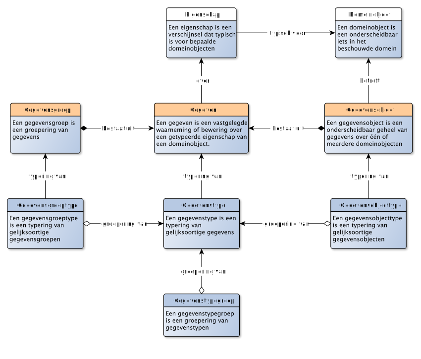
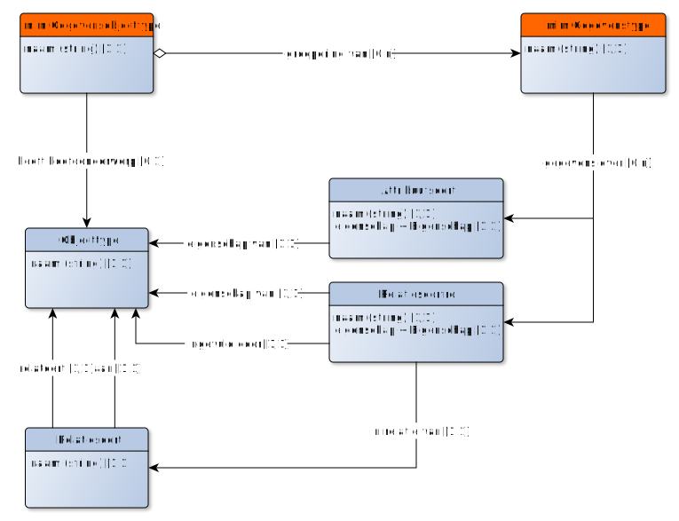
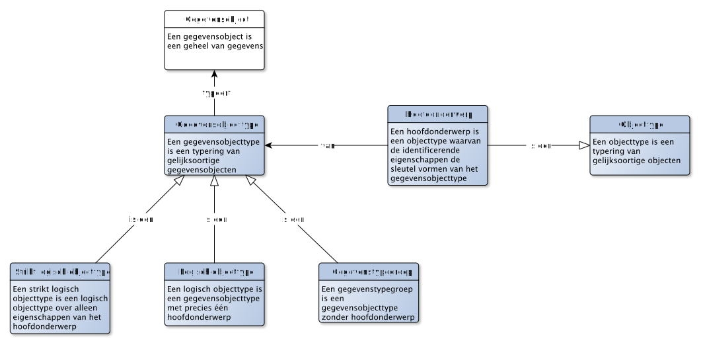
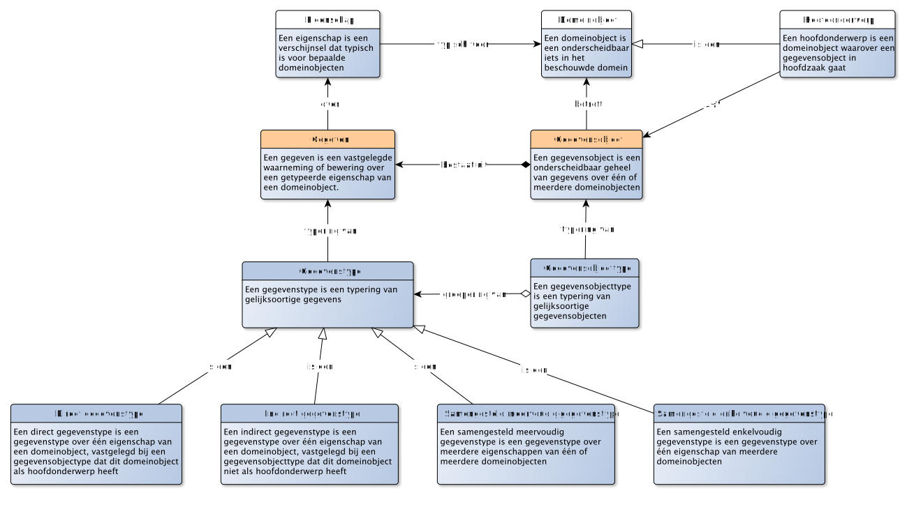

# Typering van gegevens

Net zoals het mogelijk is om objecten en eigenschappen te typering, kunnen we ook gegevens typeren.

> Een GEGEVENSTYPE is een typering van gelijksoortige GEGEVENs.

Er kan sprake zijn van gelijksoortige gegevens, als deze gegevens over dezelfde eigenschap van gelijksoortige domeinobjecten gaat. Dus bijvoorbeeld gegevenstypen die gaan over de eigenschap geboortedatum van een objecttype persoon. Er is sprake van een ander gegevenstype, als de eigenschap verschilt, of als het over een ander objecttype gaat.

Naast gegevens, kunnen we ook de gegevensobjecten typeren:

> Een GEGEVENSOBJECTTYPE is een typering van gelijksoortige GEGEVENSOBJECTen

Er kan sprake zijn van gelijksoortige gegevensobjecten, als de gegevens die elk van deze gegevensobjecten bevat, van hetzelfde gegevenstype zijn. We kunnen met andere woorden gegevensobjecttypen typeren door te beschrijven welke gegevenstypen behoren tot dat gegevensobjecttype. Dit is echter niet voldoende. Gegevens gaan over domeinobjecten. Gegevensobjecten gaan daarmee ook over (diezelfde) domeinobjecten. Er is alleen sprake van gelijksoortige gegevensobjecten als de populatie waaruit deze domeinobjecten komen, dezelfde is. Een gegevensobjecttype "(Nederlandse) Inwoner" met als populatie de persoonsgegevens van alle Nederlands, verschilt daarmee van een gegevensobjecttype "(Europese) Inwoner" met als populatie de persoonsgegevens van alle Europeanen.

Een gegevensobject kan gegevens omvatten die allen gaan over één domeinobject, het hoofdonderwerp. Daarnaast onderkennen we ook de situatie dat een gegevensobject gaat over meerdere domeinobjecten, bijvoorbeeld een lijst met inwoners per provincie van Nederland. Maar ook voor dergelijke gegevensobjecten is sprake van dezelfde gelijksoortigheid bij de typering.

Ook gegevenstypen zelf kun je groeperen. Bijvoorbeeld als je het wilt hebben over alle gegevenstypen die "geheim" zijn. Het is nu niet dat we deze gegevens als groep bij elkaar willen zetten, om ze vervolgens (als groep) te typeren. In dit geval willen we juist de gegevens*typen* zelf groeperen.

> Een GEGEVENSTYPEGROEP is een groepering van GEGEVENSTYPEN

Gegevenstypen typeren gegevens die gaan over domeinobjecten. En objecttypen typeren domeinobjecten. Om te beschrijven waarover gegevens gaan, kunnen we gegevenstypen relateren aan objecttypen. Onderstaand diagram beschrijft hoe dat gaat:

## Identificeren van gegevensobjecten: sleutels

> Een sleutel is de verzameling van gegevenstypen waarmee een unieke aanduiding voor een gegevensobject kan worden gevormd

*TODO: Uitleggen wat een sleutel is en hoe deze verschilt van de identificerende eigenschappen van een domeinobject. Relatie legggen met hoofdonderwerp*

## Speciaal soort gegevensobjecttypen

Een gegevensobjecttype kan sterk lijken op een objecttype. We noemen dat *isomorf*. In dat geval gaan de gegevens die bij één gegevensobject worden bijgehouden over eigenschappen van één domeinobject van dat objecttype. Maar het is ook denkbaar om gegevens over andere objecten bij een gegevensobject te plaatsen. Hiertoe maken we onderscheid in drie soorten gegevensobjecttypen:

- Een **gegevensgroeptype** (of groeperend gegevensobjecttype) is een gegevensobjecttype met gegevens over meerdere domeinobjecten, zonder dat één van deze domeinobjecten het hoofdonderwerp is;
- Een **eenduidig gegevensobjecttype** is een gegevensobjecttype met precies één hoofdonderwerp;
- Een **strikt eenduidig gegevensobjecttype** is een eenduidig gegevensobjecttype over alleen eigenschappen van het hoofdonderwerp.

Merk op dat het afleidbaar is wanneer een gegevensobjecttype een strikt eenduidig gegevensobjecttype is en wanneer niet. Zolang alle eigenschappen waarover dit gegevensobjecttype gaan behoren tot de eigenschappen van het hoofdonderwerp, is sprake van een strikt eenduidig gegevensobjecttype, en alle andere gevallen niet.

Het is denkbaar om gegevens ook te groeperen, zonder dat er expliciet een hoofdonderwerp is. In zo'n geval spreken we over een gegevensgroep: een groep van gegevens. En zo'n gegevensgroep kun je ook typeren: dan ontstaat een gegevensgroeptype. Het is simpelweg het bij elkaar zetten van enkele gegevens als groep, zonder dat er expliciet een hoofdonderwerp voor die groep van gegevens bestaat (de gegevens gaan over meerdere objecten).

## Speciaal soort gegevenstypen

Een gegevenstype kan sterk lijken op een eigenschap (kenmerk, rol, classificatie). In dat geval gaan de gegevens van dit gegevenstype over precies één eigenschap van precies één object. Maar het is ook denkbaar om gegevens vast te leggen die een samenstelling is van meerdere eigenschappen of van meerdere objecten. Hiertoe maken we onderscheid in vier soorten gegevenstypen:

- Een **direct gegevenstype** is een gegevenstype over één eigenschap van een domeinobject, vastgelegd bij een gegevensobjectype dat dit domeinobject als hoofdonderwerp heeft;
- Een **indirect gegevenstype** is een gegevenstype over één eigenschap van een domeinobject, vastgelegd bij een gegevensobjecttype dat dit domeinobject niet als hoofdonderwerp heeft;
- Een **samengesteld enkelvoudig gegevenstype** is een gegevenstype over één eigenschap van meerdere domeinobjecten;
- Een **samengesteld meervoudig gegevenstype** is een gegevenstype over meerdere eigenschappen van één of meerdere domeinobjecten.

## Gegevensverzamelingen: waardelijsten en referentielijsten

Bij de typering van domeinobjecten kwam het onderscheid tussen waardelijsten, classificatieschemas en populaties aan bod. Daarbij werd duidelijk dat:

- Een *waardelijst* een lijst van *waarden* is;
- Een *classificatieschema* een ordening beschrijft in *klassen*;
- Een *populatie* een opsomming van *domeinobjecten* betreft.

Een classificatieschema onderscheid zich daarbij van een classificatielijst. Een classificatieschema kent "diepgang", het kent een boomstructuur van klassen. Bijvoorbeeld de indeling van biologische klassen van flora en fauna. Een classificatielijst is daarbij een classificatieschema zonder diepgang: alles in één lijst. Een classificatielijst zou bijvoorbeeld de lijst van alle klassen op het niveau van biologische soort kunnen zijn.

Als we ons beperking tot de classificatielijsten, dan kan het voorkomen dat zowel waardelijsten, classificatielijsten en populaties op dezelfde wijze in een gegevensmodel terecht komen. Hieronder enkele voorbeelden:

- De *waardelijst* van getallen uit de fibonachi reeks kleiner dan 30. Deze waardelijst bestaat uit de getallen 1, 2, 3, 5, 8, 13 en 21. Dergelijke waarden kennen geen andere eigenschappen dan de waarde zelf (het is niet zinvol om te spreken over "code" of "label" of iets dergelijks, de waarde betekent immers -per definitie- niets anders dan de waarde zelf);
- De *classificatielijst* van olympische sporten die behoren tot de meerkamp voor de mannen. Deze bestaat uit de klassen «verspringen», «hoogspringen», etc. Over deze klassen kun je andere eigenschappen vastleggen, het is (dus) relevant om te beschrijven wat we van deze klassen willen weten.
- De *populatie* van de landen die een ISO 3166-1 landencode hebben. We hebben het hier over domeinobjecten van het objecttype Land. En daarbij een specifieke populatie (dus niet alle mogelijke voorkomens van dit objecttype), namelijk die domeinobjecten met de eigenschap ISO landencode.

Waardelijsten en referentielijsten zijn gegevensverzamelingen: het zijn verzamelingen van gegevens (!). Voor waardelijsten geldt dat deze gegevens alleen maar beweringen zijn over de waardelijst en de waarden zelf, zoals: *De waarde "1" staat op de waardelijst met de naam "fibonachireeks kleiner dan 30"*. Voor referentielijsten geldt dat die gegevensverzameling niet alleen beweringen bevat over de referentielijst en de klassen dan wel domeinobjecten op die lijst, maar het bevat ook gegevens over deze klassen en domeinobjecten, zoals we hieronder zullen zien.

### Gegevenstypen en gegevens m.b.t. waardelijsten
Een gegevenstype dat gegevens typeert over kenmerken, kun je koppelen aan een waardelijst: dit zijn dan de waarden die je mag gebruiken. Zo kun je een gegevenstype specificeren van het kenmerk "storypoints" met als waardelijst die hierboven genoemde waardelijst. Deze waardelijst bestaat uit de volgende gegevens:

|Waardelijstnaam|Waarde|
|---------------|------|
|Fibonachegetallen onder 30|1|
|Fibonachegetallen onder 30|2|
|Fibonachegetallen onder 30|3|
|Fibonachegetallen onder 30|5|
|Fibonachegetallen onder 30|8|
|Fibonachegetallen onder 30|13|
|Fibonachegetallen onder 30|21|

### Gegevenstypen en gegevens m.b.t. classificatielijsten
Een gegevenstype dat gegevens typeert over classificaties, kun je koppelen aan een referentielijst. Deze referentielijst bevat referentiewaarden. Anders dan "echte" waarden, verwijzen deze referentiewaarden naar afzonderlijke klassen. Deze referentiewaarden zijn feitelijk de sleutel van de betreffende klasse. Zo kun je een gegevenstype specificeren van de classificatie "onderdeel" met als referentielijst een lijst met referentiewaarden die refereren aan de hierboven genoemde klassen. Relevante eigenschappen van deze klassen kunnen daarbij bijvoorbeeld zijn: code, naam en betekenis. De code is de identificerende eigenschap van de klasse die gebruikt wordt als de referentiewaarde in het gegeven. De naam is de identificerende eigenschap zoals deze voor mensen herkenbaar is en de betekenis is de eigenschap die verwijst naar een begrip waarin de betekenis wordt uitgelegd. Deze referentielijst bestaat uit de volgende gegevens:

|Waardelijstnaam|Code|Naam|Betekenis|
|---------------|----|----|---------|
|Mannen meerkamponderdelen|VER|Verspringen|[Long jump](http://dbpedia.org/resource/Long_jump)|
|Mannen meerkamponderdelen|100V|100 meter sprint vlak|[100 metres](http://dbpedia.org/resource/100_metres)|
|Mannen meerkamponderdelen|KOGEL|Kogelstoten|[Shot put](http://dbpedia.org/resource/Shot_put)|
|Mannen meerkamponderdelen|HOOG|Hoogspringen|[High jump](http://dbpedia.org/resource/High_jump)|
|Mannen meerkamponderdelen|400V|400 meter vlak|[400 metres](http://dbpedia.org/resource/400_metres)|
|Mannen meerkamponderdelen|110H|110 meter horden|[100 metres hurdles](http://dbpedia.org/resource/110_metres_hurdles)|
|Mannen meerkamponderdelen|DIS|Discuswerpen|[Discus throw](http://dbpedia.org/resource/Discus_throw)|
|Mannen meerkamponderdelen|POLSTOK|Polstokhoogspringen|[Pole vault](http://dbpedia.org/resource/Pole_vault)|
|Mannen meerkamponderdelen|SPEER|Speerwerpen|[Javelin throw](http://dbpedia.org/resource/Javelin_throw)|
|Mannen meerkamponderdelen|1500V|1500 meter vlak|[1500 metres](http://dbpedia.org/resource/1500_metres)|

Merk op dat deze classificatielijst eenvoudig is te verdiepen tot een classificatieschema door een extra eigenschap als "klasse" op te nemen, waarbij elke sportsoort weer verwijst naar een algemenere klassen, bijvoorbeeld:

|Code|Klasse|Naam|Betekenis|
|----|------|----|---------|
|VER|SPRING|||
|100V|LOOP|||
|KOGEL|WERP|||
|SPRING|ATHL|Springonderdeel||
|LOOP|ATHL||Looponderdeel||
|WERP|ATHL||Werponderdeel||
|ATHL|SPORT||Athletiek||
|SPORT||Sport||

### Gegevenstypen en gegevens m.b.t. populaties
Een gegevenstype dat gegevens typeert over populaties, kun je ook koppelen aan een referentielijst. Deze referentielijst bevat referentiewaarden. Anders dan "echte" waarden, verwijzen deze referentiewaarden naar afzonderlijke domeinobjecten uit deze populatie. Deze referentiewaarden zijn feitelijk de sleutel van het betreffende domeinobject. Zo kun je een gegevenstype specificeren van de rol "land van herkomst" met als referentielijst een lijst met referentiewaarden die refereren aan de hierboven genoemde landen met een ISO 3166-1 landencode. Relevante eigenschappen van deze landen kunnen daarbij bijvoorbeeld zijn: naam, alpha-2 en alpha-3. Daarbij is zowel de alpha-2 als alpha-3 eigenschap bruikbaar als referentiewaarde. De naam is de identificerende eigenschap zoals deze voor mensen herkenbaar is (in dit geval degenen die de Nederlandse taal machtig zijn). Deze referentielijst bestaat uit de volgende gegevens (alleen de gegevens van de eerste drie landen zijn hieronder getoond):

|Waardelijstnaam|Alpha-2|Alpha-3|Naam|
|----------|-------|-------|----|
|ISO 3166-1|AF|AFG|Afghanistan|
|ISO 3166-1|AX|ALA|Åland|
|ISO 3166-1|Albanië|AL|ALB|
