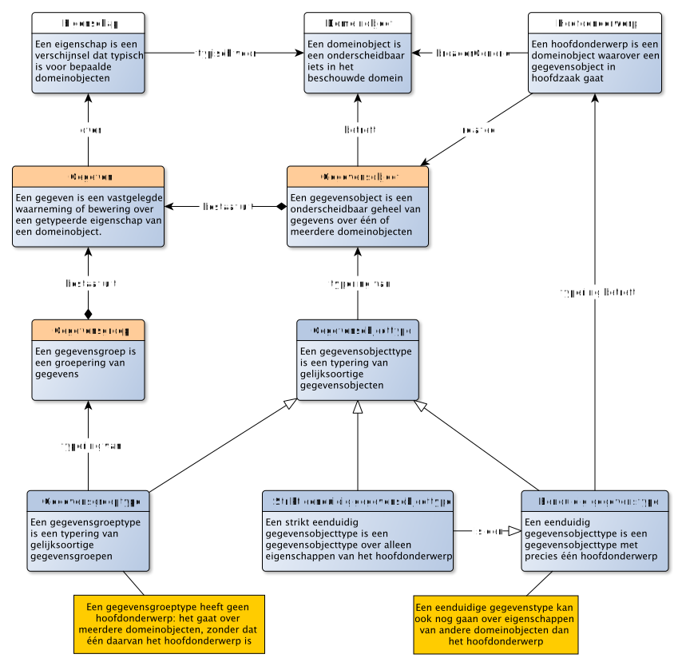

# Typering van gegevens

Net zoals het mogelijk is om objecten en eigenschappen te typering, kunnen we ook gegevens typeren.

> Een GEGEVENSTYPE is een typering van gelijksoortige GEGEVENs.

Er kan sprake zijn van gelijksoortige gegevens, als deze gegevens over dezelfde eigenschap van gelijksoortige domeinobjecten gaat. Dus bijvoorbeeld gegevenstypen die gaan over de eigenschap geboortedatum van een objecttype persoon. Er is sprake van een ander gegevenstype, als de eigenschap verschilt, of als het over een ander objecttype gaat.

Naast gegevens, kunnen we ook de gegevensobjecten typeren:

> Een GEGEVENSOBJECTTYPE is een typering van gelijksoortige GEGEVENSOBJECTen

Er kan sprake zijn van gelijksoortige gegevensobjecten, als de gegevens die elk van deze gegevensobjecten bevat, van hetzelfde gegevenstype zijn. We kunnen met andere woorden gegevensobjecttypen typeren door te beschrijven welke gegevenstypen behoren tot dat gegevensobjecttype. Dit is echter niet voldoende. Gegevens gaan over domeinobjecten. Gegevensobjecten gaan daarmee ook over (diezelfde) domeinobjecten. Er is alleen sprake van gelijksoortige gegevensobjecten als de populatie waaruit deze domeinobjecten komen, dezelfde is. Een gegevensobjecttype "(Nederlandse) Inwoner" met als populatie de persoonsgegevens van alle Nederlands, verschilt daarmee van een gegevensobjecttype "(Europese) Inwoner" met als populatie de persoonsgegevens van alle Europeanen.

Een gegevensobject kan gegevens omvatten die allen gaan over één domeinobject, het hoofdonderwerp. Daarnaast onderkennen we ook de situatie dat een gegevensobject gaat over meerdere domeinobjecten, bijvoorbeeld een lijst met inwoners per provincie van Nederland. Maar ook voor dergelijke gegevensobjecten is sprake van dezelfde gelijksoortigheid bij de typering.

Gegevenstypen typeren gegevens die gaan over domeinobjecten. En objecttypen typeren domeinobjecten. Om te beschrijven waarover gegevens gaan, kunnen we gegevenstypen relateren aan objecttypen. Onderstaand diagram beschrijft hoe dat gaat:

## Identificeren van gegevensobjecten: sleutels

> Een sleutel is de verzameling van gegevenstypen waarmee een unieke aanduiding voor een gegevensobject kan worden gevormd

*TODO: Uitleggen wat een sleutel is en hoe deze verschilt van de identificerende eigenschappen van een domeinobject. Relatie legggen met hoofdonderwerp*

## Speciaal soort gegevensobjecttypen

Een gegevensobjecttype kan sterk lijken op een objecttype. We noemen dat *isomorf*. In dat geval gaan de gegevens die bij één gegevensobject worden bijgehouden over eigenschappen van één domeinobject van dat objecttype. Maar het is ook denkbaar om gegevens over andere objecten bij een gegevensobject te plaatsen. Hiertoe maken we onderscheid in drie soorten gegevensobjecttypen:

- Een **gegevensgroeptype** (of groeperend gegevensobjecttype) is een gegevensobjecttype met gegevens over meerdere domeinobjecten, zonder dat één van deze domeinobjecten het hoofdonderwerp is;
- Een **eenduidig gegevensobjecttype** is een gegevensobjecttype met precies één hoofdonderwerp;
- Een **strikt eenduidig gegevensobjecttype** is een eenduidig gegevensobjecttype over alleen eigenschappen van het hoofdonderwerp.

Merk op dat het afleidbaar is wanneer een gegevensobjecttype een strikt eenduidig gegevensobjecttype is en wanneer niet. Zolang alle eigenschappen waarover dit gegevensobjecttype gaan behoren tot de eigenschappen van het hoofdonderwerp, is sprake van een strikt eenduidig gegevensobjecttype, en alle andere gevallen niet.

Het is denkbaar om gegevens ook te groeperen, zonder dat er expliciet een hoofdonderwerp is. In zo'n geval spreken we over een gegevensgroep: een groep van gegevens. En zo'n gegevensgroep kun je ook typeren: dan ontstaat een gegevensgroeptype. Het is simpelweg het bij elkaar zetten van enkele gegevens als groep, zonder dat er expliciet een hoofdonderwerp voor die groep van gegevens bestaat (de gegevens gaan over meerdere objecten).

Ook gegevenstypen zelf kun je groeperen. Bijvoorbeeld als je het wilt hebben over alle gegevenstypen die "geheim" zijn. Het is nu niet dat we deze gegevens als groep bij elkaar willen zetten, om ze vervolgens (als groep) te typeren. In dit geval willen we juist de gegevens*typen* zelf groeperen.

## Speciaal soort gegevenstypen

Een gegevenstype kan sterk lijken op een eigenschap (kenmerk, rol, classificatie). In dat geval gaan de gegevens van dit gegevenstype over precies één eigenschap van precies één object. Maar het is ook denkbaar om gegevens vast te leggen die een samenstelling is van meerdere eigenschappen of van meerdere objecten. Hiertoe maken we onderscheid in vier soorten gegevenstypen:

- Een **direct gegevenstype** is een gegevenstype over één eigenschap van een objecttype, vastgelegd bij een gegevensobjectype dat dit objecttype als hoofdonderwerp heeft;
- Een **indirect gegevenstype** is een gegevenstype over één eigenschap van een objecttype, vastgelegd bij een gegevensobjecttype dat dit objecttype niet als hoofdonderwerp heeft;
- Een **samengesteld enkelvoudig gegevenstype** is een gegevenstype over één eigenschap van meerdere objecten;
- Een **samengesteld meervoudig gegevenstype** is een gegevenstype over meerdere eigenschappen van één of meerdere objecten.

