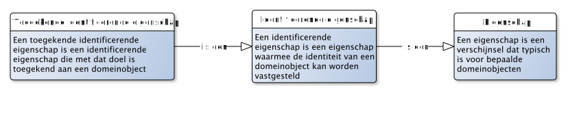
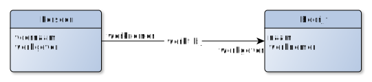

# Metamodelleren - inleiding

WORK IN PROGRESS

Dit document beschrijft een manier van gegevensmodelleren en gegevenstypering die gebaseerd is op een nauwlettend onderscheid tussen enerzijds de wereld die we wensen te beschouwen enerzijds (in termen van objecten en eigenschappen van die objecten) en de beschrijving van deze wereld (in termen van gegevens).

We bouwen dit model op aan de hand van een begrippenkader. Dit begrippenkader is axiomatisch van aard. Dat betekent dat we beginnen met enkele axioma's en op basis daarvan bouwen we het model steeds verder uit, en beschrijven we hoe alle onderdelen van het model met elkaar samenhangen.

# De concrete zaken

## De basis: objecten, eigenschappen en gegevens

> Een GEGEVEN is een vastgelegde waarneming of bewering over een getypeerde EIGENSCHAP van een OBJECT

We verbinden de betekenis van een «gegeven» met de betekenis van de begrippen «eigenschap» en «object»:

> Een OBJECT is een onderscheidbaar iets in het domein

en:

> Een EIGENSCHAP is een verschijnsel dat typisch is voor bepaalde objecten

Dit zijn heel algemene definities, en dat is ook de bedoeling: we willen hiermee de volledige wereld kunnen beschrijven in termen van objecten en eigenschappen! Toch zetten we een paar piketpaaltjes:

1. Een object is onderscheidbaar. Dit houdt in dat je voor iets in het domein kunt zeggen dat het er eentje is (en niet twee), dat het er zo-eentje is (en niet iets anders) en dat het die ene is (en niet een andere).
2. Een object is iets in het domein. Dit houdt in dat wat je onderscheid, bepaald wordt door het domein. In verschillende domeinen kun je dus ook andere dingen (willen) onderscheiden. We stellen hier ook dat DE werkelijkheid niet bestaat, maar dat je er altijd met een bepaalde blik naar kijkt: je domeinblik.
3. Een eigenschap is typisch voor bepaalde objecten. Dus bepaalde objecten *hebben* zo'n eigenschap. Maar dat wil niet zeggen dat een eigenschap is voorbehouden aan een bepaalde groep van objecten. Zo kan de eigenschap «haarkleur» een eigenschap zijn van zowel (het haar van een voorkomen van) een mens, een konijn of zelfs een knuffelbeertje. We stellen hiermee alleen dat die voorkomens iets gemeen hebben: een haarkleur.
4. Wat een eigenschap is, is ook domeinspecifiek. In het vorige voorbeeld zou je ook kunnen stellen dat mensen, konijnen en knuffelbeertjes geen «haarkleur» hebben, maar dat «haarkleur» een eigenschap is van «haar», en dat een eigenschap van mensen, konijnen en knuffelbeertjes is dat ze «haar» kunnen hebben. Dat laatste is net wat preciezer, maar mogelijk niet relevant in jouw domein.

> Een GEGEVENSOBJECT is een OBJECT als groepering van GEGEVENs

Zet enkele gegevens bij elkaar, en je krijgt een gegevensobject. Zo'n gegevensobject *zelf* is weer een object! Dus het is niet zo maar een groepering van gegevens, het is een groepering van gegevens die onderscheidbaar zijn in een domein. En in dit geval is dit het gegevensdomein.

Meta-gegevens (gegevens *over* gegevens) kunnen zo ook worden uitgedrukt: een (meta)gegeven is daarmee een vastgelegd waarneming of bewering over een getypeerde eigenschap van een gegevensobject.

## Identificerende eigenschap

Hoewel een gegevensobject en (speciaal soort) object is, is het niet direct mogelijk om de twee met elkaar te verbinden. Gegevens bestaan, zo gezegd, in een andere werkelijkheid dan objecten. Denk bijvoorbeeld aan een object als een persoon, of een voertuig of een weg. Van alle drie kun je gegevens vastleggen. Maar om daarbij de relatie te leggen *waarover* deze gegevens gaan, zul je de betreffende persoon, voertuig of weg moeten identificeren. De enige manier om gegevens en objecten direct aan elkaar te relateren is letterlijk de gegevens op het object te "plakken". Bijvoorbeeld een serienummer dat gegraveerd wordt in het chassis van een voertuig of een straatnaambordje dat langs een weg wordt geplaatst. Met de digitalisering zijn dit vooral de uitzonderingen.

> Een IDENTIFICERENDE EIGENSCHAP is een EIGENSCHAP waarmee de identiteit van een object kan worden vastgesteld

Veel identificerende eigenschappen zijn, goed beschouwd, feitelijk geen eigenschap van het object dat zij identificeren. Zo is een eigenschap van een motorvoertuig bijvoorbeeld dat het een motor heeft, wielen heeft, een kleur, een maximum snelheid, etc. Maar het kenteken van een motorvoertuig is geen echte eigenschap van dat motorvoertuig. Het is niet echt een **eigen**schap. Dit noemen we toegekende (identificerende) eigenschappen. Het zijn eigenschappen waarvan we vinden dat ze echt wel *van* het object zijn, maar feitelijk zijn ze toegekend. Het kenteken van een motorvoertuig is zo'n eigenschap.

> Een TOEGEKENDE IDENTIFICERENDE EIGENSCHAP is een IDENTIFICERENDE EIGENSCHAP die met dat doel is toegekend aan een object

## Kenmerken, classificaties en rollen

De definitie van een gegeven gaat uit van getypeerde eigenschappen. Dit laatste houdt in dat we *typen* eigenschappen willen onderscheiden en ook beschrijven. Dit begint met het fundamentele onderscheid van eigenschappen in kenmerken, classificaties en rollen.

> Een ROL is een EIGENSCHAP van een OBJECT in een relatie met een ander OBJECT

Objecten kunnen zich verhouden tot andere objecten en dat kunnen wezenlijke eigenschappen zijn van zo'n object. Zo is een werkgever een rol van een persoon in een arbeidsrelatie met een andere persoon. Net zo goed als je kunt vragen "Wat is de leeftijd van Jan" (een vraag over de eigenschap 'leeftijd' van een persoon) kun je de vraag stellen "Wie is de werkgever van Jan". De rol van werkgever wordt hier bijvoorbeeld vervuld door Bakkerij Broodjes. En Jan zelf vervuld de rol van werknemer. In dit geval is '(heeft) werkgever' dus een eigenschap van Jan. De *invulling* van die rol ligt bij Bakkerij Broodjes.

> Een KENMERK is een EIGENSCHAP van een OBJECT met een WAARDE

> Een WAARDE is een letterlijke aanduiding van de waarde zelf

Anders dan bij een rol, is een kenmerk een eigenschap met slechts een waarde. Zoals leeftijd in het voorgaande voorbeeld. Een waarde is geen object, maar juist een letterlijke invulling van de eigenschap. Zoals een getal, een stukje tekst, een datum of een boolean (waar/onwaar). Gelijk aan rollen is in dit geval '(heeft) leeftijd' een eigenschap van Jan. De *invulling* van dit kenmerk is bijvoorbeeld de waarde 25.

> Een CLASSIFICATIE is een EIGENSCHAP van een OBJECT met een toekenning aan een KLASSE

> KLASSE is een aanduiding van een groep OBJECTen die iets gemeen hebben

Een classificatie zit tussen een kenmerk en een rol in. Het lijkt een beetje op een kenmerk, maar toch is een klasse geen waarde. En het lijkt een beetje op een rol, maar ook hier is een klasse geen object. Het zit er tussenin. Een klasse is een aanduiding voor een groep van objecten die iets gemeen hebben. Een classificatie verbindt een object met die klasse. Zou kun je bijvoorbeeld objecten groeperen die levende wezens zijn en waarvan de moeders de jongen melk geeft, dwz: de groep van zoogdieren. De klasse «zoogdier» kan dan de invulling zijn van de eigenschap 'biologische klasse' van een levend wezen.

## Wat voorbeelden

Nu we de begrippen rondom gegevens helder hebben, kunnen we een aantal voorbeelden van gegevens geven. We gebruiken hiervoor het volgende "sjabloon":

Merk op dat met dit sjabloon geen technische structuur wordt beoogd: het gaat om de logische representatie van een gegeven, waar verscheidende technische realisaties voor mogelijk zijn.

We kunnen het zo over de volgende gegevens hebben:
- Er is een object met de voornaam 'Jan' (de invulling voor de eigenschap «voornaam» van dit object is de waarde 'Jan');
- Dit object heeft BSN 12345678 (de invulling voor de toegekende identificerende eigenschap «BSN» van dit object is de waarde 12345678);
- Dit object heeft als geboortedatum 25 mei 1970 (de invulling voor de eigenschap «geboortedatum» van dit object is de waarde 25 mei 1970);
- Jan is een man (de invulling voor de classificatie-eigenschap «geslacht» is de klasse «mannelijk»);
- Jan is de werknemer van een object met de naam 'Bakkerij Broodjes' (de invulling voor de rol werkgever van Jan is Bakkerij Broodjes).

Deze vijf uitspraken zijn vijf gegevens die gegroepeerd kunnen worden tot één gegevensobject met als hoofdontwerp het object met het BSN 12345678.

# Typering van objecten
Nu we de concrete zaken hebben behandeld, kunnen we de stap maken naar de typering. En eigenlijk zijn we daar ook al een beetje mee begonnen. Want eigenschappen en klassen zijn eigen ook een vorm van typering (zoals we hieronder zullen zien).

## Objecttype en attribuutsoorten

> Een OBJECTTYPE is een typering van gelijksoortige OBJECTen

De oplettende lezer zal zich afvragen wat het verschil is tussen een klasse en een objecttype. En dat is terecht. Want vaak is iets zowel een klasse als een objecttype. Je kunt het bijvoorbeeld hebben over de klasse «Homo Sapiens» als een klasse bij de classificatie van levende wezens. Maar gelijktijdig kun je het hebben over het objecttype «Persoon» als typering van alle objecten van diezelfde klasse. Het gaat hier vooral om het doel waarom we typering. Een klasse wordt gebruikt als onderdeel van een gegeven, terwijl een objecttype juist bedoeld is om een beschrijving te geven in welke objecten we zijn geïnteresseerd.

Van een objecttype beschrijven we welke eigenschappen we relevant vinden om te kunnen weten van objecten die tot een dergelijk objecttype behoren. Door dit te beschrijven, kunnen we vervolgens gegevens over dergelijke objecten verwerken.

> Een ATTRIBUUTSOORT is een typering van een KENMERK van een OBJECT, behorende tot een OBJECTTYPE

Waar een eigenschap (en daarmee ook een kenmerk) los kan staan van een object, geldt voor een attribuutsoort dat deze getypeerd is in de context van een objecttype.

> Een CLASSIFICERENDE ATTRIBUUTSOORT is een ATTRIBUUTSOORT als typering van een classificatie

Gelijk aan een attribuutsoort met een waarde, zal een classificerende attribuutsoort als invulling een klasse hebben.

## Relatiesoorten en rollen

> Een RELATIESOORT is een typering van een relatie tussen twee OBJECTen

We kunnen relaties tussen objecten typeren. Echter, als het gaat om gegevens, dan hebben we het over eigenschappen van objecten. We zagen daarin dat een eigenschap van een object een rol kan zijn. Dergelijke rollen kun je ook typering:

> Een RELATIESOORTROL is een typering van een ROL van een OBJECT in een relatie, getypeerd door een RELATIESOORT

## Wat voorbeelden

De begrippen die we hiermee gedefinieerd hebben, zijn behoorlijk abstract. Aangezien we het hier hebben over typering, was dat ook wel te verwachten. Daarom handig om een aantal voorbeelden te beschrijven: wat kunnen we nu met deze typering? We doen dit aan de hand van het volgende sjabloon:

In het voorbeeld willen we de typering vastleggen uit het concrete voorbeeld hierboven over Jan.

- We beschrijven het objecttype met de naam "Persoon". Het object met de voornaam Jan typeren we als het objecttype «Persoon».
- Dit objecttype kent dus in ieder geval ook de attribuutsoort «voornaam», die de overeenkomstige eigenschap «voornaam» betreft.
- Hier koppelen we de attribuutsoort met de naam "BSN" aan. Deze attribuutsoort betreft de toegekende identificerende eigenschap «BSN».
- Ook koppelen we hier de attribuutsoort met de naam "geboortedatum". Deze attribuutsoort betreft het kenmerk «geboortedatum».
- Tenslotte koppelen we hier de classificerende attribuutsoort met de naam "geslacht" aan. Deze attribuutsoort betreft de classificatie «geslacht».
- Als relatiesoort onderkennen we de relatiesoort met de naam "werkt bij". Deze relateert het objecttype «Persoon» aan het objecttype «Bedrijf».
- Als relatiesoortrol onderkennen we eentje met de naam "werkgever". Dit is een eigenschap van (objecten getypeerd als) het objecttype «Persoon» en wordt ingevuld door (objecten getypeerd als) het objecttype «Bedrijf».
- Andersom is er een relatiesoorrol te onderkennen met de naam "werknemer". Dit is een eigenschap van (objecten getypeerd als) het objecttype «Bedrijf» en wordt ingevuld door (objecten getypeerd als) het objecttype «Persoon».

Je kunt bovenstaande ook visueel afbeelden als:

## Classificatie, klassen en (object)subtypen

Wellicht is opgevallen dat «werkgever» een eigenschap is van een persoon (en wordt ingevuld door een bedrijf), waar je mogelijk zou verwachten dat een werkgever juist een *bedrijf* is. Dat laatste is ook zo (een werkgever is een rol die een bedrijf invult), maar dan hebben we het eigenlijk (dus) over iets anders. We hebben het dan niet over een rol of over een eigenschap, maar over een rolvervulling. Zo'n rolvervulling is een typering van objecten die een bepaalde rol invullen. Eigenlijk is dit ook al zichtbaar in de visualisatie hierboven: "werkgever" staat hier twee keer in het diagram: één keer als eigenschap bij het objecttype «Persoon» en één keer als rolinvulling bij het objecttype «Bedrijf». Dit kan ook expliciet worden getoond:

Iets vergelijkbaars speelt zich af bij geslacht. De invulling van deze classificatie kan met twee klassen: «Man» en «Vrouw». En net zoals je kunt stellen dat een werknemer een persoon is, kun je stellen dat een man een persoon is, en ook een vrouw een persoon is. Het verschil hier is dat er geen sprake is van een relatie(soort), maar van een classificatie: de classificatie naar geslacht. En in dit geval zie je dat je objecttypen kunt vormen uit klassen: de objecttypen «Man» en «Vrouw». Je zou dit ook als volgt kunnen visualiseren:

Man en vrouw zijn hier personen, geclassificeerd naar (de classificatie, de eigenschap) geslacht.

# Typering van gegevens

Net zoals het mogelijk is om objecten en eigenschappen te typering, kunnen we ook gegevens typeren.

> Een GEGEVENSTYPE is een typering van gelijksoortige GEGEVENs.

En

> Een GEGEVENSOBJECTTYPE is een typering van gelijksoortige GEGEVENSOBJECTen, als groepering van GEGEVENSTYPEn.

Gegevenstypen typeren gegevens die gaan over objecten. En objecttypen typeren objecten. Om te beschrijven waarover gegevens gaan, kunnen we gegevenstypen relateren aan objecttypen. Onderstaand diagram beschrijft hoe dat gaat:

## Speciaal soort gegevensobjecttypen

Een gegevensobjecttype kan sterk lijken op een objecttype. We noemen dat *isomorfie*. In dat geval gaan de gegevens die bij één gegevensobject worden bijgehouden over eigenschappen van één object van dat objecttype. Maar het is ook denkbaar om gegevens over andere objecten bij een gegevensobject te plaatsen. Hiertoe maken we onderscheid in drie soorten gegevensobjecttypen:

- Een **gegevenstypegroep** is een gegevensobjecttype zonder hoofdonderwerp;
- Een **logisch objecttype** is een gegevensobjecttype met precies één hoofdonderwerp;
- Een **strikt logisch objecttype** is een logisch objecttype over alleen eigenschappen van het hoofdonderwerp.

Dit onderscheid verklaart ook de kardinaliteit van de eigenschap hoofdonderwerp: bij een gegevenstypegroep is er geen hoofdonderwerp (dus "0"), bij de andere soorten is er juist altijd precies één hoofdonderwerp (dus "1").

## Speciaal soort gegevenstypen

Een gegevenstype kan sterk lijken op een eigenschap (kenmerk, rol, classificatie). In dat geval gaan de gegevens van dit gegevenstype over precies één eigenschap van precies één object. Maar het is ook denkbaar om gegevens vast te leggen die een samenstelling is van meerdere eigenschappen of van meerdere objecten. Hiertoe maken we onderscheid in vier soorten gegevenstypen:

- Een **direct gegevenstype** is een gegevenstype over één eigenschap van een objecttype, vastgelegd bij een gegevensobjectype dat dit objecttype als hoofdonderwerp heeft;
- Een **indirect gegevenstype** is een gegevenstype over één eigenschap van een objecttype, vastgelegd bij een gegevensobjecttype dat dit objecttype niet als hoofdonderwerp heeft;
- Een **samengesteld enkelvoudig gegevenstype** is een gegevenstype over één eigenschap van meerdere objecten;
- Een **samengesteld meervoudig gegevenstype** is een gegevenstype over meerdere eigenschappen van één of meerdere objecten.
