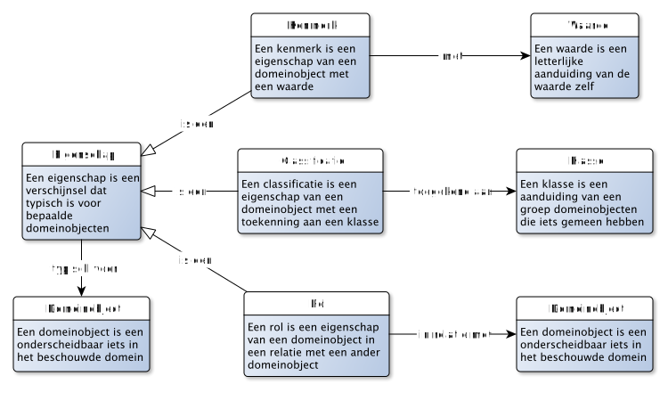
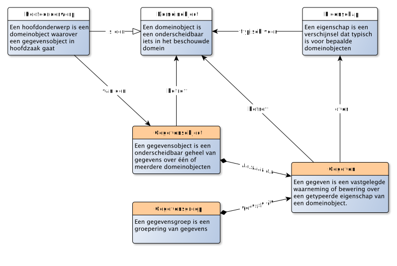
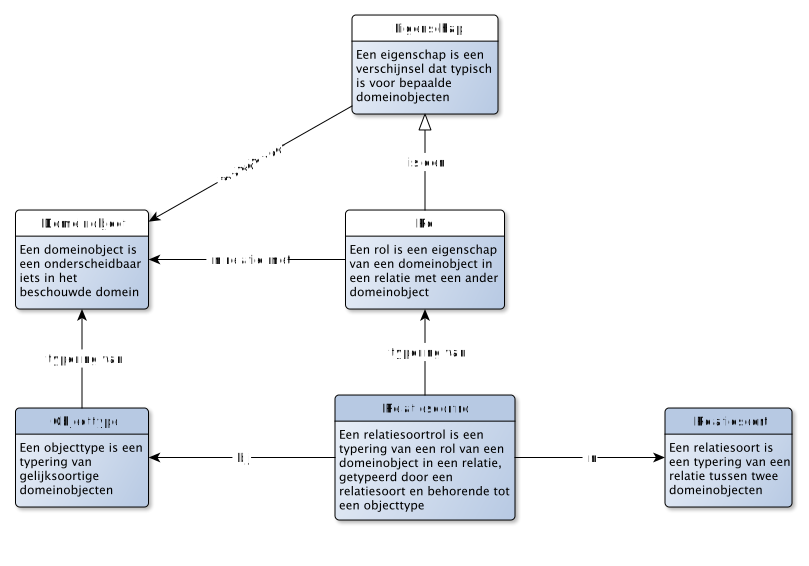
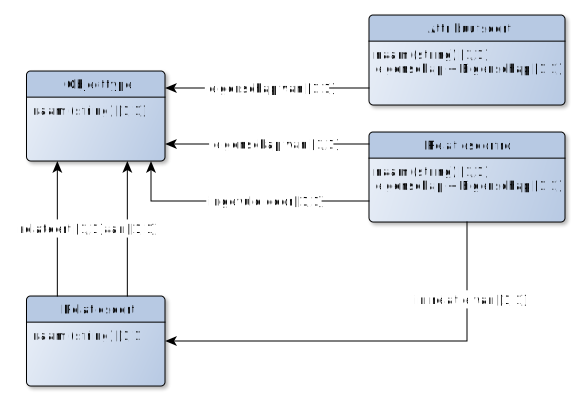
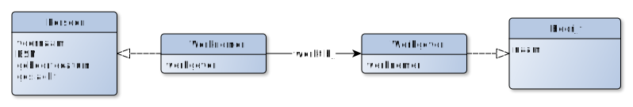
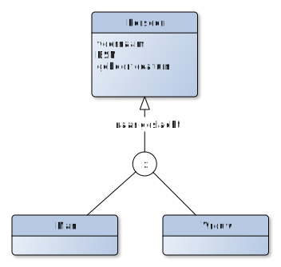

# Metamodelleren - inleiding

NB: Dit document bouwt het metamodel beetje-bij-beetje op, door steeds iets meer van het model prijs te geven. Voor degene die graag het eindresultaat wil zien (het volledige metamodel), kun je ook direct naar de metamodel navigeren, onderaan deze pagina.

Met gegevensmodelleren en gegevenstypering beschrijven we gegevens. Die gegevens *gaan* ergens over: bijvoorbeeld over mensen, gebeurtenissen, objecten, plaatsen en de relaties daartussen. Andersom gaan mensen ook *over* gegevens: zij geven betekenis aan gegevens, bijvoorbeeld door beslissingen af te laten hangen van de gegevens die zij tot hun beschikking hebben. Wet- en regelgeving neemt daarbij een bijzondere plaats in: deze codificeert de afspraken die "we" hebben gemaakt en deze afspraken bieden een basis voor de betekenis die we met bepaalde gegevens beogen.

Om nauwkeurig gegevens te kunnen typeren, zullen we het (vooral ook) over deze betekenis moeten hebben. En daarvoor is het van belang om bepaalde zaken van elkaar te onderscheiden.

Enerzijds kunnen we het hebben over het domein *waarover* we gegevens willen verwerken. En anderzijds kunnen we het over de gegevens (en de verwerking daarvan) *zelf* hebben. En dit zijn verschillende zaken!

Aangezien gegevens over de dingen in het domein gaan, zullen we die dingen moeten kunnen identificeren. Dit lijkt vaak makkelijk, maar dat is het niet. Zo is het relatief makkelijk om te bepalen wie een mens is en wie niet. Maar als het om meer abstracte zaken gaat (wanneer ben je Belastingplichtige, Verdachte of Eigenaar?), dan wordt het moeilijk. En als we dingen niet alleen willen herkennen, maar ook identificeren, dan wordt het al snel een stuk minder makkelijk. Modelleren neemt daarvoor een belangrijke plek in.

Bij het modelleren maken we onderscheid in verschillende beschouwingsniveaus. De eerste drie beschouwingsniveaus gaan over het domein zelf. Steeds nauwkeuriger beschouwen we de dingen in het domein. De laatste twee beschouwingsniveaus gaan over de gegevens(verwerking). Pas op dat niveau beschrijven we de gegevens zelf, door aan te geven over welke dingen uit het domein (zoals gemodelleerd in de eerste drie beschouwingsniveaus), we gegevens verwerken en hoe.

We gebruiken hier steeds bewust het begrip «verwerken». We hebben het dan ook over zowel het lezen, gebruiken, uitwisselen, opslaan, wijzigen en vernietigen van gegevens.

1. **Kennisbronnen** en **verhalen**. Betekenis kan gevonden worden in bepaalde kennisbronnen, in de zin van: "de betekenis is, zoals beoogd in dit document". Zo'n kennisbron heeft bepaalde autoriteit, bijvoorbeeld een wet of een standaard waar we ons aan willen houden. Maar ook verhalen kunnen helpen: ze nemen de lezer mee in de betekenis vanuit voorbeelden en concrete gebeurtenissen.
2. **Model van begrippen**. Een eerste, talige, model van begrippen kan helpen om een beter inzicht te krijgen wat er wordt bedoeld als een bepaald woord of woordcombinatie ("term") wordt gebruikt in een bepaalde context. We modelleren hier de communicatie: welke woorden *daadwerkelijk* worden gebruikt in het domein en wat ze in die context betekenen voor degenen die deze woorden gebruiken.
3. **Conceptueel model**, waarmee inzicht wordt gegeven welke objecten relevant zijn om te beschouwen en welke eigenschappen daarvan en relaties daartussen. Anders dan bij een model van begrippen, gaat het ons hier niet primair om de gebruikte taal, maar juist de dingen waarover wordt gesproken (letterlijk: "de onderwerpen van gesprek").
4. **Logisch gegevensmodel**. Waar we in de vorige modellen kijken naar het domein waarover we gegevens willen verwerken, gaat dit model juist over die gegevens zelf.
5. **Fysiek datamodel**. Tenslotte zullen gegevens ook daadwerkelijk vastgelegd moeten worden. Het fysieke datamodel beschrijft hoe gegevens als data worden vastgelegd.

# Een voorbeeld - het domein
Voor dit document gebruiken we een voorbeeld, een casus op basis waarvan we de overige modellen zullen invullen.

> - Jan is geboren op 10 februari 1970 in Zwolle.
> - Hij is de zoon van Paul en Marie Veenstra.
> - Jan heeft inmiddels een lengte van 2.05 bereikt.
> - En hoewel Jan oorspronkelijk gezegend was met een flinke bos haar, is hij inmiddels vrijwel volledig kaal.
> - Hij werkt sinds 1990 als bakker bij Bakkerij Broodjes.
> - Jan woont inmiddels in Meppel. Hij is in die gemeente ingeschreven met BSN nummer 12345678.
> - Jan is getrouwd met Marie op 6 september 2003.

**TODO: Voorbeeld nog verder uitwerken. Liefst ook met een stukje wet- en regelgeving, bijvoorbeeld arbeidsrecht**

# De concrete zaken uit het domein

## De basis: objecten en eigenschappen

> Een OBJECT is een onderscheidbaar iets in het domein

Wat we onderscheiden in een domein, en wat (dus) hier een object is, hangt af van wat we willen beschouwen. Als we het over objecten hebben, dan hebben we het daarmee over het conceptueel model. Het conceptueel model is, met andere woorden, een model van objecten.

> Een EIGENSCHAP is een verschijnsel dat typisch is voor bepaalde objecten

1. Een object is onderscheidbaar. Dit houdt in dat je voor iets in het domein kunt zeggen dat het er eentje is (en niet twee), dat het er zo-eentje is (en niet iets anders) en dat het die ene is (en niet een andere).
2. Een object is iets in het domein. Dit houdt in dat wat je onderscheid, bepaald wordt door het domein. In verschillende domeinen kun je dus ook andere dingen (willen) onderscheiden. We stellen hier ook dat DE werkelijkheid niet bestaat, maar dat je er altijd met een bepaalde blik naar kijkt: je domeinblik.
3. Een eigenschap is typisch voor bepaalde objecten. Dus bepaalde objecten *hebben* zo'n eigenschap. Maar dat wil niet zeggen dat een eigenschap is voorbehouden aan een bepaalde groep van objecten. Zo kan de eigenschap «haarkleur» een eigenschap zijn van zowel (het haar van een voorkomen van) een mens, een konijn of zelfs een knuffelbeertje. We stellen hiermee alleen dat die voorkomens iets gemeen hebben: een haarkleur.
4. Wat een eigenschap is, is ook domeinspecifiek. In het vorige voorbeeld zou je ook kunnen stellen dat mensen, konijnen en knuffelbeertjes geen «haarkleur» hebben, maar dat «haarkleur» een eigenschap is van «haar», en dat een eigenschap van mensen, konijnen en knuffelbeertjes is dat ze «haar» kunnen hebben. Dat laatste is net wat preciezer, maar mogelijk niet relevant in jouw domein.

"Jan" uit ons voorbeeld is een object, maar ook "Zwolle" en "Bakkerij broodjes". Een eigenschap van Jan is dat hij geboren is, en dat Jan bakker is.

## Identificerende eigenschap

Als we het over objecten in de werkelijkheid hebben, dan kunnen we die objecten aanwijzen. Zoals in de zin "Hij daar, is de bakker". Stel dat die zin wordt uitgesproken in de winkel van Bakkerij Broodjes en er staan 5 mannen in die winkel, je zult dan de juiste persoon moeten aanwijzen! Je kunt ook gebruik maken van eigenschappen die de juiste persoon identificeren, zoals in de zin: "Die lange kale man daar, is Jan, de bakker".

> Een IDENTIFICERENDE EIGENSCHAP is een EIGENSCHAP waarmee de identiteit van een object kan worden vastgesteld

Eén enkele identificerende eigenschap is vaak niet voldoende. Zo is in ons voorbeeld het niet voldoende om Jan daadwerkelijk uniek te kunnen identificeren. Daarvoor is vaak iets extra nodig, een eigenschap die wordt toegekend aan een object, om deze uniek te identificeren. Zo'n eigenschap is vaak niet rechtstreeks met het object verbonden, maar wordt erbij gehouden. De enige manier om zo'n toekende eigenschap daadwerkelijk aan het object te verbinden is door het er letterlijk op te plakken. Bijvoorbeeld een serienummer dat gegraveerd wordt in het chassis van een voertuig of een straatnaambordje dat langs een weg wordt geplaatst.

Veel identificerende eigenschappen zijn, goed beschouwd, feitelijk geen eigenschap van het object dat zij identificeren. Zo is een eigenschap van een motorvoertuig bijvoorbeeld dat het een motor heeft, wielen heeft, een kleur, een maximum snelheid, etc. Maar het kenteken van een motorvoertuig is geen echte eigenschap van dat motorvoertuig. Het is niet echt een **eigen**schap. Dit noemen we toegekende (identificerende) eigenschappen. Het zijn eigenschappen waarvan we vinden dat ze echt wel *van* het object zijn, maar feitelijk zijn ze toegekend. Het kenteken van een motorvoertuig is zo'n eigenschap.

> Een TOEGEKENDE IDENTIFICERENDE EIGENSCHAP is een IDENTIFICERENDE EIGENSCHAP die met dat doel is toegekend aan een object

## Kenmerken, classificaties en rollen

Als we naar de eigenschappen van een object kijken, dan valt op dat er verschillende soorten eigenschappen zijn te onderkennen. Een eigenschap van een object kent een invulling. Zo is de invulling van de eigenschap «(heeft) lengte» van het object Jan uit ons voorbeeld gelijk aan 2 meter en 5 centimeter. En de invulling van de eigenschap «(heeft) werkgever» is Bakkerij Broodjes. Tenslotte is de invulling van de eigenschap «(heeft) geslacht» gelijk aan man. Drie eigenschappen, maar geheel andere invullingen. We hebben het respectievelijk over een kenmerk, rol en classificatie.

> Een ROL is een EIGENSCHAP van een OBJECT in een relatie met een ander OBJECT

Objecten kunnen zich verhouden tot andere objecten en dat kunnen wezenlijke eigenschappen zijn van zo'n object. Zo is een werkgever een rol van een persoon in een arbeidsrelatie met een andere persoon. Net zo goed als je kunt vragen "Wat is de leeftijd van Jan" (een vraag over de eigenschap 'leeftijd' van een persoon) kun je de vraag stellen "Wie is de werkgever van Jan". De rol van werkgever wordt hier bijvoorbeeld vervuld door Bakkerij Broodjes. En Jan zelf vervuld de rol van werknemer. In dit geval is '(heeft) werkgever' dus een eigenschap van Jan. De *invulling* van die rol ligt bij Bakkerij Broodjes.

> Een KENMERK is een EIGENSCHAP van een OBJECT met een WAARDE

> Een WAARDE is een letterlijke aanduiding van de waarde zelf

Anders dan bij een rol, is een kenmerk een eigenschap met slechts een waarde. Zoals leeftijd in het voorgaande voorbeeld. Een waarde is geen object, maar juist een letterlijke invulling van de eigenschap. Zoals een getal, een stukje tekst, een datum of een boolean (waar/onwaar). Gelijk aan rollen is in dit geval '(heeft) leeftijd' een eigenschap van Jan. De *invulling* van dit kenmerk is bijvoorbeeld de waarde 25.

> Een CLASSIFICATIE is een EIGENSCHAP van een OBJECT met een toekenning aan een KLASSE

> KLASSE is een aanduiding van een groep OBJECTen die iets gemeen hebben

Een classificatie zit tussen een kenmerk en een rol in. Het lijkt een beetje op een kenmerk, maar toch is een klasse geen waarde. En het lijkt een beetje op een rol, maar ook hier is een klasse geen object. Het zit er tussenin. Een klasse is een aanduiding voor een groep van objecten die iets gemeen hebben. Een classificatie verbindt een object met die klasse. Zou kun je bijvoorbeeld objecten groeperen die levende wezens zijn en waarvan de moeders de jongen melk geeft, dwz: de groep van zoogdieren. De klasse «zoogdier» kan dan de invulling zijn van de eigenschap 'biologische klasse' van een levend wezen.

## Gegevens: de concrete zaken van de verwerking

> Een GEGEVEN is een vastgelegde waarneming of bewering over een getypeerde EIGENSCHAP van een OBJECT

> Een GEGEVENSOBJECT is een OBJECT als groepering van GEGEVENs

Hoewel een gegevensobject en (speciaal soort) object is, is het niet direct mogelijk om de twee met elkaar te verbinden. Gegevens bestaan, zo gezegd, in een andere werkelijkheid dan objecten. Denk bijvoorbeeld aan een object als een persoon, of een voertuig of een weg. Van alle drie kun je gegevens vastleggen. Maar om daarbij de relatie te leggen *waarover* deze gegevens gaan, zul je de betreffende persoon, voertuig of weg moeten identificeren. De enige manier om gegevens en objecten direct aan elkaar te relateren is letterlijk de gegevens op het object te "plakken". In de digitale werkelijkheid is dit een uitzondering. Vaak gebruiken we een toegekende identificerende eigenschap om bij een gegeven aan te kunnen geven over welk object het gaat.

In ons voorbeeld kunnen we bijvoorbeeld het volgende gegeven uitdrukken, door gebruik te maken van de toegekende identificerende eigenschap «BSN»: "De persoon met BSN 12345678 heeft geboortedatum 10 februari 1970". Dit is een bewering over de eigenschap «geboortedatum» van het object dat geïdentificeerd met het BSN 12345678, dwz: onze Jan.

Zet enkele gegevens bij elkaar, en je krijgt een gegevensobject. Zo'n gegevensobject *zelf* is weer een object! Dus het is niet zo maar een groepering van gegevens, het is een groepering van gegevens die onderscheidbaar zijn in een domein. En in dit geval is dit het gegevensdomein. Meta-gegevens (gegevens *over* gegevens) kunnen zo ook worden uitgedrukt: een (meta)gegeven is daarmee een vastgelegd waarneming of bewering over een getypeerde eigenschap van een gegevensobject.

## Informatieobjecten: de duurzame vastlegging van gegevens

> Een INFORMATIEOBJECT is een verzameling van aan elkaar gerelateerde GEGEVENs die als eenheid wordt behandeld

Deze definitie van informatieobject is afkomstig uit de MTDO. Waar het bij gegevensobjecten gaat over de verwerking, gaat het bij informatieobjecten over het (leveren van) informatie. Oorspronkelijk ging het daarbij om documenten (bestaande uit ongestructureerde gegevens). Vanuit de context van gegevenstypering, is een informatieobject feitelijk een verzameling van gegevens (en dus ook een verzameling van gegevensobjecten), waarbij het verschil is dat een informatieobject duurzaam beschikbaar is. Akten, huwelijkscontracten, een verslag van een vergadering of een rapportage zijn voorbeelden van informatieobjecten.

Een informatieobject kan relevant zijn vanuit gegevenstypering omdat een informatieobject zelf ook als object gezien kan worden (waarover we gegevens vastleggen). Een informatieobject heeft bijvoorbeeld eigenschappen als auteur, versienummer, versiedatum, rubricering, etc.

## Wat voorbeelden

Nu we de begrippen rondom gegevens helder hebben, kunnen we een aantal voorbeelden van gegevens geven. We gebruiken hiervoor het volgende "sjabloon":

Merk op dat met dit sjabloon geen technische structuur wordt beoogd: het gaat om de logische representatie van een gegeven, waar verscheidende technische realisaties voor mogelijk zijn.

We kunnen het zo over de volgende gegevens hebben:
- Er is een object met de voornaam 'Jan' (de invulling voor de eigenschap «voornaam» van dit object is de waarde 'Jan');
- Dit object heeft BSN 12345678 (de invulling voor de toegekende identificerende eigenschap «BSN» van dit object is de waarde 12345678);
- Dit object heeft als geboortedatum 25 mei 1970 (de invulling voor de eigenschap «geboortedatum» van dit object is de waarde 25 mei 1970);
- Jan is een man (de invulling voor de classificatie-eigenschap «geslacht» is de klasse «mannelijk»);
- Jan is de werknemer van een object met de naam 'Bakkerij Broodjes' (de invulling voor de rol werkgever van Jan is Bakkerij Broodjes).
- Jan is getrouwd met Marie (de invulling van de rol partner van Jan is Marie).

Deze zes uitspraken zijn vijf gegevens die gegroepeerd kunnen worden tot één gegevensobject met als hoofdontwerp het object met het BSN 12345678.

## Rol, rolinvulling en relatie-object

In onze kijk op het domein hebben we het slechts over objecten en eigenschappen van objecten gehad. En hoewel we relaties hebben besproken, komt relatie niet terug in ons voorbeeld. Alleen de rol komt terug.

Dit heeft alles te maken met hoe we tegen het domein aankijken: blijkbaar is een relatie niet "bijzonder" genoeg om deze daadwerkelijk te identificeren. Dat was in ons voorbeeld het geval. Maar dat hoeft niet: dit hangt sterk af van hoe we tegen het domein aan willen kijken.

Als we de relatie *zelf* willen onderkennen, dan kunnen we de relatie simpelweg als een object beschouwen.

Zo kunnen we het bijvoorbeeld over de huwelijksrelatie tussen Jan en Marie hebben. Zo'n huwelijksrelatie betreft dan een (relatie)object. Het relatieobject heeft dan zelf eigenschappen, zoals de huwelijksdatum, de gehuwden en getuigen.

Relaties hebben vaak te maken met gebeurtenissen waaruit de relatie ontstaan. In bovenstaand voorbeeld stond de gebeurtenis centraal. Maar ook het resultaat van de gebeurtenis kan gezien worden als object. In zo'n geval zou huwelijk mogelijk een eigenschap hebben als huwelijkse voorwaarden.

Bij het betalen van een rekening is zo sprake van de gebeurtenis van betalen, het resultaat van de betaling en de rollen betaler en ontvanger. Het is aan de modelleur om aan te geven welke onderdelen hij hiervan als objecten en eigenschappen wenst te zien in het domein.

En ook de rol(invulling) zelf kunnen we zien als een object. Zo is een eigenschap van een betaling de rol «betaler». Als we naar de invulling van die rol kijken, dan wordt die ingevuld door een object dat we de «Betaler» kunnen noemen. Met andere woorden:

> Als Bakkerij Broodjes het loon van Jan overmaakt (4700 euro), dan:
> - Is er sprake van een betaling;
> - Een eigenschap van die betaling is het «bedrag»;
> - De invulling van deze eigenschap voor deze betaling is 4700 euro;
> - Een eigenschap van die betaling is de «betaler»;
> - De invulling van deze eigenschap voor deze betaling is Bakkerij Broodjes
> - Bakkerij Broodjes is in deze betaling de betaler.

# Typering van objecten
Nu we de concrete zaken hebben behandeld, kunnen we de stap maken naar de typering. En eigenlijk zijn we daar ook al een beetje mee begonnen. Want eigenschappen en klassen zijn eigenlijk ook al een vorm van typering (zoals we hieronder zullen zien).

## Objecttype en attribuutsoorten

> Een OBJECTTYPE is een typering van gelijksoortige OBJECTen

De oplettende lezer zal zich afvragen wat het verschil is tussen een klasse en een objecttype. En dat is terecht. Want vaak is iets zowel een klasse als een objecttype. Je kunt het bijvoorbeeld hebben over de klasse «Homo Sapiens» als een klasse bij de classificatie van levende wezens. Maar gelijktijdig kun je het hebben over het objecttype «Persoon» als typering van alle objecten van diezelfde klasse. Het gaat hier vooral om het doel waarom we typering. Een klasse wordt gebruikt als onderdeel van een gegeven, terwijl een objecttype juist bedoeld is om een beschrijving te geven in welke objecten we zijn geïnteresseerd.

Van een objecttype beschrijven we welke eigenschappen we relevant vinden om te kunnen weten van objecten die tot een dergelijk objecttype behoren. Door dit te beschrijven, kunnen we vervolgens gegevens over dergelijke objecten verwerken.

> Een ATTRIBUUTSOORT is een typering van een KENMERK van een OBJECT, behorende tot een OBJECTTYPE

Waar een eigenschap (en daarmee ook een kenmerk) los kan staan van een object, geldt voor een attribuutsoort dat deze getypeerd is in de context van een objecttype.

> Een CLASSIFICERENDE ATTRIBUUTSOORT is een ATTRIBUUTSOORT als typering van een classificatie

Gelijk aan een attribuutsoort als typering van een kenmerk met als invulling een waarde, zal een classificerende attribuutsoort als invulling een klasse hebben. Waarden kunnen we daarbij ook typeren. Zo zal een kenmerk «geboortedatum» niet zomaar elke waarde kunnen zijn, maar kunnen we ook deze waarde typeren. Zo zal een geboortedatum van het waardetype «Datum» kunnen zijn.

> Een WAARDETYPE is een typering van gelijksoortige WAARDEn

Bij classificerende attribuutsoorten gaat het net wat anders: een classificatie heeft als invulling een klasse, wat al een vorm van typering betreft. Wel is relevant welke klassen precies bij een classificerende attribuutsoort gebruikt kunnen worden. Dit is het classificatieschema. Dit kan een lijstje zijn van klassen die zijn toegestaan, maar kan bijvoorbeeld ook een hiërarchie van klassen omvatten.

> Een CLASSIFICATIESCHEMA is een systematische ordening van OBJECTen in KLASSEn

## Relatiesoorten en rollen

> Een RELATIESOORT is een typering van een relatie tussen twee OBJECTen

We kunnen relaties tussen objecten typeren. Echter, als het gaat om gegevens, dan hebben we het over eigenschappen van objecten. We zagen daarin dat een eigenschap van een object een rol kan zijn. Dergelijke rollen kun je ook typering:

> Een RELATIESOORTROL is een typering van een ROL van een OBJECT in een relatie, getypeerd door een RELATIESOORT

## Condities

De typering van objecttypen bestaat niet alleen uit het toewijzen van een eigenschap aan een objecttype. Het is ook relevant om te weten onder welke condities zo'n eigenschap geldt voor een object. En ook of een object tot een objecttype behoort kunnen we conditioneren.

> Een CONDITIE is een noodzakelijke voorwaarde die moet gelden voor een typering

We onderscheiden verschillende soorten condities, afhankelijk voor welke typering zo'n conditie wordt gebruikt. De meest prominente condities zijn:

- **Cardinaliteit** is een conditie waarbij van een eigenschap wordt aangegeven hoeveel invullingen er voor één object minimaal en maximaal zijn.
- **Lengte** is een conditie waarbij van een kenmerk wordt aangegeven hoe lang de invulling (de waarde) van dat kenmerk mag zijn.
- **Datatype** is een conditie waarbij van een kenmerk wordt aangegeven wat voor datatype de invulling (de waarde) heeft. Een datatype is bijvoorbeeld: getal, tekst, datum, etc.
- **Informele conditie** is een conditie die informeel beschreven is, dwz: in natuurlijke taal.
- **Formele conditie** is een conditie die formeel beschreven is, dwz: in een machine-interpreteerbare taal.

## Wat voorbeelden

De begrippen die we hiermee gedefinieerd hebben, zijn behoorlijk abstract. Aangezien we het hier hebben over typering, was dat ook wel te verwachten. Daarom handig om een aantal voorbeelden te beschrijven: wat kunnen we nu met deze typering? We doen dit aan de hand van het volgende sjabloon:

In het voorbeeld willen we de typering vastleggen uit het concrete voorbeeld hierboven over Jan.

- We beschrijven het objecttype met de naam "Persoon". Het object met de voornaam Jan typeren we als het objecttype «Persoon».
- Dit objecttype kent dus in ieder geval ook de attribuutsoort «voornaam», die de overeenkomstige eigenschap «voornaam» betreft.
- Hier koppelen we de attribuutsoort met de naam "BSN" aan. Deze attribuutsoort betreft de toegekende identificerende eigenschap «BSN».
- Ook koppelen we hier de attribuutsoort met de naam "geboortedatum". Deze attribuutsoort betreft het kenmerk «geboortedatum».
- Tenslotte koppelen we hier de classificerende attribuutsoort met de naam "geslacht" aan. Deze attribuutsoort betreft de classificatie «geslacht».
- Als relatiesoort onderkennen we de relatiesoort met de naam "werkt bij". Deze relateert het objecttype «Persoon» aan het objecttype «Bedrijf».
- Als relatiesoortrol onderkennen we eentje met de naam "werkgever". Dit is een eigenschap van (objecten getypeerd als) het objecttype «Persoon» en wordt ingevuld door (objecten getypeerd als) het objecttype «Bedrijf».
- Andersom is er een relatiesoorrol te onderkennen met de naam "werknemer". Dit is een eigenschap van (objecten getypeerd als) het objecttype «Bedrijf» en wordt ingevuld door (objecten getypeerd als) het objecttype «Persoon».

Je kunt bovenstaande ook visueel afbeelden als:

## Classificatie, klassen en (object)subtypen

Wellicht is opgevallen dat «werkgever» een eigenschap is van een persoon (en wordt ingevuld door een bedrijf), waar je mogelijk zou verwachten dat een werkgever juist een *bedrijf* is. Dat laatste is ook zo (een werkgever is een rol die een bedrijf invult), maar dan hebben we het eigenlijk (dus) over iets anders. We hebben het dan niet over een rol of over een eigenschap, maar over een rolvervulling. Zo'n rolvervulling is een typering van objecten die een bepaalde rol invullen. Eigenlijk is dit ook al zichtbaar in de visualisatie hierboven: "werkgever" staat hier twee keer in het diagram: één keer als eigenschap bij het objecttype «Persoon» en één keer als rolinvulling bij het objecttype «Bedrijf». Dit kan ook expliciet worden getoond:

Iets vergelijkbaars speelt zich af bij geslacht. De invulling van deze classificatie kan met twee klassen: «Man» en «Vrouw». En net zoals je kunt stellen dat een werknemer een persoon is, kun je stellen dat een man een persoon is, en ook een vrouw een persoon is. Het verschil hier is dat er geen sprake is van een relatie(soort), maar van een classificatie: de classificatie naar geslacht. En in dit geval zie je dat je objecttypen kunt vormen uit klassen: de objecttypen «Man» en «Vrouw». Je zou dit ook als volgt kunnen visualiseren:

Man en vrouw zijn hier personen, geclassificeerd naar (de classificatie, de eigenschap) geslacht.

# Typering van gegevens

Net zoals het mogelijk is om objecten en eigenschappen te typering, kunnen we ook gegevens typeren.

> Een GEGEVENSTYPE is een typering van gelijksoortige GEGEVENs.

En

> Een GEGEVENSOBJECTTYPE is een typering van gelijksoortige GEGEVENSOBJECTen, als groepering van GEGEVENSTYPEn.

Gegevenstypen typeren gegevens die gaan over objecten. En objecttypen typeren objecten. Om te beschrijven waarover gegevens gaan, kunnen we gegevenstypen relateren aan objecttypen. Onderstaand diagram beschrijft hoe dat gaat:

## Speciaal soort gegevensobjecttypen

Een gegevensobjecttype kan sterk lijken op een objecttype. We noemen dat *isomorfie*. In dat geval gaan de gegevens die bij één gegevensobject worden bijgehouden over eigenschappen van één object van dat objecttype. Maar het is ook denkbaar om gegevens over andere objecten bij een gegevensobject te plaatsen. Hiertoe maken we onderscheid in drie soorten gegevensobjecttypen:

- Een **gegevenstypegroep** is een gegevensobjecttype zonder hoofdonderwerp;
- Een **logisch objecttype** is een gegevensobjecttype met precies één hoofdonderwerp;
- Een **strikt logisch objecttype** is een logisch objecttype over alleen eigenschappen van het hoofdonderwerp.

Dit onderscheid verklaart ook de kardinaliteit van de eigenschap hoofdonderwerp: bij een gegevenstypegroep is er geen hoofdonderwerp (dus "0"), bij de andere soorten is er juist altijd precies één hoofdonderwerp (dus "1").

## Speciaal soort gegevenstypen

Een gegevenstype kan sterk lijken op een eigenschap (kenmerk, rol, classificatie). In dat geval gaan de gegevens van dit gegevenstype over precies één eigenschap van precies één object. Maar het is ook denkbaar om gegevens vast te leggen die een samenstelling is van meerdere eigenschappen of van meerdere objecten. Hiertoe maken we onderscheid in vier soorten gegevenstypen:

- Een **direct gegevenstype** is een gegevenstype over één eigenschap van een objecttype, vastgelegd bij een gegevensobjectype dat dit objecttype als hoofdonderwerp heeft;
- Een **indirect gegevenstype** is een gegevenstype over één eigenschap van een objecttype, vastgelegd bij een gegevensobjecttype dat dit objecttype niet als hoofdonderwerp heeft;
- Een **samengesteld enkelvoudig gegevenstype** is een gegevenstype over één eigenschap van meerdere objecten;
- Een **samengesteld meervoudig gegevenstype** is een gegevenstype over meerdere eigenschappen van één of meerdere objecten.

# Volledige model
