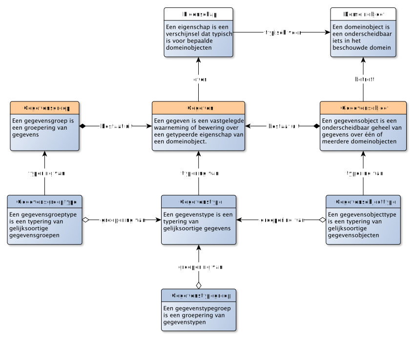

# Inleiding

NB: Dit document bouwt het metamodel beetje-bij-beetje op, door steeds iets meer van het model prijs te geven. Voor degene die graag het eindresultaat wil zien (het volledige metamodel), kun je ook direct naar de metamodel navigeren, onderaan deze pagina.

Met gegevensmodelleren en gegevenstypering beschrijven we gegevens. Die gegevens *gaan* ergens over: bijvoorbeeld over mensen, gebeurtenissen, objecten, plaatsen en de relaties daartussen. Andersom gaan mensen ook *over* gegevens: zij geven betekenis aan gegevens, bijvoorbeeld door beslissingen af te laten hangen van de gegevens die zij tot hun beschikking hebben. Wet- en regelgeving neemt daarbij een bijzondere plaats in: deze codificeert de afspraken die "we" hebben gemaakt en deze afspraken bieden een basis voor de betekenis die we met bepaalde gegevens beogen.

Om nauwkeurig gegevens te kunnen typeren, zullen we het (vooral ook) over deze betekenis moeten hebben. En daarvoor is het van belang om bepaalde zaken van elkaar te onderscheiden.

### Beschouwingsdomein en verwerkingsdomein

Enerzijds kunnen we het hebben over het domein *waarover* we gegevens willen verwerken. En anderzijds kunnen we het over de gegevens (en de verwerking daarvan) *zelf* hebben. En dit zijn verschillende zaken! Eerstgenoemde domein zullen we het *beschouwingsdomein* noemen, laatstgenoemde het *verwerkingsdomein*

We gebruiken hier steeds het begrip «verwerken». We hebben het dan ook over zowel het lezen, gebruiken, uitwisselen, opslaan, wijzigen als vernietigen van gegevens.

Aangezien gegevens over de dingen in het beschouwingsdomein gaan, zullen we die dingen moeten kunnen identificeren. Dit lijkt vaak makkelijk, maar dat is het niet. Zo is het relatief makkelijk om te bepalen wie een mens is en wie niet. Maar als het om meer abstracte zaken gaat (wanneer ben je Belastingplichtige, Verdachte of Eigenaar?), dan wordt het moeilijk. En als we dingen niet alleen willen herkennen, maar ook identificeren, dan wordt het nog een stuk minder makkelijk. Modelleren is een hulpmiddel om deze complexiteit behapbaar te maken.

### Soorten modellen

We modelleren zowel het beschouwingsdomein als het verwerkingsdomein. En het is daarbij verstandig om niet alles in één model te willen stoppen: hierdoor wordt het model te complex en niet meer te begrijpen. Modelleren is juist een werkwijze om op een eenduidige wijze een beschrijving te maken met precies voldoende detail voor optimaal begrip. Oftewel: "*Ik kan wel (heel) precies zijn, maar dan wordt ik niet begrepen. Als ik begrepen wil worden, kan ik niet (te) precies zijn*"). Deze eenduidige werkwijze is afgestemd op het doel dat we willen bereiken met het model. We onderscheiden vijf verschillende doelen, en evenzoveel soorten modellen:

1. **Kennisbronnen** en **verhalen**. Beiden zijn voor mensen leesbare en begrijpbare beschrijvingen in natuurlijke taal van de kennis over het beschouwingsdomein. Uit deze kennisbronnen en verhalen kan de betekenis worden gevonden, in de zin van: "de betekenis is, zoals beoogd in dit document". Zo'n kennisbron legitimeert de beoogde betekenis, bijvoorbeeld een wet of een standaard waar we ons aan willen houden. Maar ook verhalen kunnen helpen: ze nemen de lezer mee in de betekenis vanuit voorbeelden en concrete gebeurtenissen.
2. **Model van begrippen**. Een eerste, talige, model van begrippen helpt om een beter inzicht te krijgen wat er wordt bedoeld als een bepaald woord of woordcombinatie ("term") wordt gebruikt in het beschouwingsdomein. We modelleren hier het begrip dat we hebben als we met elkaar communiceren: welke woorden *daadwerkelijk* worden gebruikt in het beschouwingsdomein en wat ze in die context betekenen voor degenen die deze woorden gebruiken. Dergelijke woorden kunnen duiding geven aan een subject of object in het beschouwde domein ("werknemer", "woning") en ook aan afspraken of verplichtingen die in het beschouwingsdomein gelden ("arbeidscontract", "eigendom" of "belastingplicht").
3. **Conceptueel model**, waarmee inzicht wordt gegeven welke dingen (zoals: objecten, actoren en handelingen) relevant zijn om te beschouwen en welke eigenschappen daarvan en relaties daartussen. Anders dan bij een model van begrippen, gaat het ons hier niet primair om de gebruikte taal, maar juist de dingen waarover wordt gesproken (letterlijk: "de onderwerpen van gesprek"). Ook gaat het in een dergelijk model over de regels die gelden met betrekking tot de beschreven handelingen. Zo kan ook onderscheid gemaakt worden in een conceptueel informatiemodel (dat zich richt op de relevante informatie), conceptueel regelmodel (dat zich op de relevante regels) en een conceptueel procesmodel (dat zich richt op de relevante processen)
4. **Logisch gegevensmodel**. Waar we in de vorige modellen kijken naar het beschouwingsdomein waarover we gegevens willen verwerken, kijken we in dit model juist naar die gegevens zelf. Het logisch gegevensmodel is een model van het verwerkingsdomein. Het logisch gegevensmodel is **geen** model van het beschouwingsdomein, hoewel de modellen veel op elkaar kunnen leiden (dit wordt isomorfie genoemd, hierover later meer). Ook kunnen we bij het logisch gegevensmodel een nader onderscheid maken tussen modellen van administraties (hoe gegevens worden opgeslagen), modellen van interacties (hoe gegevens worden uitgewisseld) en modellen van de verwerking binnen een proces (hoe gegevens worden verwerkt). Het uitdrukking geven aan de gegevensverwerkende processen en op gegevens van toepassing zijnde regels zie we dan ook nadrukkelijk als onderdeel van een logisch gegevensmodel.
5. **Fysiek datamodel**. Tenslotte zullen gegevens ook daadwerkelijk vastgelegd, uitgewisseld of bewerkt moeten worden. Het fysieke datamodel beschrijft hoe gegevens als data worden vastgelegd, uitgewisseld of bewerkt.

In dit document zullen we ons met name richten op het conceptueel informatie model en het logisch gegevensmodel. De samenhang met de overige soorten modellen valt voorlopig buiten de scope van dit document.

### Gebruik van quotes

Dit document gaat over metamodellen. We introduceren daarbij bepaalde begrippen en gebruiken daar bepaalde termen voor. Daarbij is het soms van belang om expliciet te maken dat we een begrip bedoelen en soms expliciet van belang dat we een term bedoelen. De term "drie" heeft 4 letters, terwijl het begrip «drie» de betekenis heeft van het getal 3. Waar we verwijzen naar een term gebruiken we daarvoor aanhalingstekens, waar we verwijzen naar een begrip gebruiken we [guillemets](https://nl.wikipedia.org/wiki/Guillemet), zoals in het voorbeeld in deze paragraaf. In de lopende tekst zullen we ook definities voor dergelijke begrippen geven. Daar gebruiken we HOOFDLETTERS om aan te geven dat we een begrip bedoelen dat we ook definiëren in dit stuk. In voorbeelden verwijzen we vaak naar concrete dingen in het beschouwingsdomein. Als we het over [Jan] hebben, dan bedoelen we niet het woord "Jan" of het begrip «Jan», maar met [Jan] verwijzen we naar een levend persoon die toevallig luistert naar de naam "Jan". In dergelijke gevallen gebruiken we blokhaken.

## Een voorbeeld - het beschouwingsdomein

Voor dit document gebruiken we een voorbeeld, een casus op basis waarvan we de overige modellen zullen invullen.

> - [Jan] is geboren op 10 februari 1970 in [Zwolle].
> - [Hij] is de zoon van [Paul] en [Marie Veenstra].
> - [Jan] heeft inmiddels een lengte van 2.05 bereikt.
> - En hoewel [Jan] oorspronkelijk gezegend was met een flinke bos haar, is [hij] inmiddels vrijwel volledig kaal.
> - [Hij] werkt sinds 1990 als «bakker» bij [Bakkerij Broodjes].
> - [Jan] woont inmiddels in [Meppel]. [Hij] is in [die gemeente] ingeschreven met BSN nummer 12345678.
> - [Jan] is getrouwd met [Marie] op 6 september 2003.

**TODO: Voorbeeld nog verder uitwerken. Liefst ook met een stukje wet- en regelgeving, bijvoorbeeld arbeidsrecht**

# De concrete zaken uit het beschouwde domein

De termen "beschouwingsdomein" "beschouwde domein" en "domein" kunnen in dit document als synoniem van elkaar worden gelezen. Waar we het over "verwerkingsdomein" hebben, bedoelen we expliciet het domein van de gegevensverwerking, dat je ook het "gegevensdomein" of het "gegevensverwerkingsdomein" zou kunnen noemen.

## De basis: domeinobjecten en eigenschappen

> Een DOMEINOBJECT is een onderscheidbaar iets in het beschouwde domein

Wat we onderscheiden in een domein, en wat (dus) hier een object is, hangt af van wat we willen beschouwen. Deze keuzes wat we willen onderscheiden leggen we vast in een conceptueel model. Een conceptueel model is, met andere woorden, een model van domeinobjecten.

We gebruiken hier bewust het woord "domeinobject" om expliciet te maken dat we het over de objecten hebben die we beschouwen in een domein. Alles kan immers een object zijn, afhankelijk wat je beschouwt. Zo hebben java-programmeurs het ook over objecten, maar dan bedoelen ze de java-objecten in hun programmeertaal (want dat is dan hetgeen ze beschouwen!). Verderop in dit document zullen we het hebben over gegevensobjecten. En dan bedoelen we dus ook weer die objecten die we beschouwen als we het over het gegevens hebben, dwz: zoals ze voorkomen in het verwerkingsdomein.

##### Verdieping
<aside class="note" title="Verdieping">
Stel dat we een conceptueel model zouden maken van de Java programmeertaal. Het beschouwingsdomein is dan (dus) de Java programmeertaal. En de domeinobjecten zijn dan (dus) onder meer de Java-objecten (en classes, interfaces, functions, etc). Op diezelfde manier kunnen we *ook* een conceptueel model maken van de gegevensverwerking. De domeinobjecten zijn dan (dus) onder meer de gegevensobjecten. Vaak worden dergelijke modellen ook wel *meta*modellen genoemd, omdat we de gegevensverwerking zelf beschouwen, dwz: een model-van-een-model, en gegevens-over-gegevens.
</aside>

> Een EIGENSCHAP is een verschijnsel dat typisch is voor bepaalde DOMEINOBJECTen

De definities van «domeinobject» en «eigenschap» zijn niet heel precies. Er kan van alles onder vallen. Dat is bewust: we willen immers zo'n beetje alle kunnen beschouwen wat we relevant vinden *om* te beschouwen. Toch is er uit de definities wel het één en ander te halen:

1. Een domeinobject is onderscheidbaar. Dit houdt in dat je voor iets in het beschouwingsdomein kunt zeggen dat het er eentje is (en niet twee), dat het er zo-eentje is (en niet iets anders) en dat het die ene is (en niet een andere).
2. Een domeinobject is iets in het beschouwde domein. Dit houdt in dat wat je onderscheid, bepaald wordt door het domein **en** hoe je dit domein wilt beschouwen. In verschillende domeinen of vanuit verschillende invalshoeken kun je dus ook andere dingen (willen) onderscheiden. We stellen hier ook dat DE werkelijkheid niet bestaat, maar dat je er altijd met een bepaalde blik naar kijkt: jou invalshoek op het beschouwde domein.
3. Een eigenschap is typisch voor bepaalde objecten in het domein. Dus bepaalde domeinobjecten *hebben* zo'n eigenschap. Zo'n eigenschap is overigens niet voorbehouden aan een bepaalde groep van domeinobjecten. Zo kan de eigenschap «haarkleur» een eigenschap zijn van zowel (het haar van een voorkomen van) een mens, een konijn of zelfs een knuffelbeertje. We stellen hiermee alleen dat die objecten iets gemeen hebben: een haarkleur.
4. Wat een eigenschap is, is ook domeinspecifiek. In het vorige voorbeeld zou je ook kunnen stellen dat mensen, konijnen en knuffelbeertjes geen «haarkleur» hebben, maar dat «haarkleur» een eigenschap is van «haar», en dat een eigenschap van mensen, konijnen en knuffelbeertjes is dat ze «haar» kunnen hebben. Dat laatste is net wat preciezer, maar mogelijk niet relevant in jouw domein. Andersom kan het ook zijn dat we het juist (alleen) relevant vinden wie de eigenschap «rood haar» heeft. Als we dat domein beschouwen, dan kennen we alleen de eigenschap «rood haar», en kunnen we wel objecten onderscheiden in objecten die rood haar hebben, en de objecten die dat niet hebben. In dit domein kunnen we dan niet de objecten kunnen onderscheiden met een andere haarkleur.

[Jan] uit ons voorbeeld is een «domeinobject», maar ook [Zwolle] en [Bakkerij broodjes]. Een eigenschap van [Jan] is dat hij geboren is, en dat [Jan] een bakker is.

## Identificerende eigenschap

Als we het over objecten in de fysieke werkelijkheid hebben, dan kunnen we die objecten aanwijzen. Zoals in de zin: "Hij daar, is de eigenaar". Stel dat die zin wordt uitgesproken in de winkel van Bakkerij Broodjes en er staan 5 mannen in die winkel, je zult dan de juiste persoon moeten aanwijzen! Je kunt ook gebruik maken van eigenschappen die de juiste persoon identificeren, zoals in de zin: "Die lange man met rood haar daar, is Jan, de eigenaar". We willen het ook vaak kunnen hebben over objecten die we niet kunnen aanwijzen, maaar wel willen kunnen identificeren. Bijvoorbeeld het huwelijk tussen [Jan] en [Marie]. Ook dan hebben we eigenschappen van dat huwelijk nodig om het juiste huwelijk te kunnen identificeren.

> Een IDENTIFICERENDE EIGENSCHAP is een EIGENSCHAP waarmee de identiteit van een DOMEINOBJECT kan worden vastgesteld

Eén enkele identificerende eigenschap is vaak niet voldoende. Zo is in ons voorbeeld het niet voldoende om Jan daadwerkelijk uniek te kunnen identificeren. Daarvoor is vaak iets extra nodig, een eigenschap die wordt toegekend aan een object, om deze uniek te identificeren. Zo'n eigenschap is vaak niet rechtstreeks met het object verbonden, maar wordt erbij gehouden. De enige manier om zo'n toekende eigenschap daadwerkelijk aan het object te verbinden is door het er letterlijk op te plakken. Bijvoorbeeld een serienummer dat gegraveerd wordt in het chassis van een voertuig of een straatnaambordje dat langs een weg wordt geplaatst.

Veel identificerende eigenschappen zijn, goed beschouwd, vaak geen eigenschap van het object dat zij identificeren. Zo is een eigenschap van een motorvoertuig bijvoorbeeld dat het een motor heeft, wielen heeft, een kleur, een maximum snelheid, etc. Maar het kenteken van een motorvoertuig is geen echte eigenschap van dat motorvoertuig. Het is niet echt een **eigen**schap. Dit noemen we toegekende (identificerende) eigenschappen. Het zijn eigenschappen waarvan we vinden dat ze echt wel *van* het object zijn, maar feitelijk zijn ze toegekend. Het kenteken van een motorvoertuig is zo'n eigenschap.

> Een TOEGEKENDE IDENTIFICERENDE EIGENSCHAP is een IDENTIFICERENDE EIGENSCHAP die met dat doel is toegekend aan een DOMEINOBJECT

Om expliciet aan te geven dat een eigenschap niet is toegekend, maar dat we vinden dat deze daadwerkelijk **eigen** is aan een object, kunnen we de term "intrinsieke eigenschap" gebruiken.

Merk op dat wat we intrinsiek vinden en wat we toegekend vinden vooral een domeinaangelegenheid is: het is maar net hoe je er naar kijkt. Dat is dan ook precies wat we in een conceptueel model aan het doen zijn. Zo kun je stellen dat de naam van een persoon een intrinsieke eigenschap is, maar feitelijk is ook die maar toegekend ("en we noemen haar..."). En ook van het geslacht van een persoon kun je stellen dat dit een intrinsieke eigenschap is, maar er zijn ook beschouwingsdomeinen waar dit eerder als een toegekende eigenschap wordt gezien. Van belang is dus meer *of* er in het beschouwde domein sprake is van een eigenschap van een domeinobject, en niet zozeer of dit een intrinsieke dan wel toegekende is.

## Kenmerken, classificaties en rollen

### Kenmerken en waarden

Als we naar de eigenschappen van een domeinobject kijken, dan valt op dat er verschillende soorten eigenschappen zijn te onderkennen. Een eigenschap van een domeinobject kent een invulling. Zo is de invulling van de eigenschap «(heeft) lengte» van het domeinobject [Jan] uit ons voorbeeld gelijk aan "2 meter en 5 centimeter". En de invulling van de eigenschap «(heeft) werkgever» is [Bakkerij Broodjes]. Tenslotte is de invulling van de eigenschap «(heeft) geslacht» gelijk aan «man». Drie eigenschappen, maar geheel andere invullingen. We hebben het respectievelijk over een kenmerk, rol en classificatie. De nauwlettende lezer ziet dat we bij deze drie eigenschappen ook steeds een ander leesteken gebruiken!

> Een KENMERK is een EIGENSCHAP van een DOMEINOBJECT met een WAARDE

> Een WAARDE is een letterlijke aanduiding van de waarde zelf

Een kenmerk is een eigenschap met "slechts" een waarde. Zoals «leeftijd» in het voorgaande voorbeeld. Een waarde is geen object, maar juist een letterlijke invulling van de eigenschap. Zoals een getal, een stukje tekst, een datum of een boolean (waar/onwaar). Zo is in ons voorbeeld «(heeft) leeftijd» een eigenschap van [Jan]. De *invulling* van dit kenmerk is bijvoorbeeld de waarde, het getal 25. En ook de eigenschap «(heeft) naam» van [Jan] is een kenmerk, met de waarde "Jan" (een woord bestaande uit drie letters).

> [!NOTE]
> Verdieping: strikt genomen is een waarde toch vaak net wat meer dan een letterlijke waarde. De waarde "2 meter en 5 centimeter" is toch echt wat anders dan de waarde "2 feet and 5 inch". In de waarde zitten begrippen verscholen: «meter», «centimeter», «feet» en «inch». Dit zou je kunnen oplossen door niet te spreken van de eigenschap «lengte», maar van de eigenschap «lengte in centimeters». De begrippen verschuiven dan naar de eigenschap, en de waarde is weer zuiver. Verderop in dit document zullen we zien dat het soms praktisch kan zijn om dergelijke eenheden (en ook grootheden) vanuit een waarde te typeren.

### Rollen en relaties

> Een ROL is een EIGENSCHAP van een DOMEINOBJECT in een relatie met een ander DOMEINOBJECT

Objecten kunnen zich verhouden tot andere objecten en dat kunnen wezenlijke eigenschappen zijn van zo'n object. Zo is een werkgever een rol van een persoon in een arbeidsrelatie met een andere persoon. Net zo goed als je kunt vragen "Wat is de leeftijd van Jan" (een vraag over de eigenschap «leeftijd» van een persoon) kun je de vraag stellen "Wie is de werkgever van Jan". De rol van werkgever wordt hier bijvoorbeeld vervuld door [Bakkerij Broodjes]. En [Jan] zelf vervuld de rol van werknemer. In dit geval is «(heeft) werkgever» dus een eigenschap van [Jan]. De *invulling* van die rol ligt bij [Bakkerij Broodjes].

We bedoelen hier dus echt de [Bakkerij Broodjes] *zelf*. Dit is wezenlijk anders dan de eigenschap «naam» van die bakkerij. Als we zouden zeggen: "De werknemer van Jan is 'Bakkerij broodjes'", dan lijkt het alsof de werknemer van [Jan] een naam is die bestaat uit twee woorden (!). Van een dergelijk verschil tussen waarden en objecten wordt gebruik gemaakt in de grap: "Hoeveel is '1' plus '1'?" (antwoord: "11"). in bovenstaande zin wordt met de woorden "Bakkerij Broodjes" (dus) verwezen naar de Bakkerij zelf en niet naar de naam van de Bakkerij.

### Classificaties en klassen

> Een CLASSIFICATIE is een EIGENSCHAP van een DOMEINOBJECT met een toekenning aan een KLASSE

> KLASSE is een aanduiding van een groep DOMEINOBJECTen die iets gemeen hebben

Een classificatie zit tussen een kenmerk en een rol in. Het lijkt een beetje op een kenmerk, maar toch is een klasse geen waarde. En het lijkt een beetje op een rol, maar een klasse is geen object. Het zit er tussenin. Een klasse is een aanduiding voor een groep van objecten die iets gemeen hebben. Een classificatie verbindt een object met die klasse. Zou kun je bijvoorbeeld objecten groeperen die levende wezens zijn en waarvan de moeders de jongen melk geeft, dwz: de groep van zoogdieren. De klasse «zoogdier» kan dan de invulling zijn van de eigenschap «biologische klasse» van een levend wezen.

Er zijn eigenschappen die gaan over een onderscheid tussen objecten die onveranderlijk is. Zo zal de eigenschap «geboortedatum» van een persoon nooit veranderen: een persoon is nu eenmaal geboren op een bepaalde dag, dat zal niet meer veranderen. De eigenschap «leeftijd» verandert daarentegen elkaar jaar, maar wel op een hele reguliere manier (elk jaar eentje erbij). Er zijn ook eigenschappen die veranderen, zonder dat sprake is van vooraf duidelijke manier. Zo zijn rollen over het algemeen veranderlijk: [Jan] is (nu) werknemer van [Bakkerij Broodjes], maar mogelijk is hij dat over een tijdje niet meer, en er is ook een tijd geweest dat hij het (nog) niet was.

Ook voor classificaties geldt dit. Er zijn classificaties die onveranderlijk zijn. Zo zal een levend wezen altijd tot de klasse van zoogdieren behoren, of juist niet. De classificatie «werkeloos» is echt juist weer veranderlijk, en hangt bovendien ook samen met de rol «werknemer».

> [!NOTE]
> Verdieping: je zult wellicht vinden dat een classificatie «werkeloos» een eigenschap is die je niet zou moeten modelleren in een conceptueel model. Vanuit de overtuiging dat de arbeidsrelatie de werkelijk juiste modellering is. Bedenk dan dat we een beschouwingsdomein aan het modelleren zijn. *Wat* we willen beschouwen, hangt van het domein af. Dus ook of we het interessant vinden om alle details te weten over de reden waarom iemand werkeloos is. Dat kan nuttig zijn, maar ook volledig overbodig. Daarom kan een dergelijke classificatie nuttig zijn. Een herkenbaar voorbeeld is dat je minimaal 18 jaar moet zijn om alcohol te mogen kopen. In dit beschouwingsdomein is de geboortedatum van een koper in het geheel niet relevant (en zelfst niet zijn of haar exacte leeftijd), slechts de classificatie «is minimaal 18 jaar» is relevant in dit domein.

## Gegevens: de concrete zaken uit het verwerkingsdomein

> Een GEGEVEN is een vastgelegde waarneming of bewering over een getypeerde EIGENSCHAP van een DOMEINOBJECT

Eén enkel gegeven is een waarneming of bewering over een getypeerde eigenschap van een domeinobject. En dit gegeven is vastgelegd, op wat voor manier dan ook: van een kleitablet, papieren document tot een electronisch bericht. En van een papieren register (boekhouding, teboekstelling) tot een digitale database. Zo'n gegeven gaat over een eigenschap van een domeinobject, bijvoorbeeld de eigenschap «geboortedatum» van de persoon [Jan] uit ons voorbeeld. Dergelijke gegevens zijn waarneming of beweringen: ze hoeven niet waar te zijn, maar ze zijn in ieder geval *gedaan* door iets (bv een sensor, of een algoritme) of iemand (een daadwerkelijke persoon). Gegevens kunnen vastleggingen zijn van directe waarnemingen (een sensor die iets meet of een persoon die iets ziet), maar ook beweringen zijn op grond van afleidingen en beoordelingen (een algoritme dat een berekening uitvoert of een persoon die iets concludeert op basis van andere gegevens).

Hoewel gegevens gaan over de domeinobjecten , is het niet direct mogelijk om de twee met elkaar te verbinden. Gegevens bestaan, zo gezegd, eigenlijk altijd in een andere werkelijkheid dan domeinobjecten. Denk bijvoorbeeld aan een domeinobject als een persoon, of een voertuig of een weg. Van alle drie kun je gegevens vastleggen. Maar om daarbij de relatie te leggen *waarover* deze gegevens gaan komen zitten we met een probleem. De enige manier om gegevens en domeinobjecten direct aan elkaar te relateren is letterlijk de gegevens op het domeinobject te "plakken", of (net zo letterlijk): het domeinobject te "oormerken" (!). In onze huidige, digitale, samenleving is dit een uitzondering. We hebben "in" de werkelijkheid van de gegevens iets nodig om te kunnen verwijzen naar de betreffende persoon, voertuig of weg. We moeten ze identificeren. Vaak gebruiken we een toegekende identificerende eigenschap om bij een gegeven aan te kunnen geven over welk domeinobject het gaat.

In ons voorbeeld kunnen we bijvoorbeeld het volgende gegeven uitdrukken, door gebruik te maken van de toegekende identificerende eigenschap «BSN»: "De persoon met BSN 12345678 heeft geboortedatum 10 februari 1970". Dit gegeven is een bewering over de eigenschap «geboortedatum» van het domeinobject dat geïdentificeerd kan worden met de toegekende identificerende eigenschap «BSN» met de waarde "12345678", dwz: onze [Jan].

> Een GEGEVENSGROEP is een groepering van GEGEVENs

Een gegevensgroep is simpelweg het groeperen van enkele gegevens die we op een bepaalde manier bij elkaar vinden horen. Dus bijvoorbeeld een lijstje van geboortedata van personen (we groeperen dan op die eigenschap), of enkele gegevens over hetzelfde domeinobject, bijvoorbeeld onze [Jan].

> Een GEGEVENSOBJECT is een geheel van GEGEVENs over één of meerdere DOMEINOBJECTen

Als we een groep van gegevens als een geheel willen beschouwen, dus als een eigen object, een geheel, dan hebben we het over een gegevensobject. Zo'n object kan gegevens omvatten die gaan over precies één domeinobject (het onderwerp van het gegevensobject), maar ook over meerdere domeinobjecten. Als een gegevensobject vooral gaat over één domeinobject, dan noemen we dat domeinobject het *hoofdonderwerp* van het gegevensobject.

> [!NOTE]
> Verdieping: Een gegevensobject kun je *zelf* ook weer zien als een domeinobject. Dus het is niet zo maar een geheel van gegevens, het is een geheel van gegevens die onderscheidbaar zijn in een domein. En in dit geval is dit het verwerkingsdomein van gegevens. Meta-gegevens (gegevens *over* gegevens) kunnen zo ook worden uitgedrukt: een (meta)gegeven is daarmee een vastgelegd waarneming of bewering over een getypeerde eigenschap van een gegevensobject.
>
> Verdieping: Merk op dat als we het hebben over gegevens-over-gegevens, we het over metagegevens hebben. Dergelijke metagegevens bestaan in dit geval *wel* in dezelfde werkelijkheid als de gegevens waarover ze gaan. Het is dan over het algemeen ook veel makkelijker om metagegevens en gegevens bij elkaar te plaatsen. Wel blijft van belang om te blijven erkennen dat het hier om twee verschillende objecten gaat. Onderstaand voorbeeld geeft dit weer:
>
> - Een gegeven: "De persoon met BSN 12345678 heeft geboortedatum 10 februari 1970"
> - Een metagegeven: "Het gegeven: 'De persoon met BSN 12345678 heeft geboortedatum 10 februari 1970' bevat een foutieve waarde voor de eigenschap BSN"
>
> Het gegeven *gaat over* een persoon, het metagegeven *gaat over* een gegeven.

## Gebruik van identificerende eigenschappen voor verwijzingen

Een eigenschap kan een kenmerk, rol of classificatie zijn. Een gegeven kan daarmee dus gaan over zowel kenmerken, rollen en classificaties. Daarbij is duidelijk dat als je het over een eigenschap van een domeinobject hebt, je dit domeinobject zelf moet identificeren. Hiervoor hebben we de identificerende eigenschappen van een domeinobject gebruikt.

Een gegeven dat gaat over een kenmerk, kunnen we direct de waarde van dat kenmerk zelf gebruiken, zoals in het gegeven uit bovenstaand voorbeeld: "10 februari 1970" was de waarde van het kenmerk waarover dit gegeven gaat. De waarde zelf kan letterlijk gebruikt worden in het gegeven, er is geen verschil tussen de manier waarop aan de waarde *refereren* en wat de waarde *betekent*. Dit gaat niet op voor rollen en classificaties.

Bij een rol is de invulling van de rol geen waarde, maar een (ander) domeinobject. Ook daar zullen we (dus) weer gebruik moeten maken van de identificerende eigenschappen van dit domeinobject, zoals in het gegeven: "De persoon met BSN 12345678 is werknemer van het bedrijf met RSIN 87654321". Met dit gegeven wordt overigens hetzelfde bedoeld als met het gegeven "De persoon met de naam Jan is werknemer van het bedrijf met de naam Bakkerij Broodjes". Laatstgenoemde vorm is echter niet zo precies, aangezien het maar de vraag is of de eigenschap «naam» voldoende identificerend is.

Daarnaast zie je bij relaties en rollen dat je hetzelfde gegeven in drie verschillende vormen kunt uitdrukken, met elk dezelfde betekenis:

1. "De persoon met BSN 12345678 is werknemer van het bedrijf met RSIN 87654321"
2. "De persoon met BSN 12345678 heeft werkgever het bedrijf met RSIN 87654321"
3. "Het bedrijf met RSIN 87654321 heeft werknemer de persoon met BSN 12345678"

Bij een classificatie is de invulling van een classificatie geen waarde, maar een klasse. We kunnen de letterlijke aanduiding van die klasse niet gebruiken in het gegeven, we zullen moeten verwijzen door gebruik te maken van een identificerende eigenschap van die klasse.

## Informatieobjecten: de duurzame vastlegging van gegevens

> Een INFORMATIEOBJECT is een object als verzameling van aan elkaar gerelateerde GEGEVENs die als eenheid wordt behandeld

Deze definitie van informatieobject is afkomstig uit de [MTDO, Metagegevens voor duurzaam toegankelijke overheidsinformatie](https://www.nationaalarchief.nl/archiveren/mdto). Waar het bij gegevensobjecten gaat over de verwerking, gaat het bij informatieobjecten over het (leveren van) informatie. Oorspronkelijk ging het daarbij om documenten (bestaande uit ongestructureerde gegevens). Vanuit de context van gegevenstypering, is een informatieobject feitelijk een verzameling van gegevens (en dus ook een verzameling van gegevensobjecten), waarbij het verschil is dat een informatieobject duurzaam toegankelijk is. Akten, huwelijkscontracten, een verslag van een vergadering of een rapportage zijn voorbeelden van informatieobjecten.

Een gegevensobject zou daarmee gelijktijdig *ook* een informatieobject kunnen zijn. Vaak bestaat een informatieobject echter uit meerdere gegevensobjecten, die gezamenlijk als één geheel worden behandeld.

Omdat een informatieobject als eenheid wordt behandeld, wordt van een informatieobject ook altijd gegevens bijgehouden: de metagegevens. Daarmee is een informatieobject *in het beschouwingsdomein van de informatiehuishouding* dus een domeinobject (!). Een informatieobject heeft bijvoorbeeld eigenschappen als auteur, versienummer, versiedatum, rubricering, etc. De metagagevens van zo'n informatieobject zijn daarmee gegevensobjecten die *gaan over* een informatieobject.

Om het informatieobject (als domeinobject dat we beschouwen) te onderscheiden van de inhoud die "in" het informatieobject, zien we dit als twee afzonderlijke objecten: het informatieobject waarover we gegevens willen vastleggen, en de inhoud daarvan, de gegevens "in" het informatieobject:

> Een INHOUD is een een eigenschap van een informatieobject met als invulling het informatieobject zelf, of een deel daarvan.

Een informatieobject kan ook een video zijn, of een tekstbestand. Een eigenschap van zo'n informatieobject is dan zijn «inhoud». Net als bij waarden, kijk je daarbij eigenlijk naar het informatieobject *zelf*, in plaats van dat de eigenschap over iets anders gaat. Een informatieobject kan daarbij bestaan uit andere informatieobjecten. Bijvoorbeeld een dossier dat bestaat uit afzonderlijke dossierstukken.

> ![NOTE]
> Verdieping: de [Architecture of the World Wide Web, volume one](https://www.w3.org/TR/webarch/#id-resources) kent eenzelfde gedachte met betrekking tot informatieobjecten. In dit document, wordt gesproken over *information resources*, met als definitie: "a resource for which all its essential characteristics can be conveyed in a message". Voorbeelden die worden gegeven zijn: een webpagina, een plaatje, een document.  Het idee van het WWW is dat je dergelijke resources kunt identificeren met een URI, die daarmee ook de locatie beschrijft waar je een dergelijke resource kunt vinden (via het http protocol). Daarbij wordt aangegeven dat er ook resources ("objecten") zijn die je kunt identificeren met een URI, die juist geen information resources zijn: een auto, een hond en ook een fysiek stukje papier dat je daadwerkelijk in je hand hebt.

## Wat voorbeelden

Nu we de begrippen rondom gegevens helder hebben, kunnen we een aantal voorbeelden van gegevens geven. We gebruiken hiervoor het volgende "sjabloon":

Merk op dat met dit sjabloon geen technische structuur wordt beoogd: het gaat om de logische representatie van een gegeven, waar verscheidende technische realisaties voor mogelijk zijn.

We kunnen het zo over de volgende gegevens hebben:
- Er is een domeinobject met de voornaam "Jan" (de invulling voor de eigenschap «voornaam» van dit domeinobject is de waarde "Jan");
- Dit domeinobject heeft BSN 12345678 (de invulling voor de toegekende identificerende eigenschap «BSN» van dit domeinobject is de waarde "12345678");
- Dit domeinobject heeft als geboortedatum 25 mei 1970 (de invulling voor de eigenschap «geboortedatum» van dit domeinobject is de waarde "25 mei 1970");
- Jan is een man (de invulling voor de classificatie-eigenschap «geslacht» is de klasse «mannelijk»);
- Jan is de werknemer van een domeinobject met de naam "Bakkerij Broodjes" (de invulling voor de rol werkgever van [Jan] is [Bakkerij Broodjes]).
- Jan is getrouwd met Marie (de invulling van de rol partner van [Jan] is [Marie]).

Deze zes uitspraken zijn zes gegevens die gegroepeerd kunnen worden tot één gegevensobject met als hoofdonderwerp het domeinobject met het BSN 12345678.

## Rol, rolinvulling en relatie-domeinobject

In onze kijk op het domein hebben we het slechts over objecten en eigenschappen van objecten gehad. En hoewel we relaties hebben besproken, komt relatie niet terug in ons voorbeeld. Alleen de rol komt terug.

Dit heeft alles te maken met hoe we tegen het domein aankijken: blijkbaar is de relatie niet "bijzonder" genoeg om deze daadwerkelijk te identificeren. Dat was in ons voorbeeld het geval. Maar dat hoeft niet: dit hangt sterk af van hoe we tegen het domein aan willen kijken.

Als we de relatie *zelf* willen onderkennen, dan kunnen we de relatie simpelweg als een domeinobject beschouwen.

Zo kunnen we het bijvoorbeeld over de huwelijksrelatie tussen Jan en Marie hebben. Zo'n huwelijksrelatie betreft dan een (relatie)domeinobject. Het relatiedomeinobject heeft dan zelf eigenschappen, zoals de huwelijksdatum, de gehuwden en getuigen. En we zullen zo'n relatiedomeinobject moeten kunnen identificeren. In dit geval zou de combinatie van de identificerende eigenschappen van de huwelijkspartners en de huwelijksdatum daarvoor bruikbaar zijn. Het is echter ook denkbaar dat in het betreffende domein een afzonderlijk huwelijkskenmerk bestaat, bv het nummer van de huwelijksakte.

Relaties hebben vaak te maken met gebeurtenissen waaruit de relatie ontstaan. In bovenstaand voorbeeld stond de gebeurtenis centraal. Maar ook het resultaat van de gebeurtenis kan gezien worden als domeinobject. In zo'n geval zou huwelijk mogelijk een eigenschap hebben als huwelijkse voorwaarden.

Bij het betalen van een rekening is zo sprake van de gebeurtenis van betalen, het resultaat van de betaling en de rollen betaler en ontvanger. Het is aan de modelleur om aan te geven welke onderdelen hij hiervan als domeinobjecten en eigenschappen wenst te zien in het beschouwingsdomein.

En ook de rol(invulling) zelf kunnen we zien als een domeinobject. Zo is een eigenschap van een betaling de rol «betaler». Als we naar de invulling van die rol kijken, dan wordt die ingevuld door een domeinobject dat we de «Betaler» kunnen noemen. Met andere woorden:

> Als Bakkerij Broodjes het loon van Jan overmaakt (4700 euro), dan:
> - Is er sprake van een betaling;
> - Een eigenschap van die betaling is het «bedrag»;
> - De invulling van deze eigenschap voor deze betaling is 4700 euro;
> - Een eigenschap van die betaling is de «betaler»;
> - De invulling van deze eigenschap voor deze betaling is Bakkerij Broodjes
> - Bakkerij Broodjes is in deze betaling de betaler.

# Typering van domeinobjecten
Nu we de concrete zaken hebben behandeld, kunnen we de stap maken naar de typering. En eigenlijk zijn we daar ook al een beetje mee begonnen. Want eigenschappen en klassen zijn eigenlijk ook al een vorm van typering (zoals we hieronder zullen zien).

## Objecttype en attribuutsoorten

> Een OBJECTTYPE is een typering van gelijksoortige DOMEINOBJECTen

Verdieping: Een objecttype is een typering van gelijksoortige domeinobjecten. Je zou het daarmee ook kunnen hebben over een "domeinobjecttype". Het heeft echter onze voorkeur om de kortere term "objecttype" te hanteren. *Wat* je typeert is afhankelijk van je beschouwingsdomein. Zoals in de verdieping hierboven uitgelegd, kun je ook de gegevensverwerking zelf als beschouwingsdomein kiezen, en ook de informatiehuishouding kan jouw beschouwingsdomein zijn. Op dat moment zijn de domeinobjecten die je beschouwt respectievelijk gegevensobjecten en informatieobjecten (!).

De oplettende lezer zal zich afvragen wat het verschil is tussen een klasse en een objecttype. En dat is terecht. Want vaak is iets zowel een klasse als een objecttype. Je kunt het bijvoorbeeld hebben over de klasse «Homo Sapiens» als een klasse bij de classificatie van levende wezens. Maar gelijktijdig kun je het hebben over het objecttype «Persoon» als typering van alle objecten van diezelfde klasse. Het gaat hier vooral om het doel waarom we typering. Een klasse wordt gebruikt als onderdeel van een gegeven, terwijl een objecttype juist bedoeld is om een beschrijving te geven in welke objecten we zijn geïnteresseerd.

Van een objecttype beschrijven we welke eigenschappen we relevant vinden om te kunnen weten van objecten die tot een dergelijk objecttype behoren. Door dit te beschrijven, kunnen we vervolgens gegevens over dergelijke objecten verwerken.

> Een ATTRIBUUTSOORT is een typering van een KENMERK van een DOMEINOBJECT, behorende tot een OBJECTTYPE

Waar een eigenschap (en daarmee ook een kenmerk) los kan staan van een domeinobject, geldt voor een attribuutsoort dat deze getypeerd is in de context van een objecttype. Waarden kunnen we daarbij ook typeren. Zo zal een kenmerk «geboortedatum» niet zomaar elke waarde kunnen zijn, maar kunnen we ook deze waarde typeren. Zo zal een geboortedatum van het waardetype «Datum» kunnen zijn.

> Een WAARDETYPE is een typering van gelijksoortige WAARDEn

Gelijk aan een attribuutsoort als typering van een kenmerk met als invulling een waarde, zal een classificerende attribuutsoort als invulling een klasse hebben.

> Een CLASSIFICERENDE ATTRIBUUTSOORT is een ATTRIBUUTSOORT als typering van een CLASSIFICATIE

Een classificatie heeft als invulling een klasse, wat al een vorm van typering betreft. Wel is relevant welke klassen precies bij een classificerende attribuutsoort gebruikt kunnen worden. Dit is het classificatieschema. Dit kan een lijstje zijn van klassen die zijn toegestaan, maar kan bijvoorbeeld ook een hiërarchie van klassen omvatten.

> Een CLASSIFICATIESCHEMA is een systematische ordening van DOMEINOBJECTen in KLASSEn

## Relatiesoorten en rollen

> Een RELATIESOORT is een typering van een relatie tussen twee DOMEINOBJECTen

We kunnen relaties tussen objecten typeren. Echter, als het gaat om gegevens, dan hebben we het over eigenschappen van domeinobjecten. We zagen daarin dat een eigenschap van een domeinobject een rol kan zijn. Dergelijke rollen kun je ook typering:

> Een RELATIESOORTROL is een typering van een ROL van een DOMEINOBJECT in een relatie, getypeerd door een RELATIESOORT en behorende tot een OBJECTTYPE

## Condities

De typering van objecttypen bestaat niet alleen uit het toewijzen van een eigenschap aan een objecttype. Het is ook relevant om te weten onder welke condities zo'n eigenschap geldt voor een domeinobject. En ook of een domeinobject tot een objecttype behoort kunnen we conditioneren.

> Een CONDITIE is een noodzakelijke voorwaarde die moet gelden voor een typering

We onderscheiden verschillende soorten condities, afhankelijk voor welke typering zo'n conditie wordt gebruikt. De meest prominente condities zijn:

- **Cardinaliteit** is een conditie waarbij van een eigenschap wordt aangegeven hoeveel invullingen er voor één domeinobject minimaal en maximaal zijn.
- **Lengte** is een conditie waarbij van een kenmerk of waardetype wordt aangegeven hoe lang de invulling (de waarde) van dat kenmerk of waarden van een waardetype mag/mogen zijn.
- **Datatype** is een conditie waarbij van een kenmerk of waardetype wordt aangegeven wat voor datatype de invulling (de waarde) van dat kenmerk of waarden van een waardetype heeft/hebben. Een datatype is bijvoorbeeld: getal, tekst, datum, etc.
- **Informele conditie** is een conditie die beschreven is in een natuurlijke taal, dwz: in een taal die mensen gebruiken in onderlinge communicatie.
- **Formele conditie** is een conditie die beschreven is in een machine-interpreteerbare taal.

Verdieping: wat hierbij opvalt is dat condities die gaan over letterlijke waarden (lengte, waardetype) zowel kunnen gelden als condities voor gegevenstypen (het datatype van een gegevenstype over het kenmerk «geboortedatum» is exact hetzelfde datatype als voor dat kenmerk zelf). Wel kan een dergelijke conditie preciezer worden gemaakt als het gaat om gegevens, soms puur om praktische zin. Zo kan bij een kenmerk "voornaam" een waardetype «voornaamtypering» zijn opgenomen, waarin onder meer is opgenomen dat het gaat om een datatype tekst en dat een voornaam moet bestaan uit letters en geen cijfers mag bevatten. In de gegevensconditie kan daarbij aanvullend nog opgenomen worden dat de lengte maximaal 200 karakters is. Een waardetype kent daarmee een typering die betrekking heeft op het beschouwingsdomein, maar ook een stukje typering die betrekking heeft op verwerkingsdomein.

## Wat voorbeelden

De begrippen die we hiermee gedefinieerd hebben, zijn behoorlijk abstract. Aangezien we het hier hebben over typering, was dat ook wel te verwachten. Daarom handig om een aantal voorbeelden te beschrijven: wat kunnen we nu met deze typering? We doen dit aan de hand van het volgende sjabloon:

In het voorbeeld willen we de typering vastleggen uit het concrete voorbeeld hierboven over Jan.

- We beschrijven het objecttype met de naam "Persoon". Het domeinobject met de voornaam Jan typeren we als het objecttype «Persoon».
- Dit objecttype kent dus in ieder geval ook de attribuutsoort «voornaam», die de overeenkomstige eigenschap «voornaam» betreft.
- Hier koppelen we de attribuutsoort met de naam "BSN" aan. Deze attribuutsoort betreft de toegekende identificerende eigenschap «BSN».
- Ook koppelen we hier de attribuutsoort met de naam "geboortedatum". Deze attribuutsoort betreft het kenmerk «geboortedatum».
- Tenslotte koppelen we hier de classificerende attribuutsoort met de naam "geslacht" aan. Deze attribuutsoort betreft de classificatie «geslacht».
- Als relatiesoort onderkennen we de relatiesoort met de naam "werkt bij". Deze relateert het objecttype «Persoon» aan het objecttype «Bedrijf».
- Als relatiesoortrol onderkennen we eentje met de naam "werkgever". Dit is een eigenschap van (domeinobjecten getypeerd als) het objecttype «Persoon» en wordt ingevuld door (domeinobjecten getypeerd als) het objecttype «Bedrijf».
- Andersom is er een relatiesoorrol te onderkennen met de naam "werknemer". Dit is een eigenschap van (domeinobjecten getypeerd als) het objecttype «Bedrijf» en wordt ingevuld door (domeinobjecten getypeerd als) het objecttype «Persoon».

Je kunt bovenstaande ook visueel afbeelden als:

## Classificatie, klassen en (object)subtypen

Wellicht is opgevallen dat «werkgever» een eigenschap is van een persoon (en wordt ingevuld door een bedrijf), waar je mogelijk zou verwachten dat een werkgever juist een *bedrijf* is. Dat laatste is ook zo (een werkgever is een rol die een bedrijf invult), maar dan hebben we het eigenlijk (dus) over iets anders. We hebben het dan niet over een rol of over een eigenschap, maar over een rolvervulling. Zo'n rolvervulling is een typering van domeinobjecten die een bepaalde rol invullen. Eigenlijk is dit ook al zichtbaar in de visualisatie hierboven: "werkgever" staat hier twee keer in het diagram: één keer als eigenschap bij het objecttype «Persoon» en één keer als rolinvulling bij het objecttype «Bedrijf». Dit kan ook expliciet worden getoond:

Iets vergelijkbaars speelt zich af bij geslacht. De invulling van deze classificatie kan met twee klassen: «Man» en «Vrouw». En net zoals je kunt stellen dat een werknemer een persoon is, kun je stellen dat een man een persoon is, en ook een vrouw een persoon is. Het verschil hier is dat er geen sprake is van een relatie(soort), maar van een classificatie: de classificatie naar geslacht. En in dit geval zie je dat je objecttypen kunt vormen uit klassen: de objecttypen «Man» en «Vrouw». Je zou dit ook als volgt kunnen visualiseren:

## Waardetypen vs classificaties en objecttypen

Als we een domein beschouwen, dan zullen daar bepaalde domeinobjecten in voorkomen waar we het "echt" over hebben. Een klantenadministratie zal het "echt" over klanten hebben, en de eigenschappen die we van deze klanten belangrijk vinden, zoals bijvoorbeeld hun naam, adres en ook het land waar deze klant uit afkomstig is. België is daarmee (dus) ook een domeinobject in dit voorbeeld, net als de klant Jerome, afkomstig uit dit land. Het zal vermoedelijk echter niet nodig zijn om een afzonderlijke landenadministratie bij te houden. Dit is simpelweg een "lijstje" dat we eenmalig kunnen inladen.

Dergelijke lijstje lijken bij de gegevensverwerking dan ook sterk op classificaties en waardetypen waarbij een selectie uit een beperkt aantal klassen c.q. waarden gekozen kan worden. Toch is er een belangrijk verschil bij het typeren:

- Een lijst van waarden bestaat uit waarden: de waarden *zelf* betekenen niets meer dan de waarde zelf. Zo kun je het hebben over de lijst van getallen uit de fibonachi reeks kleiner dan 30, dwz: 1, 2, 3, 5, 8, 13 en 21. Dit is een *waardelijst* en we hebben het hier over *kenmerken*
- Een lijst van klassen bestaat uit klassen: de klassen zijn aanduidingen voor een groep objecten die iets gemeen hebben. Zoals de klassen «man» en «vrouw». Je zou hiervoor de codes 1 en 2 kunnen gebruiken, maar daarmee zijn deze codes **geen** waarden, maar nog steeds aanduidingen voor een groep objecten die iets gemeen hebben! Deze lijst hebben we een *classificatieschema* genoemd en we hebben het hier over *classificaties* (en geen kenmerken)
- Een lijst van domeinobjecten bestaat uit domeinobjecten: als we aangeven dat een klant afkomstig is uit een land, dan vervult dit land een rol in de relatie tussen twee domeinobjecten, in het voorbeeld het domeinobject Jerome en het domeinobject België. We kunnen daarbij de landcode 1 gebruiken, maar daarmee is deze code **geen** waarde, maar de invulling van een identificerende eigenschap van het domeinobject België. Deze lijst is de *populatie* behorende bij het domeinobjecttype «Land» en we hebben het hier over *rollen* (en geen kenmerken).

Man en vrouw zijn hier personen, geclassificeerd naar (de classificatie, de eigenschap) geslacht.

# Typering van gegevens

Net zoals het mogelijk is om objecten en eigenschappen te typering, kunnen we ook gegevens typeren.

> Een GEGEVENSTYPE is een typering van gelijksoortige GEGEVENs.

Er kan sprake zijn van gelijksoortige gegevens, als deze gegevens over dezelfde eigenschap van gelijksoortige domeinobjecten gaat. Dus bijvoorbeeld gegevenstypen die gaan over de eigenschap geboortedatum van een objecttype persoon. Er is sprake van een ander gegevenstype, als de eigenschap verschilt, of als het over een ander objecttype gaat.

Naast gegevens, kunnen we ook de gegevensobjecten typeren:

> Een GEGEVENSOBJECTTYPE is een typering van gelijksoortige GEGEVENSOBJECTen

Er kan sprake zijn van gelijksoortige gegevensobjecten, als de gegevens die elk van deze gegevensobjecten bevat, van hetzelfde gegevenstype zijn. We kunnen met andere woorden gegevensobjecttypen typeren door te beschrijven welke gegevenstypen behoren tot dat gegevensobjecttype. Dit is echter niet voldoende. Gegevens gaan over domeinobjecten. Gegevensobjecten gaan daarmee ook over (diezelfde) domeinobjecten. Er is alleen sprake van gelijksoortige gegevensobjecten als de populatie waaruit deze domeinobjecten komen, dezelfde is. Een gegevensobjecttype "(Nederlandse) Inwoner" met als populatie de persoonsgegevens van alle Nederlands, verschilt daarmee van een gegevensobjecttype "(Europese) Inwoner" met als populatie de persoonsgegevens van alle Europeanen.

Een gegevensobject kan gegevens omvatten die allen gaan over één domeinobject, het hoofdonderwerp. Daarnaast onderkennen we ook de situatie dat een gegevensobject gaat over meerdere domeinobjecten, bijvoorbeeld een lijst met inwoners per provincie van Nederland. Maar ook voor dergelijke gegevensobjecten is sprake van dezelfde gelijksoortigheid bij de typering.

Gegevenstypen typeren gegevens die gaan over domeinobjecten. En objecttypen typeren domeinobjecten. Om te beschrijven waarover gegevens gaan, kunnen we gegevenstypen relateren aan objecttypen. Onderstaand diagram beschrijft hoe dat gaat:

## Speciaal soort gegevensobjecttypen

Een gegevensobjecttype kan sterk lijken op een objecttype. We noemen dat *isomorf*. In dat geval gaan de gegevens die bij één gegevensobject worden bijgehouden over eigenschappen van één domeinobject van dat objecttype. Maar het is ook denkbaar om gegevens over andere objecten bij een gegevensobject te plaatsen. Hiertoe maken we onderscheid in drie soorten gegevensobjecttypen:

- Een **gegevensgroeptype** (of groeperend gegevensobjecttype) is een gegevensobjecttype met gegevens over meerdere domeinobjecten, zonder dat één van deze domeinobjecten het hoofdonderwerp is;
- Een **eenduidig gegevensobjecttype** is een gegevensobjecttype met precies één hoofdonderwerp;
- Een **strikt eenduidig gegevensobjecttype** is een eenduidig gegevensobjecttype over alleen eigenschappen van het hoofdonderwerp.

Merk op dat het afleidbaar is wanneer een gegevensobjecttype een strikt logisch gegevensobjecttype is en wanneer niet. Zolang alle eigenschappen waarover dit gegevensobjecttype gaan behoren tot de eigenschappen van het hoofdonderwerp, is sprake van een strikt logisch (gegevens)objecttype, en alle andere gevallen niet.

> Een HOOFDONDERWERP is een OBJECTTYPE waarvan de IDENTIFICERENDE EIGENSCHAPpen de sleutel vormen van het GEGEVENSOBJECTTYPE

Het is denkbaar om gegevens ook te groeperen, zonder dat er expliciet een hoofdonderwerp is. In zo'n geval spreken we over een gegevensgroep: een groep van gegevens. En zo'n gegevensgroep kun je ook typeren: dan ontstaat een gegevensgroeptype. Het is simpelweg het bij elkaar zetten van enkele gegevens als groep, zonder dat er expliciet een hoofdonderwerp voor die groep van gegevens bestaat (de gegevens gaan over meerdere objecten).

Ook gegevenstypen zelf kun je groeperen. Bijvoorbeeld als je het wilt hebben over alle gegevenstypen die "geheim" zijn. Het is nu dat we deze gegevens als groep bij elkaar willen zetten, om ze vervolgens (als groep) te typeren, maar juist de gegevens*typen* willen we groeperen.

## Speciaal soort gegevenstypen

Een gegevenstype kan sterk lijken op een eigenschap (kenmerk, rol, classificatie). In dat geval gaan de gegevens van dit gegevenstype over precies één eigenschap van precies één object. Maar het is ook denkbaar om gegevens vast te leggen die een samenstelling is van meerdere eigenschappen of van meerdere objecten. Hiertoe maken we onderscheid in vier soorten gegevenstypen:

- Een **direct gegevenstype** is een gegevenstype over één eigenschap van een objecttype, vastgelegd bij een gegevensobjectype dat dit objecttype als hoofdonderwerp heeft;
- Een **indirect gegevenstype** is een gegevenstype over één eigenschap van een objecttype, vastgelegd bij een gegevensobjecttype dat dit objecttype niet als hoofdonderwerp heeft;
- Een **samengesteld enkelvoudig gegevenstype** is een gegevenstype over één eigenschap van meerdere objecten;
- Een **samengesteld meervoudig gegevenstype** is een gegevenstype over meerdere eigenschappen van één of meerdere objecten.

# Volledige model

<TODO>
