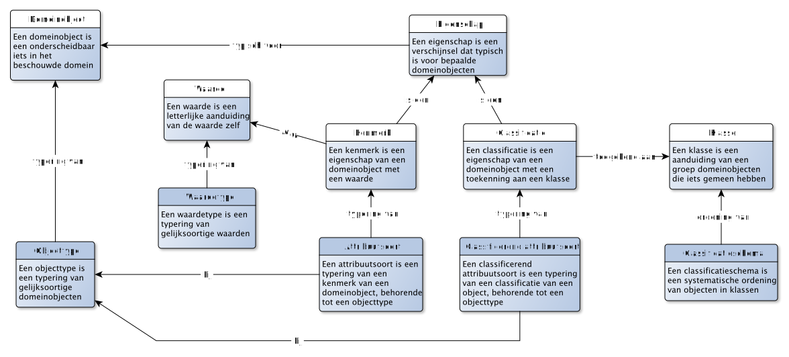

# Typering van domeinobjecten

Nu we de concrete zaken hebben behandeld, kunnen we de stap maken naar de typering. En eigenlijk zijn we daar ook al een beetje mee begonnen. Want eigenschappen en klassen zijn eigenlijk ook al een vorm van typering (zoals we hieronder zullen zien).

## Objecttype en attribuutsoorten

> Een OBJECTTYPE is een typering van gelijksoortige DOMEINOBJECTen

<aside class="note" title="Verdieping">
Een objecttype is een typering van gelijksoortige domeinobjecten. Je zou het daarmee ook kunnen hebben over een "domeinobjecttype". Het heeft echter onze voorkeur om de kortere term "objecttype" te hanteren. <i>Wat</i> je typeert is afhankelijk van je beschouwingsdomein. Zoals in de verdieping hierboven uitgelegd, kun je ook de gegevensverwerking zelf als beschouwingsdomein kiezen, en ook de informatiehuishouding kan jouw beschouwingsdomein zijn. Op dat moment zijn de domeinobjecten die je beschouwt respectievelijk gegevensobjecten en informatieobjecten (!).
</aside>

De oplettende lezer zal zich afvragen wat het verschil is tussen een klasse en een objecttype. En dat is terecht. Want vaak is iets zowel een klasse als een objecttype. Je kunt het bijvoorbeeld hebben over de klasse «Homo Sapiens» als een klasse bij de classificatie van levende wezens. Maar gelijktijdig kun je het hebben over het objecttype «Persoon» als typering van alle objecten van diezelfde klasse. Het gaat hier vooral om het doel waarom we typering. Een klasse wordt gebruikt als onderdeel van een gegeven, terwijl een objecttype juist bedoeld is om een beschrijving te geven in welke objecten we zijn geïnteresseerd.

Van een objecttype beschrijven we welke eigenschappen we relevant vinden om te kunnen weten van objecten die tot een dergelijk objecttype behoren. Door dit te beschrijven, kunnen we vervolgens gegevens over dergelijke objecten verwerken.

> Een ATTRIBUUTSOORT is een typering van een KENMERK van een DOMEINOBJECT, behorende tot een OBJECTTYPE

Waar een eigenschap (en daarmee ook een kenmerk) los kan staan van een domeinobject, geldt voor een attribuutsoort dat deze getypeerd is in de context van een objecttype. Waarden kunnen we daarbij ook typeren. Zo zal een kenmerk «geboortedatum» niet zomaar elke waarde kunnen zijn, maar kunnen we ook deze waarde typeren. Zo zal een geboortedatum van het waardetype «Datum» kunnen zijn.

> Een WAARDETYPE is een typering van gelijksoortige WAARDEn

Gelijk aan een attribuutsoort als typering van een kenmerk met als invulling een waarde, zal een classificerende attribuutsoort als invulling een klasse hebben.

> Een CLASSIFICERENDE ATTRIBUUTSOORT is een ATTRIBUUTSOORT als typering van een CLASSIFICATIE

Een classificatie heeft als invulling een klasse, wat al een vorm van typering betreft. Wel is relevant welke klassen precies bij een classificerende attribuutsoort gebruikt kunnen worden. Dit is het classificatieschema. Dit kan een lijstje zijn van klassen die zijn toegestaan, maar kan bijvoorbeeld ook een hiërarchie van klassen omvatten.

> Een CLASSIFICATIESCHEMA is een systematische ordening van DOMEINOBJECTen in KLASSEn

## Relatiesoorten en rollen

> Een RELATIESOORT is een typering van een relatie tussen twee DOMEINOBJECTen

We kunnen relaties tussen objecten typeren. Echter, als het gaat om gegevens, dan hebben we het over eigenschappen van domeinobjecten. We zagen daarin dat een eigenschap van een domeinobject een rol kan zijn. Dergelijke rollen kun je ook typering:

> Een RELATIESOORTROL is een typering van een ROL van een DOMEINOBJECT in een relatie, getypeerd door een RELATIESOORT en behorende tot een OBJECTTYPE

## Condities

De typering van objecttypen bestaat niet alleen uit het toewijzen van een eigenschap aan een objecttype. Het is ook relevant om te weten onder welke condities zo'n eigenschap geldt voor een domeinobject. En ook of een domeinobject tot een objecttype behoort kunnen we conditioneren.

> Een CONDITIE is een noodzakelijke voorwaarde die moet gelden voor een typering

We onderscheiden verschillende soorten condities, afhankelijk voor welke typering zo'n conditie wordt gebruikt. De meest prominente condities zijn:

- **Cardinaliteit** is een conditie waarbij van een eigenschap wordt aangegeven hoeveel invullingen er voor één domeinobject minimaal en maximaal zijn.
- **Lengte** is een conditie waarbij van een kenmerk of waardetype wordt aangegeven hoe lang de invulling (de waarde) van dat kenmerk of waarden van een waardetype mag/mogen zijn.
- **Datatype** is een conditie waarbij van een kenmerk of waardetype wordt aangegeven wat voor datatype de invulling (de waarde) van dat kenmerk of waarden van een waardetype heeft/hebben. Een datatype is bijvoorbeeld: getal, tekst, datum, etc.
- **Informele conditie** is een conditie die beschreven is in een natuurlijke taal, dwz: in een taal die mensen gebruiken in onderlinge communicatie.
- **Formele conditie** is een conditie die beschreven is in een machine-interpreteerbare taal.

<aside class="note" title="Verdieping">
Wat hierbij opvalt is dat condities die gaan over letterlijke waarden (lengte, waardetype) zowel kunnen gelden als condities voor gegevenstypen (het datatype van een gegevenstype over het kenmerk «geboortedatum» is exact hetzelfde datatype als voor dat kenmerk zelf). Wel kan een dergelijke conditie preciezer worden gemaakt als het gaat om gegevens, soms puur om praktische zin. Zo kan bij een kenmerk "voornaam" een waardetype «voornaamtypering» zijn opgenomen, waarin onder meer is opgenomen dat het gaat om een datatype tekst en dat een voornaam moet bestaan uit letters en geen cijfers mag bevatten. In de gegevensconditie kan daarbij aanvullend nog opgenomen worden dat de lengte maximaal 200 karakters is. Een waardetype kent daarmee een typering die betrekking heeft op het beschouwingsdomein, maar ook een stukje typering die betrekking heeft op verwerkingsdomein.
</aside>

## Wat voorbeelden

De begrippen die we hiermee gedefinieerd hebben, zijn behoorlijk abstract. Aangezien we het hier hebben over typering, was dat ook wel te verwachten. Daarom handig om een aantal voorbeelden te beschrijven: wat kunnen we nu met deze typering? We doen dit aan de hand van het volgende sjabloon:

In het voorbeeld willen we de typering vastleggen uit het concrete voorbeeld hierboven over Jan.

- We beschrijven het objecttype met de naam "Persoon". Het domeinobject met de voornaam Jan typeren we als het objecttype «Persoon».
- Dit objecttype kent dus in ieder geval ook de attribuutsoort «voornaam», die de overeenkomstige eigenschap «voornaam» betreft.
- Hier koppelen we de attribuutsoort met de naam "BSN" aan. Deze attribuutsoort betreft de toegekende identificerende eigenschap «BSN».
- Ook koppelen we hier de attribuutsoort met de naam "geboortedatum". Deze attribuutsoort betreft het kenmerk «geboortedatum».
- Tenslotte koppelen we hier de classificerende attribuutsoort met de naam "geslacht" aan. Deze attribuutsoort betreft de classificatie «geslacht».
- Als relatiesoort onderkennen we de relatiesoort met de naam "werkt bij". Deze relateert het objecttype «Persoon» aan het objecttype «Bedrijf».
- Als relatiesoortrol onderkennen we eentje met de naam "werkgever". Dit is een eigenschap van (domeinobjecten getypeerd als) het objecttype «Persoon» en wordt ingevuld door (domeinobjecten getypeerd als) het objecttype «Bedrijf».
- Andersom is er een relatiesoorrol te onderkennen met de naam "werknemer". Dit is een eigenschap van (domeinobjecten getypeerd als) het objecttype «Bedrijf» en wordt ingevuld door (domeinobjecten getypeerd als) het objecttype «Persoon».

Je kunt bovenstaande ook visueel afbeelden als:

## Classificatie, klassen en (object)subtypen

Wellicht is opgevallen dat «werkgever» een eigenschap is van een persoon (en wordt ingevuld door een bedrijf), waar je mogelijk zou verwachten dat een werkgever juist een *bedrijf* is. Dat laatste is ook zo (een werkgever is een rol die een bedrijf invult), maar dan hebben we het eigenlijk (dus) over iets anders. We hebben het dan niet over een rol of over een eigenschap, maar over een rolvervulling. Zo'n rolvervulling is een typering van domeinobjecten die een bepaalde rol invullen. Eigenlijk is dit ook al zichtbaar in de visualisatie hierboven: "werkgever" staat hier twee keer in het diagram: één keer als eigenschap bij het objecttype «Persoon» en één keer als rolinvulling bij het objecttype «Bedrijf». Dit kan ook expliciet worden getoond:

Iets vergelijkbaars speelt zich af bij geslacht. De invulling van deze classificatie kan met twee klassen: «Man» en «Vrouw». En net zoals je kunt stellen dat een werknemer een persoon is, kun je stellen dat een man een persoon is, en ook een vrouw een persoon is. Het verschil hier is dat er geen sprake is van een relatie(soort), maar van een classificatie: de classificatie naar geslacht. En in dit geval zie je dat je objecttypen kunt vormen uit klassen: de objecttypen «Man» en «Vrouw». Je zou dit ook als volgt kunnen visualiseren:

## Waardetypen vs classificaties en objecttypen

Als we een domein beschouwen, dan zullen daar bepaalde domeinobjecten in voorkomen waar we het "echt" over hebben. Een klantenadministratie zal het "echt" over klanten hebben, en de eigenschappen die we van deze klanten belangrijk vinden, zoals bijvoorbeeld hun naam, adres en ook het land waar deze klant uit afkomstig is. België is daarmee (dus) ook een domeinobject in dit voorbeeld, net als de klant Jerome, afkomstig uit dit land. Het zal vermoedelijk echter niet nodig zijn om een afzonderlijke landenadministratie bij te houden. Dit is simpelweg een "lijstje" dat we eenmalig kunnen inladen.

Dergelijke lijstje lijken bij de gegevensverwerking dan ook sterk op classificaties en waardetypen waarbij een selectie uit een beperkt aantal klassen c.q. waarden gekozen kan worden. Toch is er een belangrijk verschil bij het typeren:

- Een lijst van waarden bestaat uit waarden: de waarden *zelf* betekenen niets meer dan de waarde zelf. Zo kun je het hebben over de lijst van getallen uit de fibonachi reeks kleiner dan 30, dwz: 1, 2, 3, 5, 8, 13 en 21. Dit is een *waardelijst* en we hebben het hier over *kenmerken*
- Een lijst van klassen bestaat uit klassen: de klassen zijn aanduidingen voor een groep objecten die iets gemeen hebben. Zoals de klassen «man» en «vrouw». Je zou hiervoor de codes 1 en 2 kunnen gebruiken, maar daarmee zijn deze codes **geen** waarden, maar nog steeds aanduidingen voor een groep objecten die iets gemeen hebben! Deze lijst hebben we een *classificatieschema* genoemd en we hebben het hier over *classificaties* (en geen kenmerken)
- Een lijst van domeinobjecten bestaat uit domeinobjecten: als we aangeven dat een klant afkomstig is uit een land, dan vervult dit land een rol in de relatie tussen twee domeinobjecten, in het voorbeeld het domeinobject Jerome en het domeinobject België. We kunnen daarbij de landcode 1 gebruiken, maar daarmee is deze code **geen** waarde, maar de invulling van een identificerende eigenschap van het domeinobject België. Deze lijst is de *populatie* behorende bij het domeinobjecttype «Land» en we hebben het hier over *rollen* (en geen kenmerken).

Man en vrouw zijn hier personen, geclassificeerd naar (de classificatie, de eigenschap) geslacht.
