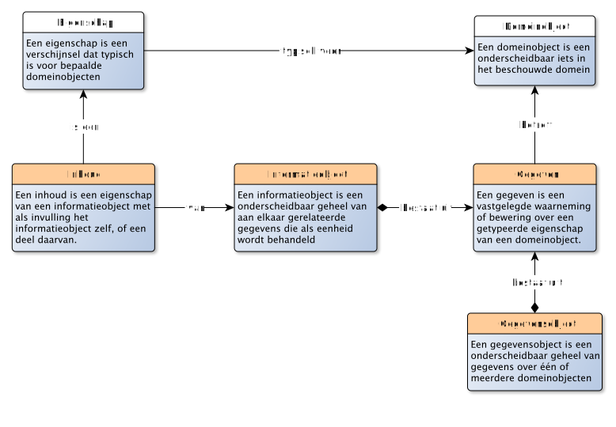
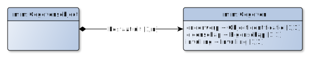

# Gegevens: de concrete zaken uit het verwerkingsdomein

> Een GEGEVEN is een vastgelegde waarneming of bewering over een getypeerde EIGENSCHAP van een DOMEINOBJECT

Eén enkel gegeven is een waarneming of bewering over een getypeerde eigenschap van een domeinobject. En dit gegeven is vastgelegd, op wat voor manier dan ook: van een kleitablet, papieren document tot een electronisch bericht. En van een papieren register (boekhouding, teboekstelling) tot een digitale database. Zo'n gegeven gaat over een eigenschap van een domeinobject, bijvoorbeeld de eigenschap «geboortedatum» van de persoon [Jan] uit ons voorbeeld. Dergelijke gegevens zijn waarneming of beweringen: ze hoeven niet waar te zijn, maar ze zijn in ieder geval *gedaan* door iets (bv een sensor, of een algoritme) of iemand (een daadwerkelijke persoon). Gegevens kunnen vastleggingen zijn van directe waarnemingen (een sensor die iets meet of een persoon die iets ziet), maar ook beweringen zijn op grond van afleidingen en beoordelingen (een algoritme dat een berekening uitvoert of een persoon die iets concludeert op basis van andere gegevens).

Hoewel gegevens gaan over de domeinobjecten , is het niet direct mogelijk om de twee met elkaar te verbinden. Gegevens bestaan, zo gezegd, eigenlijk altijd in een andere werkelijkheid dan domeinobjecten. Denk bijvoorbeeld aan een domeinobject als een persoon, of een voertuig of een weg. Van alle drie kun je gegevens vastleggen. Maar om daarbij de relatie te leggen *waarover* deze gegevens gaan komen zitten we met een probleem. De enige manier om gegevens en domeinobjecten direct aan elkaar te relateren is letterlijk de gegevens op het domeinobject te "plakken", of (net zo letterlijk): het domeinobject te "oormerken" (!). In onze huidige, digitale, samenleving is dit een uitzondering. We hebben "in" de werkelijkheid van de gegevens iets nodig om te kunnen verwijzen naar de betreffende persoon, voertuig of weg. We moeten ze identificeren. Vaak gebruiken we een toegekende identificerende eigenschap om bij een gegeven aan te kunnen geven over welk domeinobject het gaat.

In ons voorbeeld kunnen we bijvoorbeeld het volgende gegeven uitdrukken, door gebruik te maken van de toegekende identificerende eigenschap «BSN»: "De persoon met BSN 12345678 heeft geboortedatum 10 februari 1970". Dit gegeven is een bewering over de eigenschap «geboortedatum» van het domeinobject dat geïdentificeerd kan worden met de toegekende identificerende eigenschap «BSN» met de waarde "12345678", dwz: onze [Jan].

> Een GEGEVENSGROEP is een groepering van GEGEVENs

Een gegevensgroep is simpelweg het groeperen van enkele gegevens die we op een bepaalde manier bij elkaar vinden horen. Dus bijvoorbeeld een lijstje van geboortedata van personen (we groeperen dan op die eigenschap), of enkele gegevens over hetzelfde domeinobject, bijvoorbeeld onze [Jan].

> Een GEGEVENSOBJECT is een geheel van GEGEVENs over één of meerdere DOMEINOBJECTen

Als we een groep van gegevens als een geheel willen beschouwen, dus als een eigen object, een geheel, dan hebben we het over een gegevensobject. Zo'n object kan gegevens omvatten die gaan over precies één domeinobject (het onderwerp van het gegevensobject), maar ook over meerdere domeinobjecten. Als een gegevensobject vooral gaat over één domeinobject, dan noemen we dat domeinobject het *hoofdonderwerp* van het gegevensobject.

Verdieping: Een gegevensobject kun je *zelf* ook weer zien als een domeinobject. Dus het is niet zo maar een geheel van gegevens, het is een geheel van gegevens die onderscheidbaar zijn in een domein. En in dit geval is dit het verwerkingsdomein van gegevens. Meta-gegevens (gegevens *over* gegevens) kunnen zo ook worden uitgedrukt: een (meta)gegeven is daarmee een vastgelegd waarneming of bewering over een getypeerde eigenschap van een gegevensobject.

<aside class="note" title="Verdieping">

Merk op dat als we het hebben over gegevens-over-gegevens, we het over metagegevens hebben. Dergelijke metagegevens bestaan in dit geval *wel* in dezelfde werkelijkheid als de gegevens waarover ze gaan. Het is dan over het algemeen ook veel makkelijker om metagegevens en gegevens bij elkaar te plaatsen. Wel blijft van belang om te blijven erkennen dat het hier om twee verschillende objecten gaat. Onderstaand voorbeeld geeft dit weer:

<pre>
Een gegeven: "De persoon met BSN 12345678 heeft geboortedatum 10 februari 1970"
Een metagegeven: "Het gegeven: 'De persoon met BSN 12345678 heeft geboortedatum 10 februari 1970' bevat een foutieve waarde voor de eigenschap BSN"
</pre>

Het gegeven <i>gaat over</i> een persoon, het metagegeven <i>gaat over</i> een gegeven.

</aside>

## Gebruik van identificerende eigenschappen voor verwijzingen

Een eigenschap kan een kenmerk, rol of classificatie zijn. Een gegeven kan daarmee dus gaan over zowel kenmerken, rollen en classificaties. Daarbij is duidelijk dat als je het over een eigenschap van een domeinobject hebt, je dit domeinobject zelf moet identificeren. Hiervoor hebben we de identificerende eigenschappen van een domeinobject gebruikt.

Een gegeven dat gaat over een kenmerk, kunnen we direct de waarde van dat kenmerk zelf gebruiken, zoals in het gegeven uit bovenstaand voorbeeld: "10 februari 1970" was de waarde van het kenmerk waarover dit gegeven gaat. De waarde zelf kan letterlijk gebruikt worden in het gegeven, er is geen verschil tussen de manier waarop aan de waarde *refereren* en wat de waarde *betekent*. Dit gaat niet op voor rollen en classificaties.

Bij een rol is de invulling van de rol geen waarde, maar een (ander) domeinobject. Ook daar zullen we (dus) weer gebruik moeten maken van de identificerende eigenschappen van dit domeinobject, zoals in het gegeven: "De persoon met BSN 12345678 is werknemer van het bedrijf met RSIN 87654321". Met dit gegeven wordt overigens hetzelfde bedoeld als met het gegeven "De persoon met de naam Jan is werknemer van het bedrijf met de naam Bakkerij Broodjes". Laatstgenoemde vorm is echter niet zo precies, aangezien het maar de vraag is of de eigenschap «naam» voldoende identificerend is.

Daarnaast zie je bij relaties en rollen dat je hetzelfde gegeven in drie verschillende vormen kunt uitdrukken, met elk dezelfde betekenis:

<pre>
1. "De persoon met BSN 12345678 is werknemer van het bedrijf met RSIN 87654321"
2. "De persoon met BSN 12345678 heeft werkgever het bedrijf met RSIN 87654321"
3. "Het bedrijf met RSIN 87654321 heeft werknemer de persoon met BSN 12345678"
</pre>

Bij een classificatie is de invulling van een classificatie geen waarde, maar een klasse. We kunnen de letterlijke aanduiding van die klasse niet gebruiken in het gegeven, we zullen moeten verwijzen door gebruik te maken van een identificerende eigenschap van die klasse.

## Informatieobjecten: de duurzame vastlegging van gegevens

> Een INFORMATIEOBJECT is een object als verzameling van aan elkaar gerelateerde GEGEVENs die als eenheid wordt behandeld

Deze definitie van informatieobject is afkomstig uit de [MTDO, Metagegevens voor duurzaam toegankelijke overheidsinformatie](https://www.nationaalarchief.nl/archiveren/mdto). Waar het bij gegevensobjecten gaat over de verwerking, gaat het bij informatieobjecten over het (leveren van) informatie. Oorspronkelijk ging het daarbij om documenten (bestaande uit ongestructureerde gegevens). Vanuit de context van gegevenstypering, is een informatieobject feitelijk een verzameling van gegevens (en dus ook een verzameling van gegevensobjecten), waarbij het verschil is dat een informatieobject duurzaam toegankelijk is. Akten, huwelijkscontracten, een verslag van een vergadering of een rapportage zijn voorbeelden van informatieobjecten.

Een gegevensobject zou daarmee gelijktijdig *ook* een informatieobject kunnen zijn. Vaak bestaat een informatieobject echter uit meerdere gegevensobjecten, die gezamenlijk als één geheel worden behandeld.

Omdat een informatieobject als eenheid wordt behandeld, wordt van een informatieobject ook altijd gegevens bijgehouden: de metagegevens. Daarmee is een informatieobject *in het beschouwingsdomein van de informatiehuishouding* dus een domeinobject (!). Een informatieobject heeft bijvoorbeeld eigenschappen als auteur, versienummer, versiedatum, rubricering, etc. De metagagevens van zo'n informatieobject zijn daarmee gegevensobjecten die *gaan over* een informatieobject.

Om het informatieobject (als domeinobject dat we beschouwen) te onderscheiden van de inhoud die "in" het informatieobject, zien we dit als twee afzonderlijke objecten: het informatieobject waarover we gegevens willen vastleggen, en de inhoud daarvan, de gegevens "in" het informatieobject:

> Een INHOUD is een een eigenschap van een informatieobject met als invulling het informatieobject zelf, of een deel daarvan.

Een informatieobject kan ook een video zijn, of een tekstbestand. Een eigenschap van zo'n informatieobject is dan zijn «inhoud». Net als bij waarden, kijk je daarbij eigenlijk naar het informatieobject *zelf*, in plaats van dat de eigenschap over iets anders gaat. Een informatieobject kan daarbij bestaan uit andere informatieobjecten. Bijvoorbeeld een dossier dat bestaat uit afzonderlijke dossierstukken.

<aside class="note" title="Verdieping">
De <a href="https://www.w3.org/TR/webarch/#id-resources">Architecture of the World Wide Web, volume one]</a> kent eenzelfde gedachte met betrekking tot informatieobjecten. In dit document, wordt gesproken over <i>information resources</i>, met als definitie: "a resource for which all its essential characteristics can be conveyed in a message". Voorbeelden die worden gegeven zijn: een webpagina, een plaatje, een document.  Het idee van het WWW is dat je dergelijke resources kunt identificeren met een URI, die daarmee ook de locatie beschrijft waar je een dergelijke resource kunt vinden (via het http protocol). Daarbij wordt aangegeven dat er ook resources ("objecten") zijn die je kunt identificeren met een URI, die juist geen information resources zijn: een auto, een hond en ook een fysiek stukje papier dat je daadwerkelijk in je hand hebt.
</aside>

## Wat voorbeelden

Nu we de begrippen rondom gegevens helder hebben, kunnen we een aantal voorbeelden van gegevens geven. We gebruiken hiervoor het volgende "sjabloon":

Merk op dat met dit sjabloon geen technische structuur wordt beoogd: het gaat om de logische representatie van een gegeven, waar verscheidende technische realisaties voor mogelijk zijn.

We kunnen het zo over de volgende gegevens hebben:
- Er is een domeinobject met de voornaam "Jan" (de invulling voor de eigenschap «voornaam» van dit domeinobject is de waarde "Jan");
- Dit domeinobject heeft BSN 12345678 (de invulling voor de toegekende identificerende eigenschap «BSN» van dit domeinobject is de waarde "12345678");
- Dit domeinobject heeft als geboortedatum 25 mei 1970 (de invulling voor de eigenschap «geboortedatum» van dit domeinobject is de waarde "25 mei 1970");
- Jan is een man (de invulling voor de classificatie-eigenschap «geslacht» is de klasse «mannelijk»);
- Jan is de werknemer van een domeinobject met de naam "Bakkerij Broodjes" (de invulling voor de rol werkgever van [Jan] is [Bakkerij Broodjes]).
- Jan is getrouwd met Marie (de invulling van de rol partner van [Jan] is [Marie]).

Deze zes uitspraken zijn zes gegevens die gegroepeerd kunnen worden tot één gegevensobject met als hoofdonderwerp het domeinobject met het BSN 12345678.

## Rol, rolinvulling en relatie-domeinobject

In onze kijk op het domein hebben we het slechts over objecten en eigenschappen van objecten gehad. En hoewel we relaties hebben besproken, komt relatie niet terug in ons voorbeeld. Alleen de rol komt terug.

Dit heeft alles te maken met hoe we tegen het domein aankijken: blijkbaar is de relatie niet "bijzonder" genoeg om deze daadwerkelijk te identificeren. Dat was in ons voorbeeld het geval. Maar dat hoeft niet: dit hangt sterk af van hoe we tegen het domein aan willen kijken.

Als we de relatie *zelf* willen onderkennen, dan kunnen we de relatie simpelweg als een domeinobject beschouwen.

Zo kunnen we het bijvoorbeeld over de huwelijksrelatie tussen Jan en Marie hebben. Zo'n huwelijksrelatie betreft dan een (relatie)domeinobject. Het relatiedomeinobject heeft dan zelf eigenschappen, zoals de huwelijksdatum, de gehuwden en getuigen. En we zullen zo'n relatiedomeinobject moeten kunnen identificeren. In dit geval zou de combinatie van de identificerende eigenschappen van de huwelijkspartners en de huwelijksdatum daarvoor bruikbaar zijn. Het is echter ook denkbaar dat in het betreffende domein een afzonderlijk huwelijkskenmerk bestaat, bv het nummer van de huwelijksakte.

Relaties hebben vaak te maken met gebeurtenissen waaruit de relatie ontstaan. In bovenstaand voorbeeld stond de gebeurtenis centraal. Maar ook het resultaat van de gebeurtenis kan gezien worden als domeinobject. In zo'n geval zou huwelijk mogelijk een eigenschap hebben als huwelijkse voorwaarden.

Bij het betalen van een rekening is zo sprake van de gebeurtenis van betalen, het resultaat van de betaling en de rollen betaler en ontvanger. Het is aan de modelleur om aan te geven welke onderdelen hij hiervan als domeinobjecten en eigenschappen wenst te zien in het beschouwingsdomein.

En ook de rol(invulling) zelf kunnen we zien als een domeinobject. Zo is een eigenschap van een betaling de rol «betaler». Als we naar de invulling van die rol kijken, dan wordt die ingevuld door een domeinobject dat we de «Betaler» kunnen noemen. Met andere woorden:

> Als Bakkerij Broodjes het loon van Jan overmaakt (4700 euro), dan:
> - Is er sprake van een betaling;
> - Een eigenschap van die betaling is het «bedrag»;
> - De invulling van deze eigenschap voor deze betaling is 4700 euro;
> - Een eigenschap van die betaling is de «betaler»;
> - De invulling van deze eigenschap voor deze betaling is Bakkerij Broodjes
> - Bakkerij Broodjes is in deze betaling de betaler.
