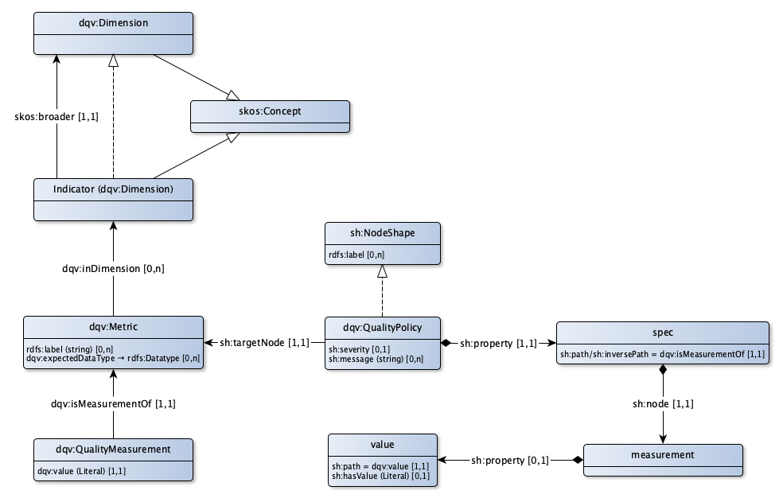

# DQV Toepassingsprofiel voor datakwaliteit

Datakwaliteit

## Kwaliteitsdimensie

|!form data!Klasse|Kwaliteitsdimensie
|----------|------
|Gebruikte term|[dqv:Dimension](http://www.w3.org/ns/dqv#Dimension)

## Kwaliteitsindicator

|!form data!Klasse|Kwaliteitsindicator
|----------|------
|Eigenschappen en relaties|[http://bp4mc2.org/profiles/dqv-ap-sc#QualityIndicator_broader](http://bp4mc2.org/profiles/dqv-ap-sc#QualityIndicator_broader)

## Meting

|!form data!Klasse|Meetfunctie
|----------|------
|Gebruikte term|[dqv:Metric](http://www.w3.org/ns/dqv#Metric)
|Eigenschappen en relaties|[http://bp4mc2.org/profiles/dqv-ap-sc#Metric_inDimension](http://bp4mc2.org/profiles/dqv-ap-sc#Metric_inDimension), [http://bp4mc2.org/profiles/dqv-ap-sc#Metric_label](http://bp4mc2.org/profiles/dqv-ap-sc#Metric_label), [http://bp4mc2.org/profiles/dqv-ap-sc#Metric_expectedDataType](http://bp4mc2.org/profiles/dqv-ap-sc#Metric_expectedDataType)

### Eigenschappen

### Relaties

|!form data!Eigenschap|Waarde
|----------|------
|Gebruikte term|[dqv:expectedDataType](http://www.w3.org/ns/dqv#expectedDataType)

|!form data!Eigenschap|Waarde
|----------|------
|Gebruikte term|[dqv:inDimension](http://www.w3.org/ns/dqv#inDimension)
|Relatie met|[Kwaliteitsindicator](http://bp4mc2.org/profiles/dqv-ap-sc#QualityIndicator)

|!form data!Eigenschap|Waarde
|----------|------
|Gebruikte term|[rdfs:label](http://www.w3.org/2000/01/rdf-schema#label)

## Kwaliteitsmeetwaarde

|!form data!Klasse|Waarde
|----------|------
|Gebruikte term|[dqv:QualityMeasurement](http://www.w3.org/ns/dqv#QualityMeasurement)
|Eigenschappen en relaties|[http://bp4mc2.org/profiles/dqv-ap-sc#QualityMeasurement_isMeasurementOf](http://bp4mc2.org/profiles/dqv-ap-sc#QualityMeasurement_isMeasurementOf), [http://bp4mc2.org/profiles/dqv-ap-sc#QualityMeasurement_value](http://bp4mc2.org/profiles/dqv-ap-sc#QualityMeasurement_value)

### Eigenschappen

### Relaties

|!form data!Eigenschap|Waarde
|----------|------
|nodeKind|[http://www.w3.org/ns/shacl#BlankNode](http://www.w3.org/ns/shacl#BlankNode)
|Gebruikte term|[sh:property](http://www.w3.org/ns/shacl#property)
|Relatie met|[http://bp4mc2.org/profiles/dqv-ap-sc#QualityPolicySpec](http://bp4mc2.org/profiles/dqv-ap-sc#QualityPolicySpec)
|Min card.|1
|Max card.|1

|!form data!Eigenschap|Waarde
|----------|------
|Max card.|1

|!form data!Eigenschap|Waarde
|----------|------
|Verwijst naar|[dqv:Metric](http://www.w3.org/ns/dqv#Metric)
|Min card.|1
|Max card.|1

### Relaties

|!form data!Eigenschap|Waarde
|----------|------
|Gebruikte term|[dqv:isMeasurementOf](http://www.w3.org/ns/dqv#isMeasurementOf)
|Verwijst naar|[dqv:Metric](http://www.w3.org/ns/dqv#Metric)
|Min card.|1
|Max card.|1

|!form data!Eigenschap|Waarde
|----------|------
|Gebruikte term|[dqv:value](http://www.w3.org/ns/dqv#value)
|Min card.|1
|Max card.|1

## Kwaliteitseis

|!form data!Klasse|Kwaliteitseis
|----------|------
|Eigenschappen en relaties|[http://bp4mc2.org/profiles/dqv-ap-sc#QualityPolicy_targetNode](http://bp4mc2.org/profiles/dqv-ap-sc#QualityPolicy_targetNode), [http://bp4mc2.org/profiles/dqv-ap-sc#QualityPolicy_severity](http://bp4mc2.org/profiles/dqv-ap-sc#QualityPolicy_severity), [http://bp4mc2.org/profiles/dqv-ap-sc#QualityPolicy_message](http://bp4mc2.org/profiles/dqv-ap-sc#QualityPolicy_message), [http://bp4mc2.org/profiles/dqv-ap-sc#QualityPolicy_property](http://bp4mc2.org/profiles/dqv-ap-sc#QualityPolicy_property)

### Eigenschappen

|!form data!Eigenschap|Waarde
|----------|------
|Datatype|[Tekst](http://www.w3.org/2001/XMLSchema#string)

