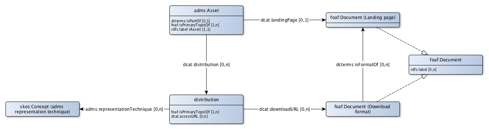

# ADMS Application profile for asset descriptions

ADMS is the W3C standard for describing 'semantic assets' that are used at eGovernment. In a system catalog it is specifically about reusable metadata on
* taxonomies or dictionaries that contain the concept scheme that contains the 'topics of interest' of a dataset (general).
* reference data and controlled vocabularies from a dataset (general) that can be reused in other domains.
* data models of a dataset (version) or of a dataset (product).

Every metadata description, in ADMS an asset, can have its own webpage.

A metadata description can be published in various ways, for example as a pdf download, as a ttl description or as a html description. For controlled vocabularies also csv and xml / gc (genericode) are common. For data models XMI is common as an exchange format for UML representations. Every format in which a metadata description (adms: Asset) is published can be explicitly described as distirbution (adms: Distribution).

Provenance can be tracked of metadata descriptions and distributions.
* For concept schemes and for reference data or controlled vocabularies, that are usually managed in a of 'continious delivery' process. This means that the metadata description is published once. The provenance is then managed at the level of a concept or reference entity.
* In addition, controlled vocabularies can periodically releases. Each release then becomes a new version of the metadata description.
* Data models are always published or released in full at once. Each release receives a new version of the metadata description.

## Asset

|!form data!Klasse|Asset
|----------|------
|Description|An asset is a set of reusable metadata and reference data  that are used for eGovernment system development.
|Properties en relations|[has distribution](http://bp4mc2.org/profiles/adms-ap-sc#Asset_distribution), [label](http://bp4mc2.org/profiles/adms-ap-sc#Asset_label), [has landing page](http://bp4mc2.org/profiles/adms-ap-sc#Asset_landingPage), [part of](http://bp4mc2.org/profiles/adms-ap-sc#Asset_partOf), [provenance (asset)](http://bp4mc2.org/profiles/adms-ap-sc#Asset_provenance)

### Properties

### Relations

|!form data!Eigenschap|has distribution
|----------|------
|Property|[dcat:distribution](http://www.w3.org/ns/dcat#distribution)
|Related with|[distribution](http://bp4mc2.org/profiles/adms-ap-sc#AssetDistribution)
|Description|The way in which an asset is published can be indicated.

|!form data!Eigenschap|label
|----------|------
|Property|[rdfs:label](http://www.w3.org/2000/01/rdf-schema#label)
|Description|An asset has a label.
|Example|Landenlijst
|Min card.|1
|Max card.|1

|!form data!Eigenschap|has landing page
|----------|------
|Property|[dcat:landingPage](http://www.w3.org/ns/dcat#landingPage)
|Related with|[landing page](http://bp4mc2.org/profiles/adms-ap-sc#LandingPage)
|Description|The landing page on the web on which an asset can be found can be specified.
|Max card.|1

|!form data!Eigenschap|part of
|----------|------
|Property|[dcterms:isPartOf](http://purl.org/dc/terms/isPartOf)
|Related with|[http://bp4mc2.org/profiles/adms-ap-sc#Dataset](http://bp4mc2.org/profiles/adms-ap-sc#Dataset)
|Description|An asset can be part of a dataset.
|Max card.|1

|!form data!Eigenschap|provenance (asset)
|----------|------
|Property|[foaf:isPrimaryTopicOf](http://xmlns.com/foaf/0.1/isPrimaryTopicOf)
|Refers to|[http://www.w3.org/ns/prov#Entity](http://www.w3.org/ns/prov#Entity)
|Description|Provenance of a asset can be described.
|Example|Op basis van de nieuwe wet op de BAG is een een nieuw informatiemodel opgesteld
|Min card.|1

## Asset distribution

|!form data!Klasse|distribution
|----------|------
|Used term|[distribution](http://www.w3.org/ns/adms#Distribution)
|Description|The way in which an asset is published.
|Properties en relations|[access url](http://bp4mc2.org/profiles/adms-ap-sc#AssetDistribution_accessURL), [download url](http://bp4mc2.org/profiles/adms-ap-sc#AssetDistribution_downloadURL), [provenance (asset distribution)](http://bp4mc2.org/profiles/adms-ap-sc#AssetDistribution_provenance), [representation format](http://bp4mc2.org/profiles/adms-ap-sc#AssetDistribution_representationTechnique)

### Properties

### Relations

|!form data!Eigenschap|has distribution
|----------|------
|Property|[dcat:distribution](http://www.w3.org/ns/dcat#distribution)
|Related with|[distribution](http://bp4mc2.org/profiles/adms-ap-sc#AssetDistribution)
|Description|The way in which an asset is published can be indicated.

|!form data!Eigenschap|label
|----------|------
|Property|[rdfs:label](http://www.w3.org/2000/01/rdf-schema#label)
|Description|An asset has a label.
|Example|Landenlijst
|Min card.|1
|Max card.|1

|!form data!Eigenschap|has landing page
|----------|------
|Property|[dcat:landingPage](http://www.w3.org/ns/dcat#landingPage)
|Related with|[landing page](http://bp4mc2.org/profiles/adms-ap-sc#LandingPage)
|Description|The landing page on the web on which an asset can be found can be specified.
|Max card.|1

|!form data!Eigenschap|part of
|----------|------
|Property|[dcterms:isPartOf](http://purl.org/dc/terms/isPartOf)
|Related with|[http://bp4mc2.org/profiles/adms-ap-sc#Dataset](http://bp4mc2.org/profiles/adms-ap-sc#Dataset)
|Description|An asset can be part of a dataset.
|Max card.|1

|!form data!Eigenschap|provenance (asset)
|----------|------
|Property|[foaf:isPrimaryTopicOf](http://xmlns.com/foaf/0.1/isPrimaryTopicOf)
|Refers to|[http://www.w3.org/ns/prov#Entity](http://www.w3.org/ns/prov#Entity)
|Description|Provenance of a asset can be described.
|Example|Op basis van de nieuwe wet op de BAG is een een nieuw informatiemodel opgesteld
|Min card.|1

## Landing page

### Properties

### Relations

|!form data!Eigenschap|has distribution
|----------|------
|Property|[dcat:distribution](http://www.w3.org/ns/dcat#distribution)
|Related with|[distribution](http://bp4mc2.org/profiles/adms-ap-sc#AssetDistribution)
|Description|The way in which an asset is published can be indicated.

|!form data!Eigenschap|label
|----------|------
|Property|[rdfs:label](http://www.w3.org/2000/01/rdf-schema#label)
|Description|An asset has a label.
|Example|Landenlijst
|Min card.|1
|Max card.|1

|!form data!Eigenschap|has landing page
|----------|------
|Property|[dcat:landingPage](http://www.w3.org/ns/dcat#landingPage)
|Related with|[landing page](http://bp4mc2.org/profiles/adms-ap-sc#LandingPage)
|Description|The landing page on the web on which an asset can be found can be specified.
|Max card.|1

|!form data!Eigenschap|part of
|----------|------
|Property|[dcterms:isPartOf](http://purl.org/dc/terms/isPartOf)
|Related with|[http://bp4mc2.org/profiles/adms-ap-sc#Dataset](http://bp4mc2.org/profiles/adms-ap-sc#Dataset)
|Description|An asset can be part of a dataset.
|Max card.|1

|!form data!Eigenschap|provenance (asset)
|----------|------
|Property|[foaf:isPrimaryTopicOf](http://xmlns.com/foaf/0.1/isPrimaryTopicOf)
|Refers to|[http://www.w3.org/ns/prov#Entity](http://www.w3.org/ns/prov#Entity)
|Description|Provenance of a asset can be described.
|Example|Op basis van de nieuwe wet op de BAG is een een nieuw informatiemodel opgesteld
|Min card.|1

## Download format

### Properties

### Relations

|!form data!Eigenschap|has distribution
|----------|------
|Property|[dcat:distribution](http://www.w3.org/ns/dcat#distribution)
|Related with|[distribution](http://bp4mc2.org/profiles/adms-ap-sc#AssetDistribution)
|Description|The way in which an asset is published can be indicated.

|!form data!Eigenschap|label
|----------|------
|Property|[rdfs:label](http://www.w3.org/2000/01/rdf-schema#label)
|Description|An asset has a label.
|Example|Landenlijst
|Min card.|1
|Max card.|1

|!form data!Eigenschap|has landing page
|----------|------
|Property|[dcat:landingPage](http://www.w3.org/ns/dcat#landingPage)
|Related with|[landing page](http://bp4mc2.org/profiles/adms-ap-sc#LandingPage)
|Description|The landing page on the web on which an asset can be found can be specified.
|Max card.|1

|!form data!Eigenschap|part of
|----------|------
|Property|[dcterms:isPartOf](http://purl.org/dc/terms/isPartOf)
|Related with|[http://bp4mc2.org/profiles/adms-ap-sc#Dataset](http://bp4mc2.org/profiles/adms-ap-sc#Dataset)
|Description|An asset can be part of a dataset.
|Max card.|1

|!form data!Eigenschap|provenance (asset)
|----------|------
|Property|[foaf:isPrimaryTopicOf](http://xmlns.com/foaf/0.1/isPrimaryTopicOf)
|Refers to|[http://www.w3.org/ns/prov#Entity](http://www.w3.org/ns/prov#Entity)
|Description|Provenance of a asset can be described.
|Example|Op basis van de nieuwe wet op de BAG is een een nieuw informatiemodel opgesteld
|Min card.|1

## Uri strategy

Assets en asset distributions get a uri according to the pattern:

* `http://{domain}/id/{asset-type}/{UpperCamelCase(rdfs:label)}` for assets
* `http://{domain}/id/{asset-type}/{UpperCamelCase(rdfs:label)}.{extension}` for asset distributions

Depending on the type of asset, `{asset-type}` is one of the following values:
* `codelist` voor waardelijsten;
* `scheme` voor begrippenkaders;
* `model` voor informatiemodellen.

And for `{extension}` the regular extensions for file types are used:
* `ttl` for turtle files;
* `pdf` for pdf files;
* `xml` for xml files.

