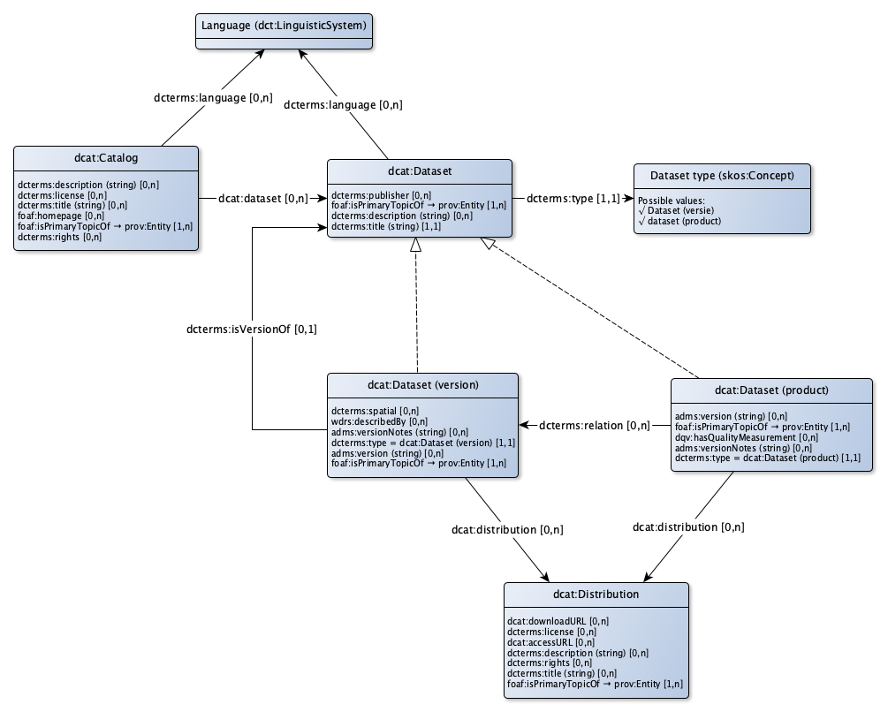

# DCAT Application profile for dataset descriptions

For data on the web it is good practice to describe the data in a catalog using DCAT (Data Catalog). DCAT is the W3C standard  to describe data sets and is prescribed by the EU (ISA) for reasons of interoperability. In the Netherlands DCAT is used to describe the open datasets in [data.overheid.nl](https://www.data.overheid.nl). The [national georegister[(https://www.nationaalgeoregister.nl), where all open geo datasets are described, offers a DCAT export. The application profile DCAT-AP-NL was created for data.overheid.nl. It describes which elements from DCAT are used and how these elements are applied. Geo-DCAT-AP for the geo-world is drawn up by the EU (ISA). For the catalog, the application profile for DCAT must comply with existing application profiles for DCAT, in particular DCAT-AP-NL and geoDCAT-AP.

* The [Dutch Application Profile](https://data.overheid.nl/sites/default/files/2014-11-13 DCAT-NL IPM Datasets 0.6 kopie.pdf) for DCAT (DCAT-AP-NL).
** is based on the DCAT [Application Profile](https://joinup.ec.europa.eu/asset/dcat_application_profile/description) for data portals in Europe.
** gives guidelines for the translation of metadata in accordance with the Dutch metadata profile on ISO 19115 Geography, 1.3.1 (ISO19115)
** is specified in an IPM
* [geoDCAT-AP](https://joinup.ec.europa.eu/node/154143/)
** is a profile for data portals in Europe for describing geo datasets, datasets series and services.
** offers an RDF syntax for the all metadata elements of the core profile of ISO 19115: 2003 and those defined in the framework of the [INSPIRE directive](http://eur-lex.europa.eu/LexUriServ /LexUriServ.do?Uri=PB:L:2007:108:0001:0014:nl:PDF) The term Information Publication Model (IPM) is often used. An IPM for datasets provides a standard for the online exchange of metadata between Dutch data and catalogs, including: data.overheid.nl, National Geo Register (NGR) and for example the (open) data catalog of municipalities and provinces.

A system catalog can be set up as Metadata Broker. A Metadata Broker collects meta data from different catalogs and unlocks this collection in a separate catalog. The Broker Metadata Catalog contains descriptions of the other catalogs and their catalog records. For example, datasets are described in several catalogs. This means that these data sets can be described from the same source in different contexts, for example as statistical data and as geographical data.

A dataset is actually everything you call a dataset. A dataset is not defined sharply by the W3C. This is intentionally not done to enable the concept dataset to be widely usable. This enables describing coherent sets of information at different levels as a dataset. We stand for an approach in which the metadata describe each dataset at the source and metadata brokers link to the source. Each dataset is described in 1 catalog. That is the authentic source of that metadata.

* A dataset (general) is the general (versionless) dataset that can be linked once to the catalog. This is done through a link to the publication of the administrator of the original dataset in the dcat repository. The description is about all versions that have ever been or will ever be.
* A dataset (version) is a version of a dataset that contains concrete information.
** Dataset versions are published and documented in the dcat repository by the administrator of the original dataset. Because there is already a link from the system catalog to the Abstract dataset and because a Concrete dataset is linked to the Abstract dataset, this information is immediately available in the system catalog.
** A registration whith many changes every day differs from a traditional dataset of which periodically, for example a new version is distributed monthly. That would yield a new version after each mutation. For descriptions of an authentic registration, a new version of the data model is therefore considered as a new version of the dataset.
* A 'dataset product' is a description of a subset of a dataset that is available as an data product (for example an API or a SOAP service). Such a subset with concrete data is always a subset of a concrete dataset version.
* A distribution describes a physical distribution form of a dataset. This is always an data product. For example, the distribution contains the reference to a download or an API.

## Dataset (general)

|Eigenschap|Waarde
|----------|------
|Class|[dcat:Dataset](http://www.w3.org/ns/dcat#Dataset)
|Description|A dataset is a description of a collection of data, published or curated by a single agent.
|Properties en relations|[description](http://bp4mc2.org/profiles/dcat-ap-sc#Dataset_description), [title](http://bp4mc2.org/profiles/dcat-ap-sc#Dataset_label), [language](http://bp4mc2.org/profiles/dcat-ap-sc#Dataset_language), [provenance](http://bp4mc2.org/profiles/dcat-ap-sc#Dataset_provenance), [publisher](http://bp4mc2.org/profiles/dcat-ap-sc#Dataset_publisher), [type dataset](http://bp4mc2.org/profiles/dcat-ap-sc#Dataset_type)

### Properties

|Eigenschap|Waarde
|----------|------
|Naam|description
|Property|[dcterms:description](http://purl.org/dc/terms/description)
|Datatype|[Text](http://www.w3.org/2001/XMLSchema#string)
|Description|The dataset can have a clear description.

|Eigenschap|Waarde
|----------|------
|Naam|title
|Property|[dcterms:title](http://purl.org/dc/terms/title)
|Datatype|[Text](http://www.w3.org/2001/XMLSchema#string)
|Description|A dataset has a label.
|Min card.|1
|Max card.|1

### Relations

|Eigenschap|Waarde
|----------|------
|Label|language
|Property|[dcterms:language](http://purl.org/dc/terms/language)
|Related with|[Language](http://bp4mc2.org/profiles/dcat-ap-sc#Language)
|Description|The language in which the dataset is described (because of the compatibility with the DCAT-AP NL) can be recorded.

|Eigenschap|Waarde
|----------|------
|Label|provenance
|Property|[foaf:isPrimaryTopicOf](http://xmlns.com/foaf/0.1/isPrimaryTopicOf)
|Refers to|[prov:Entity](http://www.w3.org/ns/prov#Entity)
|Description|Provenance of a dataset can be described.
|Example|De BAG is op xx/xx/xx gelanceerd
|Min card.|1

|Eigenschap|Waarde
|----------|------
|Label|publisher
|Property|[dcterms:publisher](http://purl.org/dc/terms/publisher)
|Refers to|[http://xmlns.com/foaf/0.1/Agent](http://xmlns.com/foaf/0.1/Agent)
|Description|The person who publishes a dataset can be recorded. This organization or person has permission to perform this action.

|Eigenschap|Waarde
|----------|------
|Label|type dataset
|Property|[dcterms:type](http://purl.org/dc/terms/type)
|Related with|[Dataset type](http://bp4mc2.org/profiles/dcat-ap-sc#DatasetType)
|Min card.|1
|Max card.|1

## Dataset (version)

|Eigenschap|Waarde
|----------|------
|inScheme|[Dataset types](http://bp4mc2.org/profiles/dcat-ap-sc#DatasetTypes)
|Description|A dataset (general) is a concrete, versioned description of a collection of data, published or curated by a single agent.
|Properties en relations|[described by](http://bp4mc2.org/profiles/dcat-ap-sc#DatasetVersion_describedBy), [distribution (dataset version)](http://bp4mc2.org/profiles/dcat-ap-sc#DatasetVersion_distribution), [geographical demarcation](http://bp4mc2.org/profiles/dcat-ap-sc#DatasetVersion_geometricDemarcation), [provenance (dataset version)](http://bp4mc2.org/profiles/dcat-ap-sc#DatasetVersion_provenance), [type dataset = DatasetVersion](http://bp4mc2.org/profiles/dcat-ap-sc#DatasetVersion_type), [version (dataset version)](http://bp4mc2.org/profiles/dcat-ap-sc#DatasetVersion_version), [version notes (dataset version)](http://bp4mc2.org/profiles/dcat-ap-sc#DatasetVersion_versionNotes), [version of](http://bp4mc2.org/profiles/dcat-ap-sc#DatasetVersion_versionOf)

### Properties

|Eigenschap|Waarde
|----------|------
|Naam|version (dataset version)
|Property|[adms:version](http://www.w3.org/ns/adms#version)
|Datatype|[Text](http://www.w3.org/2001/XMLSchema#string)
|Description|A dataset (version) can have a version indication.

|Eigenschap|Waarde
|----------|------
|Naam|version notes (dataset version)
|Property|[adms:versionNotes](http://www.w3.org/ns/adms#versionNotes)
|Datatype|[Text](http://www.w3.org/2001/XMLSchema#string)
|Description|A dataset (version) can contain release notes.

### Relations

|Eigenschap|Waarde
|----------|------
|Label|described by
|Property|[wdrs:describedBy](http://www.w3.org/2007/05/powder-s#describedBy)
|Description|The data in a dataset (version) is decribed by a data model.
|Example|kadaster.nl/schemas/imkad

|Eigenschap|Waarde
|----------|------
|Label|distribution (dataset version)
|Property|[dcat:distribution](http://www.w3.org/ns/dcat#distribution)
|Refers to|[dcat:Distribution](http://www.w3.org/ns/dcat#Distribution)
|Description|The channels through which a dataset (version) can be distributed can be recorded.

|Eigenschap|Waarde
|----------|------
|Label|geographical demarcation
|Property|[dcterms:spatial](http://purl.org/dc/terms/spatial)
|Refers to|[http://purl.org/dc/terms/Location](http://purl.org/dc/terms/Location)
|Description|The area the dataset is about can be recorded.

|Eigenschap|Waarde
|----------|------
|Label|provenance (dataset version)
|Property|[foaf:isPrimaryTopicOf](http://xmlns.com/foaf/0.1/isPrimaryTopicOf)
|Refers to|[prov:Entity](http://www.w3.org/ns/prov#Entity)
|Description|Provenance of a dataset (version) can be described.
|Example|De BAG 2.0 is op xx/xx/xx gelanceerd
|Min card.|1

|Eigenschap|Waarde
|----------|------
|Label|type dataset = DatasetVersion
|Property|[dcterms:type](http://purl.org/dc/terms/type)
|Value|[Dataset (version)](http://bp4mc2.org/profiles/dcat-ap-sc#DatasetVersion)
|Description|In case of a dataset version, the dataset is typed accordingly
|Min card.|1
|Max card.|1

|Eigenschap|Waarde
|----------|------
|Label|version of
|Property|[dcterms:isVersionOf](http://purl.org/dc/terms/isVersionOf)
|Related with|[Dataset](http://bp4mc2.org/profiles/dcat-ap-sc#Dataset)
|Description|A dataset (version) can be derived from a dataset (general).
|Max card.|1

## Dataset (product)

|Eigenschap|Waarde
|----------|------
|inScheme|[Dataset types](http://bp4mc2.org/profiles/dcat-ap-sc#DatasetTypes)
|Description|A dataset (product) is a concrete, versioned information product based on the data in a dataset (version).
|Properties en relations|[distribution (product)](http://bp4mc2.org/profiles/dcat-ap-sc#DatasetProduct_distribution), [derived from](http://bp4mc2.org/profiles/dcat-ap-sc#DatasetProduct_isDerivedFrom), [provenance (product)](http://bp4mc2.org/profiles/dcat-ap-sc#DatasetProduct_provenance), [has quality measurement](http://bp4mc2.org/profiles/dcat-ap-sc#DatasetProduct_qualityMeasurement), [type dataset = DatasetProduct](http://bp4mc2.org/profiles/dcat-ap-sc#DatasetProduct_type), [version (product)](http://bp4mc2.org/profiles/dcat-ap-sc#DatasetProduct_version), [version notes (product)](http://bp4mc2.org/profiles/dcat-ap-sc#DatasetProduct_versionNotes)

### Properties

|Eigenschap|Waarde
|----------|------
|Naam|version (product)
|Property|[adms:version](http://www.w3.org/ns/adms#version)
|Datatype|[Text](http://www.w3.org/2001/XMLSchema#string)
|Description|A dataset (product) can have a version indication.
|Example|2.1.0

|Eigenschap|Waarde
|----------|------
|Naam|version notes (product)
|Property|[adms:versionNotes](http://www.w3.org/ns/adms#versionNotes)
|Datatype|[Text](http://www.w3.org/2001/XMLSchema#string)
|Description|A dataset (product) can contain release notes.

### Relations

|Eigenschap|Waarde
|----------|------
|Label|distribution (product)
|Property|[dcat:distribution](http://www.w3.org/ns/dcat#distribution)
|Refers to|[dcat:Distribution](http://www.w3.org/ns/dcat#Distribution)
|Description|The channels through which a dataset (product) can be distributed can be recorded.

|Eigenschap|Waarde
|----------|------
|Label|derived from
|Property|[dcterms:relation](http://purl.org/dc/terms/relation)
|Related with|[Dataset (version)](http://bp4mc2.org/profiles/dcat-ap-sc#DatasetVersion)
|Description|A dataset (product) can be derived from a dataset (version).

|Eigenschap|Waarde
|----------|------
|Label|provenance (product)
|Property|[foaf:isPrimaryTopicOf](http://xmlns.com/foaf/0.1/isPrimaryTopicOf)
|Refers to|[prov:Entity](http://www.w3.org/ns/prov#Entity)
|Description|Provenance of an information product can be described.
|Example|De BAG 2.0 is op xx/xx/xx gelanceerd
|Min card.|1

|Eigenschap|Waarde
|----------|------
|Label|has quality measurement
|Property|[dqv:hasQualityMeasurement](http://www.w3.org/ns/dqv#hasQualityMeasurement)
|Refers to|[http://www.w3.org/ns/dqv#QualityMeasurement](http://www.w3.org/ns/dqv#QualityMeasurement)
|Description|A dataset (product) can have an quality evaluation against a specific quality metric.

|Eigenschap|Waarde
|----------|------
|Label|type dataset = DatasetProduct
|Property|[dcterms:type](http://purl.org/dc/terms/type)
|Value|[dataset (product)](http://bp4mc2.org/profiles/dcat-ap-sc#DatasetProduct)
|Description|In case of a dataset product, the dataset is typed accordingly
|Min card.|1
|Max card.|1

## Catalog

|Eigenschap|Waarde
|----------|------
|Class|[dcat:Catalog](http://www.w3.org/ns/dcat#Catalog)
|Description|A catalog is a curated collection of (federally managed) metadata about datasets (general, version or product), distributions and associated assets.
|Properties en relations|[contains dataset](http://bp4mc2.org/profiles/dcat-ap-sc#Catalog_dataset), [description (catalog)](http://bp4mc2.org/profiles/dcat-ap-sc#Catalog_description), [landing page](http://bp4mc2.org/profiles/dcat-ap-sc#Catalog_homepage), [language](http://bp4mc2.org/profiles/dcat-ap-sc#Catalog_language), [license (catalog)](http://bp4mc2.org/profiles/dcat-ap-sc#Catalog_licence), [label (catalog)](http://bp4mc2.org/profiles/dcat-ap-sc#Catalog_name), [provenance (catalog)](http://bp4mc2.org/profiles/dcat-ap-sc#Catalog_provenance), [rights (catalog)](http://bp4mc2.org/profiles/dcat-ap-sc#Catalog_rights)

### Properties

|Eigenschap|Waarde
|----------|------
|Naam|description (catalog)
|Property|[dcterms:description](http://purl.org/dc/terms/description)
|Datatype|[Text](http://www.w3.org/2001/XMLSchema#string)
|Description|De catalog can be described.

|Eigenschap|Waarde
|----------|------
|Naam|label (catalog)
|Property|[dcterms:title](http://purl.org/dc/terms/title)
|Datatype|[Text](http://www.w3.org/2001/XMLSchema#string)
|Description|The catalog can have has a label
|Example|Catalogus Omgevingswet

### Relations

|Eigenschap|Waarde
|----------|------
|Label|contains dataset
|Property|[dcat:dataset](http://www.w3.org/ns/dcat#dataset)
|Refers to|[dcat:Dataset](http://www.w3.org/ns/dcat#Dataset)
|Description|A dataset, which may or may not be managed elsewhere, can be included in the catalog via a link to that dataset (general).

|Eigenschap|Waarde
|----------|------
|Label|landing page
|Property|[foaf:homepage](http://xmlns.com/foaf/0.1/homepage)
|Description|De landing page on which the catalog can be found can be recorded.
|Example|http://catalogus.kadaster.nl/

|Eigenschap|Waarde
|----------|------
|Label|language
|Property|[dcterms:language](http://purl.org/dc/terms/language)
|Related with|[Language](http://bp4mc2.org/profiles/dcat-ap-sc#Language)
|Description|The language in which the metadata in the catalog is desribed can be recorded.

|Eigenschap|Waarde
|----------|------
|Label|license (catalog)
|Property|[dcterms:license](http://purl.org/dc/terms/license)
|Description|The license applied to the catalog can be specified. This can be another license as the license for distributions of datasets.
|Example|Creative Commons Naamsvermelding 4.0 licentie

|Eigenschap|Waarde
|----------|------
|Label|provenance (catalog)
|Property|[foaf:isPrimaryTopicOf](http://xmlns.com/foaf/0.1/isPrimaryTopicOf)
|Refers to|[prov:Entity](http://www.w3.org/ns/prov#Entity)
|Description|Provenance of a catalog can be described.
|Example|De beschrijving van de catalogus voor de BAG is aangepast nav de nieuwe wet op de BAG
|Min card.|1

|Eigenschap|Waarde
|----------|------
|Label|rights (catalog)
|Property|[dcterms:rights](http://purl.org/dc/terms/rights)
|Description|The rights applied to the catalog can be specified. This can be nother rights as the rights for distributions of datasets.

## Distribution

|Eigenschap|Waarde
|----------|------
|Class|[dcat:Catalog](http://www.w3.org/ns/dcat#Catalog)
|Description|A catalog is a curated collection of (federally managed) metadata about datasets (general, version or product), distributions and associated assets.
|Properties en relations|[contains dataset](http://bp4mc2.org/profiles/dcat-ap-sc#Catalog_dataset), [description (catalog)](http://bp4mc2.org/profiles/dcat-ap-sc#Catalog_description), [landing page](http://bp4mc2.org/profiles/dcat-ap-sc#Catalog_homepage), [language](http://bp4mc2.org/profiles/dcat-ap-sc#Catalog_language), [license (catalog)](http://bp4mc2.org/profiles/dcat-ap-sc#Catalog_licence), [label (catalog)](http://bp4mc2.org/profiles/dcat-ap-sc#Catalog_name), [provenance (catalog)](http://bp4mc2.org/profiles/dcat-ap-sc#Catalog_provenance), [rights (catalog)](http://bp4mc2.org/profiles/dcat-ap-sc#Catalog_rights)

### Properties

|Eigenschap|Waarde
|----------|------
|Naam|description (distribution)
|Property|[dcterms:description](http://purl.org/dc/terms/description)
|Datatype|[Text](http://www.w3.org/2001/XMLSchema#string)
|Description|De distribution can be described.

|Eigenschap|Waarde
|----------|------
|Naam|label (distribution)
|Property|[dcterms:title](http://purl.org/dc/terms/title)
|Datatype|[Text](http://www.w3.org/2001/XMLSchema#string)
|Description|De distribution can have a label

### Relations

|Eigenschap|Waarde
|----------|------
|Label|access url
|Property|[dcat:accessURL](http://www.w3.org/ns/dcat#accessURL)
|Description|A distribution can be an API or a web service that is accesable via a url.

|Eigenschap|Waarde
|----------|------
|Label|download url
|Property|[dcat:downloadURL](http://www.w3.org/ns/dcat#downloadURL)
|Description|A distribution can be a download service that is accesable via a url

|Eigenschap|Waarde
|----------|------
|Label|license (distribution)
|Property|[dcterms:license](http://purl.org/dc/terms/license)
|Description|The license applied to the distribution can be specified. This can be another license as the license for the catalog.

|Eigenschap|Waarde
|----------|------
|Label|provenance (distribution)
|Property|[foaf:isPrimaryTopicOf](http://xmlns.com/foaf/0.1/isPrimaryTopicOf)
|Refers to|[prov:Entity](http://www.w3.org/ns/prov#Entity)
|Description|Provenance of a distribution can be described.
|Example|De beschrijving van de catalogus voor de BAG is aangepast nav de nieuwe wet op de BAG
|Min card.|1

|Eigenschap|Waarde
|----------|------
|Label|rights (distribution)
|Property|[dcterms:rights](http://purl.org/dc/terms/rights)
|Description|The rights applied to the distribution can be specified. This can be nother rights as the rights for the catalog.

## Language

|Eigenschap|Waarde
|----------|------
|Role|[http://purl.org/dc/terms/LinguisticSystem](http://purl.org/dc/terms/LinguisticSystem)
|Controlled vocabulary|[http://publications.europa.eu/mdr/authority/language/](http://publications.europa.eu/mdr/authority/language/)

## Uri strategy

Catalogs, datasets (general), datasets (version), datasets (product) and distirbutions get a uri according to the pattern:

* `http://{domain}/id/catalog/{UpperCamelCase(rdfs:label)}` for catalogs
* `http://{domain}/id/dataset/{UpperCamelCase(rdfs:label)}` for datasets (general)
* `http://{domain}/id/dataset/{UpperCamelCase(rdfs:label)}` for datasets (version)
* `http://{domain}/id/dataset/{UpperCamelCase(rdfs:label)}` for datasets (product)
* `http://{domain}/id/distribution/{UpperCamelCase(rdfs:label)}` for distributions

