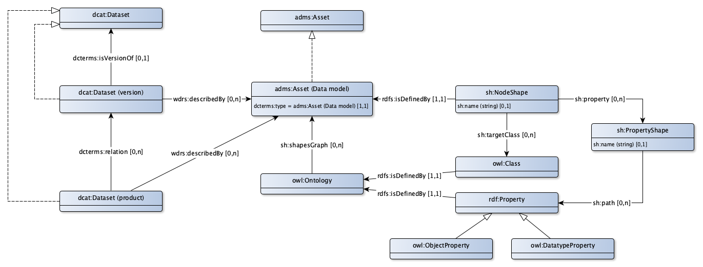

# DM Application profile for data models

A data model is a description of the structure in which data about things that are described by concepts in a concept scheme can be stored. The concept scheme can be used to communicate with domain owners and users on the content of a registration. Translating a concept scheme into a coherent data model is the domain of the data architect.

One way for building a data model is to use the Dutch Metamodel for Data models (MIM), (see [https://www.geonovum.nl/geo-standards/metamodel-informatiemodellering/nationaal-metamodel-voor-informatiemodellering]) . This meta model contains object classes, attribute types, data groups, data group types, generalizations, relationship types, and relationship classes. An data model created on base of the MIM can be expressed in UML or in RDF. In other words, it is 'form-free'. A MIM class is usually a realization of a concept. For example, the attribute type 'main address' in the BAG is the realization of the term 'Main address' and the object class 'AddressableObject', where a 'main address' is the realization of the term 'AddressableObject'. The term 'AddressableObject' is about the (linguistic) meaning of an addressable object. The object class is a kind of 'box' in which the data about an addressable object can be stored.

When building an data model based on a concept scheme, the following good practices can be used:
* A class is created for each objectifiable concept. For example, the class with the name 'Public Space' contains the data about the objects that are indicated by the concept 'Public Space'.
* Concepts that are published in a controlled vocabulary are treated differently in a relational model and in a linked data model:
** In a relational model, the parent concept (of which the  concepts in the controlled vocabulary are a specialization) is translated into a class whose instances are typed on base of an element in the controlled vocabulary. Usually this is an attribute with 'type' or ‘kind’ in the name.
** In a linked data model, such concepts are modelled as subtypes of the parent concept.
* For every concept that is a property of a class and is not a reference to another concept, a data property arises. For example, the property with the name 'year of construction' represents the term with the name 'Year of construction'.
* Specializations, generalizations, and partitive relationships in the concept scheme are translated into specializations, generalizations and partitive relationships in the data model.
* For each semantic relation in the conceptual model, a relation is defined in the data model (in linked data an object property). An example is 'lies in' as a relation between the classes 'Public Space' and 'Residence' as an elaboration of the semantic relationship between the terms 'Public Space' and 'Residence'.

An example of the BAG model elaborated in this way can be found at [https://bag.basisregistraties.overheid.nl/def]. #-uri's can be used to reference to elements in this model, for example [https://bag.basisregistraties.overheid.nl/def/objectklasse/ AdresseerbaarObject#hoofdadres]. This example is available as a html web page, in turtle and as a graph. This example also shows how the uri strategy works to describe a data model. Typing in the above URL will lead to the display the part for the '#'of the page [http://bag.basisregistraties.overheid.nl/def/objectklasse/ AdresseerbaarObject]. In other words: the description of the entity 'Addressable object'.

## Data model

### Properties

### Relations

## shapes graph

## Uri strategy

A data model gets a uri from the asset that describes the model.
...

