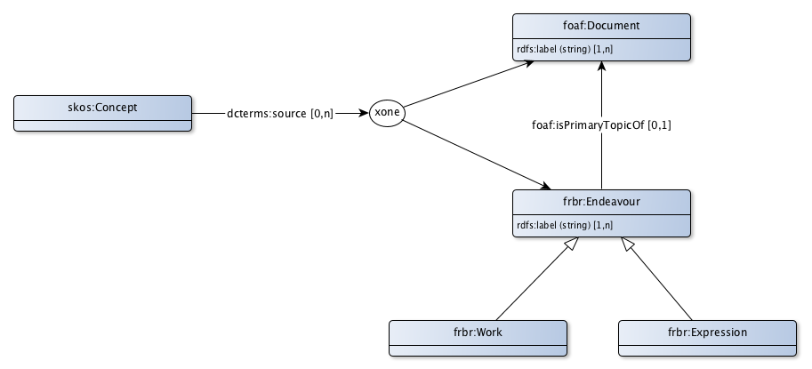

# FRBR Appication profile for Bibliographic references

FRBR is the standard to refer to a bibliographic source (for example a legal article) in general or a version of a bibliographic source as it was valid at a certain time. Formal concepts are usually defined in a decree or a law. Referring to such a concept, it is important to know whether to reference to that concept in general or to a description of that concept at a specific moment in time.

The FRBR application profile makes it possible to refer to:
* a document that can be found on the web, for example a wikipedia page. Voor een stabiele verwijzing kan het handig zijn om te verwijzen naar een specifieke versie, zoals deze beschikbaar was op het moment dat de verwijzing is aangebracht.
* a bibliographic reference, without the need for the availability of an online document. If the document is available online, an extra link to this document can be made. Bibliographic references are available in two styles:
  * a reference of a work, without reference to a particular version of this work, for example: "The constitution";
  * a reference of a version of a work, the "expresssion". For example: "The constitution, as valid on november 17th, 2017".

## document

|Eigenschap|Waarde
|----------|------
|Label|Document
|Description|A document that can be found on the web.
|Example|[https://wetten.overheid.nl/BWBR0001840/2017-11-17](https://wetten.overheid.nl/BWBR0001840/2017-11-17)
|Properties en relations|[label](http://bp4mc2.org/profiles/frbr-ap-sc#Document_label)

### Properties

|Eigenschap|Waarde
|----------|------
|datatype|[http://www.w3.org/2001/XMLSchema#string](http://www.w3.org/2001/XMLSchema#string)
|Label|label
|Property|[rdfs:label](http://www.w3.org/2000/01/rdf-schema#label)
|Description|A document has a human-readable label.
|Min card.|1

## Work as source

|Eigenschap|Waarde
|----------|------
|Label|generic bibliographic source
|Class|[frbr:Work](http://purl.org/vocab/frbr/core#Work)
|Description|A bibliographic source identifiable via the web, without an explicit reference to a specific version.

## Expression as source

|Eigenschap|Waarde
|----------|------
|Label|version bibliographic source
|Class|[frbr:Expression](http://purl.org/vocab/frbr/core#Expression)
|Description|A specific version of a bibliographic source identifiable on the web.

## Uri strategy

A source document, source on the web, work as source, respectively expression as source gets a uri according to the pattern:

* http://{domain}/id/{SourceDocument}/{UpperCamelCase(rdfs:Label)} for a source document
* http://{domain}/id/{Source}/{UpperCamelCase(rdfs:Label)} for a bibliographic source on the web
* http://{domain}/id/{WorkAsSource}/{UpperCamelCase(rdfs:Label)} for a general bibliographic resource on the web
* http://{domain}/id/{ExpressionAsSource}/{UpperCamelCase(rdfs:Label)} for a specific version of a bibliographic source on the web

