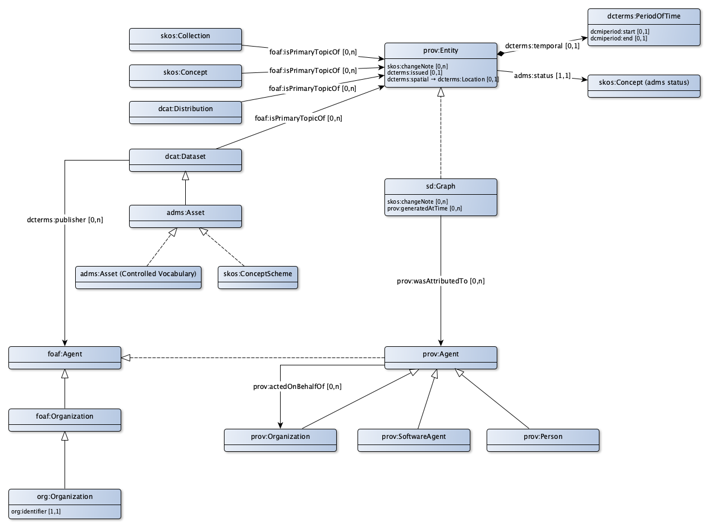

# Application profile for provenance information

Formal/legal validity and administrative aspects are recorded in accordance with the prov ontology. This involves who, what, when and for whatever reason has been recorded or changed.

* To this end metadata are described in a prov:Entity.
* The system catalog itself is the most generic entity on which provenance is recorded. This means that all changes in the catalog description are kept.
* Provenance is also recorded on the descriptions of datasets (dataset, dataset version and dataset product) and (dataset) distributions.
* For concepts models, value lists and information models, which are described as an asset, provenance is recorded on the asset description and on the asset distribution description.
* For concepts and collections provenance is recorded per concept and collection.

The provenance has two aspects:
* The formal and legal validity.
** The formal validity is recorded in the formal issued date. The formal status can also be established. For the formal status the EU value list for statuses (adms:status) is used.
** The legal validity in time and place can be recorded in a time period and in a reference to a geographical area.
** For concepts and collections of concepts that originate from the underlying laws and regulations, this period of time is the period as laid down in those laws and regulations. The geographical area is the area over which the relevant competent authority has jurisdiction.
* The administrative / household aspects.
** A change in the data is recorded in an sd:graph. The graph is the collection of changed elements in 1 transaction.
** This change is made by a prov:agent.
** This prov:agent must be authorized to make such a change. This implies that the prov:agent needs to be known as a foaf:Agent in a list of parties (actually a list of organizations). Via the dcterms:publisher relationship, it is clear who is the publicist of a dataset, and thus who is allowed to make changes to the information about this dataset.

## Metadata

|!form data!Klasse|Waarde
|----------|------
|Used term|[prov:Entity](http://www.w3.org/ns/prov#Entity)
|Description|Metadata of a version of an entity can be described.
|Properties en relations|[change note](http://bp4mc2.org/profiles/prov-ap-sc#Metadata_changeNote), [date issued](http://bp4mc2.org/profiles/prov-ap-sc#Metadata_isIssued), [temporal validity](http://bp4mc2.org/profiles/prov-ap-sc#Metadata_isValidDuring), [spatial validity](http://bp4mc2.org/profiles/prov-ap-sc#Metadata_isvalidWithin), [status](http://bp4mc2.org/profiles/prov-ap-sc#Metadata_status)

### Properties

|!form data!Eigenschap|change note
|----------|------
|Used term|[skos:changeNote](http://www.w3.org/2004/02/skos/core#changeNote)
|Datatype|[Text](http://www.w3.org/2001/XMLSchema#string)
|Description|The reason for a version and other points of attention in a version can be explained.

|!form data!Eigenschap|date issued
|----------|------
|Used term|[dcterms:issued](http://purl.org/dc/terms/issued)
|Datatype|[http://www.w3.org/2001/XMLSchema#dateTime](http://www.w3.org/2001/XMLSchema#dateTime)
|Description|A version can be issued from a certain moment in time.
|Max card.|1

### Relations

|!form data!Eigenschap|temporal validity
|----------|------
|nodeKind|[http://www.w3.org/ns/shacl#BlankNode](http://www.w3.org/ns/shacl#BlankNode)
|Used term|[dcterms:temporal](http://purl.org/dc/terms/temporal)
|Refers to|[dcterms:PeriodOfTime](http://purl.org/dc/terms/PeriodOfTime)
|Description|A version can be formally / legally valid for a period.
|Example|22/10/2017 - 
|Max card.|1

|!form data!Eigenschap|spatial validity
|----------|------
|Used term|[dcterms:spatial](http://purl.org/dc/terms/spatial)
|Refers to|[dcterms:Location](http://purl.org/dc/terms/Location)
|Description|A version can be formally / legally valid in an geographical area.
|Example|gemeente Apeldoorn
|Max card.|1

|!form data!Eigenschap|status
|----------|------
|Used term|[adms:status](http://www.w3.org/ns/adms#status)
|Related with|[Controlled vocabulary status](http://bp4mc2.org/profiles/prov-ap-sc#Status)
|Description|A version has an administrative status based on the ADMS list of values.
|Min card.|1
|Max card.|1

## Status

|!form data!Klasse|Controlled vocabulary status
|----------|------
|Description|A version can hav an administrative status that is based on the ADMS controlled vocabulary.
|Controlled vocabulary|[http://purl.org/adms/status/1.0](http://purl.org/adms/status/1.0)

## Period of time

|!form data!Klasse|Time period
|----------|------
|Used term|[dcterms:PeriodOfTime](http://purl.org/dc/terms/PeriodOfTime)
|Description|A period of time is pointed out by a start date and end date.
|Properties en relations|[end](http://bp4mc2.org/profiles/prov-ap-sc#PeriodOfTime_end), [start](http://bp4mc2.org/profiles/prov-ap-sc#PeriodOfTime_start)

### Properties

|!form data!Eigenschap|end
|----------|------
|Used term|[dcmiperiod:end](http://dublincore.org/documents/2006/04/10/dcmi-period/end)
|Datatype|[http://www.w3.org/2001/XMLSchema#dateTime](http://www.w3.org/2001/XMLSchema#dateTime)
|Description|A period of time ends at a certain date. This date can be unknown (empty).
|Example|01/08/2018
|Max card.|1

|!form data!Eigenschap|start
|----------|------
|Used term|[dcmiperiod:start](http://dublincore.org/documents/2006/04/10/dcmi-period/start)
|Datatype|[http://www.w3.org/2001/XMLSchema#dateTime](http://www.w3.org/2001/XMLSchema#dateTime)
|Description|A period of time starts at a certain date. This date can be unknown (empty).
|Example|22/10/2017
|Max card.|1

## Geographical area

|!form data!Klasse|Geographical area
|----------|------
|Used term|[dcterms:Location](http://purl.org/dc/terms/Location)
|Description|The description of the geographical area in which a version is valid.

## Data graph

|!form data!Klasse|Data graph
|----------|------
|Used term|[sd:Graph](http://www.w3.org/ns/sparql-service-description#Graph)
|Description|The data graph contains both the concrete data (represented by a prov:Entity), and the metadata of the prov:Entity, that is: an sd:Graph
|Properties en relations|[attributed to](http://bp4mc2.org/profiles/prov-ap-sc#ProvenanceGraph_attributedTo), [change note](http://bp4mc2.org/profiles/prov-ap-sc#ProvenanceGraph_changeNote), [registration moment](http://bp4mc2.org/profiles/prov-ap-sc#ProvenanceGraph_generatedAtTime)

### Properties

|!form data!Eigenschap|change note
|----------|------
|Used term|[skos:changeNote](http://www.w3.org/2004/02/skos/core#changeNote)
|Datatype|[http://www.w3.org/2001/XMLSchema#dataTime](http://www.w3.org/2001/XMLSchema#dataTime)
|Description|The reason for a set of related changes can be explained.

### Relations

|!form data!Eigenschap|attributed to
|----------|------
|Used term|[prov:wasAttributedTo](http://www.w3.org/ns/prov#wasAttributedTo)
|Refers to|[prov:Agent](http://www.w3.org/ns/prov#Agent)
|Description|The person or organization that made or let make the change can be recorded.

|!form data!Eigenschap|registration moment
|----------|------
|Used term|[prov:generatedAtTime](http://www.w3.org/ns/prov#generatedAtTime)
|Description|The date and time of the administrative operation can be saved. This way you can always retrieve what information was known at what time.

## Agent (provenance)

|!form data!Klasse|Agent (provenance)
|----------|------
|Used term|[prov:Agent](http://www.w3.org/ns/prov#Agent)
|Description|The person or organization that is responsible for an activity, the creation of a entity or an activity of another can be recorded.
|Properties en relations|[acted on behalf of](http://bp4mc2.org/profiles/prov-ap-sc#ProvenanceAgent_OnBehalfOf)

### Relations

|!form data!Eigenschap|acted on behalf of
|----------|------
|Used term|[prov:actedOnBehalfOf](http://www.w3.org/ns/prov#actedOnBehalfOf)
|Refers to|[prov:Organization](http://www.w3.org/ns/prov#Organization)
|Description|A person or organization can act on behalf of another person or organization.

## Person (provenance)

|!form data!Klasse|Person (provenance)
|----------|------
|Used term|[prov:Person](http://www.w3.org/ns/prov#Person)
|Description|An agent (provenance can be a human.

## Software agent

|!form data!Klasse|Software agent
|----------|------
|Used term|[prov:SoftwareAgent](http://www.w3.org/ns/prov#SoftwareAgent)
|Description|An agent (provenance can be an automated routine.

## Organization (provenance)

|!form data!Klasse|Organization (provenance)
|----------|------
|Used term|[prov:Organization](http://www.w3.org/ns/prov#Organization)
|Description|An agent (provenance can be an organization.

## Registered Agent

|!form data!Klasse|Agent (foaf)
|----------|------
|Used term|[foaf:Agent](http://xmlns.com/foaf/0.1/Agent)
|Description|The person or organization that is responsible for a dataset.

## Organization (foaf)

|!form data!Klasse|Organization (foaf)
|----------|------
|Used term|[foaf:Organization](http://xmlns.com/foaf/0.1/Organization)
|Description|The organization that is responsible for a dataset.

## Organization (org)

|!form data!Klasse|Organization (org)
|----------|------
|Used term|[org:Organization](http://www.w3.org/ns/org#Organization)
|Description|The organization as included in the formal list with OIN numbers.
|Properties en relations|[has OIN](http://bp4mc2.org/profiles/prov-ap-sc#OrgOrganization_oin)

## Uri strategy

* The information about an entity as valid at a certain time can be requested via the doc-uri, supplemented with yyyy/mm/dd
#* The information about a location as valid at a certain place can be requested via the doc-uri, supplemented with {UpperCamelCase (rdfs:label of the Location)}

