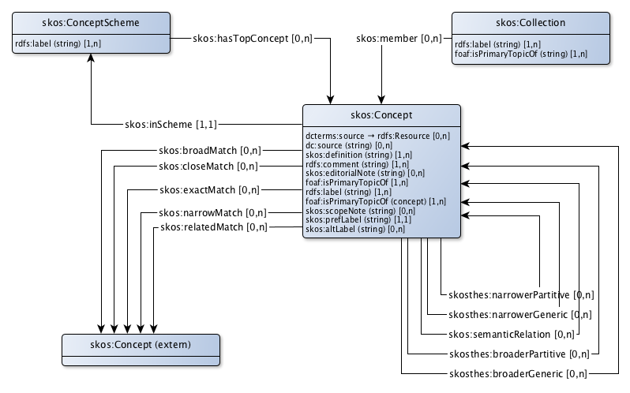

# SKOS Profile for concept schemes

Concepts make clear which 'topics of conversation' exist. In a system catalog concepts are formally defined. Each definition is built according to strict rules. The essence is that every concept in a certain domain is explained in terms of other concepts. These concepts are also explained until finally every concept that needs some explanation is defined. At the end the concepts  whose meaning is taken for granted remain. In a logical model these are called axioms. This way an axiomatic conceptual framework is created for each domain. This conceptual framework can be regarded as a more or less formalized description of the institutional reality of the domain.

SKOS is used to describe concepts. SKOS is a standard on the appy-or-explain list for governments in the Netherlands.

* Every concept is represented by a skos:concept.
* Each domain has its own concept scheme. The concept scheme for a particular domain is represented by a skos:ConceptScheme.
* Concepts can be arranged in collections. A collection is represented by a skos:collection.
* Concepts in different domains can be linked via matching mechanisms. This connection of concepts between domains creates a system of coherent concept schemes. This system of coherent concepts schemes can be seen as the knowledge base for a system catalog.

## Concept scheme

|!form data!Klasse|Concept scheme
|----------|------
|Used term|[skos:ConceptScheme](http://www.w3.org/2004/02/skos/core#ConceptScheme)
|Description|The knowledge about physical reality is described in a linguistic model, a conceptual model. In a conceptual model, this knowledge is structured in such a way that it is understood by both people and computers.
|Properties en relations|[top concept](http://bp4mc2.org/profiles/skos-ap-sc#ConceptScheme_hasTopConcept), [label](http://bp4mc2.org/profiles/skos-ap-sc#ConceptScheme_label)

### Properties

|!form data!Eigenschap|label
|----------|------
|Property|[rdfs:label](http://www.w3.org/2000/01/rdf-schema#label)
|Datatype|[Text](http://www.w3.org/2001/XMLSchema#string)
|Description|A concept scheme has a human readable label. Blanks and diacritics are allowed.
|Example|Het schema dat het domein regelgeving beschrijft heeft als label 'Regelgeving'.
|Min card.|1

### Relations

|!form data!Eigenschap|top concept
|----------|------
|Property|[skos:hasTopConcept](http://www.w3.org/2004/02/skos/core#hasTopConcept)
|Refers to|[skos:Concept](http://www.w3.org/2004/02/skos/core#Concept)
|Description|A concept schema can contain concepts that are the most generic in a hierarchy of specializations / generalizations.

## Concept

|!form data!Klasse|Concept
|----------|------
|Used term|[skos:Concept](http://www.w3.org/2004/02/skos/core#Concept)
|Description|A  concept is an idea or notion, a unit of thought, a topic in the universe of discourse.
|Properties en relations|[broadly matches with](http://bp4mc2.org/profiles/skos-ap-sc#Concept_broadlyMatches), [closely matches with](http://bp4mc2.org/profiles/skos-ap-sc#Concept_closelyMatches), [comment](http://bp4mc2.org/profiles/skos-ap-sc#Concept_comment), [consists of](http://bp4mc2.org/profiles/skos-ap-sc#Concept_consistsOf), [written source](http://bp4mc2.org/profiles/skos-ap-sc#Concept_dcsource), [source on the web](http://bp4mc2.org/profiles/skos-ap-sc#Concept_dctsource), [definition](http://bp4mc2.org/profiles/skos-ap-sc#Concept_definition), [domain](http://bp4mc2.org/profiles/skos-ap-sc#Concept_domain), [editorial note](http://bp4mc2.org/profiles/skos-ap-sc#Concept_editorialNote), [exactly matches with](http://bp4mc2.org/profiles/skos-ap-sc#Concept_exactlyMatches), [generalization of](http://bp4mc2.org/profiles/skos-ap-sc#Concept_generalisationOf), [related to](http://bp4mc2.org/profiles/skos-ap-sc#Concept_isRelatedTo), [label](http://bp4mc2.org/profiles/skos-ap-sc#Concept_label), [narrowly matches with](http://bp4mc2.org/profiles/skos-ap-sc#Concept_narrowlyMatches), [part of](http://bp4mc2.org/profiles/skos-ap-sc#Concept_partOf), [preferred label](http://bp4mc2.org/profiles/skos-ap-sc#Concept_prefLabel), [provenance](http://bp4mc2.org/profiles/skos-ap-sc#Concept_provenance), [scope note](http://bp4mc2.org/profiles/skos-ap-sc#Concept_scopeNote), [related to](http://bp4mc2.org/profiles/skos-ap-sc#Concept_seeAlso), [specialization of](http://bp4mc2.org/profiles/skos-ap-sc#Concept_specialisationOf), [alternative label](http://bp4mc2.org/profiles/skos-ap-sc#Concept_synonym)

### Properties

|!form data!Eigenschap|comment
|----------|------
|Property|[rdfs:comment](http://www.w3.org/2000/01/rdf-schema#comment)
|Datatype|[Text](http://www.w3.org/2001/XMLSchema#string)
|Description|Preferably a concept has a comment in 'clear language'.
|Min card.|1

|!form data!Eigenschap|written source
|----------|------
|Property|[dc:source](http://purl.org/dc/elements/1.1/source)
|Datatype|[Text](http://www.w3.org/2001/XMLSchema#string)
|Description|A concept can be derived from a written source.

|!form data!Eigenschap|definition
|----------|------
|Property|[skos:definition](http://www.w3.org/2004/02/skos/core#definition)
|Datatype|[Text](http://www.w3.org/2001/XMLSchema#string)
|Description|A concept can have a formal definition. If possible this is taken from a formal publication.
|Min card.|1

|!form data!Eigenschap|editorial note
|----------|------
|Property|[skos:editorialNote](http://www.w3.org/2004/02/skos/core#editorialNote)
|Datatype|[Text](http://www.w3.org/2001/XMLSchema#string)
|Description|A concept can have an editorial comment.

|!form data!Eigenschap|label
|----------|------
|Property|[rdfs:label](http://www.w3.org/2000/01/rdf-schema#label)
|Datatype|[Text](http://www.w3.org/2001/XMLSchema#string)
|Description|A concept has a human-readable label (including spaces and diacritics). This is equal to the skos: prefLabel. An exception to this is the situation that within one concept scheme the same skos:prefLabel is used more than once. This is not a good practice and should be avoided as much as possible. In case this occurs nonetheless, the rdfs: label gets an addition between brackets that indicates the distinction. This label can be multilingual, indicated by @nl or @en
|Min card.|1

|!form data!Eigenschap|preferred label
|----------|------
|Property|[skos:prefLabel](http://www.w3.org/2004/02/skos/core#prefLabel)
|Datatype|[Text](http://www.w3.org/2001/XMLSchema#string)
|Description|A concept has a human-readable preferred label. There is exactly one preferred label in the preferred language (this field is not multilingual). It is good practice that in 1 concept scheme each concept has a unique prefLabel.
|Min card.|1
|Max card.|1

|!form data!Eigenschap|scope note
|----------|------
|Property|[skos:scopeNote](http://www.w3.org/2004/02/skos/core#scopeNote)
|Datatype|[Text](http://www.w3.org/2001/XMLSchema#string)
|Description|A concept can be explained.

|!form data!Eigenschap|alternative label
|----------|------
|Property|[skos:altLabel](http://www.w3.org/2004/02/skos/core#altLabel)
|Datatype|[Text](http://www.w3.org/2001/XMLSchema#string)
|Description|A concept can have an alternative label, a synonym

### Relations

|!form data!Eigenschap|broadly matches with
|----------|------
|Property|[skos:broadMatch](http://www.w3.org/2004/02/skos/core#broadMatch)
|Related with|[Extern concept](http://bp4mc2.org/profiles/skos-ap-sc#ExternalConcept)
|Description|A concept can be a specializaton of a concept in another domain.

|!form data!Eigenschap|closely matches with
|----------|------
|Property|[skos:closeMatch](http://www.w3.org/2004/02/skos/core#closeMatch)
|Related with|[Extern concept](http://bp4mc2.org/profiles/skos-ap-sc#ExternalConcept)
|Description|A concept can have almost the same meaning as a concept in another domain.

|!form data!Eigenschap|consists of
|----------|------
|Property|[skosthes:narrowerPartitive](http://purl.org/iso25964/skos-thes#narrowerPartitive)
|Refers to|[skos:Concept](http://www.w3.org/2004/02/skos/core#Concept)
|Description|A concept can be about several parts.

|!form data!Eigenschap|source on the web
|----------|------
|Property|[dcterms:source](http://purl.org/dc/terms/source)
|Refers to|[rdfs:Resource](http://www.w3.org/2000/01/rdf-schema#Resource)
|Description|A concept can be derived from a source that can be found on the web. This can be a (version of) a description of a specific concept or a document in which a description of the concept can be found.

|!form data!Eigenschap|domain
|----------|------
|Property|[skos:inScheme](http://www.w3.org/2004/02/skos/core#inScheme)
|Refers to|[skos:ConceptScheme](http://www.w3.org/2004/02/skos/core#ConceptScheme)
|Description|A concept is defined in the context of a certain domain.
|Min card.|1
|Max card.|1

|!form data!Eigenschap|exactly matches with
|----------|------
|Property|[skos:exactMatch](http://www.w3.org/2004/02/skos/core#exactMatch)
|Related with|[Extern concept](http://bp4mc2.org/profiles/skos-ap-sc#ExternalConcept)
|Description|A concept can have exactly the same meaning as a concept in another domain.

|!form data!Eigenschap|generalization of
|----------|------
|Property|[skosthes:narrowerGeneric](http://purl.org/iso25964/skos-thes#narrowerGeneric)
|Refers to|[skos:Concept](http://www.w3.org/2004/02/skos/core#Concept)
|Description|A concept can be a generalization of a concept with a narrower meaning.

|!form data!Eigenschap|related to
|----------|------
|Property|[skos:semanticRelation](http://www.w3.org/2004/02/skos/core#semanticRelation)
|Refers to|[skos:Concept](http://www.w3.org/2004/02/skos/core#Concept)
|Description|A concept can be related to another concept.

|!form data!Eigenschap|narrowly matches with
|----------|------
|Property|[skos:narrowMatch](http://www.w3.org/2004/02/skos/core#narrowMatch)
|Related with|[Extern concept](http://bp4mc2.org/profiles/skos-ap-sc#ExternalConcept)
|Description|A concept can be a generalizaton of a concept in another domain.

|!form data!Eigenschap|part of
|----------|------
|Property|[skosthes:broaderPartitive](http://purl.org/iso25964/skos-thes#broaderPartitive)
|Refers to|[skos:Concept](http://www.w3.org/2004/02/skos/core#Concept)
|Description|A concept can be about a part of a broader concept.

|!form data!Eigenschap|provenance
|----------|------
|Property|[foaf:isPrimaryTopicOf](http://xmlns.com/foaf/0.1/isPrimaryTopicOf)
|Refers to|[prov:Entity](http://www.w3.org/ns/prov#Entity)
|Description|Provenance of a concept can be described.
|Example|Op basis van de nieuwe wet op de BAG is de definitie van het begrip 'verblijfsobject' aangepast.
|Min card.|1

|!form data!Eigenschap|related to
|----------|------
|Property|[skos:relatedMatch](http://www.w3.org/2004/02/skos/core#relatedMatch)
|Related with|[Extern concept](http://bp4mc2.org/profiles/skos-ap-sc#ExternalConcept)
|Description|A concepts can be related to a concept in another domain.

|!form data!Eigenschap|specialization of
|----------|------
|Property|[skosthes:broaderGeneric](http://purl.org/iso25964/skos-thes#broaderGeneric)
|Refers to|[skos:Concept](http://www.w3.org/2004/02/skos/core#Concept)
|Description|A concept can be a specialization of a concept with a broader meaning.

## Collection

|!form data!Klasse|Collection
|----------|------
|Used term|[skos:Collection](http://www.w3.org/2004/02/skos/core#Collection)
|Description|A group of coherent concepts can be bundled in a collection.
|Properties en relations|[has member](http://bp4mc2.org/profiles/skos-ap-sc#Collection_hasMember), [label](http://bp4mc2.org/profiles/skos-ap-sc#Collection_label), [provenance](http://bp4mc2.org/profiles/skos-ap-sc#Collection_provenance)

### Properties

|!form data!Eigenschap|label
|----------|------
|Property|[rdfs:label](http://www.w3.org/2000/01/rdf-schema#label)
|Datatype|[Text](http://www.w3.org/2001/XMLSchema#string)
|Description|A collection has a human readable label. Blanks and diacritics are allowed.
|Example|De collectie die alle activiteiten in het BAL beschrijft heeft als label 'BAL'
|Min card.|1

### Relations

|!form data!Eigenschap|has member
|----------|------
|Property|[skos:member](http://www.w3.org/2004/02/skos/core#member)
|Refers to|[skos:Concept](http://www.w3.org/2004/02/skos/core#Concept)
|Description|A collection can contain one or more concepts, that possibly come from multiple concept schemes.
|Example|de collectie 'Zakelijke rechten' bevat het begrip 'Erfpacht'

|!form data!Eigenschap|provenance
|----------|------
|Property|[foaf:isPrimaryTopicOf](http://xmlns.com/foaf/0.1/isPrimaryTopicOf)
|Refers to|[prov:Entity](http://www.w3.org/ns/prov#Entity)
|Description|Provenance of a collection can be described.
|Example|Op basis van de nieuwe wet op de BAG is een aantal begrippen toegevoegd aan de collectie 'aard gebruik'
|Min card.|1

## Concept

|!form data!Klasse|Extern concept
|----------|------
|Typed as|[skos:Concept](http://www.w3.org/2004/02/skos/core#Concept)
|Description|A concept in another concept scheme, to which is referenced.

## Concept scheme asset

|!form data!Klasse|Asset (ConceptScheme)
|----------|------
|Typed as|[adms:Asset](http://www.w3.org/ns/adms#Asset), [skos:ConceptScheme](http://www.w3.org/2004/02/skos/core#ConceptScheme)
|Description|A concept scheme can be identified as an asset.
|Properties en relations|[type asset = Concept scheme](http://bp4mc2.org/profiles/skos-ap-sc#AssetConceptScheme_typeConceptScheme)

### Relations

|!form data!Eigenschap|type asset = Concept scheme
|----------|------
|Property|[dcterms:type](http://purl.org/dc/terms/type)
|Value|[Asset (ConceptScheme)](http://bp4mc2.org/profiles/skos-ap-sc#AssetConceptScheme)
|Description|A concept scheme is explicitly typed as a concept scheme.
|Min card.|1
|Max card.|1

## Uri strategy

Concept schemes, collections and concepts get a uri according to the pattern:

* `http://{domain}/id/scheme/{UpperCamelCase(rdfs:label)}` for concept schemes
* `http://{domain}/id/collection/{UpperCamelCase(rdfs:label)}` for collections
* `http://{domain}/id/concept/{UpperCamelCase(skos:prefLabel)}` for concepts

The `skos:prefLabel` is in most cases equal to the `rdfs:label` and these should be unique for all concepts in a particular concept scheme. If this is not the case, the URI should be extended with a `_{context}` postfix. In such a case, the `rdfs:label` is also extended with ` ({context})`.

