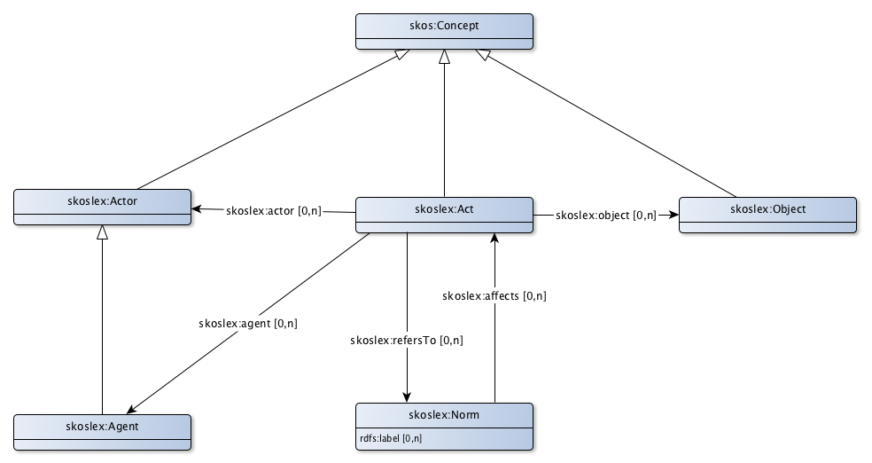

# SKOS-Lex application profile for (legal) acts

Events can be described as concepts. They then have the same characteristics as concepts, which denote 'objects', but they also have some other characteristics.
* Events are described in legislation and regulations as possible (legal) acts that can take place in a certain domain. An example is the exploitation of a marina in the area of the decree on Activities in the Environment (in Dutch ‘Besluit Activiteiten Leefomgeving/BAL).
* Events make the dynamics of institutional reality visible. A change in the registration can be referenced c to the event. This helps to understand 'what has happened' around the change. An example is a new owner of property in the BRK. In this case it can be recorded that this situation arose through a transfer, inheritance, estate distribution, etc.
* An event relates to an object. This object is an 'ordinary' concept. In the example of the transfer in the BRK, the object is the property.
* Institutional events or legal acts have one or more actors, for example the seller and the buyer in the transfer of property. In cases where the legislation and regulations are primarily intended to describe the rules (norms), an actor is called in Dutch a norm adressee. Actors are also 'ordinary' concepts.
* Not everyone is authorized to record an institutional event. This is done by an official or by a civil-law notary. This is called an 'agent'. This is a special kind of actor.
* Finally, there are the rules or norms that a legal act must meet. Norms are not concepts.

## Act

|Eigenschap|Waarde
|----------|------
|Class|[skoslex:Act](http://bp4mc2.org/def/skos-lex#Act)
|Description|The class of Acts. An act is a legal construct representing a set of activities, performed by an Actor and with respect to some Object.
|Properties en relations|[actor](http://bp4mc2.org/profiles/skoslex-ap-sc#Act_actor), [agent](http://bp4mc2.org/profiles/skoslex-ap-sc#Act_agent), [object](http://bp4mc2.org/profiles/skoslex-ap-sc#Act_object), [refers to](http://bp4mc2.org/profiles/skoslex-ap-sc#Act_refersTo)

### Relations

|Eigenschap|Waarde
|----------|------
|Label|actor
|Property|[skoslex:actor](http://bp4mc2.org/def/skos-lex#actor)
|Refers to|[skoslex:Actor](http://bp4mc2.org/def/skos-lex#Actor)
|Description|Actor relates an Act with the Actor that performs the act.

|Eigenschap|Waarde
|----------|------
|Label|agent
|Property|[skoslex:agent](http://bp4mc2.org/def/skos-lex#agent)
|Refers to|[skoslex:Agent](http://bp4mc2.org/def/skos-lex#Agent)
|Description|Agent relates an Act with the Agent involved in the act.

|Eigenschap|Waarde
|----------|------
|Label|object
|Property|[skoslex:object](http://bp4mc2.org/def/skos-lex#object)
|Refers to|[skoslex:Object](http://bp4mc2.org/def/skos-lex#Object)
|Description|Object relates an Act with the object that is created, changed or used during the act

|Eigenschap|Waarde
|----------|------
|Label|refers to
|Property|[skoslex:refersTo](http://bp4mc2.org/def/skos-lex#refersTo)
|Refers to|[skoslex:Norm](http://bp4mc2.org/def/skos-lex#Norm)
|Description|RefersTo relates a norm with the Act that is refered by the norm. Such an act has some relation with the norm, without further specification. It might be effected by the norm, but could also be a precondition or simply mentioned in the rules.

## Object

|Eigenschap|Waarde
|----------|------
|Class|[skoslex:Object](http://bp4mc2.org/def/skos-lex#Object)
|Description|The class of objects. An object is some thing (not an actor) that is created, used or changed during some Act
|Properties en relations|[http://bp4mc2.org/profiles/skoslex-ap-sc#LegalLabel](http://bp4mc2.org/profiles/skoslex-ap-sc#LegalLabel)

## Actor

|Eigenschap|Waarde
|----------|------
|Class|[skoslex:Object](http://bp4mc2.org/def/skos-lex#Object)
|Description|The class of objects. An object is some thing (not an actor) that is created, used or changed during some Act
|Properties en relations|[http://bp4mc2.org/profiles/skoslex-ap-sc#LegalLabel](http://bp4mc2.org/profiles/skoslex-ap-sc#LegalLabel)

## Agent

|Eigenschap|Waarde
|----------|------
|Class|[skoslex:Agent](http://bp4mc2.org/def/skos-lex#Agent)
|Description|The class of Agent. An agent is some person (individual, group or organisation) involved in some act, without actually performing the act.
|Properties en relations|[http://bp4mc2.org/profiles/skoslex-ap-sc#LegalLabel](http://bp4mc2.org/profiles/skoslex-ap-sc#LegalLabel)

## Norm

|Eigenschap|Waarde
|----------|------
|Class|[skoslex:Norm](http://bp4mc2.org/def/skos-lex#Norm)
|Description|The class of norms. A norm effects an Act. It implies what 'ought' or 'should not' be done with regard to an Act. A norm represents the set of rules that apply to an Act.
|Properties en relations|[http://bp4mc2.org/profiles/skoslex-ap-sc#LegalNorm_label](http://bp4mc2.org/profiles/skoslex-ap-sc#LegalNorm_label), [affects](http://bp4mc2.org/profiles/skoslex-ap-sc#LegalNorm_affects)

### Properties

|Eigenschap|Waarde
|----------|------
|Property|[rdfs:label](http://www.w3.org/2000/01/rdf-schema#label)
|Datatype|[Text](http://www.w3.org/2001/XMLSchema#string)

### Relations

|Eigenschap|Waarde
|----------|------
|Label|affects
|Property|[skoslex:affects](http://bp4mc2.org/def/skos-lex#affects)
|Refers to|[skoslex:Act](http://bp4mc2.org/def/skos-lex#Act)
|Description|Affects relates a norm with the Act that is affected by the norm. Such an act is restricted by the rules identified by the norm

## Uri strategy

Agents, objects en actors are concepten and follow the URI template of a concept. The following template is used for a norm:
* `http://{domain}/id/norm/{UpperCamelCase(rdfs:label)}`

