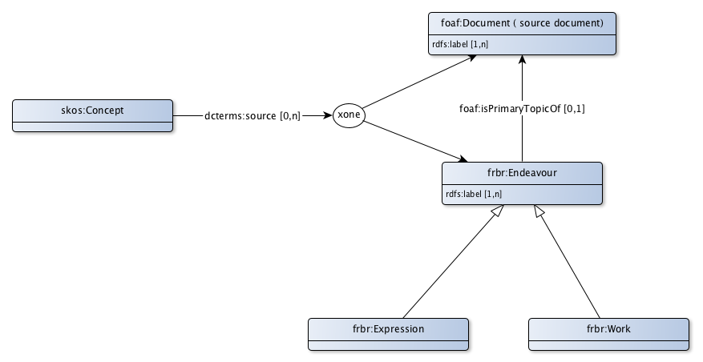

# FRBR Toepassingsprofiel voor bronbeschrijvingen

FRBR is de standaard om te kunnen verwijzen naar een bibliografische bron (bijvoorbeeld een wetsartikel) in het algemeen of een versie van een bron zoals dat op een bepaald moment geldig was. Formele begrippen worden meestal gedefinieerd in een besluit of een wet. Bij verwijzing naar zo’n begrip is het belangrijk om te weten of naar dat begrip in het algemeen of naar een beschrijving van dat begrip op een specifiek moment wordt verwezen.

Het FRBR toepassingsprofiel maakt het mogelijk te verwijzen naar:
* een document dat direct vindbaar is op het web, bijvoorbeeld een wikipedia pagina. Voor een stabiele verwijzing kan het handig zijn om te verwijzen naar een specifieke versie, zoals deze beschikbaar was op het moment dat de verwijzing is aangebracht.
* een bibliografische beschrijving, zonder dat het document zelf vindbaar is op het web. Indien het document wel vindbaar is, dan kan deze verwijzing ook opgenomen worden. Bibliografische beschrijvingen kennen we in twee vormen:
  * een beschrijving van het werk, zonder dat daarbij wordt verwezen naar een specifieke versie van dit werk, bijvoorbeeld "De grondwet";
  * een beschrijving van een versie van het werk, de "expressie". Bijvoorbeeld "De grondwet, zoals geldig op 17 november 2017".

## Begrip

### Relaties

|!form data!Eigenschap|bron op het web
|----------|------
|Eigenschap|[dcterms:source](http://purl.org/dc/terms/source)
|Uitleg|Een begrip kan zijn ontleend aan een op het web vindbare bron. Dit kan een (versie van) een beschrijving van een specifiek begrip of een document waarin een beschrijving van het begrip is te vinden.
|Voorbeeld|<jci1.3:c:BWBR0005416&titel=IV&hoofdstuk=XV&paragraaf=3&artikel=222>

## Document

|!form data!Klasse|Document
|----------|------
|Gebruikte term|[foaf:Document](http://xmlns.com/foaf/0.1/Document)
|Uitleg|Een document dat vindbaar is op het web.
|Voorbeeld|[https://wetten.overheid.nl/BWBR0001840/2017-11-17](https://wetten.overheid.nl/BWBR0001840/2017-11-17)
|Eigenschappen en relaties|[label](http://bp4mc2.org/profiles/frbr-ap-sc#Document_label)

### Eigenschappen

|!form data!Eigenschap|label
|----------|------
|Eigenschap|[rdfs:label](http://www.w3.org/2000/01/rdf-schema#label)
|Datatype|[Tekst](http://www.w3.org/2001/XMLSchema#string)
|Uitleg|Een document heeft een voor mensen leesbaar label.
|Voorbeeld|Grondwet
|Min card.|1

## Bibliografische beschrijving

|!form data!Klasse|bibliografische beschrijving
|----------|------
|Gebruikte term|[frbr:Endeavour](http://purl.org/vocab/frbr/core#Endeavour)
|Uitleg|Een bibliografische beschrijving van een werk of expressie.
|Voorbeeld|Artikel 1 van het burgerlijk wetboek of artikel 1 van het burgerlijk wetboek van 1838
|Eigenschappen en relaties|[onderwerp van](http://bp4mc2.org/profiles/frbr-ap-sc#Endeavour_isTopicOf), [label](http://bp4mc2.org/profiles/frbr-ap-sc#Endeavour_label)

### Eigenschappen

|!form data!Eigenschap|label
|----------|------
|Eigenschap|[rdfs:label](http://www.w3.org/2000/01/rdf-schema#label)
|Datatype|[Tekst](http://www.w3.org/2001/XMLSchema#string)
|Uitleg|Een bibliografische beschrijving heeft een voor mensen leesbare naam.
|Voorbeeld|Artikel 1 van het Burgerlijk Wetboek van 1838
|Min card.|1

### Relaties

|!form data!Eigenschap|onderwerp van
|----------|------
|Eigenschap|[foaf:isPrimaryTopicOf](http://xmlns.com/foaf/0.1/isPrimaryTopicOf)
|Relatie met|[Document](http://bp4mc2.org/profiles/frbr-ap-sc#Document)
|Uitleg|Een bibliografische beschrijving kan een onderwerp zijn van een document.
|Voorbeeld|Artikel 1 BW is een onderwerp in het Burgerlijk Wetboek
|Max card.|1

## Werk

|!form data!Klasse|Werk
|----------|------
|Gebruikte term|[frbr:Work](http://purl.org/vocab/frbr/core#Work)
|Uitleg|Een bibliografische beschrijving, zonder dat expliciet wordt verwezen naar een specifieke versie.
|Voorbeeld|Artikel 1 van het Burgerlijk Wetboek

## Expressie (versie van een werk)

|!form data!Klasse|expressie, versie van een werk
|----------|------
|Gebruikte term|[frbr:Expression](http://purl.org/vocab/frbr/core#Expression)
|Uitleg|Een specifieke versie van een werk.
|Voorbeeld|Artikel 1 van het Burgerlijk Wetboek van 1838

## Uri strategie

Een document, algemeen bibliografische resourcewerk op het web (work) of specifieke versie van een bibliografische resource op het web (expression) heeft een uri die gemunt is door degene die het document of de resource publiceert. In een stelselcatalogus worden hiervoor geen uri's gemunt.

