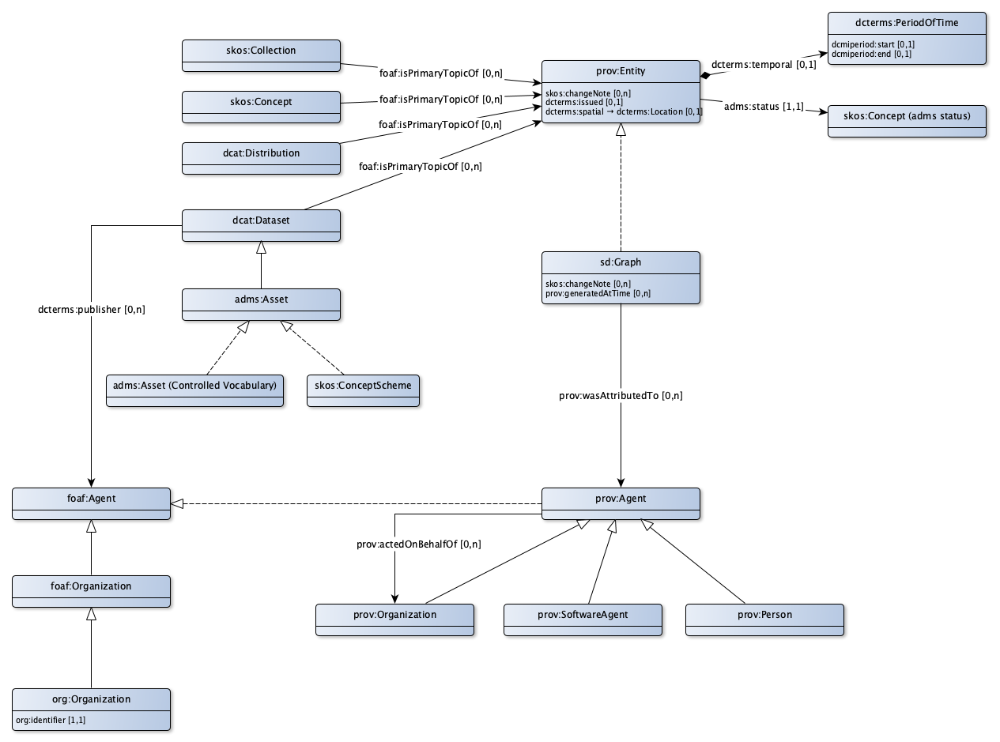

# Toepassingsprofiel voor provenance informatie

Formeel/juridische geldigheid en administratieve aspecten worden bijgehouden conform het de prov ontologie. Hierbij gaat het om wie, wat, wanneer en om wat voor reden heeft vastgelegd of gewijzigd.

* Daartoe worden de metadata beschreven in een prov:Entity.
* De stelselcatalogus zelf is de meest generieke provenance entiteit. Daarmee worden alle wijzigingen in de catalogus beschrijving bewaard.
* Ook van de beschrijvingen van datasets (dataset, dataset versie en dataset product) en (dataset) distributies wordt provenance bijgehouden.
* Voor begrippenmodellen, waardelijsten en informatiemodellen, die worden beschreven als een asset, geldt dat provenance wordt bijgehouden voor de asset beschrijving en voor de asset distributie beschrijving.
* Voor begrippen en collecties wordt per begrip en collectie provenance bijgehouden.

De provenance kent 2 aspecten:
* De formele en juridische geldigheid.
** De formele geldigheid wordt vastgelegd in de formele bekendmakingsdatum. Daarbij kan ook de formele status worden vastgelegd, waarvoor de EU waardelijst voor statussen (adms:status) wordt gehanteerd.
** De juridische geldigheid in tijd en plaats kan worden vastgelegd in een tijdsperiode en een verwijzing naar een geografisch gebied.
** Voor begrippen en collecties van begrippen die hun oorsprong vinden in de onderliggende wet- en regelgeving geldt dat deze tijdsperiode de periode is zoals in die wet- en regelgeving is vastgelegd en het geografisch gebied het gebied is waarover het betreffende bevoegd gezag zeggenschap heeft.
* De administratief/huishoudelijke aspecten. 
** Een wijziging in de data wordt vastgelegd in een eigen sd:graph (de verzameling van gewijzigde elementen in 1 transactie). 
** Deze wijziging wordt doorgevoerd door een prov:agent. 
** Deze prov:agent dient geautoriseerd te zijn om een dergelijke wijziging uit te voeren. Dit betekent dat de prov:agent ook als foaf:Agent bekend is in een lijst met partijen (feitelijk een lijst van organisaties). Via de relatie dcterms:publisher is duidelijk wie de publicist is van een dataset, en daarmee degene die wijzigingen op de informatie over deze dataset mag doorvoeren.

## Metadata

### Eigenschappen

### Relaties

## Adms status

## Metadata

### Tijdsperiode

## Geografisch gebied

## Provenance graaf

### Eigenschappen

### Relaties

## Agent (provenance)

### Eigenschappen

### Relaties

## Persoon (provenance)

## Software agent

## Organisatie (provenance)

## Agent (foaf)

## Organisatie (foaf)

## Organisatie (org)

## Uri strategie

Provenance hoort altijd bij een entiteit. 
* De gegevens over een entiteit zoals die op een bepaald moment geldig is kunnen worden opgevraagd via de doc-uri, aangevuld met yyyy/mm/dd
#* De gegevens over een locatie zoals die op een bepaalde plaats geldig is kunnen worden opgevraagd via de doc-uri, aangevuld met {UpperCamelCase (rdfs:label van de Locatie)}

