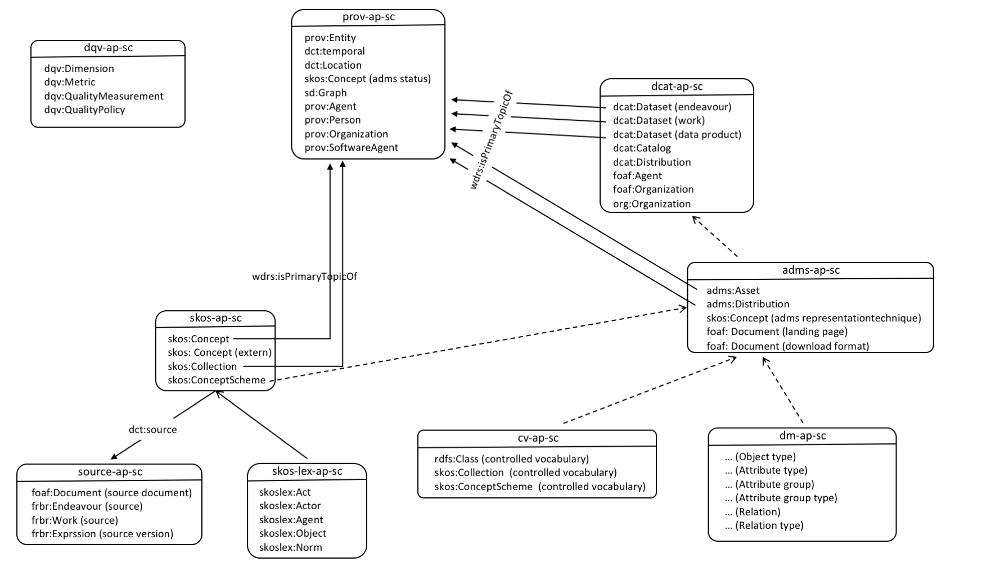

# Stelselcatalogus

In een digitaal stelsel worden data, metadata zoals kwaliteit en herkomst van de data en betekenis van die data uit verschillende domeinen in samenhang beheerd. Voorbeelden in Nederland zijn het stelsel voor de basisregistraties met de domeinen personen, rechtspersonen, inkomen, Kadaster, et cetera en het digitaal stelsel voor de Omgevingswet (DSO) met de domeinen wet-en regelgeving en informatiedomeinen rond lucht, water, aarde (openbare ruimte) en vuur (openbare veiligheid). Een Europees voorbeeld is Inspire, een digitaal netwerk voor het uitwisselen van gegevens over de leefomgeving voor Europese lidstaten.

Voor het in samenhang representeren van betekenis en metadata uit verschillende samenhangende domeinen is een soort ‘catalogus’ nodig, een stelselcatalogus. In deze tijd van digitale transformatie is dat een digitale catalogus waarbij betekenis en metadata digitaal, via het web, met standaard webtechnologieën, beschikbaar is.

De W3C heeft standaard vocabulaires waarmee betekenis en metadata kunnen worden beschreven. Gebruik van deze standaarden leidt tot interoperabiliteit en transparantie.
* DCAT is de stanaard voor het beschrijven van catalogi, met de profielen DCAT-NL en geo-DCAT-NL voor de Nederlandse overheid respectielijke de Inspire datasetbeschrijvingen.
* ADMS is de standaard voor het beschrijven van ‘semantic assets’ die worden gebruikt binnen de eOverheid. Hierbij gaat het om herbruikbare metadata zoals informatiemodellen en referentie data zoals waardelijsten en taxonomieën/woordenboeken.
* SKOS is de standaard voor het publiceren van taxonomieën. Een taxonomie bevat de begrippen en waardenlijsten (controlled vocabularies) binnen een bepaald domein.
* SKOS-LEX wordt voorgesteld als ‘legal extension’ op SKOS voor het kunnen beschrijven van gebeurtenissen en/of (rechtshandelingen).
* FRBR is de standaard om te kunnen verwijzen naar een bron (bijvoorbeeld een wetsartikel) in het algemeen of een versie van een bron zoals dat op een bepaald moment geldig was. Dit is van belang voor formele begrippen, die meestal worden gedefinieerd in een besluit.
* Controlled Vocabularies of in het Nederlands waardelijsten worden gebruikt voor het publiceren van lijsten met elementen van een bepaald domein, opdat deze ook buiten dat domein kunnen worden gebruikt.
* Een informatiemodel kan worden opgevat als een ontwerp van een structuur waarin data over dingen die worden aangeduid met begrippen in het semantische model kunnen worden opgeslagen. Het MIM (Metamodel voor InformatieModellen) in voor de VNG, Geonovum en Kadaster de standaard voor het beschrijven van informatiemodellen. Informatiemodellen c.q. datamodellen conform MIM kunnen worden gerepresenteerd in UML of in RDF (OWL/SHACL).
* DQV is de standaard voor het beschrijven van kwaliteitsattributen.
* PROV-O is de standaard voor het beschrijven van de provenance van al deze elementen.

Deze standaarden zijn los van elkaar ontwikkeld. De applicatieprofielen voor een stelselcatalogus zijn enerzijds bedoeld om te specificeren hoe deze standaarden worden toegepast in de context van een stelselcatalogus en anderzijds hoe ze onderling samenhangen. De applicatieprofielen kunnen stuk voor stuk worden gezien als een ‘best practice’ voor de toepassing van een standaard in een catalogus. Ze zijn daarmee bouwstenen waarmee een complete catalogus kan worden ingericht, maar die ook los kunnen worden ingezet. Zo kan een taxonomie worden gepubliceerd op basis van het SKOS applicatieprofiel voor de stelselcatalogus (skos-ap-sc). De onderlinge samenhang wordt weergegeven in onderstaande figuur. Elk applicatieprofiel wordt apart beschreven.

