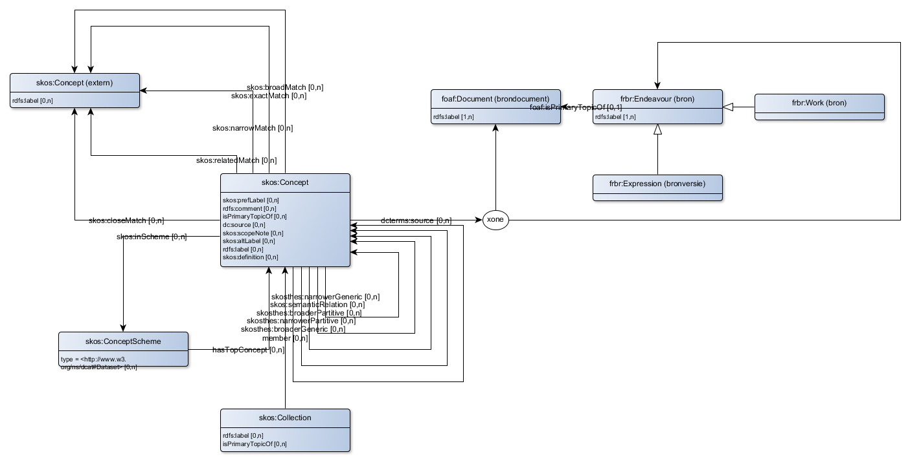

# Modelleringswijze

Er is voor gekozen veel mogelijk gebruik te maken van standaard vocabulaires. Daardoor kunnen applicaties die deze standaard vocabulaires 'begrijpen' al heel veel van de samenhang van de in BP4mc2 gebruikte begrippen 'begrijpen'.

Voor het beschrijven van begrippen worden de volgende standaarden gebruikt:

|prefix|uri
|---|---
|rdfs|http://www.w3.org/2000/01/rdf-schema#
|skos|http://www.w3.org/2004/02/skos/core#

Dit leidt tot de volgende opzet voor het beschrijven van een begrippenkader:

begrippenkader.png

Concept schema’s, collecties en concepten krijgt een uri volgens het patroon:
-	`http://{domain}/id/ConceptScheme}/{rdfs:label}` voor concepten schema’s
-	`http://{domain}/id/Collection}/{rdfs:label}` voor collecties
-	`http://{domain}/id/Concept}/{rdfs:label}` voor concepten

|Requirement|aanduiding|vocabulair
|---|---|---
|Een concepten schema heeft een voor mensen leesbare naam. De conventie is om deze naam in UpperCamelCase te noteren.|has label|rdfs:label
|Een concepten schema heeft 1 begrip dat het schema zelf aanduidt.|has top concept|skos:hasTopConcept

