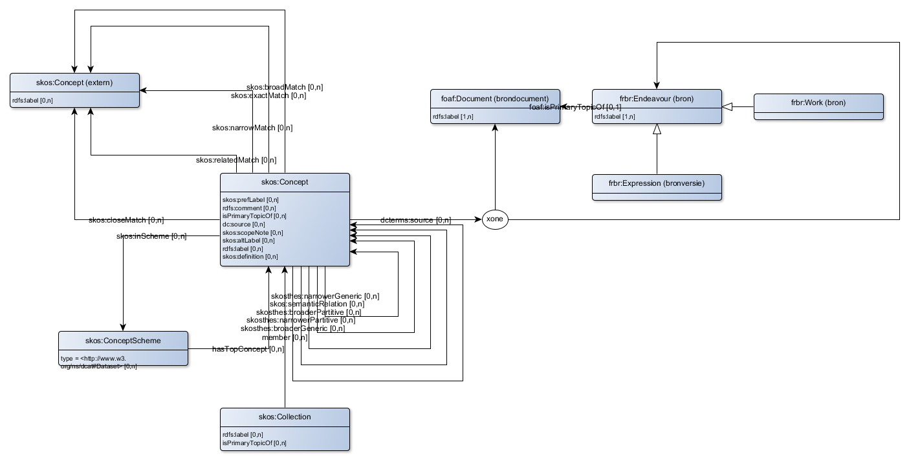
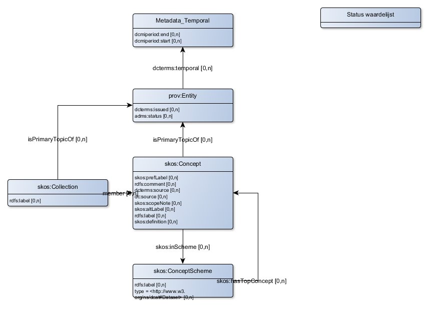

# Modelleringswijze
Er is voor gekozen veel mogelijk gebruik te maken van standaard vocabulaires. Daardoor kunnen applicaties die deze standaard vocabulaires 'begrijpen' al heel veel van de samenhang van de in BP4mc2 gebruikte begrippen 'begrijpen'.

Voor het beschrijven van begrippen worden de volgende standaarden gebruikt:

|prefix|uri
|---|---
|rdfs|http://www.w3.org/2000/01/rdf-schema#
|skos|http://www.w3.org/2004/02/skos/core#

## Begrippenkader
Dit leidt tot de volgende opzet voor het beschrijven van een begrippenkader:

Concept schema’s, collecties en concepten krijgt een uri volgens het patroon:
-	`http://{domain}/id/ConceptScheme}/{rdfs:label}` voor concepten schema’s
-	`http://{domain}/id/Collection}/{rdfs:label}` voor collecties
-	`http://{domain}/id/Concept}/{rdfs:label}` voor concepten
### Concepten schema

|requirement|aanduiding|vocabulair|voorbeeld
|---|---|---|---
|Een concepten schema heeft een voor mensen leesbare naam. De conventie is om deze naam in UpperCamelCase te noteren.|has label|rdfs:label|Het schema dat het domein regelgeving in het DSO beschrijft heeft als label 'Regelgeving'.
|Een concepten schema heeft 1 begrip dat het schema zelf aanduidt.|has top concept|skos:hasTopConcept|Het schema met als label ‘Regelgeving’ heeft als topconcept 'Regelgeving'.

### Collectie

|requirement|aanduiding|vocabulair|voorbeeld
|---|---|---|---
|Een collectie schema heeft een voor mensen leesbare naam. De conventie is om deze naam in UpperCamelCase te noteren.|has label|rdfs:label|De collectie die alle activiteiten in het BAL beschrijft heeft als label 'BAL'

### Concept

|requirement|aanduiding|vocabulair|voorbeeld
|---|---|---|---
|Een begrip bestaat uit een aantal onderdelen.|bestaat uit|skosthes:narrowerPartitive|
|Een begrip is een generalisatie van een begrip met een engere of nauwere betekenis.|generalisatie van|skosthes:narrowerGeneric|
|Een begrip is gerelateerd aan een ander begrip.|gerelateerd aan|skos:semanticRelation|
|Een begrip is gedefinieerd in een bepaald domein|has a domain|skos:inScheme|Basisregistratie Adressen en Gebouwen (BAG)
|Een begrip heeft een uitleg in 'klare taal'.|has comment|rdfs:comment|Een perceel is een stuk grond waarvan het Kadaster de grenzen heeft gemeten en dat bij het Kadaster een eigen nummer heeft.
|Een begrip heeft een formele definitie. Deze wordt waar mogelijk overgenomen uit een officiële publicatie.|has formal definition|skos:definition|Een perceel is een begrensd deel van het Nederlands grondgebied dat kadastraal geïdentificeerd is en met kadastrale grenzen begrensd is.
|Een begrip heeft een voor mensen leesbare naam. De conventie is om deze naam in UpperCamelCase te noteren.|has label|rdfs:label|Perceel
|Een begrip heeft een voor mensen leesbare naam die in documentatie kan worden gebruikt. Dit label kan meertalig zijn, aangegeven door @nl of @en|has preferred label|skos:prefLabel|"Kadastraal perceel"@nl / "Cadastral parcel"@en
|Een begrip kan nader worden toegelicht.|has scope note|skos:scopeNote|Een perceel is een (2D) vlakvormig ruimtelijk object dat "opdelend" van structuur is. Dit betekent dat Nederland altijd naadloos en volledig is bedekt met perceelsvlakken, die elkaar niet mogen overlappen.
|Een begrip is ontleend aan een formele bron. Dit kan een geschreven bron zijn.|has source|dc:source|Europees verdrag voor de rechten van de mens
|Een begrip is ontleend aan een formele bron. Dit kan een bron zijn die direct als ‘resource’ op het web vindbaar is.|has source|dcterms:source|<jci1.3:c:BWBR0005416&titel=IV&hoofdstuk=XV&paragraaf=3&artikel=222>
|Een begrip kan een synoniem hebben|has synonym|skos:altLabel|KadastraalPerceel
|Een begrip gaat over een deel van een breder begrip.|onderdeel van|skosthes:broaderPartitive|
|Een begrip is een specialisatie van een begrip met een bredere betekenis.|specialisatie van|skosthes:broaderGeneric|

Bovenstaande relaties gelden altijd binnen een domein (concept schema). Begrippen uit een domein kunnen worden gekoppeld aan begrippen uit andere domeinen.

|requirement|aanduiding|vocabulair|voorbeeld
|---|---|---|---
|Een begrip is gerelateerd aan een begrip in een ander domein.|afgeleid van|skos:relatedMatch|
|Een begrip betekent precies hetzelfde als een begrip in een ander domein.|exact gelijk aan|skos:exactMatch|
|Een begrip is een specialisatie van een begrip in een ander domein.|lijkt op breder|skos:broadMatch|
|Een begrip is een generalisatie van een begrip in een ander domein.|lijkt op smaller|skos:narrowMatch|
|Een begrip betekent bijna hetzelfde als een begrip in een ander domein.|vergelijkbaar met|skos:closeMatch|

## Meta-eigenschappen
Naast deze eigenschappen die direct betrekking hebben op het begrip zelf, kent de beschrijving van het begrip ook nog enkele specifieke meta-elementen. Deze meta-elementen zeggen iets over de beschrijving van het begrip zelf, zoals de status van deze beschrijving.
- Een conceptenschema kan een standaard zijn, zoals bijvoorbeeld het waterschap lexicon (Aquolex). 
    - De standaard gaat over 1 domein, bijvoorbeeld het aquo domein. Dit wordt vertaald naar een concept schema.
    - Begrippen kunnen worden georganiseerd in collecties, die bijvoorbeeld waardenlijsten representeren. Een voorbeeld uit het aquo domein is de waardenlijst met waterkeringstypen.
    - Begrippen in dit domein worde bijgehouden door de beheerder van de standaard, bijvoorbeeld het Informatie Huis Water.
    - In de standaard doorloopt een begrip verschillende administratieve stadia (statussen). Uiteindelijk wordt het formeel gepubliceerd als onderdeel van de standaard (issued).
    - Deze statussen zijn relevant voor begrippen, niet voor het schema en voor collecties.
- Een begrip uit deze standaard kan door een bevoegd gezag in regelgeving wordt opgenomen, bijvoorbeeld in een waterschapsverordening.
    - Regelgeving gaat over wat mag en niet mag in een bepaald bestuurlijk gebied. Dit gebied is geografisch is afgebakend.
    - Regelgeving wordt opgesteld door een bevoegd gezag, bijvoorbeeld een waterschap.
    - In regelgeving doorloopt de toepassing van een begrip eveneens verschillende statussen. Uiteindelijk wordt het begrip geldig (valid) in het betreffende bestuurlijke gebied (Location) en wordt deze toepassing formeel gepubliceerd (issued) in bijvoorbeeld een waterschapsverordening.
- Op deze wijze wordt een door een standaarden beheerder centraal beheerd begrip via regelgeving juridisch geldig in een of meer bestuurlijke gebieden.
- In het geval van een begrippenmodel van een (basis)registratie vallen regelgeving en standaard samen. Er is 1 beheerder, namelijk de beheerder van de (basis)registratie, die vaak in wet- of regelgeving is aangewezen als een soort van bevoegd gezag voor deze registratie.

|requirement|aanduiding|vocabulair|voorbeeld
|---|---|---|---
|Een versie heeft een administratieve status.|heeft status|adms:status|
|Een versie is formeel/juridisch geldig gedurende een periode.|is geldig in|dcterms:temporal|
|Een versie is formeel bekend gemaakt op een bepaald moment.|is issued|dcterms:issued|

## Gebeurtenissen
### Uitgangspunten
Gebeurtenissen zijn net als begrippen 'concepten'. Ze hebben dezelfde kenmerken als begrippen, die objecten aanduiden, maar hebben ook nog enkele andere kenmerken. 
- Gebeurtenissen worden in wet- en regelgeving beschreven als mogelijke (rechts)handelingen die kunnen plaatsvinden in een bepaald domein. Een voorbeeld is het exploiteren van een jachthaven in het domein van het Besluit Activiteiten Leefomgeving (BAL). 
- In een registratie maken gebeurtenissen de dynamiek van een registratie zichtbaar. Om te begrijpen wat er is veranderd in een registratie helpt het om te zien wat er is gebeurd. Een voorbeeld is het overdragen van een onroerend goed, waarvan het resultaat wordt vastgelegd in de BRK.
Omdat het begrippenkader is gebaseerd op een institutionele bron gaat het daarbij nog steeds om institutionele gebeurtenissen, bijvoorbeeld rechtshandelingen. Deze hebben altijd een aanleiding in de natuurlijke werkelijkheid. Institutionele gebeurtenissen zijn, zoals in de denkwijze aangegeven, onderdeel van de institutionele werkelijkheid en kennen daarmee vaak een of meerdere actoren, bijvoorbeeld de verkoper en de koper bij de overdracht van een huis. En niet iedereen is bevoegd om een institutionele gebeurtenis vast te leggen. Dat gebeurt door een beëdigd ambtenaar of door een notaris. Dit wordt een ‘agent’ (in de Engelse betekenis van het woord) genoemd. Tot slot zijn er de regels ofwel normen waaraan voldaan moet zijn voordat het feit kan plaatsvinden, de voorwaarde en de regels waaraan het resultaat van de gebeurtenis voldoet, de eindsituatie.

### Model
Om gebeurtenissen c.q. rechtshandelingen te kunnen beschrijven worden begrippen getypeerd als activiteit (act), actor, agent, norm en object. De samenhang tussen deze begrippen is weergegeven in onderstaande figuur. In juridische termen wordt een actor ook wel een normadressaat genoemd.

|requirement|aanduiding|vocabulair|voorbeeld
|---|---|---|---
|Een handeling wordt uitgevoerd door een actor|actor|skoslex:actor|
||agent|skoslex:agent|
|Een handeling wordt uitgevoerd in relatie tot een object|object|skoslex:object|
||refersTo|skoslex:refersTo|

## Waardelijsten

