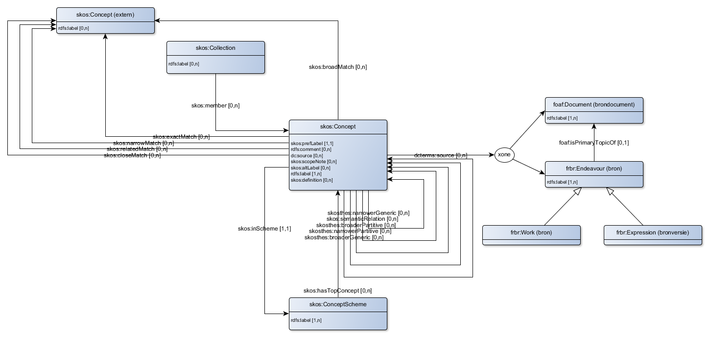
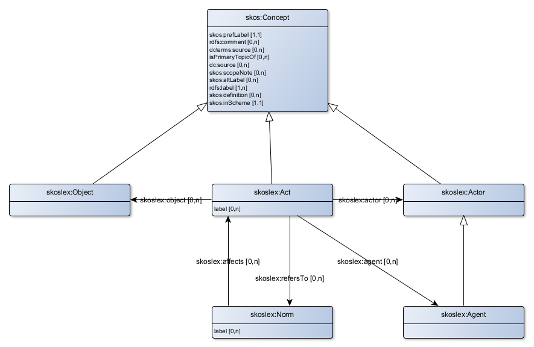

# Modelleringswijze
Er is voor gekozen veel mogelijk gebruik te maken van standaard vocabulaires. Daardoor kunnen applicaties die deze standaard vocabulaires 'begrijpen' al heel veel van de samenhang van de in BP4mc2 gebruikte begrippen 'begrijpen'.

Voor het beschrijven van begrippen worden de volgende standaarden gebruikt:

|prefix|uri|website
|---|---|---
|dct|http://dublincore.org/documents/dcmi-terms/|[http://www.dublincore.org/documents/dcmi-terms/](http://www.dublincore.org/documents/dcmi-terms/)
|rdfs|http://www.w3.org/2000/01/rdf-schema#|[http://www.w3.org/TR/rdf-schema/](http://www.w3.org/TR/rdf-schema/)
|skos|http://www.w3.org/2004/02/skos/core#|[http://www.w3.org/TR/skos-reference/](http://www.w3.org/TR/skos-reference/)

## Begrippenkader
Dit leidt tot de volgende opzet voor het beschrijven van een begrippenkader:

Concept schema's, collecties en concepten krijgt een uri volgens het patroon:
-	`http://{domain}/id/ConceptScheme}/{UpperCamelCase(skos:prefLabel)}` voor concepten schema's
-	`http://{domain}/id/Collection}/{UpperCamelCase(skos:prefLabel)}` voor collecties
-	`http://{domain}/id/Concept}/{UpperCamelCase(skos:prefLabel)}` voor concepten

Op het moment dat bovenstaande nog niet tot een unieke URI leidt (bijvoorbeeld als binnen een conceptschema twee concepten bestaan met hetzelfde `skos:prefLabel`), dan wordt de URI uitgebreid met een underscore (`_`), gevolgd door een term waaruit het onderscheid blijkt. Deze term wordt vervolgens ook tussen haakjes opgenomen in het `rdfs:label` van dit concept. Voorbeeld:

	ex:Pand_Recht a skos:Concept;
	  skos:prefLabel "Pand"@nl;
	  rdfs:label "Pand (Recht)"@nl
	.
	ex:Pand_Gebouw a skos:Concept;
	  skos:prefLabel "Pand"@nl;
	  rdfs:label "Pand (Gebouw)"@nl
	.

In een dergelijk geval is het niet meer mogelijk om automatisch vanuit het `skos:prefLabel` de URI te generen, en is een handmatige actie noodzakelijk.

### Concepten schema

|requirement|aanduiding|vocabulair|voorbeeld
|---|---|---|---
|De kennis over de fysieke werkelijkheid wordt beschreven in een talig model, een begrippenmodel.  In een begrippenmodel wordt deze kennis zodanig gestructureerd vastgelegd dat deze door zowel mensen als door computers wordt begrepen.|Begrippenkader|skos:ConceptScheme|De thesaurus of taxonomie met alle begrippen in het Kadastrale domein. Deze begrippen vinden hun oorsprong in de Kadasterwet, die beschrijft wat percelen en rechten daarop betekenen.
|Een begrippenkader kan worden getypeerd als een asset|getypeerd als asset|rdf:type|
|Een begrippenkader heeft een voor mensen leesbare naam. Spaties en diacritische tekens zijn  toegestaan. |label|rdfs:label|Het schema dat het domein regelgeving beschrijft heeft als label 'Regelgeving'.
|Een concepten schema kan concepten bevatten die die het meest generiek zijn in een hiërarchie van specialisaties/generalisaties.|top concept|skos:hasTopConcept|Het concept 'Zakelijk recht' als meest generieke concept voor 'Eigendom', 'Opstal', 'Erfpacht', etc.

### Collectie

|requirement|aanduiding|vocabulair|voorbeeld
|---|---|---|---
|Een groep samenhangende begrippen kan worden gebundeld in een collectie.|Collectie|skos:Collection|De collectie die alle activiteiten in het BAL beschrijft.
|Een collectie  heeft een voor mensen leesbare naam. Spaties en diacritische tekens zijn daarin toegestaan.|label (collectie)|rdfs:label|De collectie die alle activiteiten in het BAL beschrijft heeft als label 'BAL'
|Een collectie kan één of meerdere begrippen omvatten, die eventueel afkomstig kunnen zijn uit meerdere conceptschema's|heeft lid|skos:member|de collectie 'Zakelijke rechten' bevat het begrip 'Erfpacht'
|Van een collectie kan de herkomst worden beschreven.|herkomst (collectie)|foaf:isPrimaryTopicOf|Op basis van de nieuwe wet op de BAG is een aantal begrippen toegevoegd aan de collectie 'aard gebruik'

### Concept

|requirement|aanduiding|vocabulair|voorbeeld
|---|---|---|---
|Een begrip is een idee of notitie, een eenheid van denken, een onderwerp van gesprek.|Begrip|skos:Concept|
|Een begrip kan een alternatieve aanduiding, een synoniem hebben|alternatieve aanduiding|skos:altLabel|KadastraalPerceel
|Een begrip kan een formele definitiehebben. Deze wordt waar mogelijk overgenomen uit een officiële publicatie.|definitie|skos:definition|Een perceel is een begrensd deel van het Nederlands grondgebied dat kadastraal geïdentificeerd is en met kadastrale grenzen begrensd is.
|Een begrip is ontleend aan een geschreven bron.|geschreven bron|dc:source|Europees verdrag voor de rechten van de mens
|Een begrip wordt aangeduid met een voor mensen leesbare term (inclusief spaties en diacrieten). Deze is gelijk aan het skos:prefLabel. Uitzondering hierop is de situatie dat binnen 1 conceptschema er vaker dezelfde skos:prefLabel wordt gebruikt. Dit is geen good practice en dient zoveel mogelijk voorkomen te worden. In het geval dat dit toch voorkomt, krijgt het rdfs:label een toevoeging tussen haakjes die het onderscheid aangeeft. Dit label kan meertalig zijn, aangegeven door @nl of @en|label (begrip)|rdfs:label|"Kadastraal perceel"@nl / "Cadastral parcel"@en
|Een begrip kan nader worden toegelicht.|toelichting|skos:scopeNote|Een perceel is een (2D) vlakvormig ruimtelijk object dat "opdelend" van structuur is. Dit betekent dat Nederland altijd naadloos en volledig is bedekt met perceelsvlakken, die elkaar niet mogen overlappen.
|Een begrip heeft bij voorkeur een uitleg in ‘klare taal’.|uitleg|rdfs:comment|Een perceel is een stuk grond waarvan het Kadaster de grenzen heeft gemeten en dat bij het Kadaster een eigen nummer heeft.
|Een begrip heeft een voor mensen leesbare voorkeursterm. Er is precies 1 voorkeursterm in de voorkeurstaal (dit veld is dus niet meertalig). Het is een good practice dat ieder begrip binen 1 begrippenkader een uniek prefLabel heeft.|voorkeursterm|skos:prefLabel|Kadastraal perceel
|Een begrip kan kan gaan over een aantal onderdelen.|bestaat uit|skosthes:narrowerPartitive|Een schip bestaat uit een romp, kajuit, motor, ... 
|Een begrip kan zijn ontleend aan een op het web vindbare bron. Dit kan een (versie van) een beschrijving van een specifiek begrip of een document waarin een beschrijving van het begrip is te vinden.|bron op het web|dcterms:source|<jci1.3:c:BWBR0005416&titel=IV&hoofdstuk=XV&paragraaf=3&artikel=222>
|Een begrip is gedefinieerd in de context van een bepaald domein.|domein|skos:inScheme|Basisregistratie Adressen en Gebouwen (BAG)
|Een begrip kan een generalisatie zijn van een begrip met een engere of nauwere betekenis.|generalisatie van|skosthes:narrowerGeneric|Een KadastraalObject is een OnroerendGoed of een Registergoed.
|Een begrip kan gerelateerd zijn aan een ander begrip.|gerelateerd aan|skos:semanticRelation|Een perceel is gerelateerd aan KadastraleGrens.
|Van een begrip kan de herkomst, geldigheid en status worden beschreven.|herkomst (begrip)|foaf:isPrimaryTopicOf|De uitleg van een begrip is aangepast naar aanleiding van een vraag van een klant
|Een begrip kan gaan over een deel van een breder begrip.|onderdeel van|skosthes:broaderPartitive|Een motor is onderdeel van een schip.
|Een begrip kan een specialisatie zijn van een begrip met een bredere betekenis.|specialisatie van|skosthes:broaderGeneric|Een Perceel is een OnroerendGoed.

Bovenstaande relaties gelden altijd binnen een domein (concept schema). Begrippen uit een domein kunnen worden gekoppeld aan begrippen uit andere domeinen.

|requirement|aanduiding|vocabulair|voorbeeld
|---|---|---|---
|Een begrip kan precies hetzelfde betekenen als een begrip in een ander domein.|exact gelijk aan|skos:exactMatch|Een Perceel in het BAL betekent hetzelfde als een Perceel in de BRK.
|Een begrip kan zijn gerelateerd aan een begrip in een ander domein.|gerelateerd aan|skos:relatedMatch|Een Perceel in de BRK is gerelateerd aan een adres (Nummeraanduiding) in de BAG.
|Een begrip kan een specialisatie zijn van een begrip in een ander domein.|lijkt op breder|skos:broadMatch|Een Appartementsrecht in de BRK is een specialisatie van een Verblijfsobject in de BAG.
|Een begrip kan een generalisatie zijn van een begrip in een ander domein.|lijkt op smaller|skos:narrowMatch|Een Postadres is een generalisatie van een Nummeraanduiding en een Postbus.
|Een begrip kan bijna hetzelfde betekenen als een begrip in een ander domein.|vergelijkbaar met|skos:closeMatch|Een OnroerendGoed in de BRK is ongeveer hetzelfde als een WOZobject in de WOZ.

## Meta-eigenschappen
Naast deze eigenschappen die direct betrekking hebben op het begrip zelf, kent de beschrijving van het begrip ook nog enkele specifieke meta-elementen. Deze meta-elementen zeggen iets over de beschrijving van het begrip zelf, zoals de status van deze beschrijving.
- Een conceptenschema kan een standaard zijn, zoals bijvoorbeeld het waterschap lexicon (Aquolex).
    - De standaard gaat over 1 domein, bijvoorbeeld het aquo domein. Dit wordt vertaald naar een concept schema.
    - Begrippen kunnen worden georganiseerd in collecties, die bijvoorbeeld waardenlijsten representeren. Een voorbeeld uit het aquo domein is de waardenlijst met waterkeringstypen.
    - Begrippen in dit domein worde bijgehouden door de beheerder van de standaard, bijvoorbeeld het Informatie Huis Water.
    - In de standaard doorloopt een begrip verschillende administratieve stadia (statussen). Uiteindelijk wordt het formeel gepubliceerd als onderdeel van de standaard (issued).
    - Deze statussen zijn relevant voor begrippen, niet voor het schema en voor collecties.
- Een begrip uit deze standaard kan door een bevoegd gezag in regelgeving wordt opgenomen, bijvoorbeeld in een waterschapsverordening.
    - Regelgeving gaat over wat mag en niet mag in een bepaald bestuurlijk gebied. Dit gebied is geografisch is afgebakend.
    - Regelgeving wordt opgesteld door een bevoegd gezag, bijvoorbeeld een waterschap.
    - In regelgeving doorloopt de toepassing van een begrip eveneens verschillende statussen. Uiteindelijk wordt het begrip geldig (valid) in het betreffende bestuurlijke gebied (Location) en wordt deze toepassing formeel gepubliceerd (issued) in bijvoorbeeld een waterschapsverordening.
- Op deze wijze wordt een door een standaarden beheerder centraal beheerd begrip via regelgeving juridisch geldig in een of meer bestuurlijke gebieden.
- In het geval van een begrippenmodel van een (basis)registratie vallen regelgeving en standaard samen. Er is 1 beheerder, namelijk de beheerder van de (basis)registratie, die vaak in wet- of regelgeving is aangewezen als een soort van bevoegd gezag voor deze registratie.

|requirement|aanduiding|vocabulair|voorbeeld
|---|---|---|---
|Metadata van een versie van een entiteit kan worden beschreven.|Metadata|prov:Entity|De juridische geldigheid en/of de adnimistratieve housekeeping (provenance) gegevens van een entiteit
|Een versie kan bekend worden gemaakt vanaf een bepaald moment.|bekendgemaakt|dcterms:issued|21/10/2017 20:21
|De reden van een versie en andere aandachtspunten bij een versie kunnen worden toegelicht.|wijzingsnotitie (metadata)|skos:changeNote|De toelichting is uitgebreid vanwege een onduidelijkheid.
|Een versie kan formeel/juridisch geldig zijn in een gebied.|geldig in gebied|dcterms:spatial|gemeente Apeldoorn
|Een versie kan formeel/juridisch geldig zijn gedurende een periode.|geldig in tijd|dcterms:temporal|22/10/2017 - 
|Een versie heeft een administratieve status op basis van de ADMS waardenlijst.|status|adms:status|Completed

|requirement|aanduiding|vocabulair|voorbeeld
|---|---|---|---
|Een periode eindigt op een bepaalde dataum. Deze datum kan onbekend (leeg) zijn.|einde|dcmiperiod:end|01/08/2018
|Een periode start op een bepaalde datum. Deze datum kan onbekend (leeg) zijn.|start|dcmiperiod:start|22/10/2017

## Gebeurtenissen
### Uitgangspunten
Gebeurtenissen zijn net als begrippen 'concepten'. Ze hebben dezelfde kenmerken als begrippen, die objecten aanduiden, maar hebben ook nog enkele andere kenmerken.
- Gebeurtenissen worden in wet- en regelgeving beschreven als mogelijke (rechts)handelingen die kunnen plaatsvinden in een bepaald domein. Een voorbeeld is het exploiteren van een jachthaven in het domein van het Besluit Activiteiten Leefomgeving (BAL).
- In een registratie maken gebeurtenissen de dynamiek van een registratie zichtbaar. Om te begrijpen wat er is veranderd in een registratie helpt het om te zien wat er is gebeurd. Een voorbeeld is het overdragen van een onroerend goed, waarvan het resultaat wordt vastgelegd in de BRK.
Omdat het begrippenkader is gebaseerd op een institutionele bron gaat het daarbij nog steeds om institutionele gebeurtenissen, bijvoorbeeld rechtshandelingen. Deze hebben altijd een aanleiding in de natuurlijke werkelijkheid. Institutionele gebeurtenissen zijn, zoals in de denkwijze aangegeven, onderdeel van de institutionele werkelijkheid en kennen daarmee vaak een of meerdere actoren, bijvoorbeeld de verkoper en de koper bij de overdracht van een huis. En niet iedereen is bevoegd om een institutionele gebeurtenis vast te leggen. Dat gebeurt door een beëdigd ambtenaar of door een notaris. Dit wordt een 'agent' (in de Engelse betekenis van het woord) genoemd. Tot slot zijn er de regels ofwel normen waaraan voldaan moet zijn voordat het feit kan plaatsvinden, de voorwaarde en de regels waaraan het resultaat van de gebeurtenis voldoet, de eindsituatie.

### Model
Om gebeurtenissen c.q. rechtshandelingen te kunnen beschrijven worden begrippen getypeerd als activiteit (act), actor, agent, norm en object. De samenhang tussen deze begrippen is weergegeven in onderstaande figuur. In juridische termen wordt een actor ook wel een normadressaat genoemd.

|requirement|aanduiding|vocabulair|voorbeeld
|---|---|---|---
|De klasse van handelingen. Een handeling is een juridische constructie die een verzamelingen activiteiten voorstelt, uitgevoerd door een Actor en op een Object.|Handeling|skoslex:Act|De levering van een onroerend goed zoals vastgelegd in een notariele akte (rechtshandeling), Het bouwen van een bouwwerk (handeling)
|||rdfs:label|
|Actor relateert een handeling aan de actor die de handeling uitvoert|actor|skoslex:actor|Jan Jansen in zijn rol van koper van een onroerend goed.
|Agent relateert een handeling aan de agent die bij de handeling betrokken is|agent|skoslex:agent|Een notaris die een akte opmaakt bij de koop van een onroerend goed.
|Object relateert een handeling met een object dat ontstaat, wijzigt of wordt gebruikt gedurende een act|object|skoslex:object|Het onroerend goed DPV00 B 1207 als onderwerp van de koop.
|Verwijst naar relateert een norm aan de handeling waarnaar de norm refereert. Zo'n handeling heeft een relatie met de norm, zonder verdere specificatie. Het kan zijn dat de norm bepaalde zaken voorschrift, maar het kan ook zijn dat de handeling een preconditie is, of gewoon benoemd is in de regels.|verwijst naar|skoslex:refersTo|De verkoper van een onroerend goed moet bij de verkoop ervan kunnen aantonen dat hij eigenaar is.
|De klasse van actoren. Een actor is een persoon (individu, groep of organisatie) die een handeling uitvoert|Actor|skoslex:Actor|Jan Jansen.
|De klasse van agenten. Een agent is een persoon (individu, groep of organisatie) die bij een handeling betrokken is, zonder de handeling feitelijk uit te voeren.|Agent|skoslex:Agent|Notaris Pietersen.
|The klasse van normen. Een norm heeft effect op een handeling. De norm stelt wat 'zou moeten' of juist 'niet zo moeten' met betrekking tot de handeling. Een norm representeert de regels die gelden voor de handeling.|Norm|skoslex:Norm|De verkoper van een onroerend goed moet bij de verkoop ervan kunnen aantonen dat hij eigenaar is.
|||rdfs:label|
|Normeert relateert een norm aan de handeling die de norm normeert. Zo'n handeling wordt beperkt door de regels van de norm|normeert|skoslex:affects|
|De klasse van objecten. Een object is een ding (niet een actor) dat ontstaat, wijzigt of gebruikt wordt gedurende een handeling|Object|skoslex:Object|Het onroerend goed DPV00 B 1207.

## Waardelijsten
Een speciale categorie waarin informatie over begrippen wordt vastgelegd betreft waardenlijsten. Waarden zijn termen die bepaalde, samenhangende begrippen aanduiden waaraan in verschillende toepassingen en soms zelfs bij verschillende organisaties wordt gerefereerd. Soms worden dit daarom ook referentiedata genoemd.
Elementen in een waardenlijst worden stuk voor stuk aangeduid met een begrip in het begrippenkader. Een voorbeeld uit de BAG is het 'gebruiksdoel' van een 'pand'. Dat kan 'wonen', 'winkel', 'kantoor', et cetera zijn. Semantisch betekent dit dat er verschillende soorten panden zijn, namelijk woonhuizen, winkels en kantoren. Om het datamodel overzichtelijk te houden is in de BAG de ontwerpkeuze gemaakt om 1 objecttype te definiëren. Dit heeft als attribuuttype 'gebruiksdoel', dat de waarden “wonen”, “winkel”, “kantoor”, et cetera in de waardenlijst kan aannemen. Bijkomend voordeel is dat het datamodel niet hoeft te worden aangepast als er een gebruiksdoel bij komt. Dan hoeft alleen maar een nieuw element aan de waardenlijst te worden toegevoegd.
Een ander type waardenlijst is een lijst met instanties van een klasse. Een voorbeeld is een lijst van Nederlandse gemeenten of een lijst met bestuurlijke gebieden.
Voor de structuur van de waardenlijst maakt het niet uit of het een lijst (skos collectie) is met een aantal instanties van skos concepten of een lijst met mogelijke instanties van een klasse.
- Beide vormen hebben een basale structuur met soms een code (bijvoorbeeld de CBS-gemeentecode) en altijd een omschrijving (bijvoorbeeld de gemeentenaam).
    - Voor de omschrijving wordt het skos:prefLabel gebruikt.
    - Voor de code kan skos:notation worden gebruikt.
- Wanneer een waardenlijst als Linked data wordt gepubliceerd krijgt iedere waarde in die lijst bovendien een uri.
    - Een waarde in een lijst (collectie) van begrippen krijgt een uri volgens het patroon: https://{domein}/id/Concept/{rdfs:label}.
    - Een waarde in een lijst met instanties van een klasse krijgt een uri volgens het patroon https://{domein}/id/{Klassenaam}/{rdfs:label}, waarbij het label de naam van de betreffende instantie is.
- De waarden in de waardenlijst kunnen dezelfde metadata meekrijgen als begrippen, namelijk has status, is generated at time, is invalidated at time, is valid during, is issued, is valid at.
- Indien gewenst kunnen extra kenmerken worden toegevoegd, bijvoorbeeld de geometrie van bestuurlijk gebied en visualisatiecodes voor afbeelding op een kaart.

|requirement|aanduiding|vocabulair|voorbeeld
|---|---|---|---
|Een waardelijst is een verzameling van begrippen of elementen die worden gebruikt om inhoud te indexeren en / of inhoud op te halen via browsen of zoeken. Hij bevat meestal voorkeurs- en varianttermen en heeft een gedefinieerde scope of beschrijft een specifiek domein.|Asset (Waardelijst)|adms:Asset (Waardelijst)|De lijst met Kadastrale gemeenten.
|||dcterms:type|
|Een waardelijst wordt getypeerd als adms:Asset.||rdf:type|De lijst met Kadastrale gemeenten is vindbaar als een adms:Asset.
|Een waardelijst heeft een naam.|naam|rdfs:label|Landenlijst
|A controlled vocabulary has a label.|naam|rdfs:label|Landenlijst
|||dcat:landingPage|
||distributie|dcat:distribution|
|Een waardelijst kan onderdeel zijn van een dataset.|onderdeel van|dcterms:isPartOf|De lijst met Kadastrale gemeenten is onderdeel van de BRK.
||specificatie|rdfs:isDefinedBy|
||Waardelijstdistributie|adms:Distribution|
|||dcat:accessURL|
|||adms:representationTechnique|
|||dcat:downloadURL|

## Administratieve werkelijkheid - Informatiemodel

|requirement|aanduiding|vocabulair|voorbeeld
|---|---|---|---
||Asset (Informatiemodel)|adms:Asset (Informatiemodel)|
|||dcterms:type|
|||rdf:type|
||label|rdfs:label|'IMKAD'
||distributie|dcat:distribution|
||landingspagina|dcat:landingPage|

### Vertaling begrippenkader naar een datamodel
Het begrippenkader is bruikbaar om met domeineigenaren en data afnemers te communiceren over de inhoud van een registratie. Het vertalen van dit begrip naar een samenhangend datamodel is het werkveld van de data architect. Een datamodel kan worden opgevat als een ontwerp van een structuur waarin data over de begrippen in het semantische model kunnen worden opgeslagen.
Een hulpmiddel voor het maken van een datamodel is het KKG-metamodel. Dit model bevat objectklassen, attribuutsoorten, gegevensgroepen, gegevensgroeptypen, generalisaties, relatiesoorten en relatieklassen. Een met KKG gemaakt informatiemodel kan worden uitgedrukt in UML of in RDF. Met andere woorden het is 'vormvrij'.
Een KKG-klasse is in de regel een realisatie van een begrip. Zo is het de attribuutsoort 'hoofdadres' in de BRK de realisatie van het begrip 'Hoofdadres' en de objectklasse 'AdresseerbaarObject', waarbij een 'hoofdadres' hoort de realisatie van het begrip 'AdresseerbaarObject'. Het begrip 'AdresseerbaarObject' gaat over de (talige, dat wil zeggen in taal) betekenis van een adresseerbaar object. De objectklasse is als het ware een 'bakje' waarin de data over een adresseerbaar object kan worden opgeslagen.
Een op deze manier uitgewerkt voorbeeld van het model van de BRK is te vinden op [http://brk.basisregistraties.overheid.nl/def/objectklasse/AdresseerbaarObject#hoofdadres] . Dit voorbeeld is beschikbaar als html webpagina, in turtle en als grafische representatie.
Dit voorbeeld laat ook mooi zien hoe de uri-strategie voor het beschrijven van een datamodel werkt. Het intypen van bovenstaande URL zal leiden tot de weergave van de pagina [http://brk.basisregistraties.overheid.nl/def/objectklasse/AdresseerbaarObject] (het deel voor de "#"). Met andere woorden: de beschrijving van de entiteit "Adresseerbaar object"

## Catalogus
### Uitgangspunten
Op het web is het gebruikelijk data te beschrijven in een catalogus met behulp van DCAT (Data Catalog). DCAT is een W3C standaard die door de EU (ISA) wordt voorgeschreven om datasets binnen Europa op een interoperabele wijze te beschrijven. In Nederland wordt DCAT onder andere toegepast in data.overheid.nl, waar alle open datasets in Nederland worden beschreven. Het nationaal georegister (nationaalgeoregister.nl), waar alle open geo-datasets worden beschreven biedt een DCAT export. Voor data.overheid.nl is het toepassingsprofiel DCAT-AP-NL gemaakt. Daarin wordt beschreven welke elementen uit DCAT worden gebruikt en hoe deze elementen specifiek worden ingevuld. Voor de geo-wereld is er Geo-DCAT-AP, dat door de EU (ISA) is opgesteld.
Voor de catalogus geldt dat het applicatieprofiel voor DCAT moet voldoen aan bestaande applicatieprofielen voor DCAT, met name DCAT-AP-NL en geoDCAT-AP.
- [Het Nederlands Applicatieprofiel voor DCAT (DCAT-AP-NL)](https://data.overheid.nl/sites/default/files/2014-11-13%20DCAT-NL%20IPM%20Datasets%200.6%20kopie.pdf).
    - is gebaseerd op het [DCAT Application Profile voor data portals in Europa](https://joinup.ec.europa.eu/asset/dcat_application_profile/description).
    - geeft richtlijnen voor de vertaling van metagegevens in overeenstemming met het Nederlandse metadata profiel op ISO 19115 Geografie, 1.3.1 (ISO19115)
    - is gespecificeerd in een IPM
- [geoDCAT-AP](https://joinup.ec.europa.eu/node/154143/)
    - is een profiel voor data portals in Europa voor het beschrijven van geo datasets, datasetseries en services.
    - biedt een RDF-syntaxbinding voor de alle metadata-elementen van het kernprofiel van ISO 19115: 2003 en die welke zijn gedefinieerd in het kader van de [INSPIRE-richtlijn](http://eur-lex.europa.eu/LexUriServ/LexUriServ.do?Uri=PB:L:2007:108:0001:0014:nl:PDF)
Vaak wordt de term Informatie Publicatie Model (IPM) gebruikt. Een IPM voor datasets geeft een norm voor de online uitwisseling van metadata tussen Nederlandse gegevens en catalogi, waaronder: data.overheid.nl, National Geo Register (NGR) en bijvoorbeeld de (open) data catalogus van gemeenten en provincies.
#### Catalogus
Een catalogus kan worden opgezet als Metadata Broker.
Een Metadata Broker verzamelt meta data uit verschillende catalogi en ontgrendelt deze collectie weer in een aparte catalogus. De Broker Metadata Catalogus bevat beschrijvingen van de andere catalogi en hun catalogusrecords. Zo worden datasets beschreven in meerdere catalogi. Dit maakt dat deze datasets vanuit dezelfde bron in verschillende contexten, bijvoorbeeld als statistische gegevens en als geografische gegevens, kunnen worden beschreven.
- Een dataset wordt 1 keer als 'abstracte dataset' opgenomen in de catalogus. Dit gebeurt door een link naar de publicatie van de beheerder van de originele dataset in de dcat repository van deze beheerder.
- Een (concrete) versies van deze abstracte dataset is een Concrete dataset. Deze versies worden door de beheerder van de originele dataset gepubliceerd en gedocumenteerd in de dcat repository van deze beheerder. Doordat er vanuit de catalogus al een link is naar de Abstracte dataset en doordat een Concrete dataset wordt gekoppeld aan de Abstracte dataset, is deze informatie direct beschikbaar in onze catalogus.
- Een informatieproduct wordt afgeleid van een dataset. Meestal bevat zo'n informatieproduct een subset van de data in de totale dataset.
- Een informatieproduct wordt uiteindelijk verspreid als datadistributie.
Op basis van deze uitgangspunten ontstaat het volgende DCAT-profiel van onze catalogus. Dit profiel is ontleend aan de [actuele DCAT specificatie](https://www.w3.org/TR/vocab-dcat/) en het [ADMS profiel](https://www.w3.org/TR/vocab-adms/).
#### Dataset
Een dataset wordt door de W3C niet scherp gedefinieerd. Dit, aldus een van de DCAT-auteurs op het DCAT congres in november 2016, met opzet niet gedaan om mogelijk te maken dat je dit begrip ruimt kunt gebruiken. Een dataset is eigenlijk alles wat je een dataset noemt. Dat geeft de ruimte om samenhangende sets met informatie op verschillende niveaus te beschrijven als dataset.
- Een (bron)document dat informatie bevat kan worden beschreven als dataset. In de context van bijvoorbeeld de Omgevingswet kan de Omgevingswet zelf (1 wet) als dataset worden beschreven, net als de verzameling van AMVB's en ministeriële regelingen waarin deze wet wordt uitgewerkt als dataset kan worden beschreven.
- Net zo kan een registratie (bijvoorbeeld de BRK) als dataset worden beschreven. Ook een uit een subset van data in die registratie opgebouwd informatieproduct kan als dataset worden beschreven.

We staan voor een aanpak waarin de metadata elke dataset aan de bron worden beschreven en metadata brokers deze informatie aan de bron koppelen. Daarbij wordt iedere dataset in 1 catalogus beschreven. Dat is dan de authentieke bron van die metadata.
- Een dataset wordt 1 keer als abstracte (versieloze) dataset aan de catalogus gekoppeld. Deze beschrijving gaat over alle versies die ooit zijn geweest of ooit zullen zijn.
- Als er een nieuwe versie van een dataset komt, wordt deze door de eigenaar in zijn eigen omgeving als nieuwe versie van de abstracte dataset gepubliceerd. Doordat de catalogus een link bevat naar de originele abstracte dataset, is deze nieuwe versie direct vindbaar.
- Voor beschrijvingen van een authentieke registratie wordt een nieuwe versie van het informatiemodel beschouwd als een nieuwe versie van de dataset. Wanneer data direct uit een registratie wordt gehaald, bijvoorbeeld via een API of via het Linked data protocol, is er niet sprake van een traditionele dataset waarvan periodiek, bijvoorbeeld maandelijks een nieuwe versie wordt verspreid. Dat zou na iedere mutatie een nieuwe versie opleveren.
Een beschrijving van een subset van een dataset die bijvoorbeeld als informatieproduct beschikbaar is, wordt eveneens beschreven als een dataset.
#### Distributie
Iedere fysieke verspreidingsvorm van een dataset (dat is altijd een informatieproduct), wordt beschreven als een datadistributie. Deze bevat bijvoorbeeld de verwijzing naar een downloadportaal of een API-store.
### Model
Voor calalogi worden de volgende standaarden gebruikt:

|prefix|uri|website
|---|---|---
|adms|http://www.w3.org/ns/adms#|[http://www.w3.org/TR/vocab-adms/](http://www.w3.org/TR/vocab-adms/)
|dcat|http://www.w3.org/ns/dcat#|[http://www.w3.org/TR/vocab-dcat/](http://www.w3.org/TR/vocab-dcat/)
|prov|http://www.w3.org/ns/prov#|[http://www.w3.org/TR/prov-o/](http://www.w3.org/TR/prov-o/)

De centrale elementen zijn catalogus (dcat:Catalog), dataset (dcat:Dataset) en distributie (dcat:Distribution).

#### Catalogus

|requirement|aanduiding|vocabulair|voorbeeld
|---|---|---|---
||Catalogus|dcat:Catalog|
|De catalogus heeft een duidelijke beschrijving|beschrijving|dcterms:description|De Catalogus voor de Omgevingswet is een centrale ingang tot het stelsel, waarin wetgeving, begrippen, regels, informatiemodellen, datasets, producten en services met elkaar worden verbonden. De catalogus is daarmee een centrale plek waar de verschillende gebruikersgroepen van het stelsel kunnen zien waar het stelsel uit bestaat, wat begrippen betekenen en hoe de verschillende elementen van het stelsel aan elkaar zijn gerelateerd.
|De catalogus als portaal is vindbaar op een homepage.|homepage|foaf:homepage|http://catalogus.kadaster.nl/
|Een licentie is van toepassing op de catalogus zelf. Dit kan een andere licentie zijn als de licentie voor distributies van datasets|licentie|dcterms:license|Creative Commons Naamsvermelding 4.0 licentie
|De catalogus is op een bepaalde datum gepubliceerd|publicatiedatum|dcterms:issued|1/10/2016
|Een beschrijving van de rechten die van toepassing is op de catalogus. Dit kunnen andere rechten zijn als die voor distributies van datasets|rechten|dcterms:rights|Proclaimer: De Catalogus voor de Omgevingswet verbindt definities, toelichtingen en uitleg van begrippen, regels, informatiemodellen, producten en services met elkaar. De datasets waarin deze worden beschreven worden federatief beheerd door de betreffende bronhouders. Bij iedere dataset wordt aangegeven wie de bronhouder is en daarmee verantwoordelijk is voor de inhoud.
|De taal waarin de catalogus is beschreven|taal|dcterms:language|@nl
||titel|dcterms:title|Catalogus Omgevingswet
|De datum waarop iets in de catalogus zelf is veranderd, wordt bewaard, bijvoorbeeld een eigenschap van de catalogus of een nieuwe dataset|wijzigingsdatum|dcterms:modified|1/10/2016
|||dcat:dataset|

#### Dataset

|requirement|aanduiding|vocabulair|voorbeeld
|---|---|---|---
||Dataset|dcat:Dataset|
|De dataset heeft een duidelijke beschrijving|beschrijving|dcterms:description|Met de Omgevingswet wil de overheid de regels voor ruimtelijke ontwikkeling vereenvoudigen en samenvoegen. Zodat het straks bijvoorbeeld makkelijker is om bouwprojecten te starten. De Crisis- en herstelwet (Chw) maakt dit nu al mogelijk, bijvoorbeeld door bestaande regels aan te passen. Naar verwachting treedt de Omgevingswet in 2019 in werking.
|De dataset heeft een naam|naam|dcterms:title|'Omgevingswet','BAL','BRK', etc'
|De dataset is op een bepaalde datum gepubliceerd. Dit is de oorspronkelijke publicatiedatum. Het is niet per se de datum van opname van de dataset in de catalogus.|publicatiedatum|dcterms:issued|1/10/2017
|De taal waarin de dataset is beschreven (vanwege de compatibiliteit met het DCAT-AP NL)|taal|dcterms:language|@nl
|||foaf:isPrimaryTopicOf|
|Het is bekend door wie een dataset wordt gepubliceerd. Deze organisatie of persoon heeft toestemming om deze handeling uit te voeren|publicist|dcterms:publisher|overheid:Rijkswaterstaat

#### Dataset versie

|requirement|aanduiding|vocabulair|voorbeeld
|---|---|---|---
||Datasetversie|dcat:Dataset (versie)|
|||rdf:type|
|De versie van de dataset.|versie|adms:version|2.1.0
|Een versie heeft release notes.|versie-notities|adms:versionNotes|IMKAD 2.1.0 (publicatie 22-11-2011) is de final draft versie van IMKAD 2 zoals die is aangeboden aan belanghebbenden voor beoordeling. Het commentaar is voor zover mogelijk verwerkt in versie 2.1.1. Deze wijzigingen zijn terug te vinden in de change log.
|De data in een dataset is beschreven door een informatiemodel.|beschreven door|wdrs:describedBy|kadaster.nl/schemas/imkad
|Een dataset kan worden verspreid via verschillende kanalen.|distributie|dcat:distribution|Digitale Kadastrale Kaart download service.
|Het gebied waar de dataset over gaat|geografische afbakening|dcterms:spatial|gemeente Apeldoorn
|Een concrete, geversioneerde dataset is afgeleid van een abstracte dataset. A versioned datasets is derived from the general dataset and a productmodel is derived from an informationmodel|versie van|dcterms:isVersionOf|IMKAD 2.1.0 is een concrete versie van IMKAD.

#### Locatie

|requirement|aanduiding|vocabulair|voorbeeld
|---|---|---|---
||Locatie|dcterms:Location|

#### Distributie

|requirement|aanduiding|vocabulair|voorbeeld
|---|---|---|---
||Distributie|dcat:Distribution|
|Een distributie kan een API zijn of een webservice die beschikbaar is via een uri.|API/servicelocatie|dcat:accessURL|https://data.pdok.nl/brk/api/v1
|De distributie heeft een duidelijke beschrijving.|beschrijving|dcterms:description|Het Kadaster is houder van de Basisregistratie Kadaster (BRK). Onderdeel van de BRK is de Digitale kadastrale kaart. Deze is beschikbaar als open data en nu via dit portaal ook als Linked Open Data (vooralsnog zonder de topografie).
|Een distributie kan een downloadservice zijn die beschikbaar is via een uri.|downloadlocatie|dcat:downloadURL|https://www.pdok.nl/nl/producten/pdok-downloads/basis-registratie-kadaster/kadastrale-kaart
|Een licentie is van toepassing op de distributie.|licentie|dcterms:license|uri-beerware
|De distributie is op een bepaalde datum gepubliceerd. Dit is de oorspronkelijke publicatiedatum. Het is niet per se de datum van opname van de distributie in de catalogus.|publicatiedatum|dcterms:issued|1/10/2016
|De rechten met betrekking tot de distributie zijn beschreven. Zie ook: svbg:gebruiksvoorwaarden en iso:confidentiality|rechten|dcterms:rights|Wilt u direct aan  de slag met BRK Levering? Raadpleeg dan de reference card bij 'Documenten'. Daarin vindt u de stappen die u moet zetten om met BRK Levering te kunnen starten. Eerste of éénmalige levering tot 100.000 objecten, per object €1,16;tot 1.000.000 objecten, per object €0,98;bij meer dan 1.000.000 objecten, per object €0,73;Gebiedsuitbreiding van een bestaand abonnement, per object €1,16;Abonnementslevering, per jaar en per 1.000 objecten binnen abonnement €208,00;Extra (losse) levering van een bestand, per verstrekking €192,00;Tweede mutatie-abonnement, per jaar €192,00;Deze bedragen zijn vrij van btw;Dit product valt onder de budgetfinanciering BRK.
||titel|dcterms:title|Digitale Kadastrale Kaart download service
|||foaf:isPrimaryTopicOf|

## Samenhang dataset, concepten schema en informatiemodel
### Samenhang
- Een begrippenmodel (skos:ConceptScheme), inclusief de bijbehorende waardenlijsten is 1 op 1 gekoppeld aan een Abstracte dataset.
    - Versiebeheer gebeurt hier op het niveau van begrippen en waarden in waardenlijsten.
    - Het begrippenmodel, de collectie of de waardenlijst is versieloos. Wel kan op elk moment in de tijd een overzicht worden gemaakt van de geldige of gepubliceerde stand op een bepaald moment in de tijd.
- Een versie van een informatiemodel is 1 op 1 gekoppeld aan een concrete dataset.
    - Een registratie (bijvoorbeeld de BRK) is altijd beschreven als concrete dataset.
    - De dataset bevat dan de versie informatie, releasenotes, publicatiedatum etc. van de dataset die is beschreven met een bepaalde versie van het informatiemodel. Een voorbeeld is het informatiemodel van de BAG-versie 2.0.
    - Een catalogus die wet- en regelgeving beschrijft is wel een abstracte dataset, maar bevat geen instantieerbare data. Er is dan dus ook geen concrete dataset.

### Toepassing in informatiehuizen
In de aansluitvoorwaarden voor informatiehuizen wordt bepaald dat een informatieproduct is geregistreerd in de Stelselcatalogus DSO of een direct daaraan gekoppelde metadatacatalogus, inclusief een aantal gegevens. In onderstaande tabel is weergegeven hoe dit in de catalogus wordt vastgelegd. Op hoofdlijnen bevat de dataset de beschrijving van het 'wat' en de distributie de beschrijving van het 'hoe'.

|Aansluitvoorwaarde|Uitwerking
|------------------|----------
|1. Definitie van het informatieproduct, dat minimaal bestaat uit een naam, omschrijving en een versienummer.|Deze wordt vastgelegd via de name, description en version in de dcat:Dataset beschrijving van het informatieproduct
|2. Informatiemodel van het informatieproduct.|Bij deze dataset hoort een (product)informatiemodel.
|3. Informatiemodellen van brongegevens die ten grondslag liggen aan het informatiemodel voor het informatieproduct.|Het productinformatiemodel is afgeleid van een of meerdere concrete datasets. Dit kan bijvoorbeeld een model zijn voor het informatiehuis ruimte dat een product levert op basis van het ruimtelijke plannen versie 2012, versie 2008 en eventuele eerder versies.
|4. Kwaliteitseigenschappen.|<Voor de beschrijving van de kwaliteitsnorm van de dataset als geheel – kwaliteitselementen die nu op object- en attribuutniveau worden gehanteerd in KKG toepassen op dataset>
|5. Relevante begrippen.|Begrippen zitten in het begrippenmodel dat hoort bij de abstracte dataset
|6. Services:|
|6.1. Verwijzingen naar services in de registratie van het Stelselknooppunt DSO.|Bij iedere dataset die een informatieproduct beschrijft hoort een datadistributie. Het gegeven ‘has access url’ verwijst naar de url van de API op het knooppunt.
|6.2. De endpoints van de laatste in gebruik zijnde productieversies van de services.|Via de laatste ‘issued date’ kan de laatste in gebruik zijnde versie worden gevonden. <invalidated at time nog toevoegen>
|7. Gebruiksdoel(en) en doelgroep(en).|De 'rights' in de distributiebeschrijving van het informatieproduct kan worden gebruikt als proclaimer. Hierin kunnen indien gewenst ook statements over gebruiksdoel(en) en doelgroep(en) worden opgenomen.
|8. Ondersteunde zoekdimensies. |<dit komt niet in de catalogus, maar in de OAS>
|9. Verbeeldingsstandaard. |Deze kan worden opgenomen bij de waardenlijsten
|10. Brongegevens en daarvoor verantwoordelijke bronhouders (Dit geldt ook voor eventuele generieke gegevens, informatieproducten van andere informatiehuizen en stam/referentiegegevens die worden gebruikt bij de totstandkoming van een informatieproduct..)|Als deze bronnen ook zijn gedocumenteerd in een vergelijkbare catalogus kan daaraan worden gelinkt. Het informatieproduct wordt dan afgeleid (via dct:realation) van al deze bronnen.  <Als het niet-linked data bronnen zijn, moet er iets worden verzonnen via dc:source oid>
|11. BIV-Classificatie.|<nog uitwerken – is een lastige: op de onderliggende ISO standaard rust copyright, dus een vocabulaire publiceren dat deze standaard representeert kan niet zomaari>
|12. Indicatie of het vertrouwelijke of persoonsgegevens bevat.|<dit is een van de elementen van het ldqv (linked data quality vocabulary)>
|13. Werkingsgebied.|Via dct:location dat de geldigheid van de dataset aangeeft
|14. Metadata voor archivering van informatieproducten, waaronder minimaal de verplichte velden zoals beschreven in de Richtlijn Metagegevens Overheidsinformatie.|met het tijdreismodel en de provenance informatie zou je hieraan moeten voldoen
|15. Coördinaatstelsel, waarbij minimaal RD en/of ETRS89 wordt ondersteund (indien het informatieproduct een geografische component bevat).|<In DCAT-AP, no equivalent term is foreseen. This is also the case for the NeoGeo [NEOGEO], GeoSPARQL [GEOSPARQL], and the Core Location Vocabulary [LOCN]. Based on this, these elements are provisionally mapped to property dct:conformsTo. Moreover, in order to indicate that the object of dct:conformsTo denotes a reference system, an additional statement with predicate dct:type is added, with a code list value defining the notion of (spatial / temporal) reference system, taken from the glossary operated by the INSPIRE Registry.>
|16. Verwijzing naar documentatie op website van informatiehuis|Profiel uitbreiden met dcat:landingpage

## Provenance
Administratieve aspecten worden bijgehouden conform het de prov ontologie. Hierbij gaat het om wie, wat, wanneer en om wat voor reden heeft vastgelegd of gewijzigd.
- Daartoe worden begrippen en hun metadata, collecties, catalogus, dataset en distributie beschreven in een prov:Entity.
- Op het informatiemodel en het begrippenmodel wordt geen provenance bijgehouden. Dit gebeurt via de abstracte respectievelijk concrete dataset.

### Provenance

|requirement|aanduiding|vocabulair|voorbeeld
|---|---|---|---
|Metadata van een versie van een entiteit kan worden beschreven.|Metadata|prov:Entity|De juridische geldigheid en/of de adnimistratieve housekeeping (provenance) gegevens van een entiteit
|Een versie kan bekend worden gemaakt vanaf een bepaald moment.|bekendgemaakt|dcterms:issued|21/10/2017 20:21
|De reden van een versie en andere aandachtspunten bij een versie kunnen worden toegelicht.|wijzingsnotitie (metadata)|skos:changeNote|De toelichting is uitgebreid vanwege een onduidelijkheid.
|Een versie kan formeel/juridisch geldig zijn in een gebied.|geldig in gebied|dcterms:spatial|gemeente Apeldoorn
|Een versie kan formeel/juridisch geldig zijn gedurende een periode.|geldig in tijd|dcterms:temporal|22/10/2017 - 
|Een versie heeft een administratieve status op basis van de ADMS waardenlijst.|status|adms:status|Completed

### Cataloguswijziging

|requirement|aanduiding|vocabulair|voorbeeld
|---|---|---|---
|De provenance graaf omvat zowel de concrete data (gerepresenteerd door een prov:Entity), als de metadata van de prov:Entity, dat wil zeggen: een sd:Graph|Provenance graaf|sd:Graph|Alle wijzigingen en nieuwe data die op 8 augustus 2018 in een keer zijn geladen.
|||rdf:type|
|De datum en tijd van de administratieve handeling kan worden bewaard. Daardoor is altijd terug te halen wat op welk tijdstip aan informatie bekend was.|registratiemoment|prov:generatedAtTime|21/10/2017 20:21
|De reden van een set samenhangende wijzigingen kan worden toegelicht.|wijzigingsnotitie (provenance graaf)|skos:changeNote|Alle definities zijn aangepast overeenkomstig de nieuwe wet op de BAG.
|De persoon of organisatie die de wijziging heeft (laten) doorvoeren kan worden vastgelegd|doorgevoerd door|prov:wasAttributedTo|Het Kadaster

### Provenance agent (person, organization or software agent)

Een wijziging in de data wordt vastgelegd in een eigen `sd:graph` (de verzameling van gewijzigde elementen in 1 transactie). Deze wijziging is afkomstig van een `prov:agent`. Deze `prov:agent` dient geautoriseerd te zijn om een dergelijke wijziging uit te voeren. Dit betekent dat de `prov:agent` ook als `foaf:Agent` bekend is in een lijst met partijen (feitelijk een lijst van organisaties). Via de relatie `dcterms:publisher` is duidelijk wie de publicist is van een dataset, en daarmee degene die wijzigingen op de informatie over deze dataset mag doorvoeren.

|requirement|aanduiding|vocabulair|voorbeeld
|---|---|---|---
| De persoon of organisatie die verantwoordelijk is voor een activiteit, de creatie van een entity of een activiteit van een ander kan worden vastgelegd.|Agent (provenance)|prov:Agent|Het Ministerie van BZK
|Een persoon of organisatie kan opereren namens een andere persoon of organisatie.|uitgevoerd namens|prov:actedOnBehalfOf|overheid:Rijkswaterstaat
|Een agent (provenance) kan een organisatie zijn.|Organisatie (provenance)|prov:Organization|Rijkswaterstaat
|Een agent (provenance) kan een mens zijn.|Persoon (provenance)|prov:Person|Jan Jansen
|Een agent (provenance) kan een geautomatiseerde routine zijn.|Software agent|prov:SoftwareAgent|Scheduled routine x

