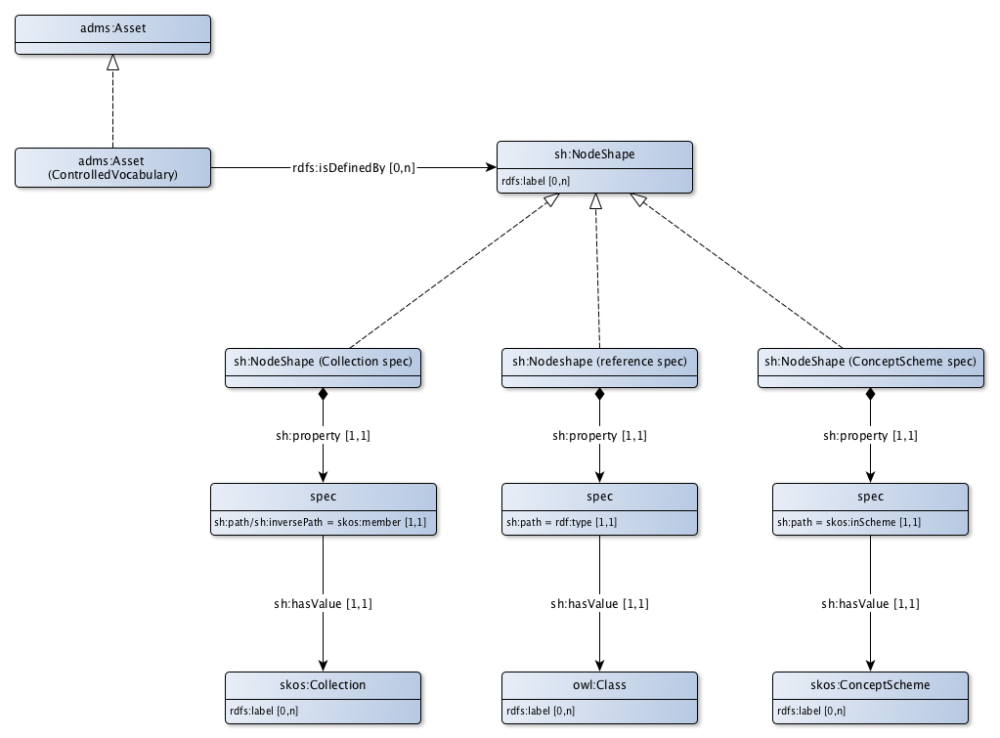

# CV Toepassingsprofiel voor waardelijsten

Waardelijsten zijn lijstjes met elementen waaraan vanuit verschillende toepassingen, soms zelfs vanuit verschillende organisaties wordt gerefereerd. Soms worden dit ook wel referentiedata genoemd. Waardelijsten kunnen 3 verschillende vormen hebben:
* Waardelijsten met elementen die met een begrip in het begrippenkader (skos:ConceptScheme) worden aangeduid. Een voorbeeld uit de BAG is het ‘gebruiksdoel’ van een ‘Pand’. Dat kan ‘wonen’, ‘winkel’, ‘kantoor’, et cetera zijn. Semantisch betekent dit dat er verschillende soorten panden zijn, namelijk woonhuizen, winkels en kantoren. Om het datamodel overzichtelijk te houden is in de BAG de ontwerpkeuze gemaakt om 1 objecttype te definiëren. Dit heeft als attribuuttype ‘gebruiksdoel’, dat de waarden 'wonen', 'winkel', 'kantoor', et cetera in de waardenlijst kan aannemen. Bijkomend voordeel is dat het datamodel niet hoeft te worden aangepast als er een gebruiksdoel bij komt. Dan hoeft alleen maar een nieuw element aan de waardenlijst te worden toegevoegd. Als het om betekenis gaat zijn 'wonen', 'winkel', 'kantoor', et cetera specialisaties van het begrp 'gebruiksdoel'. Ze vormen een skos:Collections met als skos:Label 'gebruiksdoel' binnen het skos:ConceptScheme 'BAG'.
* Een variant op dit type waardelijst is een lijst met begrippen die als zelfstandig begrippenkader (skos:ConceptScheme) worden gepubliceerd. Dit gebeurt bijvoorbeeld bij de Europese Inspire waardelijsten. De concepten in zo’n schema worden vaak als skos:TopConcept gedefinieerd, opdat ze in lokale waardelijsten, bijvoorbeeld Nederlandse waardelijsten, kunnen worden gedetailleerd.
* Het derde type waardenlijst is een lijst met instanties van een klasse. Een voorbeeld is een lijst van Nederlandse gemeenten of een lijst met bestuurlijke gebieden. Dit zijn geen begrippen (skos:Concept), maar instanties van de klasse ‘Gemeente’ die door het Ministerie van BZK is gedefinieerd.

Voor de basale representatie van de waardenlijst maakt het niet uit of het een lijst in de vorm van een skos:Collection of een skos:ConceptScheme is met instanties van skos concepten of een lijst met mogelijke instanties van een klasse. Beide vormen hebben een basale structuur met soms een code (bijvoorbeeld de CBS-gemeentecode) en altijd een omschrijving (bijvoorbeeld de gemeentenaam).
* Voor de code kan skos:notation worden gebruikt.
* Voor de omschrijving wordt het skos:prefLabel gebruikt.
* Wanneer een waardenlijst als Linked data wordt gepubliceerd krijgt iedere waarde in die lijst bovendien een uri.

De waarden in de waardenlijst kunnen dezelfde metadata meekrijgen als begrippen, namelijk 'has status', 'is generated at time', 'is invalidated at time', 'is valid during', 'is issued', 'is valid at'.

Bij instanties van klassen kunnen alle extra kenmerken van die klasse die nodig zijn voor gebruik buiten het domein waarin de oorspronkelijke klasse is gedefinieerd, worden toegevoegd. In het voorbeeld van de lijst met Nederlandse gemeenten kan dit de geometrie van het bestuurlijk gebied zijn en visualisatiecodes voor afbeelding op een kaart.

## Waardelijst

|!form data#ControlledVocabulary!Klasse|Asset (Waardelijst)
|----------|------
|Uitleg|Een waardelijst is een verzameling van begrippen of elementen die worden gebruikt om inhoud te indexeren en / of inhoud op te halen via browsen of zoeken. Hij bevat meestal voorkeurs- en varianttermen en heeft een gedefinieerde scope of beschrijft een specifiek domein.
|Voorbeeld|De lijst met Kadastrale gemeenten.
|Eigenschappen en relaties|[http://bp4mc2.org/profiles/cv-ap-sc#ControlledVocabulary_typeControlledVocabulary](http://bp4mc2.org/profiles/cv-ap-sc#ControlledVocabulary_typeControlledVocabulary), [gespecificeerd](#ControlledVocabulary_specification)

### Eigenschappen

### Relaties

|!form data#ControlledVocabulary_specification!Eigenschap|gespecificeerd
|----------|------
|Gebruikte term|[rdfs:isDefinedBy](http://www.w3.org/2000/01/rdf-schema#isDefinedBy)
|Relatie met|[http://bp4mc2.org/profiles/cv-ap-sc#NodeShape](http://bp4mc2.org/profiles/cv-ap-sc#NodeShape)
|Uitleg|Een waardelijst kan worden gespecificeerd als begrippenkader, collectie van begrippen of als referentielijst.
|Voorbeeld|De referentielijst met Kadastrale gemeenten.

## Waardelijst als begrippenkader

|!form data#SchemeControlledVocabulary!Klasse|begrippenkader specificatie
|----------|------
|Uitleg|Een waardelijst kan worden gespecificeerd als apart begrippenkader.
|Voorbeeld|The Inspire lijst met een europees afgestemd kader voor de typering van kabels en leidingen.
|Eigenschappen en relaties|[http://bp4mc2.org/profiles/cv-ap-sc#SchemeControlledVocabulary_property](http://bp4mc2.org/profiles/cv-ap-sc#SchemeControlledVocabulary_property)

### Eigenschappen

### Relaties

|!form data#SchemeControlledVocabulary_property!Eigenschap|Waarde
|----------|------
|Gebruikte term|[sh:property](http://www.w3.org/ns/shacl#property)
|Relatie met|[http://bp4mc2.org/profiles/cv-ap-sc#SchemeControlledVocabularySpec](http://bp4mc2.org/profiles/cv-ap-sc#SchemeControlledVocabularySpec)
|Min card.|1
|Max card.|1

## Uri strategie

Een lijst (collectie of schema) van begrippen of een lijst met instanties van een klasse krijgt een uri conform de beschrijvende asset.

Een waarde in een lijst (collectie of schema) van begrippen krijgt een uri volgens het patroon:
* `http://{domain}/id/concept/{rdfs:label}`, waarbij het `{rdfs:label}` het label van de collectie of het schema is.

Een waarde in een lijst met instanties van een klasse krijgt een uri volgens het patroon:
* `http://{domain}/id/{class}/{rdfs:label}`, waarbij het `{rdfs:label}` de naam van de betreffende instantie is.

