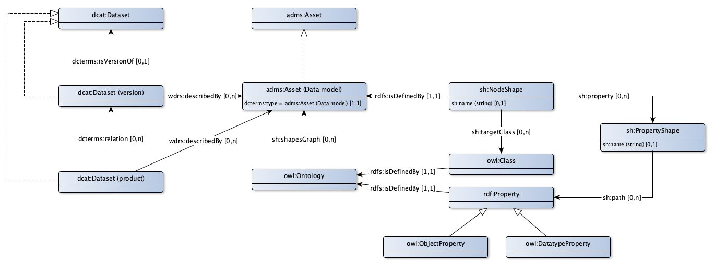

# DM Toepassingsprofiel voor informatiemodellen

Een informatiemodel is een beschrijving van de structuur waarin data over dingen die worden aangeduid met begrippen in het semantische model kunnen worden opgeslagen. Het begrippenkader is bruikbaar om met domeineigenaren en data afnemers te communiceren over de inhoud van een registratie. Het vertalen van een begrippenkader naar een samenhangend datamodel is het werkveld van de data architect.

Een hulpmiddel voor het maken van een informatiemodel is het Nederlandse Metamodel voor Informatie Modellen (MIM), (|zie [https://www.geonovum.nl/geo-standaarden/metamodel-informatiemodellering/nationaal-metamodel-voor-informatiemodellering]). Dit model bevat objectklassen, attribuutsoorten, gegevensgroepen, gegevensgroeptypen, generalisaties, relatiesoorten en relatieklassen. Een op basis van het MIM gemaakt informatiemodel kan worden uitgedrukt in UML of in RDF. Met andere woorden het is ‘vormvrij’. Een MIM-klasse is in de regel een realisatie van een begrip. Zo is het de attribuutsoort ‘hoofdadres’ in de BAG de realisatie van het begrip ‘Hoofdadres’ en de objectklasse ‘AdresseerbaarObject’, waarbij een ‘hoofdadres’ hoort de realisatie van het begrip ‘AdresseerbaarObject’. Het begrip ‘AdresseerbaarObject’ gaat over de (talige, dat wil zeggen in taal) betekenis van een adresseerbaar object. De objectklasse is als het ware een ‘bakje’ waarin de data over een adresseerbaar object kan worden opgeslagen.

Bij het maken van een informatiemodel op basis van een begrippenkader kunnen de volgende good practices worden gehanteerd:
* Voor elk objectiveerbaar begrip ontstaat een klasse. Zo bevat de klasse met de naam ‘OpenbareRuimte’ de data over de objecten die worden aangeduid met het begrip met de naam ‘Openbare ruimte’.
* Begrippen die in een waardelijst worden gepubliceerd worden in een relationeel model en in een linked data model anders behandeld:
** In een relationeel model wordt het bovenliggende begrip (waarvan de begrippen in de waardelijst een specialisatie zijn) vertaald naar een klasse, waarvan de instanties een typering krijgen op basis van een element in de waardelijst. Meestal is dit een eigenschap waarbij ‘soort’, ‘type’ of ‘aard’ in de naam voorkomt.
** In een linked data model worden dergelijke begrippen volledig uitgemodelleerd als subtypen van het bovenliggende begrip.
* Voor elk begrip dat een eigenschap is van een klasse en geen verwijzing is naar een ander begrip, ontstaat een data-eigenschap. Zo representeert de eigenschap met de naam ‘bouwjaar’ het begrip met de naam ‘Bouwjaar’.
* Specialisaties, generalisaties, en partitieve relaties in het begrippenmodel worden vertaald naar specialisaties, generalisaties en partitieve relaties in het informatiemodel.
* Voor iedere semantische relatie in het begrippenmodel wordt in het informatiemodel een relatie gedefinieerd (in linked data een object-eigenschap). Een voorbeeld is ‘ligt in’ als relatie tussen de klassen ‘OpenbareRuimte’ en ‘Woonplaats’ als uitwerking van de semantische relatie tussen de begrippen ‘OpenbareRuimte’ en ‘Woonplaats’.

Een op deze manier uitgewerkt voorbeeld van het model van de BAG is te vinden op [https://bag.basisregistraties.overheid.nl/def]. Via #-uri’s kan worden verwezen naar elementen in dit model, bijvoorbeeld [https://bag.basisregistraties.overheid.nl/def/objectklasse/AdresseerbaarObject#hoofdadres]. Dit voorbeeld is beschikbaar als html webpagina, in turtle en als grafische representatie. Dit voorbeeld laat ook mooi zien hoe de uri-strategie voor het beschrijven van een datamodel werkt. Het intypen van bovenstaande URL zal leiden tot de weergave van de pagina [http://bag.basisregistraties.overheid.nl/def/objectklasse/AdresseerbaarObject] (het deel voor de ‘#’). Met andere woorden: de beschrijving van de entiteit ‘Adresseerbaar object’.

## Informatiemodel

|!form data#DataModel!Klasse|Asset (Datamodel)
|----------|------
|Getypeerd als|[adms:Asset](#Asset)
|Uitleg|Een datamodel is een beschrijving van de structuur waarin data over dingen in een  specifiek domein worden opgeslagen.
|Voorbeeld|De lijst met Kadastrale gemeenten.
|Eigenschappen en relaties|[type asset = datamodel](#DataModel_typeDataModel)

### Relaties

|!form data#DataModel_typeDataModel!Eigenschap|type asset = datamodel
|----------|------
|Gebruikte term|[dcterms:type](http://purl.org/dc/terms/type)
|Waarde|[Asset (Datamodel)](http://bp4mc2.org/profiles/dm-ap-sc#DataModel)
|Uitleg|Een datamodel wordt expliciet getypeerd als datamodel.
|Min card.|1
|Max card.|1

## Model beschrijving

## Vocabulaire

|!form data#Ontology!Klasse|Vocabulaire
|----------|------
|Gebruikte term|[owl:Ontology](http://www.w3.org/2002/07/owl#Ontology)
|Uitleg|De beschrijving van de vocabulaire en zijn semantiek (ontologie)
|Eigenschappen en relaties|[structuurbeschrijving](#Ontology_shapesGraph)

### Relaties

|!form data#Ontology_shapesGraph!Eigenschap|structuurbeschrijving
|----------|------
|Gebruikte term|[sh:shapesGraph](http://www.w3.org/ns/shacl#shapesGraph)
|Relatie met|[Asset (Datamodel)](#DataModel)
|Uitleg|Een informatiemodel kan worden beschreven in een 'shape graph'.
|Voorbeeld|De verwijzing naar de beschrijving van het InformatieModel Kadaster (IMKAD).

## Klassebeschrijving

|!form data#NodeShape!Klasse|Klassebeschrijving
|----------|------
|Gebruikte term|[sh:NodeShape](http://www.w3.org/ns/shacl#NodeShape)
|Eigenschappen en relaties|[is gedefinieerd door](#NodeShape_isDefinedBy), [naam](#NodeShape_name), [eigenschap](#NodeShape_property), [bijbehorende klasse](#NodeShape_targetClass)

### Eigenschappen

|!form data#NodeShape_name!Eigenschap|naam
|----------|------
|Gebruikte term|[sh:name](http://www.w3.org/ns/shacl#name)
|Datatype|[Tekst](http://www.w3.org/2001/XMLSchema#string)
|Max card.|1

### Relaties

|!form data#NodeShape_isDefinedBy!Eigenschap|is gedefinieerd door
|----------|------
|Gebruikte term|[rdfs:isDefinedBy](http://www.w3.org/2000/01/rdf-schema#isDefinedBy)
|Relatie met|[Asset (Datamodel)](#DataModel)
|Min card.|1
|Max card.|1

|!form data#NodeShape_property!Eigenschap|eigenschap
|----------|------
|Gebruikte term|[sh:property](http://www.w3.org/ns/shacl#property)
|Verwijst naar|[sh:PropertyShape](#PropertyShape)

|!form data#NodeShape_targetClass!Eigenschap|bijbehorende klasse
|----------|------
|Gebruikte term|[sh:targetClass](http://www.w3.org/ns/shacl#targetClass)
|Verwijst naar|[owl:Class](#Class)

## Klasse

|!form data#Class!Klasse|Klasse
|----------|------
|Gebruikte term|[owl:Class](http://www.w3.org/2002/07/owl#Class)
|Eigenschappen en relaties|[is gedefinieerd door](#Class_isDefinedBy)

### Relaties

|!form data#Class_isDefinedBy!Eigenschap|is gedefinieerd door
|----------|------
|Gebruikte term|[rdfs:isDefinedBy](http://www.w3.org/2000/01/rdf-schema#isDefinedBy)
|Relatie met|[Vocabulaire](#Ontology)
|Min card.|1
|Max card.|1

## Eigenschapbeschrijving

|!form data#PropertyShape!Klasse|Eigenschapbeschrijving
|----------|------
|Gebruikte term|[sh:PropertyShape](http://www.w3.org/ns/shacl#PropertyShape)
|Eigenschappen en relaties|[naam](#PropertyShape_name), [pad](#PropertyShape_path)

### Eigenschappen

|!form data#PropertyShape_name!Eigenschap|naam
|----------|------
|Gebruikte term|[sh:name](http://www.w3.org/ns/shacl#name)
|Datatype|[Tekst](http://www.w3.org/2001/XMLSchema#string)
|Max card.|1

### Relaties

|!form data#PropertyShape_path!Eigenschap|pad
|----------|------
|Gebruikte term|[sh:path](http://www.w3.org/ns/shacl#path)
|Relatie met|[Eigenschap](#Property)

## Eigenschap

|!form data#Property!Klasse|Eigenschap
|----------|------
|Gebruikte term|[rdf:Property](http://www.w3.org/1999/02/22-rdf-syntax-ns#Property)
|Eigenschappen en relaties|[is gedefinieerd door](#Property_isDefinedBy)

### Relaties

|!form data#Property_isDefinedBy!Eigenschap|is gedefinieerd door
|----------|------
|Gebruikte term|[rdfs:isDefinedBy](http://www.w3.org/2000/01/rdf-schema#isDefinedBy)
|Verwijst naar|[owl:Ontology](#Ontology)
|Min card.|1
|Max card.|1

## Uri strategie

Een informatiemodel krijgt een uri conform de beschrijvende asset.

