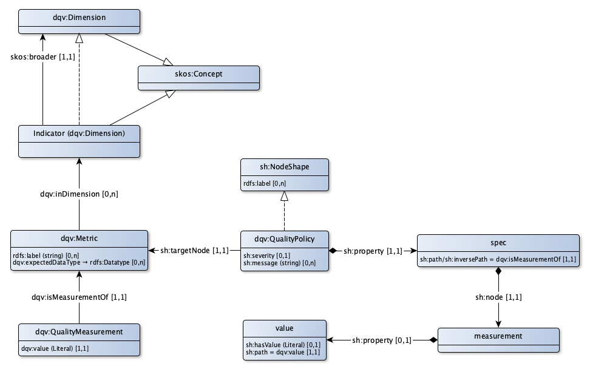

# DQV Toepassingsprofiel voor datakwaliteit

Datakwaliteit

## Kwaliteitsdimensie

|!form data#QualityDimension!Klasse|Kwaliteitsdimensie
|----------|------
|Gebruikte term|[dqv:Dimension](http://www.w3.org/ns/dqv#Dimension)

## Kwaliteitsindicator

|!form data#QualityIndicator!Klasse|Kwaliteitsindicator
|----------|------
|Getypeerd als|[dqv:Dimension](#Dimension)
|Eigenschappen en relaties|[Specialisatie van](#QualityIndicator_broader)

### Relaties

|!form data#QualityIndicator_broader!Eigenschap|Specialisatie van
|----------|------
|Gebruikte term|[skos:broader](http://www.w3.org/2004/02/skos/core#broader)
|Relatie met|[Kwaliteitsdimensie](#QualityDimension)
|Uitleg|Een kwaliteitsindicator valt binnen een kwaliteitsdimensie
|Min card.|1
|Max card.|1

## Meting

|!form data#Metric!Klasse|Meetfunctie
|----------|------
|Gebruikte term|[dqv:Metric](http://www.w3.org/ns/dqv#Metric)
|Eigenschappen en relaties|[Verwachtte datatype](#Metric_expectedDataType), [in dimensie](#Metric_inDimension), [Label](#Metric_label)

### Eigenschappen

|!form data#Metric_label!Eigenschap|Label
|----------|------
|Gebruikte term|[rdfs:label](http://www.w3.org/2000/01/rdf-schema#label)
|Datatype|[Tekst](http://www.w3.org/2001/XMLSchema#string)
|Uitleg|Een meting kent een voor mensen leesbaar label

### Relaties

|!form data#Metric_expectedDataType!Eigenschap|Verwachtte datatype
|----------|------
|Gebruikte term|[dqv:expectedDataType](http://www.w3.org/ns/dqv#expectedDataType)
|Verwijst naar|[rdfs:Datatype](#Datatype)
|Uitleg|Het te verwachten datatype van de meting

|!form data#Metric_inDimension!Eigenschap|in dimensie
|----------|------
|Gebruikte term|[dqv:inDimension](http://www.w3.org/ns/dqv#inDimension)
|Relatie met|[Kwaliteitsindicator](#QualityIndicator)
|Uitleg|Een meting betreft een kwaliteitsdimensie

## Kwaliteitsmeetwaarde

|!form data#QualityMeasurement!Klasse|Kwaliteitsmeetwaarde
|----------|------
|Gebruikte term|[dqv:QualityMeasurement](http://www.w3.org/ns/dqv#QualityMeasurement)
|Eigenschappen en relaties|[is meetwaarde van](#QualityMeasurement_isMeasurementOf), [waarde](#QualityMeasurement_value)

### Eigenschappen

|!form data#QualityMeasurement_value!Eigenschap|waarde
|----------|------
|Gebruikte term|[dqv:value](http://www.w3.org/ns/dqv#value)
|Datatype|[rdfs:Literal](http://www.w3.org/2000/01/rdf-schema#Literal)
|Uitleg|De uitkomst van de meting, de waarde
|Min card.|1
|Max card.|1

### Relaties

|!form data#QualityPolicy_property!Eigenschap|eigenschap
|----------|------
|Gebruikte term|[sh:property](http://www.w3.org/ns/shacl#property)
|Relatie met|[Specificatie van de eis](#QualityPolicySpec)
|Uitleg|De regel behorende bij de kwaliteitseis
|Min card.|1
|Max card.|1

|!form data#QualityPolicy_severity!Eigenschap|ernst
|----------|------
|Uitleg|De ernst van de kwaliteitseis
|Max card.|1

|!form data#QualityPolicy_targetNode!Eigenschap|betreft
|----------|------
|Verwijst naar|[dqv:Metric](#Metric)
|Uitleg|De meting waar deze kwaliteitseis voor geldt
|Min card.|1
|Max card.|1

### Relaties

|!form data#QualityMeasurement_isMeasurementOf!Eigenschap|is meetwaarde van
|----------|------
|Gebruikte term|[dqv:isMeasurementOf](http://www.w3.org/ns/dqv#isMeasurementOf)
|Verwijst naar|[dqv:Metric](#Metric)
|Uitleg|Geeft de meting aan waar deze meetwaarde een uitkomst van is
|Min card.|1
|Max card.|1

## Kwaliteitseis

|!form data#QualityPolicy!Klasse|Kwaliteitseis
|----------|------
|Getypeerd als|[sh:NodeShape](#NodeShape)
|Eigenschappen en relaties|[melding](#QualityPolicy_message), [eigenschap](#QualityPolicy_property), [ernst](#QualityPolicy_severity), [betreft](#QualityPolicy_targetNode)

### Eigenschappen

|!form data#QualityPolicy_message!Eigenschap|melding
|----------|------
|Datatype|[Tekst](http://www.w3.org/2001/XMLSchema#string)
|Uitleg|De melding die gerapporteerd wordt als de meting niet voldoet aan de kwaliteitseis

## Specificatie

|!form data#QualityPolicySpec!Klasse|Specificatie van de eis
|----------|------

## Datatype

|!form data#Datatype!Klasse|Datatype
|----------|------
|Gebruikte term|[rdfs:Datatype](http://www.w3.org/2000/01/rdf-schema#Datatype)

