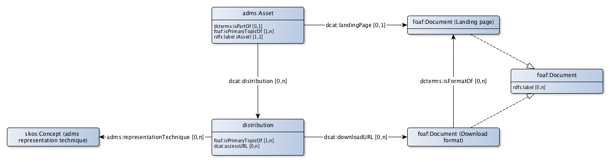

# ADMS Application profile for asset descriptions

ADMS is the W3C standard for describing 'semantic assets' that are used at eGovernment. In a system catalog it is specifically about reusable metadata on
* taxonomies or dictionaries that contain the concept scheme that contains the 'topics of interest' of a dataset (general).
* reference data and controlled vocabularies from a dataset (general) that can be reused in other domains.
* data models of a dataset (version) or of a dataset (product).

Every metadata description, in ADMS an asset, can have its own webpage.

A metadata description can be published in various ways, for example as a pdf download, as a ttl description or as a html description. For controlled vocabularies also csv and xml / gc (genericode) are common. For data models XMI is common as an exchange format for UML representations. Every format in which a metadata description (adms: Asset) is published can be explicitly described as distirbution (adms: Distribution).

Provenance can be tracked of metadata descriptions and distributions.
* For concept schemes and for reference data or controlled vocabularies, that are usually managed in a of 'continious delivery' process. This means that the metadata description is published once. The provenance is then managed at the level of a concept or reference entity.
* In addition, controlled vocabularies can periodically releases. Each release then becomes a new version of the metadata description.
* Data models are always published or released in full at once. Each release receives a new version of the metadata description.

## Asset

|!form data#Asset!Klasse|Asset
|----------|------
|Description|An asset is a set of reusable metadata and reference data  that are used for eGovernment system development.
|Properties en relations|[has distribution](#Asset_distribution), [label](#Asset_label), [has landing page](#Asset_landingPage), [part of](#Asset_partOf), [provenance](#Asset_provenance)

### Properties

|!form data#Asset_label!Eigenschap|label
|----------|------
|Used term|[rdfs:label](http://www.w3.org/2000/01/rdf-schema#label)
|Datatype|[Text](http://www.w3.org/2001/XMLSchema#string)
|Description|An asset has a label.
|Example|Landenlijst
|Min card.|1
|Max card.|1

### Relations

|!form data#Asset_distribution!Eigenschap|has distribution
|----------|------
|Used term|[dcat:distribution](http://www.w3.org/ns/dcat#distribution)
|Related with|[Distribution](#AssetDistribution)
|Description|The way in which an asset is published can be indicated.

|!form data#Asset_landingPage!Eigenschap|has landing page
|----------|------
|Used term|[dcat:landingPage](http://www.w3.org/ns/dcat#landingPage)
|Related with|[Landing page](#LandingPage)
|Description|The landing page on the web on which an asset can be found can be specified.
|Max card.|1

|!form data#Asset_partOf!Eigenschap|part of
|----------|------
|Used term|[dcterms:isPartOf](http://purl.org/dc/terms/isPartOf)
|Related with|[http://bp4mc2.org/profiles/adms-ap-sc#Dataset](http://bp4mc2.org/profiles/adms-ap-sc#Dataset)
|Description|An asset can be part of a dataset.
|Max card.|1

|!form data#Asset_provenance!Eigenschap|provenance
|----------|------
|Used term|[foaf:isPrimaryTopicOf](http://xmlns.com/foaf/0.1/isPrimaryTopicOf)
|Refers to|[prov:Entity](#Entity)
|Description|Provenance of a asset can be described.
|Example|Op basis van de nieuwe wet op de BAG is een een nieuw informatiemodel opgesteld
|Min card.|1

## Asset distribution

|!form data#AssetDistribution!Klasse|Distribution
|----------|------
|Used term|[distribution](http://www.w3.org/ns/adms#Distribution)
|Description|The way in which an asset is published.
|Properties en relations|[access url](#AssetDistribution_accessURL), [download url](#AssetDistribution_downloadURL), [provenance](#AssetDistribution_provenance), [representation format](#AssetDistribution_representationTechnique)

### Relations

|!form data#AssetDistribution_accessURL!Eigenschap|access url
|----------|------
|Used term|[dcat:accessURL](http://www.w3.org/ns/dcat#accessURL)
|Description|A distribution can be found via an access url.

|!form data#AssetDistribution_downloadURL!Eigenschap|download url
|----------|------
|Used term|[dcat:downloadURL](http://www.w3.org/ns/dcat#downloadURL)
|Related with|[Download format](#DownloadFormat)
|Description|A download can be found via an download url.

|!form data#AssetDistribution_provenance!Eigenschap|provenance
|----------|------
|Used term|[foaf:isPrimaryTopicOf](http://xmlns.com/foaf/0.1/isPrimaryTopicOf)
|Refers to|[prov:Entity](#Entity)
|Description|Provenance of a distribution can be described.
|Example|De metadata van de reSpec beschrijving van het nieuwe informatiemodel voor de BAG
|Min card.|1

|!form data#AssetDistribution_representationTechnique!Eigenschap|representation format
|----------|------
|Used term|[adms:representationTechnique](http://www.w3.org/ns/adms#representationTechnique)
|Related with|[http://bp4mc2.org/profiles/adms-ap-sc#RepresentationTechnique](http://bp4mc2.org/profiles/adms-ap-sc#RepresentationTechnique)
|Description|The format in which a distribution is available can be specified based on the adms controlled vocabulary on representation techniques.

## Landing page

|!form data#LandingPage!Klasse|Landing page
|----------|------
|Description|The landing page on the web on which an asset can be found.

## Download format

|!form data#DownloadFormat!Klasse|Download format
|----------|------
|Description|The download can be a file or a landing page with information.
|Properties en relations|[is format of](#DownloadFormat_isFormatOf)

### Relations

|!form data#DownloadFormat_isFormatOf!Eigenschap|is format of
|----------|------
|Used term|[dcterms:isFormatOf](http://purl.org/dc/terms/isFormatOf)
|Related with|[Landing page](#LandingPage)

## Uri strategy

Assets en asset distributions get a uri according to the pattern:

* `http://{domain}/id/{asset-type}/{UpperCamelCase(rdfs:label)}` for assets
* `http://{domain}/id/{asset-type}/{UpperCamelCase(rdfs:label)}.{extension}` for asset distributions

Depending on the type of asset, `{asset-type}` is one of the following values:
* `codelist` voor waardelijsten;
* `scheme` voor begrippenkaders;
* `model` voor informatiemodellen.

And for `{extension}` the regular extensions for file types are used:
* `ttl` for turtle files;
* `pdf` for pdf files;
* `xml` for xml files.

