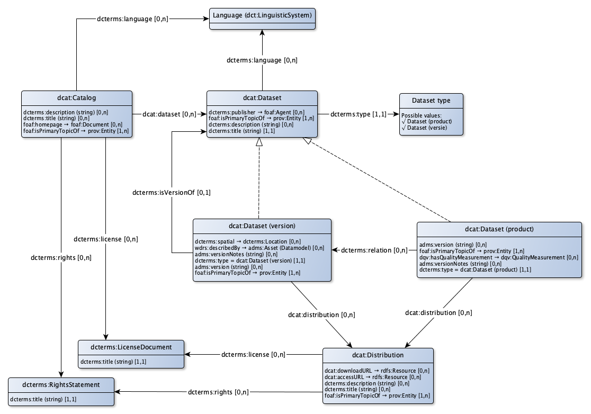

# DCAT Application profile for dataset descriptions

For data on the web it is good practice to describe the data in a catalog using DCAT (Data Catalog). DCAT is the W3C standard  to describe data sets and is prescribed by the EU (ISA) for reasons of interoperability. In the Netherlands DCAT is used to describe the open datasets in [data.overheid.nl](https://www.data.overheid.nl). The [national georegister[(https://www.nationaalgeoregister.nl), where all open geo datasets are described, offers a DCAT export. The application profile DCAT-AP-NL was created for data.overheid.nl. It describes which elements from DCAT are used and how these elements are applied. Geo-DCAT-AP for the geo-world is drawn up by the EU (ISA). For the catalog, the application profile for DCAT must comply with existing application profiles for DCAT, in particular DCAT-AP-NL and geoDCAT-AP.

* The [Dutch Application Profile](https://data.overheid.nl/sites/default/files/2014-11-13 DCAT-NL IPM Datasets 0.6 kopie.pdf) for DCAT (DCAT-AP-NL).
** is based on the DCAT [Application Profile](https://joinup.ec.europa.eu/asset/dcat_application_profile/description) for data portals in Europe.
** gives guidelines for the translation of metadata in accordance with the Dutch metadata profile on ISO 19115 Geography, 1.3.1 (ISO19115)
** is specified in an IPM
* [geoDCAT-AP](https://joinup.ec.europa.eu/node/154143/)
** is a profile for data portals in Europe for describing geo datasets, datasets series and services.
** offers an RDF syntax for the all metadata elements of the core profile of ISO 19115: 2003 and those defined in the framework of the [INSPIRE directive](http://eur-lex.europa.eu/LexUriServ /LexUriServ.do?Uri=PB:L:2007:108:0001:0014:nl:PDF) The term Information Publication Model (IPM) is often used. An IPM for datasets provides a standard for the online exchange of metadata between Dutch data and catalogs, including: data.overheid.nl, National Geo Register (NGR) and for example the (open) data catalog of municipalities and provinces.

A system catalog can be set up as Metadata Broker. A Metadata Broker collects meta data from different catalogs and unlocks this collection in a separate catalog. The Broker Metadata Catalog contains descriptions of the other catalogs and their catalog records. For example, datasets are described in several catalogs. This means that these data sets can be described from the same source in different contexts, for example as statistical data and as geographical data.

A dataset is actually everything you call a dataset. A dataset is not defined sharply by the W3C. This is intentionally not done to enable the concept dataset to be widely usable. This enables describing coherent sets of information at different levels as a dataset. We stand for an approach in which the metadata describe each dataset at the source and metadata brokers link to the source. Each dataset is described in 1 catalog. That is the authentic source of that metadata.

* A dataset (general) is the general (versionless) dataset that can be linked once to the catalog. This is done through a link to the publication of the administrator of the original dataset in the dcat repository. The description is about all versions that have ever been or will ever be.
* A dataset (version) is a version of a dataset that contains concrete information.
** Dataset versions are published and documented in the dcat repository by the administrator of the original dataset. Because there is already a link from the system catalog to the Abstract dataset and because a Concrete dataset is linked to the Abstract dataset, this information is immediately available in the system catalog.
** A registration whith many changes every day differs from a traditional dataset of which periodically, for example a new version is distributed monthly. That would yield a new version after each mutation. For descriptions of an authentic registration, a new version of the data model is therefore considered as a new version of the dataset.
* A 'dataset product' is a description of a subset of a dataset that is available as an data product (for example an API or a SOAP service). Such a subset with concrete data is always a subset of a concrete dataset version.
* A distribution describes a physical distribution form of a dataset. This is always an data product. For example, the distribution contains the reference to a download or an API.

## Dataset

|!form data#Dataset!Klasse|Dataset
|----------|------
|Used term|[dcat:Dataset](http://www.w3.org/ns/dcat#Dataset)
|Description|A dataset is a description of a collection of data, published or curated by a single agent.
|Properties en relations|[description](#Dataset_description), [title](#Dataset_label), [language](#Dataset_language), [provenance](#Dataset_provenance), [publisher](#Dataset_publisher), [type dataset](#Dataset_type)

### Properties

|!form data#Dataset_description!Eigenschap|description
|----------|------
|Used term|[dcterms:description](http://purl.org/dc/terms/description)
|Datatype|[Text](http://www.w3.org/2001/XMLSchema#string)
|Description|The dataset can have a clear description.

|!form data#Dataset_label!Eigenschap|title
|----------|------
|Used term|[dcterms:title](http://purl.org/dc/terms/title)
|Datatype|[Text](http://www.w3.org/2001/XMLSchema#string)
|Description|A dataset has a label.
|Min card.|1
|Max card.|1

### Relations

|!form data#Dataset_language!Eigenschap|language
|----------|------
|Used term|[dcterms:language](http://purl.org/dc/terms/language)
|Related with|[Language](#Language)
|Description|The language in which the dataset is described (because of the compatibility with the DCAT-AP NL) can be recorded.

|!form data#Dataset_provenance!Eigenschap|provenance
|----------|------
|Used term|[foaf:isPrimaryTopicOf](http://xmlns.com/foaf/0.1/isPrimaryTopicOf)
|Refers to|[prov:Entity](#Entity)
|Description|Provenance of a dataset can be described.
|Example|De BAG is op xx/xx/xx gelanceerd
|Min card.|1

|!form data#Dataset_publisher!Eigenschap|publisher
|----------|------
|Used term|[dcterms:publisher](http://purl.org/dc/terms/publisher)
|Related with|[Agent (foaf)](#FoafAgent)
|Description|The person who publishes a dataset can be recorded. This organization or person has permission to perform this action.

|!form data#Dataset_type!Eigenschap|type dataset
|----------|------
|Used term|[dcterms:type](http://purl.org/dc/terms/type)
|Related with|[Dataset type](#DatasetType)
|Min card.|1
|Max card.|1

## Dataset (version)

|!form data#DatasetVersion!Klasse|Dataset (version)
|----------|------
|Description|A dataset (general) is a concrete, versioned description of a collection of data, published or curated by a single agent.
|Properties en relations|[described by](#DatasetVersion_describedBy), [distribution](#DatasetVersion_distribution), [geographical demarcation](#DatasetVersion_geometricDemarcation), [provenance](#DatasetVersion_provenance), [type dataset = DatasetVersion](#DatasetVersion_type), [version](#DatasetVersion_version), [version notes](#DatasetVersion_versionNotes), [version of](#DatasetVersion_versionOf)

### Properties

|!form data#DatasetVersion_version!Eigenschap|version
|----------|------
|Used term|[adms:version](http://www.w3.org/ns/adms#version)
|Datatype|[Text](http://www.w3.org/2001/XMLSchema#string)
|Description|A dataset (version) can have a version indication.

|!form data#DatasetVersion_versionNotes!Eigenschap|version notes
|----------|------
|Used term|[adms:versionNotes](http://www.w3.org/ns/adms#versionNotes)
|Datatype|[Text](http://www.w3.org/2001/XMLSchema#string)
|Description|A dataset (version) can contain release notes.

### Relations

|!form data#DatasetVersion_describedBy!Eigenschap|described by
|----------|------
|Used term|[wdrs:describedBy](http://www.w3.org/2007/05/powder-s#describedBy)
|Related with|[http://bp4mc2.org/profiles/dcat-ap-sc#Datamodel](http://bp4mc2.org/profiles/dcat-ap-sc#Datamodel)
|Description|The data in a dataset (version) is decribed by a data model.
|Example|kadaster.nl/schemas/imkad

|!form data#DatasetVersion_distribution!Eigenschap|distribution
|----------|------
|Used term|[dcat:distribution](http://www.w3.org/ns/dcat#distribution)
|Refers to|[dcat:Distribution](#Distribution)
|Description|The channels through which a dataset (version) can be distributed can be recorded.

|!form data#DatasetVersion_geometricDemarcation!Eigenschap|geographical demarcation
|----------|------
|Used term|[dcterms:spatial](http://purl.org/dc/terms/spatial)
|Refers to|[dcterms:Location](#Location)
|Description|The area the dataset is about can be recorded.

|!form data#DatasetVersion_provenance!Eigenschap|provenance
|----------|------
|Used term|[foaf:isPrimaryTopicOf](http://xmlns.com/foaf/0.1/isPrimaryTopicOf)
|Refers to|[prov:Entity](#Entity)
|Description|Provenance of a dataset (version) can be described.
|Example|De BAG 2.0 is op xx/xx/xx gelanceerd
|Min card.|1

|!form data#DatasetVersion_type!Eigenschap|type dataset = DatasetVersion
|----------|------
|Used term|[dcterms:type](http://purl.org/dc/terms/type)
|Value|[Dataset (version)](http://bp4mc2.org/profiles/dcat-ap-sc#DatasetVersion)
|Description|In case of a dataset version, the dataset is typed accordingly
|Min card.|1
|Max card.|1

|!form data#DatasetVersion_versionOf!Eigenschap|version of
|----------|------
|Used term|[dcterms:isVersionOf](http://purl.org/dc/terms/isVersionOf)
|Related with|[Dataset](#Dataset)
|Description|A dataset (version) can be derived from a dataset (general).
|Max card.|1

## Dataset (product)

|!form data#DatasetProduct!Klasse|Dataset (product)
|----------|------
|Description|A dataset (product) is a concrete, versioned information product based on the data in a dataset (version).
|Properties en relations|[distribution](#DatasetProduct_distribution), [derived from](#DatasetProduct_isDerivedFrom), [provenance](#DatasetProduct_provenance), [has quality measurement](#DatasetProduct_qualityMeasurement), [type dataset = DatasetProduct](#DatasetProduct_type), [version](#DatasetProduct_version), [version notes](#DatasetProduct_versionNotes)

### Properties

|!form data#DatasetProduct_version!Eigenschap|version
|----------|------
|Used term|[adms:version](http://www.w3.org/ns/adms#version)
|Datatype|[Text](http://www.w3.org/2001/XMLSchema#string)
|Description|A dataset (product) can have a version indication.
|Example|2.1.0

|!form data#DatasetProduct_versionNotes!Eigenschap|version notes
|----------|------
|Used term|[adms:versionNotes](http://www.w3.org/ns/adms#versionNotes)
|Datatype|[Text](http://www.w3.org/2001/XMLSchema#string)
|Description|A dataset (product) can contain release notes.

### Relations

|!form data#DatasetProduct_distribution!Eigenschap|distribution
|----------|------
|Used term|[dcat:distribution](http://www.w3.org/ns/dcat#distribution)
|Refers to|[dcat:Distribution](#Distribution)
|Description|The channels through which a dataset (product) can be distributed can be recorded.

|!form data#DatasetProduct_isDerivedFrom!Eigenschap|derived from
|----------|------
|Used term|[dcterms:relation](http://purl.org/dc/terms/relation)
|Related with|[Dataset (version)](#DatasetVersion)
|Description|A dataset (product) can be derived from a dataset (version).

|!form data#DatasetProduct_provenance!Eigenschap|provenance
|----------|------
|Used term|[foaf:isPrimaryTopicOf](http://xmlns.com/foaf/0.1/isPrimaryTopicOf)
|Refers to|[prov:Entity](#Entity)
|Description|Provenance of an information product can be described.
|Example|De BAG 2.0 is op xx/xx/xx gelanceerd
|Min card.|1

|!form data#DatasetProduct_qualityMeasurement!Eigenschap|has quality measurement
|----------|------
|Used term|[dqv:hasQualityMeasurement](http://www.w3.org/ns/dqv#hasQualityMeasurement)
|Refers to|[dqv:QualityMeasurement](#QualityMeasurement)
|Description|A dataset (product) can have an quality evaluation against a specific quality metric.

|!form data#DatasetProduct_type!Eigenschap|type dataset = DatasetProduct
|----------|------
|Used term|[dcterms:type](http://purl.org/dc/terms/type)
|Value|[Dataset (product)](http://bp4mc2.org/profiles/dcat-ap-sc#DatasetProduct)
|Description|In case of a dataset product, the dataset is typed accordingly
|Min card.|1
|Max card.|1

## Catalog

|!form data#Catalog!Klasse|Catalog
|----------|------
|Used term|[dcat:Catalog](http://www.w3.org/ns/dcat#Catalog)
|Description|A catalog is a curated collection of (federally managed) metadata about datasets (general, version or product), distributions and associated assets.
|Properties en relations|[contains dataset](#Catalog_dataset), [description](#Catalog_description), [landing page](#Catalog_homepage), [language](#Catalog_language), [license](#Catalog_licence), [label](#Catalog_name), [provenance](#Catalog_provenance), [rights](#Catalog_rights)

### Properties

|!form data#Catalog_description!Eigenschap|description
|----------|------
|Used term|[dcterms:description](http://purl.org/dc/terms/description)
|Datatype|[Text](http://www.w3.org/2001/XMLSchema#string)
|Description|De catalog can be described.

|!form data#Catalog_name!Eigenschap|label
|----------|------
|Used term|[dcterms:title](http://purl.org/dc/terms/title)
|Datatype|[Text](http://www.w3.org/2001/XMLSchema#string)
|Description|The catalog can have has a label
|Example|Catalogus Omgevingswet

### Relations

|!form data#Catalog_dataset!Eigenschap|contains dataset
|----------|------
|Used term|[dcat:dataset](http://www.w3.org/ns/dcat#dataset)
|Refers to|[dcat:Dataset](#Dataset)
|Description|A dataset, which may or may not be managed elsewhere, can be included in the catalog via a link to that dataset (general).

|!form data#Catalog_homepage!Eigenschap|landing page
|----------|------
|Used term|[foaf:homepage](http://xmlns.com/foaf/0.1/homepage)
|Refers to|[foaf:Document](#Document)
|Description|De landing page on which the catalog can be found can be recorded.
|Example|http://catalogus.kadaster.nl/

|!form data#Catalog_language!Eigenschap|language
|----------|------
|Used term|[dcterms:language](http://purl.org/dc/terms/language)
|Related with|[Language](#Language)
|Description|The language in which the metadata in the catalog is desribed can be recorded.

|!form data#Catalog_licence!Eigenschap|license
|----------|------
|Used term|[dcterms:license](http://purl.org/dc/terms/license)
|Refers to|[dcterms:LicenseDocument](#LicenseDocument)
|Description|The license applied to the catalog can be specified. This can be another license as the license for distributions of datasets.
|Example|Creative Commons Naamsvermelding 4.0 licentie

|!form data#Catalog_provenance!Eigenschap|provenance
|----------|------
|Used term|[foaf:isPrimaryTopicOf](http://xmlns.com/foaf/0.1/isPrimaryTopicOf)
|Refers to|[prov:Entity](#Entity)
|Description|Provenance of a catalog can be described.
|Example|De beschrijving van de catalogus voor de BAG is aangepast nav de nieuwe wet op de BAG
|Min card.|1

|!form data#Catalog_rights!Eigenschap|rights
|----------|------
|Used term|[dcterms:rights](http://purl.org/dc/terms/rights)
|Refers to|[dcterms:RightsStatement](#RightsStatement)
|Description|The rights applied to the catalog can be specified. This can be nother rights as the rights for distributions of datasets.

## Distribution

|!form data#Distribution!Klasse|Distribution
|----------|------
|Used term|[dcat:Distribution](http://www.w3.org/ns/dcat#Distribution)
|Properties en relations|[access url](#Distribution_accessURL), [description](#Distribution_description), [download url](#Distribution_downloadURL), [license](#Distribution_license), [label (distribution)](#Distribution_name), [provenance](#Distribution_provenance), [rights](#Distribution_rights)

### Properties

|!form data#Distribution_description!Eigenschap|description
|----------|------
|Used term|[dcterms:description](http://purl.org/dc/terms/description)
|Datatype|[Text](http://www.w3.org/2001/XMLSchema#string)
|Description|De distribution can be described.

|!form data#Distribution_name!Eigenschap|label (distribution)
|----------|------
|Used term|[dcterms:title](http://purl.org/dc/terms/title)
|Datatype|[Text](http://www.w3.org/2001/XMLSchema#string)
|Description|De distribution can have a label

### Relations

|!form data#Distribution_accessURL!Eigenschap|access url
|----------|------
|Used term|[dcat:accessURL](http://www.w3.org/ns/dcat#accessURL)
|Refers to|[foaf:Document](#Document)
|Description|A distribution can be an API or a web service that is accesable via a url.

|!form data#Distribution_downloadURL!Eigenschap|download url
|----------|------
|Used term|[dcat:downloadURL](http://www.w3.org/ns/dcat#downloadURL)
|Refers to|[rdfs:Resource](#Resource)
|Description|A distribution can be a download service that is accesable via a url

|!form data#Distribution_license!Eigenschap|license
|----------|------
|Used term|[dcterms:license](http://purl.org/dc/terms/license)
|Refers to|[dcterms:LicenseDocument](#LicenseDocument)
|Description|The license applied to the distribution can be specified. This can be another license as the license for the catalog.

|!form data#Distribution_provenance!Eigenschap|provenance
|----------|------
|Used term|[foaf:isPrimaryTopicOf](http://xmlns.com/foaf/0.1/isPrimaryTopicOf)
|Refers to|[prov:Entity](#Entity)
|Description|Provenance of a distribution can be described.
|Example|De beschrijving van de catalogus voor de BAG is aangepast nav de nieuwe wet op de BAG
|Min card.|1

|!form data#Distribution_rights!Eigenschap|rights
|----------|------
|Used term|[dcterms:rights](http://purl.org/dc/terms/rights)
|Refers to|[dcterms:RightsStatement](#RightsStatement)
|Description|The rights applied to the distribution can be specified. This can be nother rights as the rights for the catalog.

## License document

|!form data#LicenseDocument!Klasse|License document
|----------|------
|Used term|[dcterms:LicenseDocument](http://purl.org/dc/terms/LicenseDocument)
|Properties en relations|[title](#LicenseDocument_title)

### Properties

|!form data#LicenseDocument_title!Eigenschap|title
|----------|------
|Used term|[dcterms:title](http://purl.org/dc/terms/title)
|Datatype|[Text](http://www.w3.org/2001/XMLSchema#string)
|Description|A license document has a title.
|Min card.|1
|Max card.|1

## Rights statement

|!form data#RightsStatement!Klasse|Rights statement
|----------|------
|Used term|[dcterms:RightsStatement](http://purl.org/dc/terms/RightsStatement)
|Properties en relations|[title](#RightsStatement_title)

### Properties

|!form data#RightsStatement_title!Eigenschap|title
|----------|------
|Used term|[dcterms:title](http://purl.org/dc/terms/title)
|Datatype|[Text](http://www.w3.org/2001/XMLSchema#string)
|Description|A rights statement has a title.
|Min card.|1
|Max card.|1

## Language

|!form data#Language!Klasse|Language
|----------|------
|Typed as|[http://purl.org/dc/terms/LinguisticSystem](http://purl.org/dc/terms/LinguisticSystem)
|Controlled vocabulary|[http://publications.europa.eu/mdr/authority/language/](http://publications.europa.eu/mdr/authority/language/)

## Dataset type

|!form data#DatasetType!Klasse|Dataset type
|----------|------
|Controlled vocabulary|[Dataset types](http://bp4mc2.org/profiles/dcat-ap-sc#DatasetTypes)

## Uri strategy

Catalogs, datasets (general), datasets (version), datasets (product) and distirbutions get a uri according to the pattern:

* `http://{domain}/id/catalog/{UpperCamelCase(rdfs:label)}` for catalogs
* `http://{domain}/id/dataset/{UpperCamelCase(rdfs:label)}` for datasets (general)
* `http://{domain}/id/dataset/{UpperCamelCase(rdfs:label)}` for datasets (version)
* `http://{domain}/id/dataset/{UpperCamelCase(rdfs:label)}` for datasets (product)
* `http://{domain}/id/distribution/{UpperCamelCase(rdfs:label)}` for distributions

