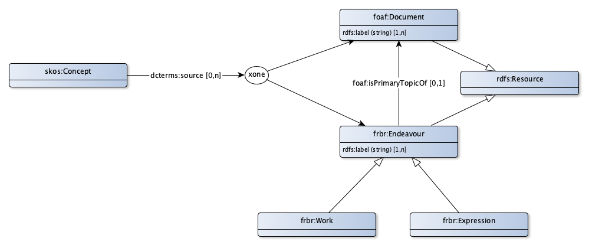

# FRBR Appication profile for Bibliographic references

FRBR is the standard to refer to a bibliographic source (for example a legal article) in general or a version of a bibliographic source as it was valid at a certain time. Formal concepts are usually defined in a decree or a law. Referring to such a concept, it is important to know whether to reference to that concept in general or to a description of that concept at a specific moment in time.

The FRBR application profile makes it possible to refer to:
* a document that can be found on the web, for example a wikipedia page.
* a bibliographic reference, without the need for the availability of an online document. If the document is available online, an extra link to this document can be made. Bibliographic references are available in two styles:
  * a reference of a work, without reference to a particular version of this work, for example: "The constitution";
  * a reference of a version of a work, the "expresssion". For example: "The constitution, as valid on november 17th, 2017".

## Concept

### Relations

|!form data#Concept_dctsource!Eigenschap|source on the web
|----------|------
|Used term|[dcterms:source](http://purl.org/dc/terms/source)
|Description|A concept can be derived from a source that can be found on the web. This can be a (version of) a description of a specific concept or a document in which a description of the concept can be found.

## Document

|!form data#Document!Klasse|Document
|----------|------
|Used term|[foaf:Document](http://xmlns.com/foaf/0.1/Document)
|Description|A document that can be found on the web.
|Example|[https://wetten.overheid.nl/BWBR0001840/2017-11-17](https://wetten.overheid.nl/BWBR0001840/2017-11-17)
|Properties en relations|[label](#Document_label)

### Properties

|!form data#Document_label!Eigenschap|label
|----------|------
|Used term|[rdfs:label](http://www.w3.org/2000/01/rdf-schema#label)
|Datatype|[Text](http://www.w3.org/2001/XMLSchema#string)
|Description|A document has a human-readable label.
|Min card.|1

## Bibliographic reference

|!form data#Endeavour!Klasse|bibliographic reference
|----------|------
|Used term|[frbr:Endeavour](http://purl.org/vocab/frbr/core#Endeavour)
|Description|A bibliographic reference of a work or expression.
|Properties en relations|[topic of](#Endeavour_isTopicOf), [label](#Endeavour_label)

### Properties

|!form data#Endeavour_label!Eigenschap|label
|----------|------
|Used term|[rdfs:label](http://www.w3.org/2000/01/rdf-schema#label)
|Datatype|[Text](http://www.w3.org/2001/XMLSchema#string)
|Description|A bibliographic reference has a human readable label.
|Min card.|1

### Relations

|!form data#Endeavour_isTopicOf!Eigenschap|topic of
|----------|------
|Used term|[foaf:isPrimaryTopicOf](http://xmlns.com/foaf/0.1/isPrimaryTopicOf)
|Related with|[Document](#Document)
|Description|A bibliographic reference can be a subject of a document.
|Max card.|1

## Work

|!form data#Work!Klasse|Work
|----------|------
|Used term|[frbr:Work](http://purl.org/vocab/frbr/core#Work)
|Description|A bibliographic reference, without an explicit reference to a specific version.

## Expression (version of a work)

|!form data#Expression!Klasse|Expression, version of a work
|----------|------
|Used term|[frbr:Expression](http://purl.org/vocab/frbr/core#Expression)
|Description|A specific version of a work.

## Resource (something with a URI)

|!form data#Resource!Klasse|Resource
|----------|------
|Used term|[rdfs:Resource](http://www.w3.org/2000/01/rdf-schema#Resource)
|Description|A thing, identified by a URI

## Uri strategy

A document, general bibliographic resource on the web (work) or specific version of a bibliographic resource on the web (expression) has a uri that is minted by the publisher of the resource. In a system catalog no uri's are minted for this resources.
