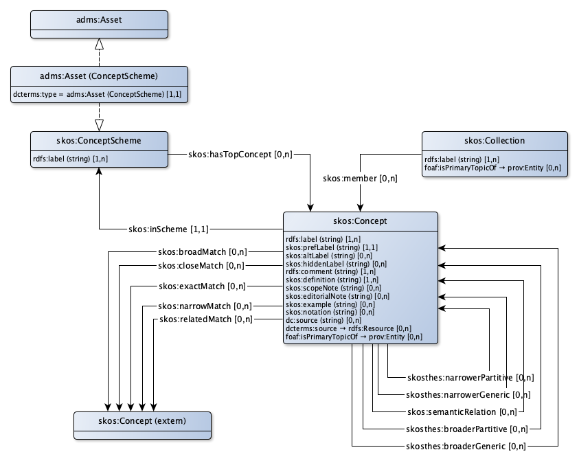

# SKOS Toepassingsprofiel voor begrippenkaders

Begrippen maken duidelijk welke ‘onderwerpen van gesprek’ er bestaan. In een stelselcatalogus worden begrippen formeel gedefinieerd, waarbij iedere definitie wordt opgebouwd volgens strikte regels. De essentie is dat elk begrip in een bepaald domein wordt uitgelegd in termen van andere begrippen. Ook die begrippen worden uitgelegd totdat uiteindelijk elk begrip wat uitleg nodig heeft is gedefinieerd. Uiteindelijk blijven de begrippen over waarvan de betekenis als vanzelfsprekend wordt aangenomen. In een logisch model worden dit axioma's genoemd. Zo ontstaat per domein een axiomatisch begrippenkader. Dit begrippenkader kan worden beschouwd als een min of meer geformaliseerde beschrijving van de institutionele werkelijkheid van het domein.

Voor het beschrijven van begrippen wordt SKOS gebruikt. SKOS staat in Nederland op de pas-toe-leg-uit lijst voor overheden.

* Ieder begrip wordt gerepresenteerd door een skos:concept.
* Ieder domein heeft zijn eigen begrippenkader. Het begrippenkader voor een bepaald domein wordt gerepresenteerd door een skos:ConceptScheme.
* Begrippen kunnen worden geordend in collecties. Een collectie wordt gerepresenteerd door een skos:collection.
* Begrippen in verschillende domeinen kunnen worden verbonden via matching mechanismes. Door deze verbinding van begrippen tussen domeinen ontstaat een stelsel van samenhangende begrippenkaders. Dit stelsel van samenhangende begrippenkaders kan worden gezien als de kennisbasis voor een stelselcatalogus.

## Begrippenkader

|!form data#ConceptScheme!Klasse|Begrippenkader
|----------|------
|Gebruikte term|[skos:ConceptScheme](http://www.w3.org/2004/02/skos/core#ConceptScheme)
|Uitleg|De kennis over de fysieke werkelijkheid wordt beschreven in een talig model, een begrippenmodel.  In een begrippenmodel wordt deze kennis zodanig gestructureerd vastgelegd dat deze door zowel mensen als door computers wordt begrepen.
|Voorbeeld|De thesaurus of taxonomie met alle begrippen in het Kadastrale domein. Deze begrippen vinden hun oorsprong in de Kadasterwet, die beschrijft wat percelen en rechten daarop betekenen.
|Eigenschappen en relaties|[top concept](#ConceptScheme_hasTopConcept), [label](#ConceptScheme_label)

### Eigenschappen

|!form data#ConceptScheme_label!Eigenschap|label
|----------|------
|Gebruikte term|[rdfs:label](http://www.w3.org/2000/01/rdf-schema#label)
|Datatype|[Tekst](http://www.w3.org/2001/XMLSchema#string)
|Uitleg|Een begrippenkader heeft een voor mensen leesbare naam. Spaties en diacritische tekens zijn  toegestaan. 
|Voorbeeld|Het schema dat het domein regelgeving beschrijft heeft als label 'Regelgeving'.
|Min card.|1

### Relaties

|!form data#ConceptScheme_hasTopConcept!Eigenschap|top concept
|----------|------
|Gebruikte term|[skos:hasTopConcept](http://www.w3.org/2004/02/skos/core#hasTopConcept)
|Verwijst naar|[skos:Concept](#Concept)
|Uitleg|Een concepten schema kan concepten bevatten die die het meest generiek zijn in een hiërarchie van specialisaties/generalisaties.
|Voorbeeld|Het concept 'Zakelijk recht' als meest generieke concept voor 'Eigendom', 'Opstal', 'Erfpacht', etc.

## Begrip

|!form data#Concept!Klasse|Begrip
|----------|------
|Gebruikte term|[skos:Concept](http://www.w3.org/2004/02/skos/core#Concept)
|Uitleg|Een begrip is een idee of notitie, een eenheid van denken, een onderwerp van gesprek.
|Voorbeeld|het begrip 'Perceel' in de BRK
|Eigenschappen en relaties|[alternatieve aanduiding](#Concept_altLabel), [lijkt op breder](#Concept_broadlyMatches), [vergelijkbaar met](#Concept_closelyMatches), [uitleg](#Concept_comment), [bestaat uit](#Concept_consistsOf), [bron](#Concept_dcsource), [bronverwijzing](#Concept_dctsource), [definitie](#Concept_definition), [domein](#Concept_domain), [redactionele opmerking](#Concept_editorialNote), [exact gelijk aan](#Concept_exactlyMatches), [voorbeeld](#Concept_example), [generalisatie van](#Concept_generalisationOf), [overige zoektermen](#Concept_hiddenLabel), [gerelateerd aan](#Concept_isRelatedTo), [label](#Concept_label), [lijkt op smaller](#Concept_narrowlyMatches), [notatie](#Concept_notation), [onderdeel van](#Concept_partOf), [voorkeursterm](#Concept_prefLabel), [herkomst](#Concept_provenance), [toelichting](#Concept_scopeNote), [gerelateerd aan](#Concept_seeAlso), [specialisatie van](#Concept_specialisationOf)

### Eigenschappen

|!form data#Concept_altLabel!Eigenschap|alternatieve aanduiding
|----------|------
|Gebruikte term|[skos:altLabel](http://www.w3.org/2004/02/skos/core#altLabel)
|Datatype|[Tekst](http://www.w3.org/2001/XMLSchema#string)
|Uitleg|Een begrip kan een alternatieve aanduiding, een synoniem hebben
|Voorbeeld|KadastraalPerceel

|!form data#Concept_comment!Eigenschap|uitleg
|----------|------
|Gebruikte term|[rdfs:comment](http://www.w3.org/2000/01/rdf-schema#comment)
|Datatype|[Tekst](http://www.w3.org/2001/XMLSchema#string)
|Uitleg|Een begrip heeft bij voorkeur een uitleg in ‘klare taal’.
|Voorbeeld|Een perceel is een stuk grond waarvan het Kadaster de grenzen heeft gemeten en dat bij het Kadaster een eigen nummer heeft.
|Min card.|1

|!form data#Concept_dcsource!Eigenschap|bron
|----------|------
|Gebruikte term|[dc:source](http://purl.org/dc/elements/1.1/source)
|Datatype|[Tekst](http://www.w3.org/2001/XMLSchema#string)
|Uitleg|Een begrip is ontleend aan een geschreven bron.
|Voorbeeld|Europees verdrag voor de rechten van de mens

|!form data#Concept_definition!Eigenschap|definitie
|----------|------
|Gebruikte term|[skos:definition](http://www.w3.org/2004/02/skos/core#definition)
|Datatype|[Tekst](http://www.w3.org/2001/XMLSchema#string)
|Uitleg|Een begrip kan een formele definitiehebben. Deze wordt waar mogelijk overgenomen uit een officiële publicatie.
|Voorbeeld|Een perceel is een begrensd deel van het Nederlands grondgebied dat kadastraal geïdentificeerd is en met kadastrale grenzen begrensd is.
|Min card.|1

|!form data#Concept_editorialNote!Eigenschap|redactionele opmerking
|----------|------
|Gebruikte term|[skos:editorialNote](http://www.w3.org/2004/02/skos/core#editorialNote)
|Datatype|[Tekst](http://www.w3.org/2001/XMLSchema#string)
|Uitleg|Een begrip kan een redactionele opmerking hebben.
|Voorbeeld|Dit begrip wordt nog gewijzigd bij het invoeringsbesluit.

|!form data#Concept_example!Eigenschap|voorbeeld
|----------|------
|Gebruikte term|[skos:example](http://www.w3.org/2004/02/skos/core#example)
|Datatype|[Tekst](http://www.w3.org/2001/XMLSchema#string)
|Uitleg|Een voorbeeld van het betreffende begrip
|Voorbeeld|Pand

|!form data#Concept_hiddenLabel!Eigenschap|overige zoektermen
|----------|------
|Gebruikte term|[skos:hiddenLabel](http://www.w3.org/2004/02/skos/core#hiddenLabel)
|Datatype|[Tekst](http://www.w3.org/2001/XMLSchema#string)
|Uitleg|Een begrip kan aanvullende zoektermen hebben. Deze zijn normaal niet zichtbaar, maar leiden wel tot het betreffende begrip als er naar wordt gezocht
|Voorbeeld|Panden (bij het begrip Pand), of Belgie (bij het begrip België)

|!form data#Concept_label!Eigenschap|label
|----------|------
|Gebruikte term|[rdfs:label](http://www.w3.org/2000/01/rdf-schema#label)
|Datatype|[Tekst](http://www.w3.org/2001/XMLSchema#string)
|Uitleg|Een begrip wordt aangeduid met een voor mensen leesbare term (inclusief spaties en diacrieten). Deze is gelijk aan het skos:prefLabel. Uitzondering hierop is de situatie dat binnen 1 conceptschema er vaker dezelfde skos:prefLabel wordt gebruikt. Dit is geen good practice en dient zoveel mogelijk voorkomen te worden. In het geval dat dit toch voorkomt, krijgt het rdfs:label een toevoeging tussen haakjes die het onderscheid aangeeft. Dit label kan meertalig zijn, aangegeven door @nl of @en
|Voorbeeld|"Kadastraal perceel"@nl / "Cadastral parcel"@en
|Min card.|1

|!form data#Concept_notation!Eigenschap|notatie
|----------|------
|Gebruikte term|[skos:notation](http://www.w3.org/2004/02/skos/core#notation)
|Datatype|[Tekst](http://www.w3.org/2001/XMLSchema#string)
|Uitleg|Een notatie of code die overeen komt met het begrip
|Voorbeeld|AU (bij het begrip 'Goud', de chemische notatie)

|!form data#Concept_prefLabel!Eigenschap|voorkeursterm
|----------|------
|Gebruikte term|[skos:prefLabel](http://www.w3.org/2004/02/skos/core#prefLabel)
|Datatype|[Tekst](http://www.w3.org/2001/XMLSchema#string)
|Uitleg|Een begrip heeft een voor mensen leesbare voorkeursterm. Er is precies 1 voorkeursterm in de voorkeurstaal (dit veld is dus niet meertalig). Het is een good practice dat ieder begrip binen 1 begrippenkader een uniek prefLabel heeft.
|Voorbeeld|Kadastraal perceel
|Min card.|1
|Max card.|1

|!form data#Concept_scopeNote!Eigenschap|toelichting
|----------|------
|Gebruikte term|[skos:scopeNote](http://www.w3.org/2004/02/skos/core#scopeNote)
|Datatype|[Tekst](http://www.w3.org/2001/XMLSchema#string)
|Uitleg|Een begrip kan nader worden toegelicht.
|Voorbeeld|Een perceel is een (2D) vlakvormig ruimtelijk object dat "opdelend" van structuur is. Dit betekent dat Nederland altijd naadloos en volledig is bedekt met perceelsvlakken, die elkaar niet mogen overlappen.

### Relaties

|!form data#Concept_broadlyMatches!Eigenschap|lijkt op breder
|----------|------
|Gebruikte term|[skos:broadMatch](http://www.w3.org/2004/02/skos/core#broadMatch)
|Relatie met|[Extern begrip](#ExternalConcept)
|Uitleg|Een begrip kan een specialisatie zijn van een begrip in een ander domein.
|Voorbeeld|Een Appartementsrecht in de BRK is een specialisatie van een Verblijfsobject in de BAG.

|!form data#Concept_closelyMatches!Eigenschap|vergelijkbaar met
|----------|------
|Gebruikte term|[skos:closeMatch](http://www.w3.org/2004/02/skos/core#closeMatch)
|Relatie met|[Extern begrip](#ExternalConcept)
|Uitleg|Een begrip kan bijna hetzelfde betekenen als een begrip in een ander domein.
|Voorbeeld|Een OnroerendGoed in de BRK is ongeveer hetzelfde als een WOZobject in de WOZ.

|!form data#Concept_consistsOf!Eigenschap|bestaat uit
|----------|------
|Gebruikte term|[skosthes:narrowerPartitive](http://purl.org/iso25964/skos-thes#narrowerPartitive)
|Verwijst naar|[skos:Concept](#Concept)
|Uitleg|Een begrip kan kan gaan over een aantal onderdelen.
|Voorbeeld|Een schip bestaat uit een romp, kajuit, motor, ... 

|!form data#Concept_dctsource!Eigenschap|bronverwijzing
|----------|------
|Gebruikte term|[dcterms:source](http://purl.org/dc/terms/source)
|Verwijst naar|[rdfs:Resource](#Resource)
|Uitleg|Een begrip kan zijn ontleend aan een op het web vindbare bron. Dit kan een (versie van) een beschrijving van een specifiek begrip of een document waarin een beschrijving van het begrip is te vinden.
|Voorbeeld|<jci1.3:c:BWBR0005416&titel=IV&hoofdstuk=XV&paragraaf=3&artikel=222>

|!form data#Concept_domain!Eigenschap|domein
|----------|------
|Gebruikte term|[skos:inScheme](http://www.w3.org/2004/02/skos/core#inScheme)
|Verwijst naar|[skos:ConceptScheme](#ConceptScheme)
|Uitleg|Een begrip is gedefinieerd in de context van een bepaald domein.
|Voorbeeld|Basisregistratie Adressen en Gebouwen (BAG)
|Min card.|1
|Max card.|1

|!form data#Concept_exactlyMatches!Eigenschap|exact gelijk aan
|----------|------
|Gebruikte term|[skos:exactMatch](http://www.w3.org/2004/02/skos/core#exactMatch)
|Relatie met|[Extern begrip](#ExternalConcept)
|Uitleg|Een begrip kan precies hetzelfde betekenen als een begrip in een ander domein.
|Voorbeeld|Een Perceel in het BAL betekent hetzelfde als een Perceel in de BRK.

|!form data#Concept_generalisationOf!Eigenschap|generalisatie van
|----------|------
|Gebruikte term|[skosthes:narrowerGeneric](http://purl.org/iso25964/skos-thes#narrowerGeneric)
|Verwijst naar|[skos:Concept](#Concept)
|Uitleg|Een begrip kan een generalisatie zijn van een begrip met een engere of nauwere betekenis.
|Voorbeeld|Een KadastraalObject is een OnroerendGoed of een Registergoed.

|!form data#Concept_isRelatedTo!Eigenschap|gerelateerd aan
|----------|------
|Gebruikte term|[skos:semanticRelation](http://www.w3.org/2004/02/skos/core#semanticRelation)
|Verwijst naar|[skos:Concept](#Concept)
|Uitleg|Een begrip kan gerelateerd zijn aan een ander begrip.
|Voorbeeld|Een perceel is gerelateerd aan KadastraleGrens.

|!form data#Concept_narrowlyMatches!Eigenschap|lijkt op smaller
|----------|------
|Gebruikte term|[skos:narrowMatch](http://www.w3.org/2004/02/skos/core#narrowMatch)
|Relatie met|[Extern begrip](#ExternalConcept)
|Uitleg|Een begrip kan een generalisatie zijn van een begrip in een ander domein.
|Voorbeeld|Een Postadres is een generalisatie van een Nummeraanduiding en een Postbus.

|!form data#Concept_partOf!Eigenschap|onderdeel van
|----------|------
|Gebruikte term|[skosthes:broaderPartitive](http://purl.org/iso25964/skos-thes#broaderPartitive)
|Verwijst naar|[skos:Concept](#Concept)
|Uitleg|Een begrip kan gaan over een deel van een breder begrip.
|Voorbeeld|Een motor is onderdeel van een schip.

|!form data#Concept_provenance!Eigenschap|herkomst
|----------|------
|Gebruikte term|[foaf:isPrimaryTopicOf](http://xmlns.com/foaf/0.1/isPrimaryTopicOf)
|Verwijst naar|[prov:Entity](#Entity)
|Uitleg|Van een begrip kan de herkomst worden beschreven.
|Voorbeeld|Op basis van de nieuwe wet op de BAG is de definitie van het begrip 'verblijfsobject' aangepast.

|!form data#Concept_seeAlso!Eigenschap|gerelateerd aan
|----------|------
|Gebruikte term|[skos:relatedMatch](http://www.w3.org/2004/02/skos/core#relatedMatch)
|Relatie met|[Extern begrip](#ExternalConcept)
|Uitleg|Een begrip kan zijn gerelateerd aan een begrip in een ander domein.
|Voorbeeld|Een Perceel in de BRK is gerelateerd aan een adres (Nummeraanduiding) in de BAG.

|!form data#Concept_specialisationOf!Eigenschap|specialisatie van
|----------|------
|Gebruikte term|[skosthes:broaderGeneric](http://purl.org/iso25964/skos-thes#broaderGeneric)
|Verwijst naar|[skos:Concept](#Concept)
|Uitleg|Een begrip kan een specialisatie zijn van een begrip met een bredere betekenis.
|Voorbeeld|Een Perceel is een OnroerendGoed.

## Collectie

|!form data#Collection!Klasse|Collectie
|----------|------
|Gebruikte term|[skos:Collection](http://www.w3.org/2004/02/skos/core#Collection)
|Uitleg|Een groep samenhangende begrippen kan worden gebundeld in een collectie.
|Voorbeeld|De collectie die alle activiteiten in het BAL beschrijft.
|Eigenschappen en relaties|[heeft lid](#Collection_hasMember), [label](#Collection_label), [herkomst](#Collection_provenance)

### Eigenschappen

|!form data#Collection_label!Eigenschap|label
|----------|------
|Gebruikte term|[rdfs:label](http://www.w3.org/2000/01/rdf-schema#label)
|Datatype|[Tekst](http://www.w3.org/2001/XMLSchema#string)
|Uitleg|Een collectie  heeft een voor mensen leesbare naam. Spaties en diacritische tekens zijn daarin toegestaan.
|Voorbeeld|De collectie die alle activiteiten in het BAL beschrijft heeft als label 'BAL'
|Min card.|1

### Relaties

|!form data#Collection_hasMember!Eigenschap|heeft lid
|----------|------
|Gebruikte term|[skos:member](http://www.w3.org/2004/02/skos/core#member)
|Verwijst naar|[skos:Concept](#Concept)
|Uitleg|Een collectie kan één of meerdere begrippen omvatten, die eventueel afkomstig kunnen zijn uit meerdere conceptschema's
|Voorbeeld|de collectie 'Zakelijke rechten' bevat het begrip 'Erfpacht'

|!form data#Collection_provenance!Eigenschap|herkomst
|----------|------
|Gebruikte term|[foaf:isPrimaryTopicOf](http://xmlns.com/foaf/0.1/isPrimaryTopicOf)
|Verwijst naar|[prov:Entity](#Entity)
|Uitleg|Van een collectie kan de herkomst worden beschreven.
|Voorbeeld|Op basis van de nieuwe wet op de BAG is een aantal begrippen toegevoegd aan de collectie 'aard gebruik'

## Begrip (external)

|!form data#ExternalConcept!Klasse|Extern begrip
|----------|------
|Getypeerd als|[skos:Concept](#Concept)
|Uitleg|Een begrip in een ander begrippenkader waarmee een relatie wordt gelegd.
|Voorbeeld|Het begrip Nummeraanduiding in de BAG in relatie tot het begrip Postadres in de BRK

## Begrippenkader als asset

Een begrippenkader kan gezien worden als een asset. Deze Asset betreft een Dataset met als inhoud alle eigenschappen van de begrippen en collecties binnen dit begrippenkader.

|!form data#AssetConceptScheme!Klasse|Asset (Begrippenkader)
|----------|------
|Getypeerd als|[skos:ConceptScheme](#ConceptScheme), [adms:Asset](#Asset)
|Uitleg|Een begrippenkader kan worden gezien als een asset.
|Voorbeeld|De thesaurus of taxonomie met alle begrippen in het Kadastrale domein kunnen worden gezien als asset voor de BRK dataset.
|Eigenschappen en relaties|[type asset = Begrippenkader](#AssetConceptScheme_typeConceptScheme)

### Relaties

|!form data#AssetConceptScheme_typeConceptScheme!Eigenschap|type asset = Begrippenkader
|----------|------
|Gebruikte term|[dcterms:type](http://purl.org/dc/terms/type)
|Waarde|[Asset (Begrippenkader)](http://bp4mc2.org/profiles/skos-ap-sc#AssetConceptScheme)
|Uitleg|Een begrippenkader wordt expliciet getypeerd als begrippenkader.
|Min card.|1
|Max card.|1

## Uri strategie

Concept schema’s, collecties en concepten krijgen een uri volgens het patroon:

* `http://{domain}/id/scheme/{UpperCamelCase(rdfs:label)}` voor begrippenkaders
* `http://{domain}/id/collection/{UpperCamelCase(rdfs:label)}` voor collecties
* `http://{domain}/id/concept/{UpperCamelCase(skos:prefLabel)}` voor concepten

Bovenstaande gaat er vanuit dat `{domain}` het begrippenkader al uniek identificeert, waardoor de toevoegen van het `rdfs:label` puur voor opslaggemak zorgt. Mocht echter het `{domain}` het begrippenkader *niet* uniek identificeren, dan geldt voor concepten en collecties de volgende uitbreiding:
* `http://{domain}/id/concept/{conceptscheme}/{term}` voor concepten
* `http://{domain}/id/collection/{conceptscheme}/{term}` voor collecties

Het `skos:prefLabel` is in beginsel gelijk aan het `rdfs:label` en deze horen uniek te zijn voor alle concepten in een begrippenkader. Als dit niet het geval is, dan wordt de URI uitgebreid met een `_{context}` postfix. In een dergelijk geval wordt ook het `rdfs:label` uitgebreid met ` ({context})`.

