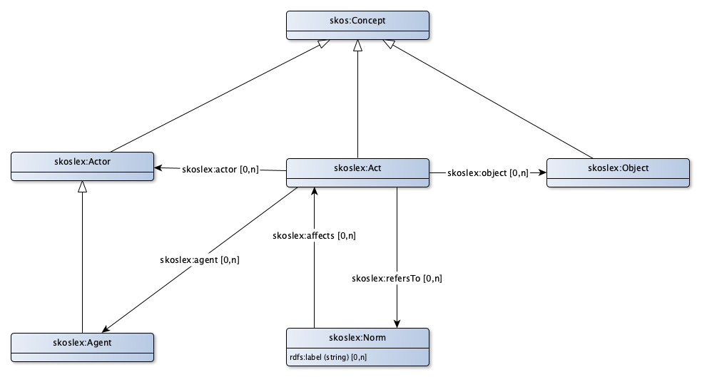

# SKOS-Lex toepassingsprofiel voor (rechts)handelingen

Gebeurtenissen kunnen worden beschreven als begrippen. Ze hebben dan dezelfde kenmerken als begrippen, die ‘objecten’ aanduiden, maar hebben ook nog enkele andere kenmerken.
* Gebeurtenissen worden in wet- en regelgeving beschreven als mogelijke (rechts)handelingen die kunnen plaatsvinden in een bepaald domein. Een voorbeeld is het exploiteren van een jachthaven in het domein van het Besluit Activiteiten Leefomgeving (BAL).
* Gebeurtenissen maken de dynamiek van de institutionele werkelijkheid zichtbaar. Bij een wijziging in de registratie kan worden gerefereerd aan de gebeurtenis.  Dit helpt om bij een wijziging te begrijpen ‘wat er is gebeurd’. Een voorbeeld is een nieuwe eigenaar van een onroerend goed in de BRK, waarbij wordt vastgelegd dat deze situatie is ontstaan door een overdracht, vererving, boedelverdeling, etc.
* Een gebeurtenis heeft betrekking op een object. Dit object is een ‘gewoon’ begrip. Bij het voorbeeld van de overdracht in de BRK is het object het onroerend goed.
* Institutionele gebeurtenissen of rechtshandelingen kennen een of meerdere actoren, bijvoorbeeld de verkoper en de koper bij de overdracht van een huis. In gevallen waar de wet- en regelgeving vooral bedoeld is om de regels (normen) te beschrijvingen word een actor ook wel een normadressaat genoemd. Actoren zijn ook ‘gewone’ begrippen.
* En niet iedereen is bevoegd om een institutionele gebeurtenis vast te leggen. Dat gebeurt door een beëdigd ambtenaar of door een notaris. Dit wordt een ‘agent’ (in de Engelse betekenis van het woord) genoemd. Dit een een speciaal soort actor.
* Tot slot zijn er de regels ofwel normen waaraan een rechtshandeling moet voldoen. Normen zijn géén begrippen.

## Handeling

|!form data#Act!Klasse|Handeling
|----------|------
|Gebruikte term|[skoslex:Act](http://bp4mc2.org/def/skos-lex#Act)
|Uitleg|De klasse van handelingen. Een handeling is een juridische constructie die een verzamelingen activiteiten voorstelt, uitgevoerd door een Actor en op een Object.
|Voorbeeld|De levering van een onroerend goed zoals vastgelegd in een notariele akte (rechtshandeling), Het bouwen van een bouwwerk (handeling)
|Eigenschappen en relaties|[actor](#Act_actor), [agent](#Act_agent), [object](#Act_object), [verwijst naar](#Act_refersTo)

### Relaties

|!form data#Act_actor!Eigenschap|actor
|----------|------
|Gebruikte term|[skoslex:actor](http://bp4mc2.org/def/skos-lex#actor)
|Verwijst naar|[skoslex:Actor](#Actor)
|Uitleg|Actor relateert een handeling aan de actor die de handeling uitvoert
|Voorbeeld|Jan Jansen in zijn rol van koper van een onroerend goed.

|!form data#Act_agent!Eigenschap|agent
|----------|------
|Gebruikte term|[skoslex:agent](http://bp4mc2.org/def/skos-lex#agent)
|Verwijst naar|[skoslex:Agent](#Agent)
|Relatie met|[Agent](#LegalAgent)
|Uitleg|Agent relateert een handeling aan de agent die bij de handeling betrokken is
|Voorbeeld|Een notaris die een akte opmaakt bij de koop van een onroerend goed.

|!form data#Act_object!Eigenschap|object
|----------|------
|Gebruikte term|[skoslex:object](http://bp4mc2.org/def/skos-lex#object)
|Verwijst naar|[skoslex:Object](#Object)
|Uitleg|Object relateert een handeling met een object dat ontstaat, wijzigt of wordt gebruikt gedurende een act
|Voorbeeld|Het onroerend goed DPV00 B 1207 als onderwerp van de koop.

|!form data#Act_refersTo!Eigenschap|verwijst naar
|----------|------
|Gebruikte term|[skoslex:refersTo](http://bp4mc2.org/def/skos-lex#refersTo)
|Verwijst naar|[skoslex:Norm](#Norm)
|Uitleg|Verwijst naar relateert een norm aan de handeling waarnaar de norm refereert. Zo'n handeling heeft een relatie met de norm, zonder verdere specificatie. Het kan zijn dat de norm bepaalde zaken voorschrift, maar het kan ook zijn dat de handeling een preconditie is, of gewoon benoemd is in de regels.
|Voorbeeld|De verkoper van een onroerend goed moet bij de verkoop ervan kunnen aantonen dat hij eigenaar is.

## Object

|!form data#Object!Klasse|Object
|----------|------
|Gebruikte term|[skoslex:Object](http://bp4mc2.org/def/skos-lex#Object)
|Uitleg|De klasse van objecten. Een object is een ding (niet een actor) dat ontstaat, wijzigt of gebruikt wordt gedurende een handeling
|Voorbeeld|Het onroerend goed DPV00 B 1207.

## Actor

|!form data#Actor!Klasse|Actor
|----------|------
|Gebruikte term|[skoslex:Actor](http://bp4mc2.org/def/skos-lex#Actor)
|Uitleg|De klasse van actoren. Een actor is een persoon (individu, groep of organisatie) die een handeling uitvoert
|Voorbeeld|Jan Jansen.

## Agent

|!form data#LegalAgent!Klasse|Agent
|----------|------
|Gebruikte term|[skoslex:Agent](http://bp4mc2.org/def/skos-lex#Agent)
|Uitleg|De klasse van agenten. Een agent is een persoon (individu, groep of organisatie) die bij een handeling betrokken is, zonder de handeling feitelijk uit te voeren.
|Voorbeeld|Notaris Pietersen.

## Norm

|!form data#Norm!Klasse|Norm
|----------|------
|Gebruikte term|[skoslex:Norm](http://bp4mc2.org/def/skos-lex#Norm)
|Uitleg|The klasse van normen. Een norm heeft effect op een handeling. De norm stelt wat 'zou moeten' of juist 'niet zo moeten' met betrekking tot de handeling. Een norm representeert de regels die gelden voor de handeling.
|Voorbeeld|De verkoper van een onroerend goed moet bij de verkoop ervan kunnen aantonen dat hij eigenaar is.
|Eigenschappen en relaties|[normeert](#Norm_affects), [Label](#Norm_label)

### Eigenschappen

|!form data#Norm_label!Eigenschap|Label
|----------|------
|Gebruikte term|[rdfs:label](http://www.w3.org/2000/01/rdf-schema#label)
|Datatype|[Tekst](http://www.w3.org/2001/XMLSchema#string)

### Relaties

|!form data#Norm_affects!Eigenschap|normeert
|----------|------
|Gebruikte term|[skoslex:affects](http://bp4mc2.org/def/skos-lex#affects)
|Verwijst naar|[skoslex:Act](#Act)
|Uitleg|Normeert relateert een norm aan de handeling die de norm normeert. Zo'n handeling wordt beperkt door de regels van de norm

## Uri strategie

Agents, objects en actors zijn concepten en volgende de URI opbouw van een concept. Voor Norm geldt het volgende template:
* `http://{domain}/id/norm/{UpperCamelCase(rdfs:label)}`

