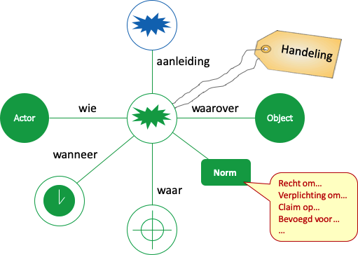

# SKOS-LEX Primer

## Inleiding

[SKOS-LEX](https://bp4mc2.org/def/skos-lex) is een uitbreiding op SKOS voor het beschrijven van juridische constructies.

[SKOS](https://www.w3.org/TR/skos-reference/) is de W3c recommendation voor het beschrijven van een gecontrolleerde vocabulaire zoals begrippenkaders, taxonomieen, thesauri en classificatieschema's. Het is expliciet ontworpen als een "Simpele" beschrijvingswijze (zie: [Key choices in the design of Simple Knowledge Organization System (SKOS)](https://www.sciencedirect.com/science/article/pii/S1570826813000176)), om er voor te zorgen dat elk kennissysteem in ieder geval in SKOS is uit te drukken. Het nadeel van deze ontwerpbeslissing is dat met SKOS vrij weinig daadwerkelijk expliciet is uit te drukken: het blijft vrij algemeen.

Hiervoor heeft SKOS dan ook een [uitbreidingsmechanisme](https://www.w3.org/TR/skos-primer/#secskosspecialization) beschreven, dwz: hoe je SKOS zou kunnen aanvullen op het moment dat je wel explicieter wilt vermelden waar je het over hebt. Een veel gebruikte aanvulling is SKOS-THES, waarin aanvullende constructies zijn opgenomen om SKOS te harmoniseren met de ISO xxx standaard voor het beschrijven van Thesauri.

SKOS-LEX is ook een dergelijke uitbreiding op SKOS. Het breid SKOS uit met juridische constructies, zodat ook de basis van juridische formuleringen opgenomen kunnen worden in SKOS.

## Rationale

Elke uitbreiding op SKOS leidt tot een nieuwe vocabulaire. En net als bij elke vocabulaire is voorzichtigheid geboden: het liefst gebruik je een al bestaande vocabulaire: waarom iets nieuws bedenken, als iemand anders al iets goeds heeft bedacht? Bovendien: iets wat al eerder is bedacht, wordt vermoedelijk ook al gebruikt, dus kun je aansluiten op bestaand gedachtengoed.

Helaas bestaat er geen uitbreiding op SKOS die ingaat op dit juridisch gedachtengoed. Zo bestaan er wel vocabulaires die ingaan op "gebeurtenissen" of "handelingen" (een belangrijk concept voor SKOS-LEX), zoals [EVENT](http://motools.sourceforge.net/event/event.html) of [PROV-O](https://www.w3.org/TR/prov-o/), maar elk van deze vocabulaires gaan over concrete gebeurtenissen en handelingen, terwijl het in SKOS-LEX nu juist gaat om een handeling als concept. Ook bestaan er vocabulaires die juridisch van aard zijn, bijvoorbeeld [ODRL](https://www.w3.org/TR/odrl-vocab/) die digitale rechtenstructuren beschrijft. Maar deze vocabulaires zijn specifiek en kunnen niet algemeen worden toegepast in elk domein.

## Ontwerpkeuze: simpel

De ontwerpkeuze van SKOS om het simpel te houden, hebben wij meegenomen in het "simpel" houden van SKOS-LEX: het kent in de basis slechts drie uitbreidingen op SKOS: [Act](http://bp4mc2.org/def/skos-lex#Act) (handeling), [Actor](http://bp4mc2.org/def/skos-lex#Actor) en [Object](http://bp4mc2.org/def/skos-lex#Object). Het is daarmee in onze ogen de meest minimale en simpele uitbreiding die je zou kunnen doen, zonder dat je het doel verliest, namelijk: juridische constructies duiden.

Zowel [Actor](http://bp4mc2.org/def/skos-lex#Actor) als [Object]((http://bp4mc2.org/def/skos-lex#Object)) kennen in SKOS-LEX nog een specialisatie: [Agent]((http://bp4mc2.org/def/skos-lex#Agent)) en [Record]((http://bp4mc2.org/def/skos-lex#Record)). De vraag is waarom deze specialisaties noodzakelijk zijn. Immers: met alleen [Act](http://bp4mc2.org/def/skos-lex#Act), [Actor](http://bp4mc2.org/def/skos-lex#Actor) en [Object](http://bp4mc2.org/def/skos-lex#Object) kun je alles (al) beschrijven. Toch hebben we gekozen om [Agent](http://bp4mc2.org/def/skos-lex#Agent) en [Record]((http://bp4mc2.org/def/skos-lex#Record)) toe te voegen. De reden is dat een agent en een record een fundamenteel andere rol vervullen in een juridische constructie dan een actor en een object. Je zou kunnen zeggen: zonder agent en record heb je het niet over juridische constructies, maar simpelweg over constructies. Zonder agents en records is het moeilijk om juridisch zaken te doen. Wij lichten dit hieronder toe.

Naast deze uitbreidingen op de klasse [skos:Concept](http://www.w3.org/2004/02/skos/core#Concept) hebben we nog een eigen klasse toegevoegd: [skoslex:Norm](http://bp4mc2.org/def/skos-lex#Norm). Zonder deze klasse kun je slechts de wereld beschrijven, maar je kunt geen afspraken vastleggen wat wel en niet zou mogen. Vandaar deze toevoeging. Om het model "Simpel" te houden, is het hier bij gebleven. We voorzien dat er ruimte is om de klasse [Norm](http://bp4mc2.org/def/skos-lex#Norm) verder te specialiseren, of juist te relateren aan meer gedetailleerde modellen om normen vast te leggen, bijvoorbeeld ten behoeve van regelsystemen.

## Acts (handelingen)
Voor succesvolle samenwerking is het belangrijk dat we elkaar goed verstaan. Elke partner in de samenwerking kent haar eigen context en kent vanuit deze context aan de gebruikte terminologie een betekenis. Vandaar dat we begrippen definiëren: zo weten we wat we bedoelen, en kunnen we verschillen in betekenis van de gebruikte terminologie snel opsporen.

Het is gebruikelijk om daarbij in eerste instantie te denken aan de zelfstandignaamwoorden: de onderwerpen waarover we praten. Maar minstens zo belangrijk zijn de handelingen die we in de samenwerking uitvoeren. En dit zijn juist vaak geen zelfstandignaamwoorden, maar werkwoorden. Hoewel je van de handeling vaak wel een zelfstandignaamwoord kunt maken (betalen wordt dan betaling, etc).

Wet- en regelgeving gaat vooral over het stellen van normen aan de handelingen die we als mensen of rechtspersonen uitvoeren of willen uitvoeren. De wet- en regelgeving gaat primair over deze handelingen, de onderwerpen zijn slechts noodzakelijk om de handeling te duiden.

[SKOS-LEX](https://bp4mc2.org/def/skos-lex) is een uitbreiding van SKOS waarin de handeling centraal staat. Elke handeling ([skoslex:Act](http://bp4mc2.org/def/skos-lex#Act)) is een begrip waarmee een handeling wordt gedefinieerd, uitgevoerd door één of meerdere actoren ([skoslex:Actor](http://bp4mc2.org/def/skos-lex#Actor)) op één of meerdere objecten ([skoslex:Object](http://bp4mc2.org/def/skos-lex#Object)). Ook actoren en objecten zijn begrippen.

In een samenwerkingsketen volgen handelingen elkaar op: de ene handeling is de aanleiding voor het starten van de volgende handeling. Deze keten van handelingen beschrijft de samenwerking. De actoren van de handelingen vervullen een rol binnen deze samenwerking, en de objecten betreffen hetgeen waarover de samenwerking gaat. Op deze wijze is duidelijk welke begrippen relevant zijn in de samenwerking en kan gecontroleerd worden of sprake kan zijn van een succesvolle samenwerking (dwz: er is sprake van een betekenisvolle, door iedereen begrepen keten van begrippen), of dat er nog onduidelijkheden zitten (bijvoorbeeld omdat handelingen of objecten niet overeen komen bij opvolgende handelingen).

## Handeling, actoren en objecten

Een juridisch systeem normeert handelingen: het normeert wat mensen wel en niet mogen "doen". Dit "doen" moet breed worden geïnterpreteerd: ook het "in stand houden", "bezitten", "laten gebeuren" of juist iets niet doen, wordt hieronder verstaan. Dergelijke handelingen worden altijd uitgevoerd door iemand: dat de zon opkomt is een gegeven en zal dus niet zo snel in een juridisch systeem worden opgenomen. En ook het feit dat er onkruid groeit tussen stoeptegels of dat er sneeuw valt, is niet iets dat je in een juridisch systeem zult opnemen. Maar je kunt wel het "onderhouden van de stoep" of het "plaatsen van zonneschermen" in een juridisch systeem opnemen.

Een "iemand" is in zo'n jurisch systeem een drager van rechten en plichten. Dit zijn normaal gesproken mensen, maar ook organisaties (als rechtspersoon) kunnen als zo'n drager van rechten en plichten worden gezien. Niet altijd is iets dat handelt ook een actor in relatie tot een handeling. Zo zijn dieren in ons huidige juridische systeem geen dragers van rechten en/of plichten. Het is juist de mens die de plicht heeft om zorg te dragen voor dieren. In die zin is een dier dus vaak geen actor, maar een object van de handeling. Hetzelfde geldt in zekere zin voor kinderen. Zowel dieren als kinderen kunnen wel actor zijn van een handeling. Dit bijvoorbeeld het geval op het moment dat een dier of kind iets doet wat op zichzelf niet genormeerd wordt, maar waar juist een ander voor verantwoordelijk is. Er is dan sprake van twee handelingen: de feitelijke handeling zoals deze wordt uitgevoerd door het kind of het dier, en de handeling van het nemen van de verantwoordelijkheid voor eerstgenoemde handeling.

Naast begrippen die betrekking hebben op handelingen en actoren die handelen, heb je nog objecten: dingen die niet handelen en ook geen handeling zijn. Zo kun je het hebben over het object "stoep" die "schoongehouden" wordt door iemand. Merk op dat ook zaken die kunnen handelen wel gezien kunnen worden als een object, zoals hierboven al is toegelicht: het betekent dan alleen maar dat ze de betreffende handeling zelf niet uitvoeren, en er alleen object in zijn. Ook een handeling zelf kan zo object zijn van een andere handeling, zoals we hierboven al hebben gezien: de feitelijke handeling is object in de verantwoordelijkheidshandeling. In het Nederlands gaat het dan vaak om de "ing" vorm van een werkwoord. Bijvoorbeeld het controleren van een "betaling", waarbij een handeling ("betalen") wordt gezien als object van de handeling "controleren".

## Norm
Met handelingen, actoren en objecten kun je beschrijven wat je zou willen normeren. Maar met slechts deze drie elementen kun je nog niet aangeven wat juist wel en niet mag of onder welke voorwaarden: de norm zelf ontbreekt. Een norm is niet zozeer een "begrip": de meeste normen worden niet aanduid met een term, maar omvatten juist een geheel van regels. We zien de [Norm](http://bp4mc2.org/def/skos-lex#Norm) dan ook als een afzonderlijke klasse en geen specialisatie van [skos:Concept](http://www.w3.org/2004/02/skos/core#Concept).

Er bestaan veel vocabulaires die gaan over wat wel en wat niet mag. Er bestaan vocabulaires waarmee je hele beslisssystemen kunt ontwerpen en vocabulaires die speciaal ingaan op de typen rechten en plichten die er zoal zijn. In de kern is SKOS-LEX een uitbreiding op SKOS. We zijn dan ook zuinig op het toevoegen van extra klassen. Het besluit om wel een [Norm](http://bp4mc2.org/def/skos-lex#Norm)-klasse te introduceren is om expliciet aan te geven dat de betekenis van een handeling los staat van het de normering van deze handeling. Zo kun je het hebben over een handeling (bijvoorbeeld het plaatsen van een tafel met stoelen op een stoep ten behoeve van horeca), los van de normering (dat dit alleen mag met een vergunning en alleen gedurende bepaalde tijden). De norm kan veranderen, de handeling is veelal stabiel.

## Agent en Record
In het juridisch verkeer is bij bepaalde handelingen sprake van een rechtshandeling: een handeling met een beoogd rechtsgevolg. Bijvoorbeeld de overdracht van een zakelijk recht (in normaal Nederland: "aan- en verkoop van een huis"), het aangaan van een verbintenis (bijvoorbeeld een arbeidsrelatie) of een huwelijk. Omdat niet iedereen bij dergelijke rechtshandelingen kan zijn, en je op een later moment toch met zekerheid wilt weten dat dergelijke rechtshandelingen zijn gepleegd, leggen we deze rechtshandelingen vast. En soms zijn er personen met een specifieke rol ("ambt") aanwezig die noodzakelijk zijn voordat sprake kan zijn van de rechtshandeling. Zoals de notaris bij de overdracht van een zakelijk recht of een ambtenaar van de burgelijke stand bij een huwelijk. Ook buiten het juridische verkeer is sprake van dergelijke actoren en objecten. Denk bijvoorbeeld aan de scheidsrechter bij een voetbalwedstrijd of een foto van de finish bij een atletiekwedstrijd.

Het object waarin de handeling wordt vastgelegd onderscheiden we door hiervoor een afzonderlijke subklasse voor te duiden: het [Record](http://bp4mc2.org/def/skos-lex#Record). In een samenwerkingsketen van opeenvolgende handelingen is dit record vaak belangrijker dan de overige objecten waarover de handeling gaat. Juist bij opeenvolgende handelingen zullen niet alle actoren van een volgende handeling aanwezig zijn geweest bij een voorgaande handeling. Het record dient als het overdraagbare object dat de noodzakelijke informatie biedt over de betreffende handeling. En juridisch gezien kan het record dienen als "bewijs" dat de handeling heeft plaatsgevonden.

De actoren met een bijzondere rol in de handeling onderscheiden we door hiervoor een afzonderlijke subklasse voor te duiden: de [Agent](http://bp4mc2.org/def/skos-lex#Agent). In een samenwerkingsketen van opeenvolgende handelingen zijn het vaak de agents die samenwerken: zij verzorgen gezamenlijk de dienstverlening aan de actoren. Hun rol is dienend: zij voeren de handelingen zelf niet uit, maar zijn wel noodzakelijk om de handeling tot stand te brengen. Agents lijken daarin wel wat op katalysators bij een chemische reactie.

## Relaties
SKOS-LEX introduceert drie specialisaties van [skos:Concept](http://www.w3.org/2004/02/skos/core#Concept). De handeling ([skoslex:Act](http://bp4mc2.org/def/skos-lex#Act)), de actor ([skoslex:Actor](http://bp4mc2.org/def/skos-lex#Actor)) en het object ([skoslex:Object](http://bp4mc2.org/def/skos-lex#Object)). Het is de bedoeling dat deze drie expliciet uit elkaar worden gehouden: een handeling kan geen actor of object zijn, een actor kan geen handeling of object zijn en een object kan geen handeling of actor zijn. Dit klinkt logisch. Actoren kunnen handelen, ze kunnen iets "doen". Een object kan juist *niet* handelen, het kan niks "doen". En een handeling is juist hetgeen dat gedaan wordt.

Toch kan het voorkomen dat een actor eigenlijk het object is van een handeling (bijvoorbeeld bij een beoordeling). Ook een handeling zelf kan het object zijn van een handeling (bijvoorbeeld het vastleggen van een voetbalwedstrijd). Naast de drie klassen onderkennen we dan ook twee eigenschappen die de relatie beschrijven tussen een handeling en een actor of object:

- Via de eigenschap [skoslex:actor](http://bp4mc2.org/def/skos-lex#actor) wordt aangegeven door welke [Actor](http://bp4mc2.org/def/skos-lex#Actor)(en) de betreffende handeling wordt uitgevoerd;
- Via de eigenschap [skoslex:object](http://bp4mc2.org/def/skos-lex#octor) wordt aangegeven welk(e) [Object](http://bp4mc2.org/def/skos-lex#Object)(en) betrokken zijn in de handeling.

De klasse [Agent](http://bp4mc2.org/def/skos-lex#Agent) is een specialisatie van de klasse [Actor](http://bp4mc2.org/def/skos-lex#Actor). Daaruit kun je afleiden dat elke agent ook een actor is. En het kan dan ook zo zijn dat een agent in bepaalde gevallen in de rol van actor handelt, en in andere gevallen in de rol van agent. Hetzelfde geldt niet voor de relatie met de handeling: de agent zal *of* in de rol van agent handelen, *of* in de rol van actor. Als dezelfde persoon beide rollen vervult in dezelfde handeling, dan ligt het meer voor de hand om hier afzonderlijke begrippen voor te introduceren:

- Via de eigenschap [skoslex:agent](http://bp4mc2.org/def/skos-lex#agent) wordt aangegeven welke [Agent](http://bp4mc2.org/def/skos-lex#Agent)(s) betrokken zijn bij de handeling;
- Via de eigenschap [skoslex:actor](http://bp4mc2.org/def/skos-lex#agent) wordt aangegeven dat (een) [Agent](http://bp4mc2.org/def/skos-lex#Agent)(s) in geval van deze handeling ook zelf uitvoerend is.

Hetzelfde geldt voor een record. De klasse [Record](http://bp4mc2.org/def/skos-lex#Record) is een specialisatie van de klasse [Object](http://bp4mc2.org/def/skos-lex#Agent). Daaruit kun je afleiden dat elk record ook een object is. En het kan dan ook zo zijn dat een record in bepaalde gevallen object is van de handeling, en in andere gevallen juist het record (de "opname") van de handeling. Hetzelfde geldt niet voor de relatie met de handeling: het record zal *of* de opname zijn van de handeling, *of* daadwerkelijk object zijn in de handeling. Als hetzelfde ding beide rollen vervult in dezelfde handeling, dan ligt het meer voor de hand om hier afzonderlijke begrippen voor te introduceren:

- Via de eigenschap [skoslex:record](http://bp4mc2.org/def/skos-lex#record) wordt aangegeven in welk [Record](http://bp4mc2.org/def/skos-lex#Record) de vastlegging van de handeling plaatsvindt;
- Via de eigenschap [skoslex:object](http://bp4mc2.org/def/skos-lex#object) wordt aangegeven welk [Record](http://bp4mc2.org/def/skos-lex#Record)(s) in geval van deze handeling ook zelf object is van de handeling.

Of een begrip gezien moet worden als [Act](http://bp4mc2.org/def/skos-lex#Act) (handeling), [Actor](http://bp4mc2.org/def/skos-lex#Actor), [Agent](http://bp4mc2.org/def/skos-lex#Agent), [Object](http://bp4mc2.org/def/skos-lex#Object) of [Record](http://bp4mc2.org/def/skos-lex#Actor) is afhankelijk van de relaties die dit begrip heeft met andere begrippen:

- Elk begrip dat wordt uitgevoerd door een [actor](http://bp4mc2.org/def/skos-lex#actor) betreft een [Act](http://bp4mc2.org/def/skos-lex#Act) (handeling). Een dergelijk begrip kan zelf geen [Actor](http://bp4mc2.org/def/skos-lex#Actor), [Agent](http://bp4mc2.org/def/skos-lex#Agent), [Object](http://bp4mc2.org/def/skos-lex#Object) of [Record](http://bp4mc2.org/def/skos-lex#Record) zijn. Wel kan een handeling de rol van [object](http://bp4mc2.org/def/skos-lex#object) vervullen bij een andere handeling;
- Elk begrip dat de rol van [agent](http://bp4mc2.org/def/skos-lex#agent) vervult bij minimaal één handeling betreft een [Agent](http://bp4mc2.org/def/skos-lex#Agent). Een agent kan ook nog de rol van [actor](http://bp4mc2.org/def/skos-lex#actor) of [object](http://bp4mc2.org/def/skos-lex#object) vervullen bij een handeling.
- Elk begrip dat de rol van [actor](http://bp4mc2.org/def/skos-lex#actor) vervult bij minimaal één handeling en geen [Agent](http://bp4mc2.org/def/skos-lex#Agent) is, betreft een [Actor](http://bp4mc2.org/def/skos-lex#Actor). Een actor kan ook nog de rol van [object](http://bp4mc2.org/def/skos-lex#object) vervullen bij een handeling.
- Elk begrip dat de rol van [record](http://bp4mc2.org/def/skos-lex#record) vervult bij minimaal één handeling, betreft een [Record](http://bp4mc2.org/def/skos-lex#Record). Een record kan ook nog de rol van [object](http://bp4mc2.org/def/skos-lex#object) vervullen bij een handeling.
- Elk begrip dat de rol van [object](http://bp4mc2.org/def/skos-lex#object) vervult bij minimaal één handeling en geen [Record](http://bp4mc2.org/def/skos-lex#Record), [Actor](http://bp4mc2.org/def/skos-lex#Actor), [Agent](http://bp4mc2.org/def/skos-lex#Agent) of [Act](http://bp4mc2.org/def/skos-lex#Act) is, betreft een [Object](http://bp4mc2.org/def/skos-lex#Object).
- Alle overige begrippen zijn slechts begrippen ([skos:Concept](http://www.w3.org/2004/02/skos/core#Concept)) en geen specialisatie hiervan.

Onderstaande tabel geeft dit grafisch weer.

|           |uitgaand|skos:agent|skos:actor|skos:record|skos:object|
|-----------|---|---|---|---|---|
|skos:Act   | x | - | - | - | - |
|skos:Agent | - | x | o | - | o |
|skos:Actor | - | - | x | - | o |
|skos:Record| - | - | - | x | o |
|skos:Object| - | - | - | - | x |

[skos:Act](http://bp4mc2.org/def/skos-lex#Act) begrippen hebben een uitgaande relatie skos:agent, skos:Actor, skos:record of skos:object naar een ander begrip. De overige specialisaties hebben juist alleen ingaande relaties.

Een "x" in de kolom betekent dat een dergelijke relatie minimaal moet voordoen. Een "o" in de kolom betekent dat een dergelijke relatie aanvullend ook is toegestaan. Een "-" in de kolom betekent dat de betreffende relatie niet voor mag komen.

## Relaties versus specialisaties van skos:Concept
Aangezien de Agent klasse een specialisatie is van de Actor klasse, worden alle Agents ook als Actors gezien. Echter, het is niet de bedoeling om een Agent expliciet ook als Actor te benoemen. Met het benoemen van een partij als agent wordt aangegeven dat de betreffende partij fundamenteel onderdeel is van de aard van de handeling, maar zelf niet daadwerkelijk partij is *in* de handeling. Mocht sprake zijn van verwarring, dan ligt het meer voor de hand om het begrip op te splitsen in twee afzonderlijke begrippen.

Laten we bijvoorbeeld een advocaat nemen. In de rechtzaak zal de advocaat gezien worden als Agent. Maar wat als deze advocaat ook mensen in dienst heeft? In de handeling van het in dienst nemen van personen, zal diezelfde persoon gezien worden als actor. In zo'n situatie zal deze persoon een Agent zijn in zijn rol als Advocaat en diezelfde persoon als Actor in zijn rol als Werkgever.

Aangezien de Record klasse een specialisatie is van de Object klasse, worden alle Records ook als Objects gezien. Echter, het is niet de bedoeling om een Record expliciet ook als Object te benoemen. Met het benoemen van iets als record wordt aangegeven dat het betreffende ding fundamenteel onderdeel is van de aard van de handeling, maar zelf niet daadwerkelijk object *van* de handeling. Mocht sprake zijn van verwarring, dan ligt het meer voor de hand om het begrip op te splitsen in twee afzonderlijke begrippen.

Laten we bijvoorbeeld een contract nemen. Het contract zelf is de vastlegging ("record") van een overeenkomst tussen twee partijen. Bijvoorbeeld een overeenkomst om bepaalde goederen te leveren. Deze goederen zelf zijn het object van de overeenkomst. Het contract is de vastlegging, het "record" van de overeenkomst. De totstandkoming van deze overeenkomst zal ook het opstellen van het contract omvatten. Het opstellen van het contract is een afzonderlijke handeling. Het object van *deze* handeling is het contract zelf. Het contract blijft van het type Record en zal een object-relatie hebben de opstellen-handeling en een record-relatie met de overeenkomst-handeling.
