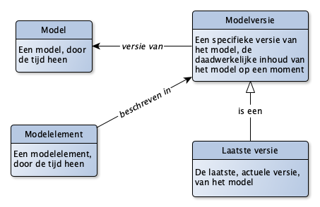
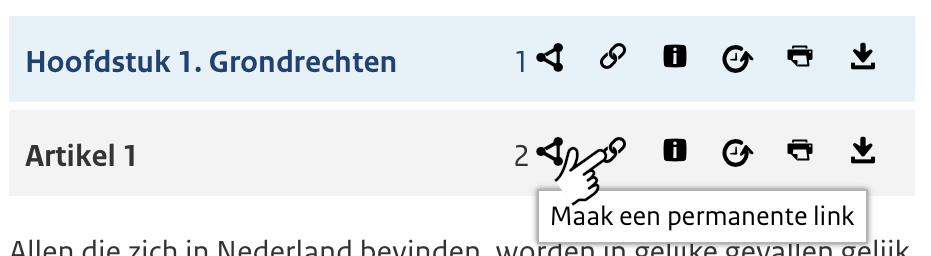

# Versionering

Dit document beschrijft de versionering van modellen. In het bijzonder modellen van begrippen (begrippenkaders) en domeinmodellen (ontologieën).

## begrippen



De volgende begrippen zijn relevant met betrekking tot versionering:

- Een **Model** is een abstracte representatie van een model door de tijd heen. Zo kun je het hebben over het *begrippenkader nen3610*, zonder dat je spreekt over een specifieke versie. De naam van een dergelijk model bevat over het algemeen ook geen versienummer of datum: het gaat immers over het model door de tijd heen. Soms wordt in de naam de "geboortedatum" of "geboortejaar" van het model opgenomen: de datum waarop het model voor het eerst werd gepubliceerd.
- Een **Modelversie** is een specifieke versie van een model, zoals dit model op een bepaald moment in de tijd bestaat. Een modelversie is dus altijd een "snapshot" een "foto" van het model op een zeker tijdstip. Zo'n versie kan een status hebben (bv: "in concept" of "gepubliceerd"). De versiedatum van een dergelijke modelversie is de datum waarop de versie zijn huidige vorm heeft gekregen (feitelijk: datum laatste wijziging). Een modelversie kan ook een release- of publicatiedatum hebben: de datum waarop deze modelversie daadwerkelijk beschikbaar is gekomen, gepubliceerd in zijn definitieve vorm.
- Een **Modelelement** is een abstracte representatie van een modelelement door de tijd heen. Bijvoorbeeld het begrip "Gebouw" in een begrippenkader of de eigenschap "bouwjaar" in een ontologie. Merk op dat er vele beschrijvingen door de tijd heen kunnen zijn van deze modelelementen. Het blijft hetzelfde begrip, klasse of eigenschap zolang de betekenis ervan gelijk is gebleven. Uiteindelijk is het een keuze van de modelleur om te bepalen wanneer echt niet meer sprake is van hetzelfde begrip. Zie [https://www.w3.org/TR/vocab-dcat-2/](https://www.w3.org/TR/vocab-dcat-2/) voor een voorbeeld hoe omgegaan wordt met verschillende beschrijving van dezelfde modelelementen. De naam van een modelelement bevat (dus) ook nooit een versienummer of versiedatum.
- De **Laatste versie** van een model is een bijzondere modelversie, namelijk de laatst gepubliceerde versie: de actuele, geldige.

## Identificaties
Voorkomens van de hierboven genoemde begrippen hebben allemaal een identificatie (URI). Daarbij geldt de volgende conventie:

- De URI van een **Model** is gebaseerd op de **Namespace** van dit model. Een namespace is feitelijk de "naamruimte" binnen het model: alle "namen" van de modelelementen die onderdeel zijn van dit model moeten uniek zijn. Aangezien er maar 1 model is binnen deze naamruimte, is de URI van het model vaak gelijk of vrijwel gelijk aan de namespace.
- De URI van een **Modelversie** is gebaseerd op de URI van het model, met daarbij ook ruimte voor een versienummer, versienaam en/of (deel van de) versiedatum om de specifieke versie van het model te kunnen duiden.
- De URI van een **Modelelement** is gebaseerd op de **Namespace** van het model en de naam van het modelelement. Hier zit dus GEEN versienummer of versiedatum bij (!)
- De URI van de **Laatste versie** is gelijk niets anders dan de URI van de betreffende Modelversie.

Voorbeelden:
```
<http://modellen.geostandaarden.nl/def/nen3610> a owl:Ontology. #Een model
<http://modellen.geostandaarden.nl/def/nen3610-2010-05-13> a owl:Ontology. #Een modelversie
<http://modellen.geostandaarden.nl/def/nen3610#Gebouw> a owl:Class. #Een modelelement (klasse)

<http://definities.geostandaarden.nl/nen3610> #Een model (van begrippen)
<http://definities.geostandaarden.nl/nen3610-2010-05-13> #Een modelversie
<http://definities.geostandaarden.nl/nen3610/id/begrip/Gebouw> a skos:Concept #Een modelelement (begrip)
<http://definities.geostandaarden.nl/nen3610/id/conceptschema/nen3610> a skos:ConceptScheme #Een ander modelelement (begrippenkader)
```

In bovenstaande voorbeelden is ook de URI strategie meegenomen:
- Een ontologie eindigt op "def/<naam ontologie"
- De elementen in de ontologie volgen de structuur "/def/<naam ontologie>#<naam element"
- Een model van begrippen kent een eigen Namespace
- Elementen in dat model zijn te herkennen via de "id/begrip/<naam begrip>" opbouw.

Merk op: een skos:ConceptScheme is een *Modelelement* geen Model of Modelversie! Vaak wordt dit in het spraakgebruik wel door elkaar gebruikt, maar aan de opbouw van de identificatie is zichtbaar dat er een verschil is.

## Content negotiation
In [Cool URI's for the web](https://www.w3.org/TR/cooluris/) wordt uitgelegd hoe content negotiation werkt. Het komt er op neer dat bij het opvragen van dezelfde URL de content die daadwerkelijk wordt teruggegeven door de webserver kan verschillen, afhankelijk van wie er om vraagt (een mens via de browser: HTML, of een machine via een web API: JSON of XML of, ...).

Bij het opvragen van een model *kun* je een extensie meegeven: in dat geval krijg je altijd de content die voldoet aan de betreffende extensie. Zonder extensie zal sprake zijn van content negotiation.

Voorbeelden:
- `<http://modellen.geostandaarden.nl/def/nen3610-2010-05-13>` resulteert in een HTML weergave van deze modelversie, als de URL in de browser is ingevoerd;
- `<http://modellen.geostandaarden.nl/def/nen3610-2010-05-13>` resulteert in een JSON-LD weergave van deze modelversie, als de Web API dit vroeg (via de http header);
- `<http://modellen.geostandaarden.nl/def/nen3610-2010-05-13.ttl>` resulteert in een Turtle (TTL) weergave van deze modelversie.

## Vindplaatsen (locaties)
Modellen kunnen op veel plekken te vinden zijn, maar minimaal zijn ze vindbaar via hun identificatie. Daarbij is er een verschil tussen ontologieën en begrippenkaders.

### Domeinmodellen (ontologie)
De primaire vindplaats van een domeinmodel is de URI van het model. Op dat moment wordt de **Laatste versie** van het model getoond. Content negotiation wordt toegepast om te bepalen welke variant getoond wordt.

Andere versie van het model kunnen gevonden worden door de URI van de betrefende modelversie in te voeren.

Aangezien bij ontologieën gebruik wordt gemaakt van een "#"-URI zal de vindplaats van een modelelement hierbinnen (een klasse, een eigenschap) niet verschillen: op het moment dat de volledige URI van een klasse wordt opgevraagd zal (in geval van HTML) het volledige model worden getoond, en zal de browser automatisch naar de plek in het document gaan waar deze klasse wordt beschreven.

Voorbeeld:
- `<http://modellen.geostandaarden.nl/def/nen3610#Gebouw>` resulteert in de pagina:
- `<http://modellen.geostandaarden.nl/def/nen3610>`.. waarbij de browser automatisch zal gaan naar het onderdeel "Gebouw".

Het is tegenwoordig gebruikelijk om *naast* de beschrijving van het model (het document dat de modelversie bevat) *ook* nog een meer uitgebreide beschrijving van het model te hebben (dit is de feitelijke "standaard"). Zie ook de DCAT standaard. Het model is te vinden via [http://www.w3.org/ns/dcat](http://www.w3.org/ns/dcat), terwijl de standaard gedocumenteerd is op [https://www.w3.org/TR/vocab-dcat-2/](https://www.w3.org/TR/vocab-dcat-2/).

Voorbeelden:
- `<http://modellen.mim-standaarden/def/mim>` beschrijft de ontologie;
- `<https://docs.geostandaarden.nl/mim/mim/>` beschrijft de standaards

### Model van begrippen (begrippenkaders)
Voor begrippen geldt dat vaak de begrippen niet in één document worden getoond, maar in een catalogus waarbij slechts een enkel modelelement wordt getoond. Maar ook in deze gevallen kan de originele URI gebruikt worden. Een specifiek beschrijving van een begrip kan dan getoond worden door de modelversie opbouw te gebruiken:

Voorbeelden:
- `<http://definities.geostandaarden.nl/nen3610>` resulteert in een overzicht van alle begrippen in de actuele versie van het begrippenkader;
- `<http://definities.geostandaarden.nl/nen3610/id/begrip/gebouw>` resulteert in de actuele beschrijving van het begrip;
- `<http://definities.geostandaarden.nl/nen3610-2010-05-13/id/begrip/gebouw>` resulteert in de beschrijving van het begrip zoals in de versie van 2010-05-13 aanwezig was.
- `<http://definities.geostandaarden.nl/nen3610/id/conceptschema/nen3610>` resulteert in een beschrijving van het begrippenkader zelf

Merk op dat het gebruik van `/begrip/` en `/conceptschema` ook net zo goed `/concept/` en `/begrippenkader/` had kunnen zijn. Dit gaat meer over de te volgen URI strategie, en niet specifiek over versionering.

Voor begrippen geldt dat de "id"-URI de identificatie van het begrip zelf is, terwijl de "doc"-URI de daadwerkelijk pagina, beschrijving, van het begrip is. Je ziet dan ook vaak dat er een redirect plaatsvindt:

- `<http://definities.geostandaarden.nl/nen3610/id/begrip/Gebouw>` wordt:
- `<https://definities.geostandaarden.nl/nen3610/doc/begrip/gebouw>`

Merk op: waar identifiers (URIs) vaak beginnen met `http:` (het is immers geen daadwerkelijk webpagina, dus er is ook nog geen sprake van een beveiliging), begint de daadwerkelijk getoonde locatie (URL) vaak met `https:`, aangezien de pagina's beveiligd worden verstuurd. Het gebruik van `http:` identifiers zegt (dus) nog niets over de beveiliging!

Niet altijd is bovenstaande functionaliteit (goed) aanwezig in de publicatietooling. Zo bestaat publicatietooling die (in navolging van dbpedia.org) niet gebruik maakt van de `/doc/`-URI, maar een `/page/`-URI. Het idee is echter hetzelfde: de URI van het "ding" verschilt van de URI van de "pagina-over-dat-ding". Ook kan het zijn dat er sprake is van de encoding van de URI in een algemene catalogus-URI (zie sectie hieronder).

### Taal
Net als het formaat van een beschrijving van een begrip of modelelement, kan ook de taal via het concept van content-negotiation meegenomen worden. Browsers zullen automatisch vragen om een specifieke taal. Dit is instelbaar in elke browser, zodat websites getoond worden in de eigen taal.

Er zijn catalogi die specifieke URLs gebruiken waarin ook een taalelement wordt meegenomen. Zo kan specifiek in de URL een taal worden gekozen. Dit is nooit de identificatie URI van een begrip of modelelement, maar altijd de URL van de beschrijving daarvan:

- `<http://definities.geostandaarden.nl/nen3610/id/begrip/Gebouw>` wordt:
- `<https://definities.geostandaarden.nl/nen3610-2011/nl/page/Gebouw>`

In dit voorbeeld is niet alleen een specifieke taal van de beschrijving opgenomen in de URL (`/nl/`), maar ook een specifieke versie: (`-2011`).

### Alternatieve vindplaatsen (catalogi)
Vaak worden domeinmodellen, maar zeker begrippenkaders, gepubliceerd in een catalogus. Op dat moment kan er een **Alias URI** aanwezig zijn die de URI van de modelbeschrijving *in* de catalogus voorstelt. Hoe deze URI er uit ziet, is afhankelijk van de gebruikte catalogus en wordt hier verder niet meer behandeld.

Voorbeeld:
- `https://definities.geostandaarden.nl/mim/nl/page/?uri=http%3A%2F%2Fdefinities.mim-standaard.nl%2Fid%2Fbegrip%2FDomein` laat het begrip met de URI `http://definities.mim-standaard.nl/id/begrip/Domein` zien in de catalogus op de URL `https://definities.geostandaarden.nl`.

Het kan zijn dat de hierbovengenoemde `/doc/`-URI's niet daadwerkelijk in de catalogus worden getoond, maar dat sprake is van een *redirect* waardoor in de browser URL balk alleen de catalogus-URI zichtbaar is en niet de originele URI. Dit wordt afgeraden. Het is namelijk ook mogelijk om dit "onder water" te doen, waardoor dit niet zichtbaar is en de originele URI wordt getoond. Soms is dit echter technisch niet (of slechts heel lastig) te realiseren in de technologie van de catalogus. In zo'n geval is het aan te raden om **expliciet** in de catalogus de echte, originele URI van het modelelement te tonen.

### Persistente link (de echte URI) in de userinterface
Omdat er verschillende redenen kunnen zijn om in de browser URL-balk niet de daadwerkelijke URI te kunnen tonen van een begrip, klasse of eigenschap, tonen veel user-interfaces tegenwoordig niet alleen de daadwerkelijk (goede) URI, maar wordt het ook makkelijk gemaakt om juist deze URI te gebruiken ipv de URI in de browserbalk:



## Tabel met voorbeelden

Onderstaande tabel geeft een uitwerking van de verschillende URI's en URL's. Daarbij is de volgende casus genomen:
- De casus betreft NEN3610
- Hiervan bestaan twee versies: NEN3610:2011 en NEN3610:2022
- Uitgangspunt is dat de begrippen die in NEN3610:2011 zijn ontstaan, in NEN3610:2022 nog steeds voorkomen met dezelfde betekenis, waarbij de beschrijving en het gebruik wel anders kan zijn
- Zowel een model van begrippen als een ontologie wordt opgesteld, voor beide versies.

Met betrekking tot bovenstaande uitleg over versionering worden de volgende besluiten genomen:
1. Het basispad voor de begrippen wordt `http(s)://definities.geostandaarden.nl`;
2. Het basispad voor de ontologie wordt `http(s)://modellen.geostandaarden.nl`;
3. De basisnaam voor de modellen betreft `nen3610`;
4. De basisnaam voor de versies wordt `nen3610-2011` en `nen3610-2022` (dwz: geen versienummer of volledige versiedatum, slechts het jaartal);
5. Voor begrippen wordt de aanduiding `/id/begrip/` gebruikt, gevolgd door de voorkeursterm van het begrip, beginnend met een hoofdletter;
6. Voor modelelementen in de ontologie wordt de aanduiding `#` gebruikt, gevolgd door de naam van het modelelement, bij klassen beginnende met een hoofdletter, bij eigenschappen beginnend met een kleine letter.

Dit leidt tot de volgende URI's en URL's:

|Categorie|URI/URL|Op dit moment|Toelichting|
|---------|-------|-------------|-----------|
|Identifier begrip| !()[http://definities.geostandaarden.nl/nen3610/id/begrip/Gebouw] | ()[http://definities.geostandaarden.nl/nen3610/id/begrip/Gebouw] en http://definities.geostandaarden.nl/nen3610-2022/id/begrip/gebouw | De begripsidentifier zou niet moeten veranderen tussen versies: het is immers (zie uitgangspunten) nog steeds hetzelfde begrip.|
|Identifier begrippenkader| http://definities.geostandaarden.nl/id/begrippenkader/nen3610 | http://definities.geostandaarden.nl/id/begrippenkader/nen3610 en http://definities.geostandaarden.nl/nen3610-2022/id/begrippenkader/nen3610-2022 | Ook voor het begrippenkader geldt feitelijk dat nog steeds sprake is van het begrippenkader NEN3610, dus ook hier hoeft de URI niet te wijzigen.|
|Identifier klasse| http://modellen.geostandaarden.nl/def/nen3610#Gebouw | http://modellen.mim-standaard.nl/def/mim#Informatiemodel | Voor NEN3610 is nog geen ontologie beschikbaar, voor MIM is wel een dergelijke ontologie beschikbaar. Zichtbaar is dat hier dezelfde opbouw is gekozen.|
|Identifier ontologie | http://modellen.geostandaarden.nl/def/nen3610# | http://modellen.mim-standaard.nl/def/mim# | Zie vorige |
|Redirect identifier | https://definities.geostandaarden.nl/nen3610/doc/begrip/Gebouw | https://definities.geostandaarden.nl/nen3610/nl/page/Gebouw | Redirect zou naar de laatste versie moeten gaan (de URL zonder versieinformatie toont altijd de laatste versie). Daarbij ook wenselijk om dit in de URL zichtbaar te maken. Toevoeging van taal is een optie |
|Redirect begrippenkader | https://definities.geostandaarden.nl/doc/begrippenkader/nen3610 of https://definities.geostandaarden.nl/nen3610 | Niet beschikbaar | Gekozen kan worden dat de redirect van het begrippenkader niet specifiek (alleen) de gegevens over het begrippenkader zelf geeft, maar feitelijk de hele lijst van begrippen, en dan de meest recente versie |
|Redirect ontologie | http://modellen.geostandaarden.nl/def/nen3610 | http://modellen.mim-standaard.nl/def/mim | Door gebruik van de `#` wordt de pagina getoond met de URL voorafgaande aan de `#`. Dit betreft de meest recente versie (de URL zonder versieinformatie toont altijde de laatste versie) |
|2011 versie van de begrippen | https://definities.geostandaarden.nl/nen3610-2011 | https://definities.geostandaarden.nl/nen3610-2011/nl | Toevoeging van de taal is optioneel |
|2020 versie van de begrippen | https://definities.geostandaarden.nl/nen3610-2020 | https://definities.geostandaarden.nl/nen3610-2020/nl | Zie vorige |
|Turtle bestand van de actuele versie van een begrip(beschrijving) | https://definities.geostandaarden.nl/nen3610/doc/begrip/Gebouw.ttl | ?? | |
|Turtle bestand van de 2011-versie van een begrip(beschrijving) | https://definities.geostandaarde.nl/nen3610-2011/doc/begrip/Gebouw.ttl | ?? | |
|Turtle bestand van de 2020-versie van een begrip(beschrijving) | https://definities.geostandaarde.nl/nen3610-2020/doc/begrip/Gebouw.ttl | ?? | |
|Turtle bestand van het volledig 2011 begripsmodel | https://definities.geostandaarde.nl/nen3610-2020.ttl | ?? | |
|Turtle bestand van de actuele versie van de ontologie | https://modellen.geostandaarden.nl/def/nen360.ttl | ?? | |
|Turtle bestand van de 2011-versie van de ontologie | https://modellen.geostandaarden.nl/def/nen3610-2011.ttl | ?? | |
|Turtle bestand van de 2020-versie van de ontologie | https://modellen.geostandaarden.nl/def/nen3610-2022.ttl | ?? | |

Algemene regels:
- Redirect van identifiers gaan altijd naar een URL die de actuele versie toont van de beschrijving van het geïdentificeerde object;
- Een URL zonder versieinformatie toont altijd de meest actuele versie;
- Door toevoegen van `.ttl`, `.jsonld`, `.xml` of `.html` wordt de betreffende serialisatie van het bestand gegeven;
- Indien geen expliciet bestandsformaat wordt meegegeven, dan wordt content-negotiation gebruikt om het bestandsformaat te bepalen (in browsers feitelijk altijd `.html`);
- Toevoegen van een taalaanduiding `/nl/` is optioneel. Zonder taal-aanduiding wordt content-negotiation gebruikt om de taal vast te stellen (in browsers altijd de voorkeurstaal zoals in de instellingen van de browser is opgegeven).
