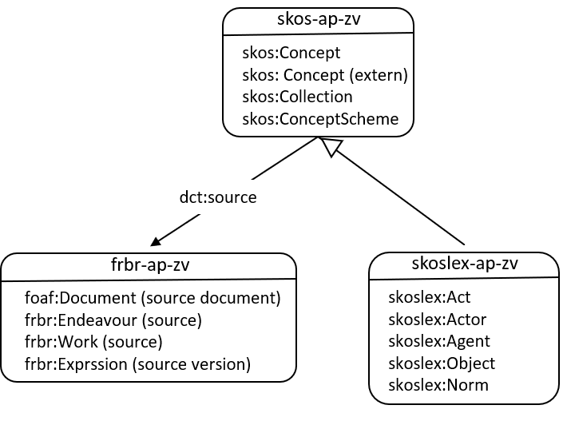

# Stelselcatalogus

In een digitaal stelsel worden data, metadata zoals kwaliteit en herkomst van de data en betekenis van die data uit verschillende domeinen in samenhang beheerd. Voorbeelden in Nederland zijn het stelsel voor de basisregistraties met de domeinen personen, rechtspersonen, inkomen, Kadaster, et cetera en het digitaal stelsel voor de Omgevingswet (DSO) met de domeinen wet-en regelgeving en informatiedomeinen rond lucht, water, aarde (openbare ruimte) en vuur (openbare veiligheid). Een Europees voorbeeld is Inspire, een digitaal netwerk voor het uitwisselen van gegevens over de leefomgeving voor Europese lidstaten. Het afsprakenstelsel voor Zorgeloos vastgoed is ook zo'n digitaal stelsel.

Voor het in samenhang representeren van betekenis en metadata uit verschillende samenhangende domeinen is een soort ‘catalogus’ nodig, een stelselcatalogus. In deze tijd van digitale transformatie is dat een digitale catalogus waarbij betekenis en metadata digitaal, via het web, met standaard webtechnologieën, beschikbaar is.

De W3C heeft standaard vocabulaires waarmee betekenis en metadata kunnen worden beschreven. Gebruik van deze standaarden leidt tot interoperabiliteit en transparantie.
* SKOS is de standaard voor het publiceren van taxonomieën. Een taxonomie bevat de begrippen en waardenlijsten (controlled vocabularies) binnen een bepaald domein.
* SKOS-LEX wordt voorgesteld als ‘legal extension’ op SKOS voor het kunnen beschrijven van gebeurtenissen en/of (rechtshandelingen).
* FRBR is de standaard om te kunnen verwijzen naar een bron (bijvoorbeeld een wetsartikel) in het algemeen of een versie van een bron zoals dat op een bepaald moment geldig was. Dit is van belang voor formele begrippen, die meestal worden gedefinieerd in een besluit.

Deze standaarden zijn los van elkaar ontwikkeld. De applicatieprofielen voor een stelselcatalogus zijn enerzijds bedoeld om te specificeren hoe deze standaarden worden toegepast in de context van een stelselcatalogus en anderzijds hoe ze onderling samenhangen. De applicatieprofielen kunnen stuk voor stuk worden gezien als een ‘best practice’ voor de toepassing van een standaard in een catalogus. Ze zijn daarmee bouwstenen waarmee een complete catalogus kan worden ingericht, maar die ook los kunnen worden ingezet. Zo kan een taxonomie worden gepubliceerd op basis van het SKOS applicatieprofiel voor de stelselcatalogus (skos-ap-sc). De onderlinge samenhang wordt weergegeven in onderstaande figuur. Elk applicatieprofiel wordt apart beschreven.

